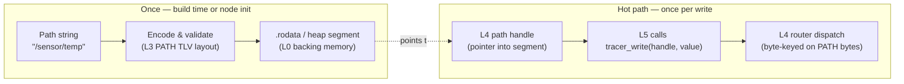

# Reference 00 — Core Overview (the libtracer Standard)

> **Status**: draft, v0.1, 2026-05-03. This is the standard. The plans (under [../plans/](../plans/)) describe how a specific implementation gets built; this document describes what *any* conforming implementation must do.

---

## What this document is

libtracer is a wire and addressing protocol for a **decentralized graph of endpoints**. Hosts publish and subscribe to **paths**; the underlying transport is whatever is loaded as a module (TCP, UDP, CAN, I²C, SHM, RDMA — all opt-in). The protocol is **language-agnostic**: the reference implementation is in C23 (per [../plans/02-roadmap-weeks-1-to-8.md](../plans/02-roadmap-weeks-1-to-8.md)), but any C++17, Rust, Zig, or Go implementation that honors this spec interoperates byte-for-byte.

The remaining sections of this reference suite specify byte format, graph semantics, addressing, communication flows, protocol-defined TLVs, user-data packing, and how a host's local view embeds into the global network.

---

## Conformance

A conforming **implementation** SHALL:

1. Encode and decode TLV frames per [01-data-format.md](01-data-format.md).
2. Honor the path syntax and wildcard semantics of [03-addressing.md](03-addressing.md).
3. Implement the read / write / await primitives and the field-write control surface of [04-communication-flows.md](04-communication-flows.md).
4. Reserve type codes per [05-protocol-tlvs.md](05-protocol-tlvs.md) and treat unknown codes safely.
5. Maintain the same-substrate invariant of [02-graph-model.md](02-graph-model.md): any sequence of mix/split/concat operations on the in-memory view tree, followed by serialization, MUST produce the same wire bytes as the equivalent fresh-buffer construction.
6. Drop already-seen TLVs by `(origin-peer-id, timestamp)` per [07-host-embedding.md](07-host-embedding.md) §cycle handling, when acting as a bridge.
7. Provide path handles per [../spec/v1.md](../spec/v1.md) §3.1: encode each address used more than once into a PATH TLV exactly once (build-time literal or init-time registration); reuse the encoded bytes on every read / write / await; do not require string parsing or allocation on the hot path.

A conforming **node** MAY load any subset of transport, discovery, security, and executor modules. A node loading **zero** transport modules is still conforming — it is an in-process-only graph. A node loading **multiple** transport modules SHALL implement the bridge logic of [07-host-embedding.md](07-host-embedding.md) §bridges.

A conforming **TLV** SHALL fit in the header layout of [01-data-format.md](01-data-format.md), use a type code from a defined range, and pass CRC-32C verification when the `CR` bit is set.

### Conformance profiles

(Distinct from the architectural layers below — these are build-size profiles, not protocol layers. Named with a `P` prefix to avoid collision.)

| Profile | Required | Typical use |
| ---- | ---- | ---- |
| **P0 — in-process** | required modules only, zero transports | unit tests, in-process pub/sub, the API substrate other layers compose against |
| **P1 — single-transport leaf** | required + 1 transport | RC car over UART, sensor over CAN, ESP32 over Wi-Fi |
| **P2 — bridge** | required + ≥2 transports + cycle-dedup | gateway between buses (CAN ↔ IP), edge router |
| **P3 — full** | P2 + discovery + executor + security | production deployment |

Higher profiles are strict supersets. A conformance test suite (week 4 of [../plans/02-roadmap-weeks-1-to-8.md](../plans/02-roadmap-weeks-1-to-8.md)) exercises P0 mandatorily; P1+ are exercised against the available transport modules.

---

## The six load-bearing claims

Any conforming implementation must honor these. They are what distinguishes libtracer from existing protocols (see [../plans/01-comparison-to-existing-protocols.md](../plans/01-comparison-to-existing-protocols.md) for the comparison).

1. **A TLV in memory IS a graph node IS the wire bytes.** No separate serialization layer. The in-memory representation is a tree of refcounted **views** over real backing memory. Mix/split/concat at the graph level rearranges views without touching bytes. Serialization is a walk of the view tree. ([02-graph-model.md](02-graph-model.md), [06-user-data-packing.md](06-user-data-packing.md))

2. **The API is read/write only.** Three calls — `read`, `write`, `await` — plus refcount management. Subscriptions, QoS, ACLs, liveness — every control surface — are **writable fields on endpoints**, addressed via the `:` separator. There is no `connect` / `disconnect` / `subscribe` primitive. ([04-communication-flows.md](04-communication-flows.md))

3. **No fragmentation rules in the wire format.** Logically large messages are addressed across child endpoints (`ep[0..N]`) with a shared timestamp. Each slice is an independently-routable TLV. The wire format never carries reassembly metadata. ([03-addressing.md](03-addressing.md), [06-user-data-packing.md](06-user-data-packing.md))

4. **Bridges are core.** Any host with two transport modules loaded is a bridge. The "one address space across CAN + IP + RDMA" claim is structural, not opt-in. From a subscriber's API view, transport choice is invisible. ([07-host-embedding.md](07-host-embedding.md))

5. **The graph imposes no shape on user data.** An endpoint is a name attached to a memory view. The protocol makes no claim about what that memory contains, how it's chunked, or how endpoints are arranged. A single boolean fits in one byte; a 10-GB camera frame fits across `ep[0..N]` slices; a memory-mapped GPIO register fits as a one-byte view backed by `mmio_base + offset`. ([06-user-data-packing.md](06-user-data-packing.md))

6. **Paths are encoded once, used many times.** A vertex address is encoded into a PATH TLV at build time (a `.rodata` literal) or at node init (one allocation), and reused thereafter. The hot-path API takes a path **handle**, not a string — no `snprintf`, no parser walk, no allocation per write. This is what makes a 16 KB Cortex-M0 a first-class libtracer node and what lets a publisher write from inside an ISR. ([../spec/v1.md](../spec/v1.md) §3.1, [03-addressing.md](03-addressing.md), [05-protocol-tlvs.md](05-protocol-tlvs.md))

---

## The six-layer model

The protocol stack has six layers of concern, numbered bottom-up from memory at L0 to application semantics at L5. Concepts in this reference suite belong to exactly one layer; conflating them produces design confusion.

| Layer | Concern | Specified in |
| ---- | ---- | ---- |
| **L0 — Memory substrate** | Real buffers, MMIO, queues, pools, peripheral FIFOs; allocation, lifetime, cache, DMA | [09-memory-substrate.md](09-memory-substrate.md) |
| **L1 — Views and ownership** | Memory views, refcounted segments, ropes (view chains), the TLV-as-cast | [08-views-and-ownership.md](08-views-and-ownership.md) |
| **L2 — Frame envelope** | Slice the byte stream into framed units; verify integrity; carry wire-time | [01-data-format.md](01-data-format.md) |
| **L3 — TLV semantics** | Interpret the type code; recurse into structured (PL=1) containers | [05-protocol-tlvs.md](05-protocol-tlvs.md) |
| **L4 — Graph endpoint logic** | Vertices, edges, paths, subscriptions, fan-out, QoS, ACL, bridges | [02-graph-model.md](02-graph-model.md), [03-addressing.md](03-addressing.md), [04-communication-flows.md](04-communication-flows.md) |
| **L5 — Application semantics** | What the bytes inside `VALUE` mean; control logic | application code |

Each adjacent pair of layers communicates through a small contract:

- **L0 ↔ L1**: backend interface (`alloc`, `release`, cache hooks). Bytes flow up as segments; lifetime flows down via `destroy` callbacks per backend.
- **L1 ↔ L2**: views are cast to TLVs. The cast is zero-copy reinterpretation.
- **L2 ↔ L3**: the `type` byte (carried at L2, meaningful at L3) and `opt.PL` (signal to recurse).
- **L3 ↔ L4**: the protocol-defined TLV registry (SUBSCRIBER, PATH, POINT, ROUTER, …) and what each means at the graph layer.
- **L4 ↔ L5**: the path / read / write / await API and the field-write control surface.

```mermaid
flowchart TB
  L5["L5 — Application semantics<br/>(what bytes inside VALUE mean)"]
  L4["L4 — Graph endpoint logic<br/>vertices, edges, paths, fanout, QoS, ACL, bridges"]
  L3["L3 — TLV semantics<br/>type byte, structured (PL=1) recursion"]
  L2["L2 — Frame envelope<br/>header + payload + trailer; CRC; wire-time TS"]
  L1["L1 — Views and ownership<br/>refcounted view tree, rope, TLV-as-cast"]
  L0["L0 — Memory substrate<br/>heap, pool, MMIO, DMA, pbuf, skbuff, FIFO"]

  L5 -->|read/write/await + path handle| L4
  L4 -->|PATH, SUBSCRIBER, ROUTER...| L3
  L3 -->|type byte + opt.PL| L2
  L2 -->|view-cast| L1
  L1 -->|alloc/release/cache hooks| L0

  classDef applic fill:#fdf,stroke:#333
  classDef graph  fill:#dfd,stroke:#333
  classDef tlv    fill:#dff,stroke:#333
  classDef wire   fill:#ddf,stroke:#333
  classDef view   fill:#ffd,stroke:#333
  classDef mem    fill:#fdd,stroke:#333
  class L5 applic
  class L4 graph
  class L3 tlv
  class L2 wire
  class L1 view
  class L0 mem
```

The wire format (L2) carries the `type` byte and `opt.PL` at fixed positions so routers can decide whether to recurse into nested children without parsing payload. The `type` byte's meaning is L3; it sits in the L2 header for routing convenience. Priority is **not** an L2 concern — it is cached at L4 from `:settings.priority`. The L2 `opt` byte's other bits select wire-format variants (`LL` length width, `CW` CRC width, `TF` TS form) — these are framing choices, not semantic information.

### Static path handles in the layer model

The path-handle mechanism (load-bearing claim 6) sits at the **L4 ↔ L5 boundary**: applications hold handles, the graph layer consumes them. Encoding a path into a PATH TLV is an L3 act; storing the result in `.rodata` or a long-lived L0 segment is an L0/L1 act; reusing the bytes on every write keeps L4 dispatch keyed on canonical PATH bytes.



The diagram is the visual form of [../spec/v1.md](../spec/v1.md) §3.1: encoding is an init-phase concern, dispatch is hot-path-clean, and the bytes that flow through L4's dispatch table are the same regardless of whether the handle was a build-time literal or a runtime registration.

### TLV-at-rest = TLV-in-transit + trailer

The L2 frame has a **header + payload + optional trailer** structure. The payload region is byte-identical across every state of the TLV's life:

- **At rest** in the graph (stored at a vertex, on disk in a recorder file): `header + payload`.
- **In transit** on a transport: `header + payload + trailer` (wire-time TS + CRC).
- **Re-emitted** by a bridge to another transport: `header + payload + new_trailer`.

The trailer is **append-only at egress, strip-only at ingress**. A bridge or recorder moves a TLV between rest and transit by attaching/stripping the trailer; the payload bytes are never touched. This is what makes the same-substrate insight extend cleanly across multi-hop bridging and recording. See [01-data-format.md](01-data-format.md) §the trailer is append-only and [02-graph-model.md](02-graph-model.md) §the trailer enables payload-bytes invariance.

### Graph-data vs in-flight-message: the ROUTER shedding rule

The TLV substrate plays two distinct roles structurally distinguished by the `ROUTER` TLV (type `0x0D`):

- **Graph data** at a vertex: just the payload, no `ROUTER`. Identity = vertex path.
- **In-flight message** crossing a bridge: a `ROUTER` TLV (type `0x0D`) wrapping the data — ROUTER is structured (PL=1) with NAME-tagged metadata children followed by `NAME "data"` and the wrapped TLV as last child. Identity = `(origin_peer_id, origin_timestamp)`.

Bridges shed the `ROUTER` when ingesting (storing only the bare data) and attach a fresh `ROUTER` when emitting on the outbound side. This keeps graph reads clean while preserving the cycle-dedup metadata at the bridge boundary. See [02-graph-model.md](02-graph-model.md) §the ROUTER shedding rule and [07-host-embedding.md](07-host-embedding.md) §cycle handling.

---

## Everything is a module

There is **no "core" carved out from "modules"**. A libtracer node is a chosen set of modules linked together. Some modules are required by every conforming node (frame codec, path resolver, refcount/view machinery, router/dispatcher, bridge logic) — those are tagged `required` in the catalog. The rest are tagged by what they bring (a transport, a discovery mechanism, a security wrap, an executor, a memory backend, an I/O view module). A bare-minimum node loads only the `required` modules; a feature-rich node loads many.

This framing matters because the so-called "core" itself is a bundle of modules separated by clean interfaces — frame codec is one module, path resolver another, dispatcher a third. They happen to be required for every conformance profile, but they are not architecturally privileged.

The full module catalog — everything across L0..L5 — is in [10-module-catalog.md](10-module-catalog.md), with a pairing table that says which L0 backends pair with which L1 view modules pair with which transports.

A node's footprint is the sum of its loaded modules. The reference implementation targets ≤ 16 KB stripped (required modules only) on `arm-none-eabi-gcc -std=c23 -Os` (sentinel test in week 4 of [../plans/02-roadmap-weeks-1-to-8.md](../plans/02-roadmap-weeks-1-to-8.md)). Adding `transport_tcp` brings ~5 KB on Linux / ~8 KB on Cortex-M (lwIP-dependent). A robot-fleet build pulling in TCP, UDP, mDNS, CAN, TLS lands in the 30–50 KB range; an RC-car build with only one UART transport stays under 25 KB.

The module ABI itself is an **implementation** concern, not a protocol property — two implementations need not share a module ABI; they need to share the wire format, addressing scheme, and flows. See [../plans/05-modules-transport-and-discovery.md](../plans/05-modules-transport-and-discovery.md) §module ABI for the reference C ABI.

---

## Implementation-language portability

The reference implementation is C23 (chosen for `_BitInt`, `<stdbit.h>`, `<stdckdint.h>`, `nullptr`, `constexpr`, `[[nodiscard]]`, `[[gnu::packed]]`; atomics still through C11 `<stdatomic.h>` carried into C23 unchanged). The choice is pragmatic: C23 produces the smallest portable binary, has the widest MCU toolchain coverage (GCC 13+, Clang 18+, ESP-IDF 5.3+, arm-none-eabi-gcc 14.x), and exposes the cleanest FFI surface for higher-level wrappers.

The protocol itself is implementable in **any language** with:

| Capability | Why needed | Substitute in C++ / Rust / Go |
| ---- | ---- | ---- |
| Atomic refcount with relaxed/acq_rel ordering | Buffer-view ownership | `std::atomic<uint32_t>` (C++); `Arc<T>` or `AtomicUsize` (Rust); `sync/atomic` (Go) |
| Pointer + length view over external memory | Zero-copy view tree | `std::span<const std::byte>` (C++20); `&[u8]` borrows or `Bytes` (Rust); `[]byte` slices (Go) |
| Packed struct with explicit endianness | TLV header layout | `#[repr(C, packed)]` (Rust); `#pragma pack` / `[[gnu::packed]]` (C++); `encoding/binary` (Go) |
| Iterative parser with bounded depth | MCU stack safety | trivially portable |
| LEB128 varint | length encoding | trivially portable |
| CRC-32C, hardware-accelerated where present | integrity | x86 SSE 4.2, ARMv8 `+crc`, software fallback — present in any language |

A pure-C++ port would be a thin layer (the C reference implementation already uses C++ headers in `tlv_vector.hpp` / `tlv_string.hpp` for the wrapper view types). A pure-Rust port is straightforward — `Bytes` from the `bytes` crate maps directly to libtracer's view + refcount; `tokio` or `mio` provides the run loop. A pure-Go port would lose the explicit refcount (Go has GC) but could use the same wire format and addressing.

**The wire format and the addressing scheme — not the C ABI — are the standard.** A future spec audit at the end of the v0.1 milestones (per [../plans/02-roadmap-weeks-1-to-8.md](../plans/02-roadmap-weeks-1-to-8.md)) is the gate to declaring this reference suite "frozen for v0.1," at which point a second implementation in C++ or Rust becomes the conformance test.

---

## Versioning

**libtracer v0.1 is the wire format. It does not version per-frame.** There is no version bit in `opt`. The wire format is a one-shot commitment: get it right, ship it, don't bump.

Future incompatible changes — should they ever be needed — are versioned at the **discovery layer**: a different mDNS service name (`_libtracer-v2._tcp` vs `_libtracer._tcp`), a different default TCP port, a different CAN-ID prefix, etc. Peers learn each other's wire-format identity at discovery time.

The forward-extension path within v0.1 is the type-code registry: new core type codes can be added in `0x0E – 0x7F` without breaking existing receivers, who gracefully ignore unknown codes per [01-data-format.md](01-data-format.md) §handling unknown type codes.

---

## Reading order

For a first pass at understanding the protocol:

1. [01-data-format.md](01-data-format.md) — what bytes look like.
2. [02-graph-model.md](02-graph-model.md) — what those bytes mean structurally, and the same-substrate insight.
3. [03-addressing.md](03-addressing.md) — how to name things.
4. [04-communication-flows.md](04-communication-flows.md) — how nodes talk.
5. [05-protocol-tlvs.md](05-protocol-tlvs.md) — every reserved TLV, byte-precise.
6. [06-user-data-packing.md](06-user-data-packing.md) — how the user puts their data into the graph (worked examples spanning 1 byte to 10 GB/s).
7. [07-host-embedding.md](07-host-embedding.md) — how a host's local view fits into the network.

For a parser/sender writer in another language: read 01, 03, 05, 06 in that order; then 02 once you start optimizing for zero-copy.

For a router / bridge implementer: 02, 03, 04, 07 are mandatory; 06 is illustrative of what you'll be routing.

---

## Out-of-scope for this reference suite

- The C ABI of any specific implementation (header signatures, struct layouts beyond the packed wire header). See the implementation's own headers — for the reference C core, those land in `libtracer/core/` per week 4 of [../plans/02-roadmap-weeks-1-to-8.md](../plans/02-roadmap-weeks-1-to-8.md).
- The module ABI (`transport_vtable_t`, etc.). See [../plans/05-modules-transport-and-discovery.md](../plans/05-modules-transport-and-discovery.md) §module ABI.
- The configuration file format (TOML for bridges/discovery). See [../plans/05-modules-transport-and-discovery.md](../plans/05-modules-transport-and-discovery.md) §bridging configuration.
- Build options and CMake toggles. See [../plans/02-roadmap-weeks-1-to-8.md](../plans/02-roadmap-weeks-1-to-8.md) week 1.
- Cluster consensus, CRDTs, distributed transactions — explicit non-goals. See [../plans/04-graph-and-endpoint-api.md](../plans/04-graph-and-endpoint-api.md) §coherency.
