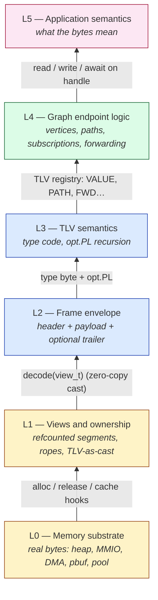
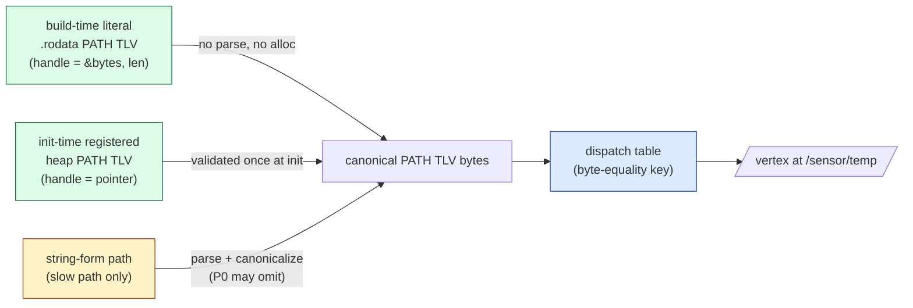
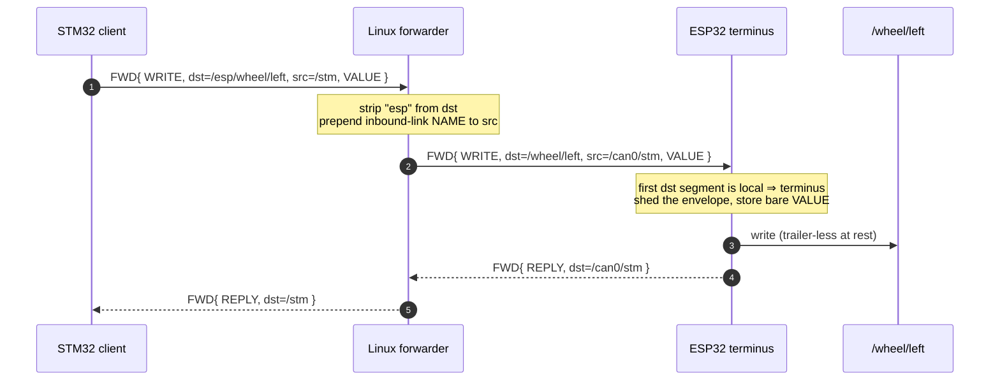

# Reference 02 — Graph Model and Same-Substrate Insight

> **Status**: draft, v1, 2026-05-03. Defines what a graph IS in libtracer and the load-bearing claim that the in-memory graph and the wire bytes are the same substrate.
> **Audience**: implementers writing the router/dispatcher; anyone reasoning about zero-copy semantics.
> **See also**: [04-communication-flows.md](04-communication-flows.md) for API rationale; [01-data-format.md](01-data-format.md) for the byte layout this section interprets structurally.

---

## Definitions

- **Vertex** (also called endpoint, point, node-in-graph): a named, addressable position in the graph at which data can be written, read, or subscribed to. A vertex has a path, an optional schema, zero or more subscribers, and an optional last-known-value.

- **Edge**: a subscription. Concretely, a SUBSCRIBER TLV stored in some vertex's `:subscribers[N]` slot, naming a target path that should receive a copy of every future write.

- **Path**: an ordered list of UTF-8 NAME segments rooted at `/`, addressing a vertex (or a field on a vertex). Syntax in [03-addressing.md](03-addressing.md).

- **Schema**: a structured TLV (typically a `POINT` or a `SETTINGS`-shaped record) returned at `<vertex>:schema`, enumerating the writable fields the vertex exposes. Two parts with defined precedence ([RFC-0010](../spec/rfcs/0010-owner-app-fields-and-schema.md) §B.2): a **synthesized protocol part** — the core fields (`:subscribers[]`, `:settings.*`, `:liveness.*`, `:acl`) plus any module-namespaced fields, authoritative for protocol machinery — and, when the owner installed a field descriptor table, an **owner part** (`NAME "app" SETTINGS{…}`) served verbatim, authoritative for `settings.app.*`. Read-only.

- **Forwarder** (router): the stateless component (`fwd_router_t`) that routes `FWD` frames between a node's local graph and its named transport links — each hop strips the leading `dst` segment and grows `src` with the way back. To a downstream subscriber a forwarded delivery is indistinguishable from a local write.

- **Buffer segment**: a refcounted region of real memory backing one or more views. The unit of ownership.

- **View**: a `{owner_segment, offset, length}` triple naming a contiguous span of bytes inside a buffer segment. Views never own bytes; segments do. A view holds a refcount on its owner segment.

- **Same-substrate**: the architectural claim that a TLV in memory IS a graph node IS the wire bytes. The in-memory graph is a tree of views; serialization is a walk of the tree; deserialization is constructing the tree of views over the received bytes.

---

## The six-layer model

The protocol stack has six distinct layers of concern, numbered bottom-up from memory at L0 to application semantics at L5. Concepts in this reference suite belong to exactly one layer; conflating them produces design confusion. Layers below L2 are platform substrate (memory, ownership, I/O); L2 and above are the protocol proper.

| Layer | Concern | What it sees | Doc that specifies it |
| ---- | ---- | ---- | ---- |
| **L0 — Memory substrate** | Real buffers, MMIO, queues, pools, peripheral FIFOs; allocation, lifetime, cache, DMA | platform-specific memory backends | [09-memory-substrate.md](09-memory-substrate.md) |
| **L1 — Views and ownership** | Refcounted memory views, ropes (chains of views), the TLV-as-cast | `segment`, `view`, refcount, rope chain | [08-views-and-ownership.md](08-views-and-ownership.md) |
| **L2 — Frame envelope** | Slice the byte stream into framed units; verify integrity; carry wire-time | `length`, `payload`, optional `trailer_ts` and `trailer_crc` | [01-data-format.md](01-data-format.md) |
| **L3 — TLV semantics** | Interpret the type code; recurse into structured (PL=1) containers | `type`, `opt.PL`, payload-as-bytes-or-children | [05-protocol-tlvs.md](05-protocol-tlvs.md) |
| **L4 — Graph endpoint logic** | Route TLVs to vertices, fan out to subscribers, enforce QoS / ACL, manage liveness, forward `FWD` frames | paths, vertices, edges, schemas, settings | [02-graph-model.md](02-graph-model.md) (this doc), [03-addressing.md](03-addressing.md), [04-communication-flows.md](04-communication-flows.md) |
| **L5 — Application semantics** | What the bytes inside a `VALUE` mean; what an endpoint's value represents; control logic over the data | application-defined | application code |

The substrate layers (L0 and L1) are what give libtracer zero-copy reach. A TLV in flight or at rest is **a view tree over real memory**, not a decoded message struct. The wire bytes IS the in-memory representation IS the graph node — across boundaries, the trailer attaches/strips ([01-data-format.md](01-data-format.md)) but the payload bytes are invariant.



The `type` byte sits at the L2 / L3 boundary. It is **carried** in the wire header (so a router can decide whether to recurse without parsing payload) but its **meaning** is L3. A pure-framing parser that just dispatches by `length + CRC` could ignore `type` entirely; a TLV-aware router uses `type` (and `opt.PL`) to decide whether to walk into nested children.

Priority is **NOT** an L2 concern. The `opt` byte carries no priority bits — priority is transport-time and per-link, not coherent across the network. A router that wants priority-aware dispatch reads `:settings.priority` once per subscription (L4) and caches it. See [01-data-format.md](01-data-format.md) §why no priority bits.

Implementations MAY refactor `type` out of the wire header (into "first byte of payload") in a future major version without semantic change; this is a layout question internal to L2/L3, not a protocol-level decision.

---

## The same-substrate insight

This is the load-bearing technical claim of the libtracer protocol.

**A TLV in memory IS a graph node IS the wire bytes.**

In most middleware:

- The wire encoding is one representation (CDR, Protobuf, Cap'n Proto, Zenoh's `z_encoding`).
- The in-memory message struct is another (decoded fields).
- The routing-topology graph is a third (separate metadata).

In libtracer, all three collapse into one. The mechanism: **buffer chains of views over real memory.**

### The two compositions: storage and meaning

The same-substrate collapse hides one subtlety worth making explicit, because conflating it is the most common design error here: the same bytes participate in **two orthogonal composite trees**, on different axes.

| | **Memory composition** | **TLV composition** |
| --- | --- | --- |
| Composes | **storage** — *where* bytes physically live | **meaning** — *what* bytes are |
| Leaf | a **view** (`{owner, offset, length}` over one segment) | an **opaque TLV** (`opt.PL=0`) |
| Composite | a **rope** — a chain of views across segments | a **structured TLV** (`opt.PL=1`); its type code says what the children mean |
| Layer | L1 ([08-views-and-ownership.md](08-views-and-ownership.md)) | L3 ([01-data-format.md](01-data-format.md), [05-protocol-tlvs.md](05-protocol-tlvs.md)) |
| Grows by | `append` / `concat` — pointer-linking, zero-copy | nesting children end-to-end |

Both are the **Composite pattern**, but they compose *different things* and are **decoupled**. That decoupling is precisely what makes zero-copy possible: a node's *meaning* (its TLV tree) is independent of how its *bytes* are physically chunked (its rope). Three consequences fall out, each a load-bearing rule:

- **A rope is not a TLV list.** A "list" (a structured TLV with homogeneous children) is *meaning*; a rope is *storage*. A rope may hold the bytes of a TLV list, but it is blind to TLV structure.
- **A view boundary may fall anywhere — including mid-TLV-header.** Because the axes are independent, a frame's 4-byte header can straddle two segments (an lwIP `pbuf` chain, a DMA ring wrap). A conforming decoder must therefore **link-walk the rope**, not assume a contiguous buffer:

  ```
  meaning  →   [ one TLV: header(4) | payload(6) ]          (one logical node)
  storage  →   [ segment A: 06 40 12 ] [ segment B: 00 | 02 00 02 00 ]
                                    ^ the header splits across the A/B boundary
  ```

- **A `FWD` uses a rope but is not one.** The remote-operation envelope ([07-host-embedding.md](07-host-embedding.md)) composes *meaning* (op + routes + the payload TLV); the bytes a hop forwards stay a rope. A forward hop is "adjust the route heads, re-emit the rest via scatter-gather, never copy" — the forwarder never inherits or becomes a rope.

The two sections below are this same point made concrete: **How nested TLVs work** is the *meaning* axis; **How that structured TLV exists in memory** is the *storage* axis.

### How nested TLVs work structurally

When the `PL` (payload-is-structured) bit is set in the header `opt` byte, the payload is interpreted as a sequence of child TLVs concatenated end-to-end. Each child has its own header (4 or 6 bytes per [01-data-format.md](01-data-format.md), depending on `opt.LL`) and optional trailer; any child may itself have `PL=1` for further nesting.

```
Outer structured TLV (PL=1, e.g. PATH, SETTINGS, FWD, or a user-range record):
  +-----------+--------+----------+
  | type=0xXX | opt=PL | length   |  header (4 bytes default; 6 if LL=1)
  +-----------+--------+----------+
  | inner TLV 1: header + payload  |
  +--------------------------------+
  | inner TLV 2: header + payload  |
  +--------------------------------+
  | inner TLV 3: header + payload  |
  +--------------------------------+
  | optional outer trailer         |  trailer (0 / 4 / 6 / 8 / 10 / 12 / 14 / 16 bytes)
  +--------------------------------+
```

Inner TLVs typically carry no trailer of their own — the outer's CRC (if present) covers the whole concatenated content. A forwarder that wants to split children out and re-route them independently MAY emit them with their own trailers, paying the per-child cost.

This structured TLV IS the graph node. To walk a vertex's children: parse the children, iterate them, recurse (iteratively, per [01-data-format.md](01-data-format.md)) into any with `PL=1`.

### How that structured TLV exists in memory

Underneath, each inner TLV is represented as a **view**: a struct holding `{owner_segment, offset, length}` where `owner_segment` is a refcounted pointer to the real memory backing the buffer. The graph "contains" inner TLVs by holding views into the parent's memory.

```
Real memory (received from socket):
  [TCP recv buffer; 4 KiB; refcount=1]
   ^^^^^^^^^^^^^^^^^^^^^^^^^^^^^^^^^^

Outer structured TLV view:
  { owner = recv_buffer_segment,
    offset = 0,
    length = 1024 }                       refcount on segment += 1

Inner TLV 1 view:
  { owner = recv_buffer_segment,           // same backing memory
    offset = 8 + len_of_outer_length_field,
    length = inner_1_length }              refcount on segment += 1

Inner TLV 2 view:
  { owner = recv_buffer_segment,           // same backing memory
    offset = 8 + len_of_outer_length_field + 8 + ... ,
    length = inner_2_length }              refcount on segment += 1
```

Operations that look like data manipulation — split a list into two, concatenate two lists, insert a new child, slice off the trailing N children — **do not move bytes**. They construct new view structs whose `owner_segment` field bumps the refcount of the underlying buffer.

When all views into a segment are released, the segment's refcount drops to zero, the segment's `destroy` callback fires, and the underlying memory is returned to whatever pool / allocator owns it (heap free, recv-pool return, mmap unmap, etc.).

### Structured TLV as abstraction, memory as rope

There is a careful distinction between **the structured TLV as a logical container** and **the memory backing it**.

A structured TLV's logical content is "an ordered sequence of children." That definition says nothing about how the children's bytes are laid out in memory. In practice:

- **Wire-receive case**: the structured TLV has just been reconstituted from a transport buffer. All children's bytes live contiguously in one segment. The "rope" has one link — a flat buffer.
- **In-memory assembled case**: the structured TLV was built up via append / concat / split operations. Different children may live in different segments — possibly received from different transports, possibly carved out of a memory-mapped region, possibly synthesized from static data. The rope has many links.

```
Logical structured-TLV view:
   ┌──────────────────────────────────────────┐
   │  child_0  child_1  child_2  child_3  ... │
   └──────────────────────────────────────────┘

Underlying rope (in-memory case):
   ┌─ view ─┐  ┌─ view ─┐    ┌─ view ──────────┐
   │ child_0│  │ child_1│    │ child_2 child_3 │
   │ in seg │  │ in seg │    │   in segment C  │
   │   A    │  │   B    │    │                 │
   └────────┘  └────────┘    └─────────────────┘
       │           │                 │
       ▼           ▼                 ▼
   segment A   segment B        segment C
   (refcounted) (refcounted)    (refcounted)
```

**Operations on a structured TLV do not move bytes**:

- `concat(C1, C2)` produces a new container whose rope is the concatenation of C1's view chain and C2's view chain. Refcounts on the underlying segments are bumped per child.
- `split(C, K)` produces two containers whose ropes share underlying segments with the original. The view chain is partitioned at child K.
- `insert(C, K, child)` produces a container whose rope is `C[0..K-1] + child + C[K..]`. The new child becomes another link in the chain.

**Serialization is the rope-to-flat-buffer walk**: when a structured TLV is sent on the wire, the serializer iterates the rope in order and emits bytes contiguously. The wire form IS contiguous; the in-memory form is NOT required to be. The proof obligation below guarantees that this walk produces the same bytes regardless of how the rope was assembled.

**The parser must handle both substrates** ([01-data-format.md](01-data-format.md) §two parser contexts):

- A wire-receive parser walks byte offsets within one buffer.
- An in-memory walker steps across view boundaries when crossing from one rope link to the next.

The same iterative pattern (recurse on `PL=1`, bound depth at 32) applies to both. Implementations typically share the parsing logic with two different cursor advance functions.

### Spec-level proof obligation

> Any sequence of mix / split / concat operations on a view tree, followed by a `serialize_to_wire()` walk, MUST produce the same bytes as if the corresponding mutations had been applied to a fresh buffer.

This invariant is testable: construct a view tree by parsing wire bytes, mutate it, serialize, and compare to the wire-bytes equivalent constructed from scratch. The reference implementation has `core/tests/substrate_test.cpp` exercising this.

A second-language implementation that fails this invariant is **not conforming**, regardless of whether its wire output is otherwise valid.

---

## Dispatch keyed on canonical PATH TLV bytes

This is the structural rule that lets [03-addressing.md](03-addressing.md) §static path handles work. The graph runtime's vertex map is **keyed on the bytes of the PATH TLV's payload**, not on the string form of the path:

- A vertex registered as `/sensor/temp` lives in the map at the key whose bytes are the canonical PATH TLV payload `NAME("sensor") + NAME("temp")`.
- A write whose path argument is a build-time `.rodata` PATH TLV byte literal hashes / compares against that same key — no string is involved at any point.
- A write whose path argument is the equivalent string `"sensor/temp"` is canonicalized into the same PATH TLV bytes once (by the slow-path string entry, if the implementation provides one) and then dispatched against the same key.

**Implication.** Two paths that name the same vertex MUST canonicalize to byte-identical PATH TLV payload bytes. The canonicalization rules in [03-addressing.md](03-addressing.md) §path canonicalization are the spec for this; conformance test vectors at `tests/conformance/vectors/v1/path_canonical/` check byte equality.



**Why this matters at L4.** The dispatch table is a hashmap (or radix tree, or whatever the implementation uses) whose key is the PATH TLV's payload bytes. Insertion, lookup, and removal all see those bytes — never a parsed string. This is what makes path-handle dispatch O(1) on the hot path: the handle already holds the bytes that the dispatch table is indexed by. There is no resolution step at all, just a hash + memcmp.

The string-form entry point is a courtesy for hosts that don't care about µs-class hot paths. On the wire, in storage, and through the dispatcher, **paths are PATH TLV bytes**.

---

## Buffer ownership and refcounts

### Segment lifecycle

```
created (refcount = 1)              ←  initial owner (e.g. transport rx)
   |
   +─→ view created   (refcount += 1)
   |   view created   (refcount += 1)
   |   view destroyed (refcount −= 1)
   |   view destroyed (refcount −= 1)
   |   ...
   |
   ↓
initial owner releases (refcount −= 1)
   |
   ↓
last view released (refcount drops to 0)
   |
   ↓
destroy callback fires; memory returned to pool/allocator
```

### Required atomic operations

Implementations on multi-threaded hosts MUST use atomic refcounts with these memory orderings (canonical Boost intrusive_ptr pattern):

| Operation | Order | Why |
| ---- | ---- | ---- |
| Increment (clone view) | `relaxed` | Caller already holds a reference; data dependency travels via that existing reference |
| Decrement (release view) | `acq_rel` | release: flush all writes before someone else observes count drop; acquire: if we observe drop to zero, sync with all prior releases |
| Read for inspection (debug, metrics) | `acquire` | Pairs with each decrement; gives consistent snapshot |
| Weak-to-strong upgrade (CAS loop) | `acq_rel` on success, `acquire` on failure | Same logic as inc + sync with last decrementer |

Rationale is expanded in [01-data-format.md](01-data-format.md) §refcount memory ordering. The reference implementation uses C++ `std::atomic`; implementations in C (`<stdatomic.h>`), Rust (`Arc<T>` / `AtomicUsize`), or any other language MUST implement equivalent semantics.

### Single-threaded mode

For Cortex-M0/M0+ (no LDREX/STREX) and bare-metal single-threaded contexts, an implementation MAY substitute plain (non-atomic) integer refcount, provided the application guarantees no cross-thread sharing of segments. The reference implementation exposes this as `LIBTRACER_NO_ATOMIC=ON`.

### Ownership transfer at endpoint delivery

When a transport module receives bytes from the wire, it constructs a top-level view over the received memory and hands it to the router via the recv callback. The router walks the view tree, finds the destination endpoint, and delivers the view to the endpoint's queue.

**At delivery, the view's ownership is *transferred* to the endpoint** — meaning the endpoint takes the existing refcount, no new copy is made. The transport module relinquishes its reference (refcount decrement; the segment survives because the endpoint now holds the count).

If multiple subscribers are attached, the view is **cloned** (refcount bumped per subscriber, no byte-level copy). Each subscriber sees the same backing memory through its own view struct.

This is the mechanism that makes "as fast as Cap'n Proto with pub/sub semantics" credible.

---

## Read is zero-copy; write is single-copy where the medium demands

The asymmetry is real and worth naming explicitly.

### Read paths

A reader that walks the graph or consumes a delivered TLV does so through views. **No bytes are copied.** The reader gets a `(pointer, length)` pair; it can `memcpy` into its own buffer if it wants a private copy, but the protocol does not impose this.

This is true regardless of where the bytes came from: a TLV constructed in-process from a static buffer, a TLV received over TCP and held in the recv-buffer segment, a TLV materialized from a memory-mapped GPIO register — all are reads through views.

### Write paths

A write of a TLV constructed in-process is similarly zero-copy at the API boundary: the caller hands over a TLV (which is a view tree); ownership transfers to the router. No copy.

The medium under a transport module determines whether a copy happens at the wire boundary:

| Transport | Send-side copy? | Receive-side copy? |
| ---- | ---- | ---- |
| In-process / in-thread | none | none |
| `transport_unix` (Unix domain socket, future) | one (kernel `write`) | one (kernel `read` into recv segment) |
| `transport_tcp` | one (kernel `send`) | one (kernel `recv` into recv segment) |
| `transport_shm` (future) | none (the segment IS shared mem) | none |
| `transport_iceoryx2` (future) | none (loan-publish-borrow) | none |
| `transport_can` | one + per-CAN-frame fragmentation | one (HAL ISR copies each frame to RX buffer) |
| `transport_uart` / `transport_i2c` (future) | one (DMA or per-byte) | one (RX buffer, then framed-TLV view over it) |
| `transport_rdma` (future) | none on the data plane | none |

The receive side on a stream/byte transport (UART, CAN, I²C, TCP) intrinsically needs an **RX buffer** because the bytes arrive incrementally and the framer needs to reconstitute a complete TLV. Once reconstituted, the framed TLV is a **view over the RX buffer**, and from that point on no further copies happen — the same view propagates through the router, fans out to subscribers, and is read by application code.

A subscriber that processes the TLV synchronously and releases its view immediately allows the RX buffer segment to be returned to the transport's free pool quickly. A subscriber that holds the view (e.g. enqueues for later processing) keeps the segment alive — backpressure on the segment pool is one of the QoS knobs (`queue_max_bytes`).

### The trailer enables payload-bytes invariance across boundaries

The wire-format trailer (`trailer_ts`, `trailer_crc`; see [01-data-format.md](01-data-format.md)) is what makes the read/write asymmetry above clean. The trailer is **append-only at egress, strip-only at ingress** — the payload region is never touched.

This means the same payload bytes flow through every state of the TLV's life:

| State | Form |
| ---- | ---- |
| Stored at a vertex (graph data) | `header + payload` |
| Recorded to disk by a recorder module | `header + payload` (trailer dropped at ingress to recorder) |
| Sent on a transport | `header + payload + trailer` (trailer attached at egress) |
| Received over a transport | `header + payload` (trailer validated and dropped) |
| Forwarded to another transport | `header + payload + new_trailer` (fresh wire-time, fresh CRC) |
| Replayed by a recorder module | `header + payload + new_trailer` |

In every state the **payload bytes are byte-identical** to every other state. A view that names those payload bytes survives unchanged through forward hops, recorder round-trip, and subscriber fan-out. Subscribers can compute hashes / equality / signatures over the payload region without worrying about whether the TLV is currently in flight or at rest.

A subscriber that wants the application-domain timestamp reads it from a sibling `TIME` TLV inside the payload (if present) — that lives inside the payload bytes and survives every transition. The wire-trailer `TS` is for transport diagnostics only; it does not survive at-rest storage.

---

## Subtree subscriptions, branch writes, write-creates ([RFC-0005](../spec/rfcs/0005-subtree-subscriptions.md))

Three ratified write/delivery semantics that make the vertex tree observable and writable **at any granularity** with the same three-call API:

- **Every subscription is a subtree subscription (vertical bubbling).** A `SUBSCRIBER` edge on vertex V observes writes to V **and to every descendant** (a leaf subscription is the trivial case). A write at W delivers — once per subscriber — to the subscribers of W and of each ancestor of W, carrying the **written TLV as-is** (the frame at the producer's granularity; no re-encoding, no tagging envelope; provenance beyond that travels in the data). Local delivery is the usual view clone; remote delivery rides the existing return-route `FWD{WRITE}` path unchanged. The write path stays **near-free when nobody listens**: per-vertex listener counters (maintained at subscribe/unsubscribe and summed from ancestors at vertex creation) mean an idle write pays one relaxed atomic load and never walks ancestors.
- **A branch write decomposes.** A write whose payload is a `POINT` tree ([05 §`0x07`](05-protocol-tlvs.md)) rooted at the target vertex lands each value-carrying node at the corresponding descendant vertex as a **refcount subview of the written frame** (zero copy), creating missing vertices on the way; each covered subscription point is notified once with its slice. Values are the truth at the vertices where they land; a branch is a view. The branch is **not a transaction** — admission (shape + ACL) is all-or-nothing, application is per-leaf; cross-leaf snapshot coherence is the coherent-sampling `(origin, ts)` group ([ADR-0019](../adr/0019-per-producer-monotonic-origin-timestamp.md)), never a write-side lock.
- **A data write creates its target** (`mkdir -p`) when the vertex does not exist, gated by the existing `CREATE` access bit on the nearest existing ancestor's effective ACL. `:field` writes, `read`, and `await` keep `tr::path::not_found`.

Reads keep the **one-store-per-vertex** invariant: a write at any granularity lands in the same canonical last-known-value a read serves, and a read returns the latest stored value — ≥ what any subscriber of that path last saw, never behind a notification, legitimately newer. The producer owns cadence: rate caps, flush intervals, dirty tracking and timers are application concerns; batching several subtrees is N self-contained frames in one `send(iov)`, never a wire batch container.

---

## Schema and field discipline

A vertex exposes a **schema** describing every writable field. The schema lives at `<vertex>:schema` as a read-only structured TLV (typically a `POINT` whose children describe each field, or a `SETTINGS`-shaped record).

### Core writable fields (frozen for v1)

| Field path | Type | Writable | Meaning |
| ---- | ---- | ---- | ---- |
| `:subscribers[N]` | SUBSCRIBER | yes | Subscription record N |
| `:subscribers[]` | sequence of SUBSCRIBER | read-only; write to `[]` appends | Full list (read) or new slot (write) |
| `:settings.reliability` | u8 enum | yes | `0=best-effort, 1=reliable` |
| `:settings.durability` | u8 enum | yes | `0=volatile, 1=transient-local` |
| `:settings.history_keep_last` | u32 | yes | N samples retained for late joiners |
| `:settings.deadline_ns` | u64 | yes | Max time between writes before liveness fault |
| `:settings.priority` | u8 | yes | `0=low ... 255=critical` (transport hint) |
| `:settings.queue_max_bytes` | u32 | yes | Per-subscriber queue cap (back-pressure threshold) |
| `:settings.app.<name…>` | owner-defined TLV | owner-declared (`ro`/`rw`/`wo`) | Application property field ([RFC-0010](../spec/rfcs/0010-owner-app-fields-and-schema.md)): declared by the vertex owner in its field descriptor table; undeclared names stay `SCHEMA_NOT_FOUND` |
| `:liveness.heartbeat_hz` | u8 | yes | Subscriber heartbeat rate; 0 = no liveness check |
| `:liveness.last_seen_ns` | u64 | read-only | Wall-clock of last write observed |
| `:liveness.missed_deadlines` | u32 | read-only | Counter |
| `:schema` | structured TLV | read-only | Self-describing schema of fields and types |
| `:description` | UTF-8 | yes (with permission) | Human-readable description |
| `:acl` | ACL | yes (with permission) | Access control list |

### Owner-declared application fields (`settings.app`) — RFC-0010

The `app` key is **reserved inside the vertex `SETTINGS` namespace** ([05 §`0x0B`](05-protocol-tlvs.md)): the protocol MUST never mint a QoS or machinery knob named `app`, and everything below `settings.app.` is **owner-defined** — names, nesting, and value bytes are the application's, opaque to the runtime. This is the substrate for the device-private half of the field discipline ([ADR-0021](../adr/0021-vertex-field-list-with-standard-and-device-specific-fields.md) rule 3: fields are standard *and* device-private, like ioctls; the device owns the catalog of what each field accepts):

- **Declaration is owner-initiated and local** ([RFC-0010](../spec/rfcs/0010-owner-app-fields-and-schema.md) §A.2 — the owner-initiated doctrine of the draft vertex-removal RFC-0009): the owner installs, through the local host API, a per-vertex **field descriptor table** — `{ name, access ∈ {ro, rw, wo}, descriptor bytes, initial value? }` per field. There is **no wire operation that declares a field**; a remote peer writes declared fields, never invents them. Undeclared names — under `settings.app.` and everywhere else — keep `SCHEMA_NOT_FOUND` (the `ENOTTY` default survives; the table opens only the holes the owner named).
- **Writes**: the owner always reads and writes its own declared fields (`ro`/`wo` constrain remote callers). A caller-attributed write is admitted iff the field is declared `rw`/`wo` — otherwise `SCHEMA_NOT_FOUND`, caller-independent, before any ACL evaluation — and the caller holds the ordinary WRITE right on the vertex (otherwise `tr::access::denied`). The value is stored **verbatim**: the runtime performs no dtype/range validation against the descriptor (self-description for consumers; semantic validation is the owner's, in its apply step). Field writes to a nonexistent vertex do not create it.
- **Reads**: a declared field serves its stored TLV verbatim, gated by the vertex READ right. A `wo` field has **no read surface** (`SCHEMA_NOT_FOUND` — a secret never mirrors back). A declared field never written reads `NOT_FOUND` (distinct from undeclared) and is omitted from container reads. `read <v>:settings.app` serves the app container; `read <v>:settings` serves the full settings container — protocol knobs and the nested `app` record in one traversal.
- **Storage**: a declared field's value is a **bare TLV riding the vertex** — no subscriber list, no ACL slot, no vertex-map entry; cost = its bytes plus one table slot. A config datum that genuinely needs independent subscribers is **promoted to a child vertex** (field promotion, [CONTEXT.md](../../CONTEXT.md)) — that trade is the schema author's, per datum.

**Change notification — the announce-write convention** ([RFC-0010](../spec/rfcs/0010-owner-app-fields-and-schema.md) §C). A field write — protocol or app, local or remote — does **not** wake `await`, does **not** advance the vertex's write sequence, and does **not** propagate along subscription edges: the property plane is silent by design. A property change consumers should notice is followed by an ordinary **announce write at the vertex** — the owner assigns + propagates once the change is actually applied (for a remote app-field write, in its apply handler; the graph never announces on the writer's behalf). Subscribers receive one ordinary delivery and re-read the property tree if they care which knob moved. Consumers MUST NOT poll fields for change detection and MUST NOT expect per-field wakeups.

### Stale and invalid values

A producer that has no good value to publish — a sensor that faulted, a reading not yet taken — does **not** need a dedicated "invalid" wire field. The two distinct concerns map onto mechanisms that already exist:

- **Stale** (the value is old, or the producer went quiet) is **consumer-derived**, never a flag the producer sets:
  - *Sample age*: the optional wire timestamp (`opt.TS`, [01-data-format.md](01-data-format.md)) carries when the sample was taken; a consumer treats `now − ts > tolerance` as stale.
  - *Producer liveness*: `:settings.deadline_ns` plus the read-only `:liveness.last_seen_ns` / `:liveness.missed_deadlines` fields (above) say whether the producer is still writing within its contract. A missed deadline is the canonical "this vertex went stale" signal, and it is observable without the producer doing anything.
- **Invalid / fault** (the producer is alive but its value is meaningless right now) is a **`STATUS=ERROR(<reason>)` delivered in place of a VALUE** — the same pattern the transport plane uses to surface `STATUS=ERROR(TRANSPORT_DOWN)` ([07-host-embedding.md](07-host-embedding.md)). Delivery is an ordinary write ([CONTEXT.md](../../CONTEXT.md) §delivery *is* a write), so a fault reaches subscribers through the same edge as a value; a type-aware consumer distinguishes a `STATUS` (type `0x09`) from a `VALUE` (type `0x01`) by its type code and reacts (hold last-good, alarm, fail over) exactly as it would for a liveness fault.

This keeps the data plane byte-agnostic: L4 never interprets a payload to decide "is this valid." Validity is either a property of *time* (stale, derived from `ts`/liveness) or an explicit *typed record* (`STATUS`/`ERROR`), never a magic value or a per-VALUE flag bit.

### Observing structural change

Watching a parent's child set change (devices appearing, a scanner discovering a 1-Wire/Modbus node) needs **no dedicated event type** — it falls out of composite subscription:

- **Subscribe to the composite parent.** Subscribing to a composite vertex *is* the subtree subscription — every subscription observes its vertex and all descendants ([RFC-0005](../spec/rfcs/0005-subtree-subscriptions.md) vertical bubbling). The subscriber receives each descendant write as the **written TLV as-is** (the producer's own frame — a leaf `VALUE`, or a whole branch `POINT`); the aggregate snapshot remains available as a read. A newly **appeared** child surfaces as its first write bubbling up — and since a data write *creates* its target (write-creates), appearance **is** the first write; a child's **value change** surfaces the same way. There is no separate `:children_changed` facet — that would duplicate what subtree delivery already does. (Wire-level concrete-path tagging of remote deliveries remains the draft [RFC-0003](../spec/rfcs/0003-bridged-wildcard-delivery-path.md) proposal.)
- **Enumerate the current members** with `read(<parent>:children[])`, which returns the subtree members (not SPECs — the write-spec / read-members asymmetry, [05 §SPEC](05-protocol-tlvs.md)). The common pattern is read-snapshot-once on join, then subscribe (to the parent) for the tail.

**Open — child removal.** Appearance and value-change are covered above, but how a child *removal* is delivered to a composite subscriber (a tombstone delta? a `STATUS=ERROR(NOT_FOUND)` at the child's path? snapshot-diff only?) is **not yet specified**. Because it is wire-observable behavior it is an RFC/ADR-level decision, tracked in [#66](https://github.com/avatarsd-llc/libtracer/issues/66); the `DELETE` access-mask bit ([05 §ACL](05-protocol-tlvs.md)) gates the *right* to remove but does not define the *notification*.

### Module-namespaced extension fields

A transport module like `transport_tcp` MAY add per-subscriber settings such as `:subscribers[N].settings.transport_tcp.send_buf_kb`. Rules:

- Module fields MUST live under their own module name (here, `transport_tcp`).
- The name `app` inside vertex `SETTINGS` is **reserved for the application** ([RFC-0010](../spec/rfcs/0010-owner-app-fields-and-schema.md) §A.1): no module or future protocol knob may claim it. The application is one more namespace owner under the same nesting shape; `app` is its name.
- Module names MUST match the module's directory in `libtracer/modules/` for the reference implementation; cross-implementation module-name uniqueness is a registry concern.
- Module fields MUST appear in the vertex's `:schema` output if they apply to that vertex.
- Reading a module field on a vertex where that module is not active returns `ERROR{tr::schema::not_found}`.

### The graph imposes no shape

A vertex's writable fields are **whatever the schema says** — for the application namespace, whatever the owner's field descriptor table declares ([RFC-0010](../spec/rfcs/0010-owner-app-fields-and-schema.md) §B: the table *is* the app part of the schema, so the two cannot drift). The protocol specifies a small set of mandatory core fields and a namespacing rule for extensions; it does NOT specify:

- How many subscribers a vertex may have.
- How many child vertices a parent vertex may have.
- The shape of an endpoint's data payload (a `VALUE` TLV's bytes are opaque to the protocol).
- The relationship between sibling vertices (e.g., `/camera/frame[0]` and `/camera/frame[1]` share a timestamp domain only if the application chooses).
- Whether a vertex is backed by RAM, MMIO, file, or function-on-read.

This is by design. [06-user-data-packing.md](06-user-data-packing.md) shows the full dynamic range — from a single boolean to a streaming 1 GB/s ADC — using the same vertex/edge primitives.

---

## Cross-walk to other middleware

For readers familiar with existing systems:

| Concept | libtracer | ROS 2 | DDS | MQTT | Zenoh |
| ---- | ---- | ---- | ---- | ---- | ---- |
| Named address | path (`/sensor/temp`) | topic (`/sensor/temp`) | topic | topic | keyexpr |
| Producer | writes to path | publishes to topic | DataWriter on topic | publishes to topic | put/publication |
| Consumer | subscribes (writes SUBSCRIBER) | DataReader subscribes | DataReader on topic | subscribes | get/subscription |
| Wildcards | `*`, `**` | not in topic, only in QoS partition | partition wildcard | `+`, `#` | `*`, `**` |
| Single API for ctrl + data | yes (field-write) | no (separate services) | no (DCPS + RPC) | no (extra packets) | no (separate `z_get` etc.) |
| Wire format | TLV (this doc) | DDS-CDR | CDR | proprietary | Zenoh proto |
| Discovery | module (mDNS/static/gossip) | DDS Simple Discovery | RTPS | broker | Zenoh scouting |
| Cross-node forwarding | core (stateless `FWD` hop) | rmw bridges (rmw_zenoh) | DDS routing service | bridges | Zenoh routers |

The unifying feature: in libtracer, every cross-walk row is the **same primitive** (a TLV at a path), not a separate API.

---

## Graph data vs in-flight messages: the FWD envelope

The TLV substrate plays two distinct roles:

- **Graph data** — what's stored at a vertex. Identity = vertex path. Content = the user's payload, possibly a structured TLV with sibling metadata (e.g., `TIME`). No routing metadata, no trailer (trailer-less at rest).
- **In-flight remote operation** — what crosses a transport between nodes. Content = a `FWD` TLV (type `0x0F`, [05-protocol-tlvs.md](05-protocol-tlvs.md)) **wrapping** the payload: FWD is structured (PL=1) carrying the op code, the `dst` route (the explicit source route to the target), the `src` route (the accumulated way back), and the payload TLV last.

Both roles use the **same TLV substrate** — same wire format, same in-memory view tree. The difference is structural and lives in the `FWD` envelope's presence.

### The shedding rule (mandatory)

At each **forward hop** (the first `dst` segment names a transport link):

1. **Strip the leading `dst` segment** — the route shrinks toward the target.
2. **Prepend the node's NAME for the inbound link to `src`** — the return route grows.
3. Re-emit the rest of the frame **untouched** over the named link (fresh trailer per the egress transport). The hop keeps no per-request state.

At the **terminus** (the first `dst` segment names a local vertex):

1. Decode the frame and apply the op to the local vertex.
2. **Shed the `FWD` envelope** — the graph stores only the bare payload TLV, trailer-less at rest. No routing metadata lands in graph data.
3. Reply with a **fresh `FWD{REPLY}`** whose `dst` is the accumulated `src` — the reply retraces the request's route hop-by-hop.

Forwarding is **loop-free by construction**: `dst` is consumed monotonically per hop, so a delivery travels exactly as far as its explicit route and no further — a physical cycle is harmless per-op, not rejected. There is no revisit check, no duplicate detection, and no hop counter — none is needed, because every remote endpoint is addressed by an explicit source route. (`0x0D` ROUTER is a reserved, decodable wire code with no implemented mechanism.)

### Why this matters

- **Graph reads are clean.** A subscriber reading `/net/can0/wheel/left` gets the bare data TLV — same shape regardless of whether the value originated locally or arrived over CAN. No envelope pollution; no need for application code to skip routing metadata.
- **Recorder is simple.** Recording a vertex's value writes the bare data TLV. Replay does NOT replay the original envelope (which would alias the original sender's route); replay is a fresh write from the recorder's identity.
- **Same substrate, two clean roles.** The protocol does not have separate "wire format" and "graph format" — it has one format with one optional wrapping that distinguishes the two roles.

### A worked sequence



A `dst` names its hops explicitly and is consumed one segment per hop, so even a route that re-enters a node it already crossed (`/b/c/a/b/c/…`) is finite: it simply terminates when the route is spent, delivering no further. **No cycle can persist** — loop-freedom is by construction, needing no revisit check.

This shedding rule is what keeps the global topology safe for any shape — see [07-host-embedding.md](07-host-embedding.md).
