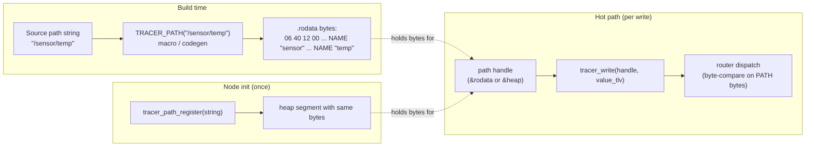

# Reference 03 — Addressing

> **Status**: draft, v1, 2026-05-03. Defines how vertices and fields are named, how subscriptions match paths, and how application-level slicing replaces wire-level fragmentation.
> **See also**: [04-communication-flows.md](04-communication-flows.md) for API rationale; [02-graph-model.md](02-graph-model.md) for the schema discipline that gives field names meaning.

---

## Path syntax

EBNF (using ABNF-like notation). Two non-terminals: `path` is the **concrete** form used as the argument to `read` / `write` / `await`; `subscriber-path` is the **wildcard-admitting** form valid only inside SUBSCRIBER's PATH child.

```
path             = root [ segment *( segment-sep segment ) ] [ field-sep field-chain ]
subscriber-path  = root [ wild-segment *( segment-sep wild-segment ) ] [ field-sep field-chain ]
root             = "/"
segment-sep      = "/"
field-sep        = ":"
segment          = name [ index ]
wild-segment     = segment / "*" / "**"
name             = 1*64 ( UTF8-codepoint - reserved )
index            = "[" ( 1*5DIGIT / "*" / "" ) "]"
field-chain      = field *( "." field )
field            = name [ index ]
reserved         = "/" / ":" / "." / "[" / "]" / "*" / "?"
DIGIT            = %x30-39
```

Wildcard segments (`*`, `**`) and the wildcard index (`[*]`) appear ONLY inside `subscriber-path`. `read`, `write`, and `await` take the strict `path` form and MUST reject any wildcard with `ERROR=INVALID_PATH`.

- All names are UTF-8, case-sensitive, **case-folded NOT performed** (Unicode normalization is the application's responsibility — `/Sensor/temp` and `/sensor/temp` are different paths).
- Maximum **single-name** length: 64 bytes (UTF-8 encoded).
- Maximum **total path** length: 1024 bytes.
- Maximum **segment depth**: 32 (matches the iterative-parser depth cap from [01-data-format.md](01-data-format.md)).
- Maximum **field-chain depth**: 8 (e.g., `:settings.transport_tcp.tls.cipher.suite` is at the limit).
- Maximum **index value**: 65535 (fits in u16).

A path that violates any limit MUST be rejected with `ERROR=INVALID_PATH`.

### Examples

```
/sensor/temp                           — a vertex
/sensor/temp:subscribers[0]            — a control field on a vertex
/sensor/temp:subscribers[]             — append-or-list view of subscribers
/sensor/temp:settings.reliability      — a nested control field
/sensor/temp:settings.transport_tcp.send_buf_kb  — module-namespaced field
/can-bridge/wheel-encoder/left         — a vertex behind a bridge
/camera/frame[7]                       — element 7 of an indexed-children vertex
/camera/frame[]                        — append target (publisher) or list (reader)
/i2c-bus/0x68/accel                    — peripheral on I²C bus 0x68
/                                      — the root vertex (rarely addressed directly)
```

### Index forms

- `[N]` (decimal integer 0..65535): a specific slot.
- `[]` (empty index): the array as a whole. A read returns a `PL=1` reply whose children are the element TLVs; a write appends to the next free slot.
- `[*]` (wildcard, **subscribe-only**): match any index. Valid only inside SUBSCRIBER PATHs.

Indexing is resolved at **L4 from the field schema**, not from a wire marker: a **fixed-stride** array (uniform element size) resolves `[N]` by direct offset (O(1)) on contiguous backing; otherwise the children are walked (ADR-0008).

### Reserved characters

The five characters `/ : . [ ]` plus the wildcards `*` and `?` cannot appear inside a NAME segment. Implementations MUST reject any NAME containing them with `ERROR=INVALID_PATH`.

(`?` is reserved for future single-character wildcard semantics; it is not in use in v1 but is reserved to keep the door open.)

---

## Field-path resolution

The `:` separator divides a path into the **vertex address** (left of `:`) and the **field chain** (right of `:`).

```
/sensor/temp:settings.deadline_ns
  └────┬────┘└─────────┬─────────┘
   vertex addr     field chain
```

Resolution proceeds in two stages:

1. **Resolve the vertex address** by walking the segment chain from the root. Each segment must match a child vertex name; index segments select indexed children.
2. **Resolve the field chain** against the vertex's schema (read `:schema` to enumerate). Each `.subfield` step descends one level; `[N]` selects a slot in an array-typed field.

If stage 1 fails: `ERROR=NOT_FOUND`. If stage 2 fails: `ERROR=SCHEMA_NOT_FOUND` for an unknown field name; `ERROR=NOT_FOUND` for an out-of-range index on an existing array field.

### Reading vs writing array slots

- `read("/x:subscribers[0]")` returns the SUBSCRIBER TLV at slot 0, or `STATUS=ERROR(NOT_FOUND)` if empty.
- `read("/x:subscribers[]")` returns a `PL=1` reply whose children are all populated SUBSCRIBER slots, in slot-order.
- `write("/x:subscribers[3]", tlv)` places the TLV at slot 3, replacing any existing entry.
- `write("/x:subscribers[]", tlv)` allocates the next free slot and places the TLV there. The caller can recover the chosen index by reading `:subscribers[]` and looking for their TLV (typically by including a unique subscriber-id NAME in the SUBSCRIBER record).

### Atomicity of multi-field writes

A single `write(path, tlv)` is atomic: a concurrent reader sees either the full prior state or the full new state at that path, not a partial mixture. To update multiple fields atomically, write a single SETTINGS TLV (`0x0B`) containing all the fields to a parent path; the router applies the SETTINGS as one operation.

```c
// Non-atomic (reader between calls sees inconsistent state):
tracer_write("/x:settings.reliability", tlv1);
tracer_write("/x:settings.deadline_ns", tlv2);

// Atomic (reader sees both fields update together):
tracer_write("/x:settings", settings_tlv(tlv1, tlv2));   // SETTINGS (0x0B), not a generic container
```

---

## Wildcards (subscribe-only)

Wildcards are valid in two contexts:

- The PATH of a SUBSCRIBER TLV (the publisher's outgoing target).
- The PATH the subscriber is **listening for** when registering its subscription.

Wildcards are NOT valid in `tracer_read`, `tracer_write`, or `tracer_await` calls. Those resolve a single path.

### Match rules

- `*` matches **exactly one** path segment, of any value.
- `**` matches **zero or more** path segments. `**` MUST be the only wildcard at its position; `**a` and `a**` are invalid.
- `[*]` (inside an index) matches **any index** at that segment. Equivalent to using `*` for the whole segment if the parent has only indexed children.

### Examples

```
/sensor/*/temp                  matches /sensor/A/temp, /sensor/B/temp; not /sensor/A/B/temp
/sensor/**                      matches /sensor, /sensor/A, /sensor/A/B, /sensor/A/B/temp
/sensor/**/temp                 matches /sensor/temp, /sensor/A/temp, /sensor/A/B/temp
/camera/frame[*]                matches /camera/frame[0], /camera/frame[1], ...
/i2c-bus/*/accel                matches /i2c-bus/0x68/accel, /i2c-bus/0x6A/accel
```

### Match cost

A subscription with a wildcard requires the router to walk the wildcard table on every relevant `tracer_write`. Implementation guidance (not normative): pre-compute the matching set of wildcard subscriptions per concrete write path, cached, invalidated when subscriptions change. Acceptable cost for the typical fan-in being modest (≤ few dozen wildcard subscribers per topic).

### Subscriber identity in wildcard subscriptions

A wildcard subscriber receives a stream of TLVs from many concrete paths and MUST be able to determine which concrete path produced each. For **local** delivery (subscriber and dispatcher in one node) the mechanism is implementation-defined — typically the matched path is passed out-of-band (a callback argument). For **bridged/remote** delivery it must travel on the wire: the matched concrete `PATH` (`0x06`) accompanies the delivered TLV. *(The on-wire form is proposed under [RFC-0003](https://github.com/avatarsd-llc/libtracer/blob/main/docs/spec/rfcs/0003-bridged-wildcard-delivery-path.md); until it lands, cross-implementation bridged wildcard delivery is not guaranteed interoperable.)*

---

## Address-shift slicing (replaces wire-level fragmentation)

The wire format ([01-data-format.md](01-data-format.md)) deliberately omits fragmentation rules. The application-level mechanism is **address-shift slicing**: a logically large payload is split across **N child endpoints** with the **same timestamp**.

### Sender behavior

```
Logical message: 10 MB camera frame, timestamp T.

Publisher chooses slice size S = 64 KiB.
Number of slices N = ceil(10 MB / S) = 160.

For i in 0..159:
    write("/camera/frame[i]", VALUE{ts=T, bytes=slice_i})
```

Each slice is a complete, valid, independently-routable TLV. The publisher emits N writes; the router and transport see N separate dispatches.

### Receiver behavior

A subscriber registers once with a wildcard path:

```
write("/camera/frame[*]:subscribers[]", SUBSCRIBER{path=/local/handler, settings})
```

Each subsequent `write("/camera/frame[i]", ...)` matches the wildcard and produces a delivery to `/local/handler` with the slice index recoverable from the matched path.

The subscriber assembles the slices into a coherent group keyed by **`(origin_peer_id, ts)`**, with each slice's `index` giving its position:

- All slices with the same **`(origin_peer_id, ts)`** belong to the same logical message. This is the **same in-flight identity** the cycle-dedup recent-set uses ([02-graph-model.md](02-graph-model.md), [07-host-embedding.md](07-host-embedding.md)); grouping by `ts` alone would merge slices from two publishers that happen to emit at the same timestamp.
- `origin_peer_id` is the **originating** publisher, not the immediate hop. The assembler MUST retain it across a bridge that sheds the ROUTER envelope — the slice arrives with the bridge as its immediate sender, but the ROUTER carried the origin.
- The slice's `index` (from the `[N]` in its address) gives its position within the logical message.
- A slice may arrive at any time within the deadline window.
- Loss of an **interior** slice is detected as a missing index at deadline; loss of **trailing** slice(s) is detectable only when the group total is known (see §loss detection).

### Subscriber assembly policies

The subscriber's QoS at `:settings.address_shift.*` controls assembly behavior. (Field names are defined here as the v1 design.)

| Field | Type | Default | Effect |
| ---- | ---- | ---- | ---- |
| `:settings.address_shift.assemble` | bool | false | If true, hold slices in a per-timestamp buffer until the group is complete or deadline expires; deliver one assembled message. If false, deliver each slice immediately as it arrives. |
| `:settings.address_shift.expected_count` | u32 | 0 (unknown) | If non-zero, declares N up-front; missing indices are detectable before deadline. |
| `:settings.address_shift.on_gap` | enum | `surface` | `surface` = deliver partial group with `STATUS=ADDRESS_SHIFT_GAP`; `drop` = silently discard incomplete groups; `wait_forever` = never give up (bounded by `queue_max_bytes`). |
| `:settings.deadline_ns` | u64 | unset | Per-group assembly deadline. After the deadline relative to the first observed slice, the group is finalized per `on_gap`. |

### Loss detection

Missing index `k` in a group with `expected_count = N` and observed indices `{0..N-1} \ {k}`: at deadline, the assembler emits `STATUS=ADDRESS_SHIFT_GAP` with `ERROR.detail = k`.

**Group totality is opt-in.** For groups without `expected_count`, the assembler treats the largest-observed-index + 1 as the implicit `N` at deadline — so a dropped **trailing** slice is invisible (a 100-slice group missing index 99 looks complete at slice 98). v1 does not force a count: open-ended streams cannot always supply one. If guaranteed tail-loss detection is required, the publisher MUST declare totality — either set `expected_count`, or precede the group with a `:manifest` write carrying the index set as a structured (`opt.PL=1`) TLV. (An end-of-group marker on the final slice is a possible future mechanism — see [ADR-0011](https://github.com/avatarsd-llc/libtracer/blob/main/docs/adr/0011-address-shift-totality-opt-in.md).)

### Why this is good

- **Lossless transport composition.** Whatever the transport does (drop a UDP datagram, lose a CAN frame), each slice is independently lost or delivered. No reassembly state to corrupt.
- **No special FRAGMENT type code.** The wire format from [01-data-format.md](01-data-format.md) doesn't need a fragment-with-reassembly-metadata type; the addressing scheme carries it.
- **Stream processing is natural.** The subscriber decides whether to assemble or to process as a stream; the publisher doesn't impose either choice.
- **Per-slice priority and QoS.** The addressing scheme lets a publisher tag different slices with different priorities (e.g., camera I-frames at high priority, P-frames at low) by writing them to differently-configured `ep[N]` slots.

### Why this is hard

- **Index allocation discipline.** The publisher must agree with subscribers on what `[N]` means (byte offset / slice_size? row index? sample index in a window?). This is an application-layer convention; libtracer does not impose semantics.
- **Wildcard matching cost** (already discussed above).

---

## Address scopes: local, bridged, global

The same path can resolve differently depending on which transport produced the write. The protocol distinguishes three scopes:

### Local scope

A path resolves within the host's own graph. No bridge prefix. Applies to:

- In-process publishers and subscribers on the same node.
- Vertex paths created by application code on this node.
- Module-exported vertex paths (e.g., `transport_i2c` exposing `/i2c-bus/0x68/accel`).

### Bridged scope

```{note}
**Trajectory (post-RFC-0004).** The `mount = "…"` / `source = "…"` **bridge republish** prefixing below is the M4 model. The current addressing is **path-as-route** ([ADR-0027](../adr/0027-transport-and-connections-are-vertices.md) / [CONTEXT.md §Path-as-route](../../CONTEXT.md)): a remote vertex is reached by walking *through* a transport-vertex — `/net/<conn>/<remote path>` — where the mount prefix **is** the transport-vertex's own path, not a configured string. The send-side suffix and this receive-side mount prefix are the same address ([ADR-0038](../adr/0038-net-plane-performance-model-two-plane-forwarding-and-buffer-lifetime.md)). See [reference/13](13-network-formation.md).
```

A path is **prefixed** with the bridge's mount point when the bridge republishes incoming TLVs. A bridge configured with `mount = "/can-bridge"` and `source = "transport_can"` republishes a CAN-borne write to `/sensor/wheel/left` as `/can-bridge/sensor/wheel/left` on the local graph.

Subscribers on the local graph see the prefixed path. The original path on the source side is not visible past the bridge unless the bridge is configured to publish a manifest.

### Global scope

The "global" scope is the union of all hosts' local + bridged graphs. There is no single authority that owns it; it is a logical view assembled by traversing peer-id mounts.

A common convention (not normative): each peer's data lives under `/peer/{peer_id}/...` on every other host. The bridge configuration `mount = "/peer/{peer_id}"` interpolates the connecting peer's announced node name and creates one mount per remote peer. This keeps the global graph navigable without name collisions.

### Collision rules

When two transports / bridges would mount data at the same local path:

- **First-binder wins**: the first transport to bind a vertex name owns it. Subsequent attempts return `ERROR=PATH_IN_USE` (a yet-to-be-assigned error code in the `0x0C..0x7F` reserved range).
- Configuration MAY use `mount` prefixes to avoid collisions explicitly (`/can-bridge`, `/tcp-bridge`).
- For peer-id mounts (`/peer/{peer_id}`), uniqueness comes from the peer-id namespace. Conflicting peer-ids on the network are a discovery-layer problem, not an addressing problem.

---

## Path canonicalization

Two textually-different paths that name the same vertex MUST canonicalize to the same internal representation:

- Trailing slashes: `/sensor/temp/` and `/sensor/temp` are the same. Implementations SHOULD strip trailing slashes during parse.
- Empty segments: `/sensor//temp` is **invalid**, not equivalent to `/sensor/temp`. Reject with `ERROR=INVALID_PATH`.
- The root path is exactly `/`. `//` and beyond are invalid.

Field paths do not have a trailing-separator equivalent; `:settings.` (trailing dot) is invalid.

UTF-8 normalization: implementations MAY normalize path bytes to NFC at the parse boundary, but MUST be consistent: normalized paths and pre-normalized paths from peers must round-trip without collision. The recommended choice is to NOT normalize and to require senders to canonicalize before transmission. (Application authors generally use ASCII-only path components, so this is rarely an issue in practice.)

---

## Static path handles (MCU-friendly addressing)

> **Normative reference**: [../spec/v1.md](../spec/v1.md) §3.1.
> **See also**: [05-protocol-tlvs.md](05-protocol-tlvs.md) §`0x06` PATH for byte-precise PATH TLV layout.

The string form `"/sensor/temp"` is convenient at the API surface but hostile to the hot path on MCU-class hardware: it forces a parser walk, allocates segment structures per call, and pulls in `snprintf` (a few KB of code) when the path includes runtime indices. libtracer addresses this with a **static path handle**: a path is encoded into a PATH TLV exactly once — at build time or at node-init — and every subsequent reference uses the pre-encoded bytes directly.

**The contract.** A path handle is whatever opaque token an implementation hands back from path registration. It MUST resolve to wire bytes byte-equal to the canonical PATH TLV for the named vertex, and the resolution MUST NOT allocate, parse, or format strings on the hot path.

### Path lifecycle

Three modes, in order of preference for embedded targets:

| Mode | Where the PATH TLV lives | When the bytes are produced | Hot path cost |
| ---- | ---- | ---- | ---- |
| **Build-time literal** | `.rodata` / flash | At compile time (macro or codegen emits the byte literal) | Pointer-load — zero runtime work |
| **Init-time registration** | RAM (long-lived segment) | Once during `tracer_init` | Pointer-load |
| **String at hot path** (legacy / convenience) | RAM (short-lived) | On every call | Parse + alloc + canonicalize |

The string-at-hot-path mode is **NOT required** of conforming implementations and a minimum-feature (P0) build MAY omit the string entry points entirely.

### Diagram: how a static path is constructed and used



Both paths land in the same shape: a const region whose bytes are a valid PATH TLV. The hot-path API treats them identically.

### Build-time encoding via macro

A reference C23 implementation supplies a `TRACER_PATH` macro that expands a literal string to a `static const` PATH TLV byte array. The shape (informative — implementation choice, not normative):

```c
// Expands to a static const uint8_t[] containing exactly the PATH TLV bytes.
// All segment validation (length caps, reserved chars) happens at compile time
// via _Static_assert; a malformed path fails the build.
static const tracer_path_t SENSOR_TEMP = TRACER_PATH("/sensor/temp");

// Hot path — no allocation, no string parsing.
void on_sample(float t) {
    tlv_t value = TLV_VALUE_F32_INLINE(t);   // value also static-friendly
    tracer_write(&SENSOR_TEMP, &value);
}
```

The macro's job is to walk the literal at preprocessor time, count segments, reject reserved characters via `_Static_assert`, and emit the byte sequence:

```
06 PL=1+CR=0  LL=0  length=u16  | type, opt, length
02 00 06 00 's' 'e' 'n' 's' 'o' 'r'   ← NAME "sensor" (10 bytes)
02 00 04 00 't' 'e' 'm' 'p'           ← NAME "temp"   (8  bytes)
```

Since `.rodata` is read-only, the bytes are never modified. The router's dispatch table indexes by **byte-equality on the PATH TLV's payload**, so two TLVs that name the same vertex hash and compare identically regardless of where their bytes live (flash, heap, or transport receive buffer).

### Init-time registration for runtime-derived paths

Some paths are not known at compile time:

- Peer-id-mounted paths (`/peer/{peer_id}/sensor/temp`) — the peer-id is discovered at runtime.
- Address-shift slice paths (`/camera/frame[0]`, `/camera/frame[1]`, …) — the index varies per slice.

For these, the implementation provides:

```c
// Validate, canonicalize, encode once. Returned handle is stable for node lifetime.
tracer_path_handle_t h_frame_slice[N];
for (size_t i = 0; i < N; i++) {
    char buf[64];
    snprintf(buf, sizeof buf, "/camera/frame[%zu]", i);   // sprintf allowed at INIT
    h_frame_slice[i] = tracer_path_register(buf);          // encodes once
}

// Hot path — no snprintf.
void on_dma_complete(const uint8_t *frame, uint64_t ts) {
    for (size_t i = 0; i < N; i++) {
        tracer_write(h_frame_slice[i], view_into(frame + i*S, S, ts));
    }
}
```

`tracer_path_register` allocates exactly one PATH TLV in a long-lived segment, validates per [03-addressing.md](03-addressing.md) §path syntax, and returns the handle. After init, the handle behaves identically to a build-time literal: a pointer-load and a dispatch.

### Indexed slot paths without runtime formatting

For the common case of `name[i]` where `i` ranges over a known set, the implementation MAY offer an **indexed-handle** form that encodes the name once and supplies the index as a separate u16 at the dispatch boundary:

```c
// One PATH TLV for "/camera/frame", plus per-call index.
static const tracer_path_t CAMERA_FRAME = TRACER_PATH("/camera/frame");

void on_dma_complete(...) {
    for (size_t i = 0; i < N; i++) {
        tracer_write_indexed(&CAMERA_FRAME, /*index=*/i, slice_tlv);
    }
}
```

The router treats an indexed-handle write as equivalent to a write to `/camera/frame[i]`. This is an optimization, not a different addressing scheme — the resolved vertex and the wire bytes (after index expansion) are identical.

### Diagram: hot-path dispatch with a static handle

```mermaid
sequenceDiagram
    participant App as Application (ISR / sample loop)
    participant Hnd as Path handle (.rodata)
    participant Disp as Router dispatch
    participant Vtx as Vertex
    participant Subs as Subscribers

    App->>Hnd: load pointer (1 cycle on Cortex-M)
    App->>Disp: tracer_write(handle, value_tlv)
    Disp->>Disp: dispatch_table[hash(handle.bytes)]
    Note over Disp: byte-compare on PATH bytes;<br/>no string parse, no alloc
    Disp->>Vtx: store value_tlv as LKV
    Disp->>Subs: refcount-bump and enqueue (per subscriber)
```

The boxed note is the load-bearing one: dispatch never re-parses the path. The handle's bytes are the cache key.

### Why this matters

- **Code size.** Removing `snprintf` from the publisher saves 2–6 KB on Cortex-M (depending on libc). For a 16 KB target ([10-module-catalog.md](10-module-catalog.md) §profile sentinel), this is the difference between fitting and not fitting.
- **Determinism.** No allocation on the hot path means no fragmentation, no malloc-under-ISR, predictable worst-case latency.
- **Cache behavior.** Build-time PATH TLVs live in flash and are streamed via XIP / cached I-side accesses; they never compete with the data cache.
- **Wire correctness by construction.** Validation is done once at encode time; the hot path can assume the handle's bytes are a valid PATH TLV. There is no class of "malformed path on the hot path" bug to worry about.

### Conformance summary

A conforming node:

- MUST accept path handles at every read / write / await entry point ([../spec/v1.md](../spec/v1.md) §3.1.4).
- MUST treat a path handle and the equivalent string-form path as semantically identical.
- SHOULD provide a build-time encoding macro for paths known at compile time.
- MAY omit string-form entry points entirely on minimum-feature builds.
- MUST NOT require the application to format paths on the hot path.

The full byte layout of the encoded PATH TLV is in [05-protocol-tlvs.md](05-protocol-tlvs.md) §`0x06`. The init-time vs hot-path distinction is in [04-communication-flows.md](04-communication-flows.md) §the static-path write flow.
