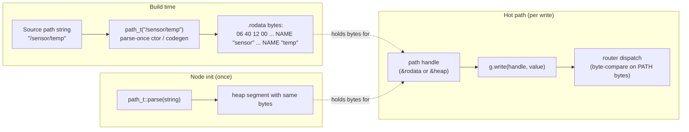
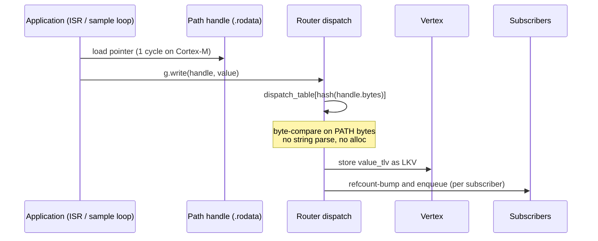

# Reference 03 — Addressing

> **Status**: draft, v1, 2026-05-03. Defines how vertices and fields are named, how subscriptions observe subtrees, and how application-level slicing replaces wire-level fragmentation.
> **See also**: [04-communication-flows.md](04-communication-flows.md) for API rationale; [02-graph-model.md](02-graph-model.md) for the schema discipline that gives field names meaning.

---

## Path syntax

EBNF (using ABNF-like notation). There is **one grammar**: the concrete `path` form is used everywhere — as the argument to `read` / `write` / `await` and inside a SUBSCRIBER's PATH child alike.

```
path             = root [ segment *( segment-sep segment ) ] [ field-sep field-chain ]
root             = "/"
segment-sep      = "/"
field-sep        = ":"
segment          = name [ index ]
name             = 1*64 ( UTF8-codepoint - reserved )
index            = "[" ( 1*5DIGIT / "" ) "]"
field-chain      = field *( "." field )
field            = name [ index ]
reserved         = "/" / ":" / "." / "[" / "]" / "*" / "?"
DIGIT            = %x30-39
```

There is **no wildcard grammar**. Subscriptions do not need one: every subscription is a **subtree subscription** ([RFC-0005](../spec/rfcs/0005-subtree-subscriptions.md)) — subscribing to a vertex observes it and all of its descendants — so "everything under `/sensor`" is expressed by subscribing to `/sensor` itself, with no pattern syntax (see [§subtree subscriptions](#subtree-subscriptions-no-wildcards) below). A path containing `*` or `?` anywhere MUST be rejected with `ERROR{tr::path::invalid}`.

- All names are UTF-8, case-sensitive, **case-folded NOT performed** (Unicode normalization is the application's responsibility — `/Sensor/temp` and `/sensor/temp` are different paths).
- Maximum **single-name** length: 64 bytes (UTF-8 encoded).
- Maximum **total path** length: 1024 bytes.
- Maximum **segment depth**: 32 (matches the iterative-parser depth cap from [01-data-format.md](01-data-format.md)).
- Maximum **field-chain depth**: 8 (e.g., `:settings.transport_tcp.tls.cipher.suite` is at the limit).
- Maximum **index value**: 65535 (fits in u16).

A path that violates any limit MUST be rejected with `ERROR{tr::path::invalid}`.

### Examples

```
/sensor/temp                           — a vertex
/sensor/temp:subscribers[0]            — a control field on a vertex
/sensor/temp:subscribers[]             — append-or-list view of subscribers
/sensor/temp:settings.reliability      — a nested control field
/sensor/temp:settings.transport_tcp.send_buf_kb  — module-namespaced field
/net/can0/wheel-encoder/left           — a remote vertex, routed through a transport-vertex
/camera/frame[7]                       — element 7 of an indexed-children vertex
/camera/frame[]                        — append target (publisher) or list (reader)
/i2c-bus/0x68/accel                    — peripheral on I²C bus 0x68
/                                      — the root vertex (rarely addressed directly)
```

### Index forms

- `[N]` (decimal integer 0..65535): a specific slot.
- `[]` (empty index): the array as a whole. A read returns a `PL=1` reply whose children are the element TLVs; a write appends to the next free slot.

Indexing is resolved at **L4 from the field schema**, not from a wire marker: a **fixed-stride** array (uniform element size) resolves `[N]` by direct offset (O(1)) on contiguous backing; otherwise the children are walked (ADR-0008).

### Reserved characters

The five characters `/ : . [ ]` plus `*` and `?` cannot appear inside a NAME segment. Implementations MUST reject any NAME containing them with `ERROR{tr::path::invalid}`.

(`*` and `?` carry no meaning anywhere in v1; they are reserved to keep the door open for a possible future per-segment wildcard grammar — see the non-normative note under [§subtree subscriptions](#subtree-subscriptions-no-wildcards).)

---

## Field-path resolution

The `:` separator divides a path into the **vertex address** (left of `:`) and the **field chain** (right of `:`).

```
/sensor/temp:settings.deadline_ns
  └────┬────┘└─────────┬─────────┘
   vertex addr     field chain
```

Resolution proceeds in two stages:

1. **Resolve the vertex address** by walking the segment chain from the root. Each segment must match a child vertex name; index segments select indexed children.
2. **Resolve the field chain** against the vertex's schema (read `:schema` to enumerate). Each `.subfield` step descends one level; `[N]` selects a slot in an array-typed field.

If stage 1 fails: `ERROR{tr::path::not_found}`. If stage 2 fails: `ERROR{tr::schema::not_found}` for an unknown field name; `ERROR{tr::path::not_found}` for an out-of-range index on an existing array field.

### Reading vs writing array slots

- `read("/x:subscribers[0]")` returns the SUBSCRIBER TLV at slot 0, or `STATUS=ERROR(NOT_FOUND)` if empty.
- `read("/x:subscribers[]")` returns a `PL=1` reply whose children are all populated SUBSCRIBER slots, in slot-order.
- `write("/x:subscribers[3]", tlv)` places the TLV at slot 3, replacing any existing entry.
- `write("/x:subscribers[]", tlv)` allocates the next free slot and places the TLV there. The caller can recover the chosen index by reading `:subscribers[]` and looking for their TLV (typically by including a unique subscriber-id NAME in the SUBSCRIBER record).

### Atomicity of multi-field writes

A single `write(path, tlv)` is atomic: a concurrent reader sees either the full prior state or the full new state at that path, not a partial mixture. To update multiple fields atomically, write a single SETTINGS TLV (`0x0B`) containing all the fields to a parent path; the router applies the SETTINGS as one operation.

```cpp
// See the graph module: ../modules/graph.md
tr::graph::graph_t g;

// Non-atomic (reader between calls sees inconsistent state):
g.write(tr::graph::path_t("/x:settings.reliability"), reliability_value);
g.write(tr::graph::path_t("/x:settings.deadline_ns"), deadline_value);

// Atomic (reader sees both fields update together):
g.write(tr::graph::path_t("/x:settings"), settings_value);   // one SETTINGS (0x0B) object, not a generic container
```

---

## Subtree subscriptions (no wildcards)

Every subscription is a **subtree subscription** ([RFC-0005](../spec/rfcs/0005-subtree-subscriptions.md), accepted and implemented): a `SUBSCRIBER` edge on vertex V observes writes to V **and to every descendant of V** — a leaf subscription is just the trivial case. A write at vertex W therefore delivers, once per subscriber, to the subscribers of W and of each of W's ancestors ("vertical bubbling"). The delivered payload is the **written TLV as-is** — the exact frame the producer wrote, at the granularity it chose.

This covers the dominant "everything under a prefix" use case with **no pattern grammar at all**: subscribing to `/sensor` is what a `/sensor/**` wildcard would have meant, and subscribing to `/camera/frame` observes every indexed child `/camera/frame[0]`, `/camera/frame[1]`, … The full semantics — bubbling, branch-write decomposition, write-creates, and the near-free-when-idle cost model (one relaxed atomic load on an unobserved write) — are specified in [02-graph-model.md](02-graph-model.md) §subtree subscriptions and [05-protocol-tlvs.md](05-protocol-tlvs.md) §`0x04`.

### Subscriber identity across a subtree

A subtree subscriber receives TLVs produced at many concrete paths and may need to know which vertex produced each. Provenance travels **in the data** where the application needs it ([CONTEXT.md](../../CONTEXT.md) §SUBSCRIBER direction); for **local** delivery the concrete path is additionally available out-of-band (implementation-defined — typically a callback argument). Wire-level concrete-path tagging of **remote** deliveries is the separate, still-draft [RFC-0003](../spec/rfcs/0003-bridged-wildcard-delivery-path.md) proposal; until it lands, cross-implementation remote provenance beyond what the data carries is not guaranteed interoperable.

### Future direction: per-segment wildcards (non-normative)

A per-segment wildcard grammar — `*` matching one segment (`/sensor/*/temp` for *horizontal* matching across siblings), `[*]` matching any index — is an **unratified idea**, not part of v1: no implementation exists, and adopting it would require its own RFC. The characters `*` and `?` are reserved so such a grammar could be added without breaking existing names. Subtree subscription deliberately removes the need for the `**`-style *vertical* wildcard.

---

## Address-shift slicing (replaces wire-level fragmentation)

The wire format ([01-data-format.md](01-data-format.md)) deliberately omits fragmentation rules. The application-level mechanism is **address-shift slicing**: a logically large payload is split across **N child endpoints** with the **same timestamp**.

### Sender behavior

```
Logical message: 10 MB camera frame, timestamp T.

Publisher chooses slice size S = 64 KiB.
Number of slices N = ceil(10 MB / S) = 160.

For i in 0..159:
    write("/camera/frame[i]", VALUE{ts=T, bytes=slice_i})
```

Each slice is a complete, valid, independently-routable TLV. The publisher emits N writes; the router and transport see N separate dispatches.

### Receiver behavior

A subscriber registers once on the **parent** vertex — a subtree subscription ([RFC-0005](../spec/rfcs/0005-subtree-subscriptions.md)) observes every indexed child:

```
write("/camera/frame:subscribers[]", SUBSCRIBER{path=/local/handler, settings})
```

Each subsequent `write("/camera/frame[i]", ...)` bubbles to the parent's subscription and produces a delivery to `/local/handler`, with the slice index recoverable from the producing path (out-of-band for local delivery; on-wire tagging for remote delivery is the draft [RFC-0003](../spec/rfcs/0003-bridged-wildcard-delivery-path.md)).

The subscriber assembles the slices into a coherent group keyed by **`(origin_peer_id, ts)`**, with each slice's `index` giving its position:

- All slices with the same **`(origin_peer_id, ts)`** belong to the same logical message; grouping by `ts` alone would merge slices from two publishers that happen to emit at the same timestamp.
- `origin_peer_id` is the **originating** publisher, not the immediate hop. For a remotely-delivered slice the origin is identified by the delivery's source route — the accumulated `src` PATH names the full route back to the producer ([07-host-embedding.md](07-host-embedding.md)).
- The slice's `index` (from the `[N]` in its address) gives its position within the logical message.
- A slice may arrive at any time within the deadline window.
- Loss of an **interior** slice is detected as a missing index at deadline; loss of **trailing** slice(s) is detectable only when the group total is known (see §loss detection).

### Subscriber assembly policies

The subscriber's QoS at `:settings.address_shift.*` controls assembly behavior. (Field names are defined here as the v1 design.)

| Field | Type | Default | Effect |
| ---- | ---- | ---- | ---- |
| `:settings.address_shift.assemble` | bool | false | If true, hold slices in a per-timestamp buffer until the group is complete or deadline expires; deliver one assembled message. If false, deliver each slice immediately as it arrives. |
| `:settings.address_shift.expected_count` | u32 | 0 (unknown) | If non-zero, declares N up-front; missing indices are detectable before deadline. |
| `:settings.address_shift.on_gap` | enum | `surface` | `surface` = deliver partial group with `STATUS=ADDRESS_SHIFT_GAP`; `drop` = silently discard incomplete groups; `wait_forever` = never give up (bounded by `queue_max_bytes`). |
| `:settings.deadline_ns` | u64 | unset | Per-group assembly deadline. After the deadline relative to the first observed slice, the group is finalized per `on_gap`. |

### Loss detection

Missing index `k` in a group with `expected_count = N` and observed indices `{0..N-1} \ {k}`: at deadline, the assembler emits `STATUS=ADDRESS_SHIFT_GAP` with `ERROR.detail = k`.

**Group totality is opt-in.** For groups without `expected_count`, the assembler treats the largest-observed-index + 1 as the implicit `N` at deadline — so a dropped **trailing** slice is invisible (a 100-slice group missing index 99 looks complete at slice 98). v1 does not force a count: open-ended streams cannot always supply one. If guaranteed tail-loss detection is required, the publisher MUST declare totality — either set `expected_count`, or precede the group with a `:manifest` write carrying the index set as a structured (`opt.PL=1`) TLV. (An end-of-group marker on the final slice is a possible future mechanism — see [ADR-0011](https://github.com/avatarsd-llc/libtracer/blob/main/docs/adr/0011-address-shift-totality-opt-in.md).)

### Why this is good

- **Lossless transport composition.** Whatever the transport does (drop a UDP datagram, lose a CAN frame), each slice is independently lost or delivered. No reassembly state to corrupt.
- **No special FRAGMENT type code.** The wire format from [01-data-format.md](01-data-format.md) doesn't need a fragment-with-reassembly-metadata type; the addressing scheme carries it.
- **Stream processing is natural.** The subscriber decides whether to assemble or to process as a stream; the publisher doesn't impose either choice.
- **Per-slice priority and QoS.** The addressing scheme lets a publisher tag different slices with different priorities (e.g., camera I-frames at high priority, P-frames at low) by writing them to differently-configured `ep[N]` slots.

### Why this is hard

- **Index allocation discipline.** The publisher must agree with subscribers on what `[N]` means (byte offset / slice_size? row index? sample index in a window?). This is an application-layer convention; libtracer does not impose semantics.
- **Bubbling fan-out cost.** Every slice write walks the ancestor chain when a subscriber exists at or above it — near-free when idle, but a hot high-rate slice stream pays one delivery per covering subscription ([RFC-0005](../spec/rfcs/0005-subtree-subscriptions.md) §A cost model).

---

## Address scopes: local, routed, global

The same path can resolve differently depending on which node evaluates it. The protocol distinguishes three scopes:

### Local scope

A path resolves within the host's own graph. No route prefix. Applies to:

- In-process publishers and subscribers on the same node.
- Vertex paths created by application code on this node.
- Module-exported vertex paths (e.g., `transport_i2c` exposing `/i2c-bus/0x68/accel`).

### Routed scope (path-as-route)

A remote vertex is reached by walking *through* a transport-vertex ([ADR-0027](../adr/0027-transport-and-connections-are-vertices.md) / [CONTEXT.md §Path-as-route](../../CONTEXT.md)): the path `/net/<conn>/<remote path>` — e.g. `/net/can0/sensor/wheel/left` — is the local address of the remote vertex, and **the path is the route**. The prefix is the transport-vertex's own path, not a configured string; the send-side suffix and the receive-side prefix are the same address.

The operation travels as an `FWD` frame carrying its own route: each forwarder hop strips its leading `dst` segment and prepends the inbound-link NAME to `src`, so `dst` is always the remaining forward route and `src` the accumulated return route. Explicit source routes cannot loop — `dst` shrinks monotonically per hop, and a `dst` that revisits a node is rejected with `ERROR{tr::path::invalid}`. Nothing is republished at a fixed prefix; a consumer addresses the routed path directly, and deliveries return along the accumulated route. See [reference/13](13-network-formation.md).

Two links to the same peer are two different routed addresses (e.g. `/net/ws0/...` and `/net/can0/...`) — deliberate redundancy the consumer subscribes to explicitly, not auto-multipath.

### Global scope

The "global" scope is the union of all hosts' local + routed graphs. There is no single authority that owns it; it is a logical view assembled by composing routes through transport-vertices.

A common convention (not normative): a peer's data is addressed through the connection that reaches it — `/net/<conn>/...` — and multi-hop reach composes one link segment per hop. This keeps the global graph navigable without name collisions.

### Collision rules

When two registrations would claim the same local path:

- **First-binder wins**: the first registrant to bind a vertex name owns it. Subsequent attempts return `ERROR{tr::path::in_use}` (a yet-to-be-assigned error code in the `0x0C..0x7F` reserved range).
- Configuration avoids collisions by giving each link a distinct connection NAME (`/net/can0`, `/net/ws0`).
- For routed addresses, uniqueness comes from the connection-NAME namespace of each node along the route. Conflicting peer identities on the network are a discovery-layer problem, not an addressing problem.

---

## Path canonicalization

Two textually-different paths that name the same vertex MUST canonicalize to the same internal representation:

- Trailing slashes: `/sensor/temp/` and `/sensor/temp` are the same. Implementations SHOULD strip trailing slashes during parse.
- Empty segments: `/sensor//temp` is **invalid**, not equivalent to `/sensor/temp`. Reject with `ERROR{tr::path::invalid}`.
- The root path is exactly `/`. `//` and beyond are invalid.

Field paths do not have a trailing-separator equivalent; `:settings.` (trailing dot) is invalid.

UTF-8 normalization: implementations MAY normalize path bytes to NFC at the parse boundary, but MUST be consistent: normalized paths and pre-normalized paths from peers must round-trip without collision. The recommended choice is to NOT normalize and to require senders to canonicalize before transmission. (Application authors generally use ASCII-only path components, so this is rarely an issue in practice.)

---

## Static path handles (MCU-friendly addressing)

> **Normative reference**: [../spec/v1.md](../spec/v1.md) §3.1.
> **See also**: [05-protocol-tlvs.md](05-protocol-tlvs.md) §`0x06` PATH for byte-precise PATH TLV layout.

The string form `"/sensor/temp"` is convenient at the API surface but hostile to the hot path on MCU-class hardware: it forces a parser walk, allocates segment structures per call, and pulls in `snprintf` (a few KB of code) when the path includes runtime indices. libtracer addresses this with a **static path handle**: a path is encoded into a PATH TLV exactly once — at build time or at node-init — and every subsequent reference uses the pre-encoded bytes directly.

**The contract.** A path handle is whatever opaque token an implementation hands back from path registration. It MUST resolve to wire bytes byte-equal to the canonical PATH TLV for the named vertex, and the resolution MUST NOT allocate, parse, or format strings on the hot path.

### Path lifecycle

Three modes, in order of preference for embedded targets:

| Mode | Where the PATH TLV lives | When the bytes are produced | Hot path cost |
| ---- | ---- | ---- | ---- |
| **Build-time literal** | `.rodata` / flash | At compile time (macro or codegen emits the byte literal) | Pointer-load — zero runtime work |
| **Init-time registration** | RAM (long-lived segment) | Once at node init (`register_vertex`) | Pointer-load |
| **String at hot path** (string-parsed, convenience) | RAM (short-lived) | On every call | Parse + alloc + canonicalize |

The string-at-hot-path mode is **NOT required** of conforming implementations and a minimum-feature (P0) build MAY omit the string entry points entirely.

### Diagram: how a static path is constructed and used



Both paths land in the same shape: a const region whose bytes are a valid PATH TLV. The hot-path API treats them identically.

### Parse-once path construction

The reference implementation encodes a literal path exactly once via the parse-once `path_t("...")` constructor (ADR-0054): it is a constructor, infallible for literals, and the resulting handle is reused on every subsequent write. A binding may additionally expose a build-time / `consteval` PATH encoder; the wire bytes are identical. The C++ sketch below shows the reference shape (see the [graph module](../modules/graph.md) and the [view module](../modules/views.md)):

```cpp
tr::graph::graph_t g;

// Parse-once handle: the PATH TLV is encoded a single time here.
// Reserved-char / length validation happens in the constructor.
tr::graph::vertex_t* sensor_temp =
    *g.register_vertex(tr::graph::path_t("/sensor/temp"),
                       tr::graph::role_t::STORED_VALUE);

// Build a fresh VALUE view over f32 bytes (standard helper pattern).
tr::view::view_t value_f32(float f) {
    tr::view::segment_ptr_t seg = tr::view::heap_alloc(4);
    std::uint32_t bits;
    std::memcpy(&bits, &f, 4);
    for (int i = 0; i < 4; ++i)
        seg->bytes[i] = static_cast<std::byte>((bits >> (8 * i)) & 0xFF);
    return tr::view::view_t::over(std::move(seg));
}

// Hot path — write by handle, no path parsing.
void on_sample(float t) {
    g.write(sensor_temp, value_f32(t));
}
```

Encoding the literal once walks the path, rejects reserved characters, counts segments, and emits the byte sequence:

```
06 PL=1+CR=0  LL=0  length=u16  | type, opt, length
02 00 06 00 's' 'e' 'n' 's' 'o' 'r'   ← NAME "sensor" (10 bytes)
02 00 04 00 't' 'e' 'm' 'p'           ← NAME "temp"   (8  bytes)
```

Since `.rodata` is read-only, the bytes are never modified. The router's dispatch table indexes by **byte-equality on the PATH TLV's payload**, so two TLVs that name the same vertex hash and compare identically regardless of where their bytes live (flash, heap, or transport receive buffer).

### Init-time registration for runtime-derived paths

Some paths are not known at compile time:

- Connection-routed paths (`/net/<conn>/sensor/temp`) — the connection name is established at runtime.
- Address-shift slice paths (`/camera/frame[0]`, `/camera/frame[1]`, …) — the index varies per slice.

For these, register each concrete indexed path once at init and keep its vertex handle. Runtime strings are parsed with `path_t::parse` (which returns `std::expected`); literal indexed paths use the `path_t("...")` constructor directly:

```cpp
tr::graph::graph_t g;

// Validate, canonicalize, encode once. The vertex handle is stable for node lifetime.
tr::graph::vertex_t* frame_slice[N];
for (std::size_t i = 0; i < N; ++i) {
    // Runtime-derived index → path_t::parse returns std::expected; deref on success.
    auto p = tr::graph::path_t::parse("/camera/frame[" + std::to_string(i) + "]");
    frame_slice[i] = *g.register_vertex(*p, tr::graph::role_t::STREAM);
}

// Hot path — zero-copy borrow of the DMA buffer, no string work.
void on_dma_complete(std::byte* frame, std::uint64_t /*ts*/) {
    for (std::size_t i = 0; i < N; ++i) {
        tr::view::view_t slice =
            tr::view::view_t::over(tr::view::borrow(std::span<std::byte>{frame + i * S, S}));
        g.write(frame_slice[i], slice);
    }
}
```

`register_vertex` encodes exactly one PATH TLV in a long-lived segment, validates per [03-addressing.md](03-addressing.md) §path syntax, and returns the handle. After init, the handle behaves identically to a build-time literal: a pointer-load and a dispatch.

### Indexed slot paths

For the common case of `name[i]` where `i` ranges over a known set, register each real indexed path (`/camera/frame[0]`, `/camera/frame[1]`, …) once and write by its handle:

```cpp
tr::graph::graph_t g;

// One vertex per real indexed path.
tr::graph::vertex_t* frame[N];
frame[0] = *g.register_vertex(tr::graph::path_t("/camera/frame[0]"), tr::graph::role_t::STREAM);
frame[1] = *g.register_vertex(tr::graph::path_t("/camera/frame[1]"), tr::graph::role_t::STREAM);
// …

void on_dma_complete(/* … */) {
    for (std::size_t i = 0; i < N; ++i) {
        g.write(frame[i], slice_view(i));
    }
}
```

A single-PATH-plus-index form — encoding `/camera/frame` once and supplying `i` as a separate u16 at the dispatch boundary — is a **permitted-but-not-implemented** optimization (non-normative): the reference core has no separate indexed-handle API. It would be equivalent to the real write to `/camera/frame[i]` above — the resolved vertex and the wire bytes (after index expansion) are identical.

### Diagram: hot-path dispatch with a static handle



The boxed note is the load-bearing one: dispatch never re-parses the path. The handle's bytes are the cache key.

### Why this matters

- **Code size.** Removing `snprintf` from the publisher saves 2–6 KB on Cortex-M (depending on libc). For a 16 KB target ([10-module-catalog.md](10-module-catalog.md) §profile sentinel), this is the difference between fitting and not fitting.
- **Determinism.** No allocation on the hot path means no fragmentation, no malloc-under-ISR, predictable worst-case latency.
- **Cache behavior.** Build-time PATH TLVs live in flash and are streamed via XIP / cached I-side accesses; they never compete with the data cache.
- **Wire correctness by construction.** Validation is done once at encode time; the hot path can assume the handle's bytes are a valid PATH TLV. There is no class of "malformed path on the hot path" bug to worry about.

### Conformance summary

A conforming node:

- MUST accept path handles at every read / write / await entry point ([../spec/v1.md](../spec/v1.md) §3.1.4).
- MUST treat a path handle and the equivalent string-form path as semantically identical.
- SHOULD provide a build-time encoding macro for paths known at compile time.
- MAY omit string-form entry points entirely on minimum-feature builds.
- MUST NOT require the application to format paths on the hot path.

The full byte layout of the encoded PATH TLV is in [05-protocol-tlvs.md](05-protocol-tlvs.md) §`0x06`. The init-time vs hot-path distinction is in [04-communication-flows.md](04-communication-flows.md) §the static-path write flow.
