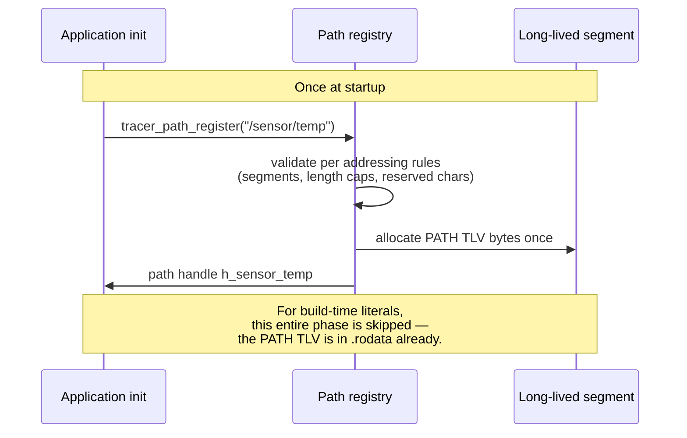
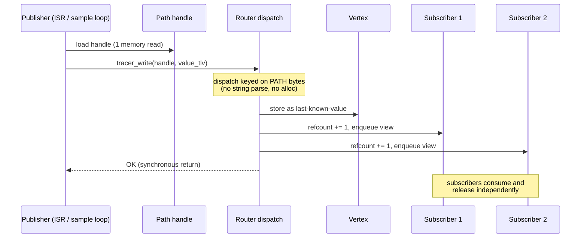
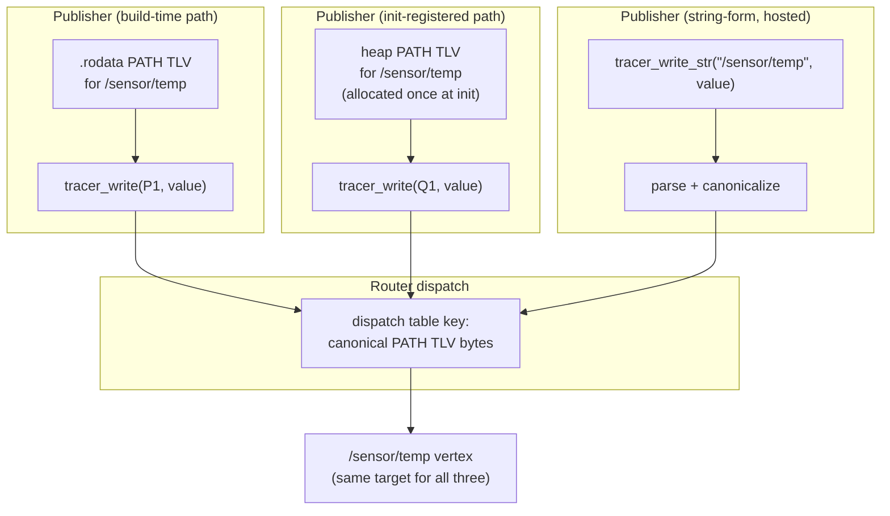

# Reference 04 — Communication Flows

> **Status**: draft, v1, 2026-05-03. Sequence-diagram catalog for every protocol-level flow. ASCII diagrams; the wire bytes for each TLV referenced here are byte-precise in [05-protocol-tlvs.md](05-protocol-tlvs.md).
> **See also**: [../adr/0006-read-write-await-api-no-connect.md](https://github.com/avatarsd-llc/libtracer/blob/main/docs/adr/0006-read-write-await-api-no-connect.md) for the API-surface rationale.

---

## The three primitive operations

The entire control + data surface is three calls. Every flow below decomposes into them.

| Primitive | Effect | Blocks? | Returns |
| ---- | ---- | ---- | ---- |
| `read(path)` | Fetch the last-known-value at `path` | No (configurable: blocks under `reliable`) | TLV view (ownership transferred to caller) or NOT_FOUND |
| `write(path, tlv)` | Push `tlv` to `path`, fan out to subscribers | No (back-pressure may queue) | OK or error code |
| `await(path, timeout)` | Block until next write at `path` or timeout | Yes | TLV view or TIMEOUT |

Subscriptions, QoS, ACL, liveness — every control surface — are encoded as **writes to fields under the `:` separator**. There is no separate `subscribe()`, `connect()`, `set_qos()`, etc.

---

## Read

```
Caller                              Local router                Vertex
  |                                       |                       |
  | read("/sensor/temp")                  |                       |
  |─────────────────────────────────────>|                       |
  |                                       | resolve_vertex("/sensor/temp")
  |                                       |──────────────────────>|
  |                                       |                       |
  |                                       |                       |── lookup last-known-value
  |                                       |                       |
  |                                       | <─ TLV view ──────────|
  |                                       | (refcount += 1)       |
  | <─ TLV view (ownership transferred) ──|                       |
  |                                       |                       |
```

- If the vertex has no last-known-value: returns `STATUS=ERROR(NOT_FOUND)` (or NULL/None depending on language binding).
- If `:settings.reliability = reliable` is set on the read-side QoS, the read MAY block until the next write (degenerates into `await`).
- Reading a control field (`:subscribers[]`, `:settings.X`, `:schema`) returns the field's current value. Reading `:schema` returns the vertex's introspectable schema regardless of whether data has been written.

---

## Write (publish + fanout)

```
Publisher              Local router            Vertex            Subscriber 1   Subscriber 2
   |                       |                     |                    |             |
   | write("/sensor/temp", VALUE{...})           |                    |             |
   |─────────────────────>|                     |                    |             |
   |                       | resolve_vertex     |                    |             |
   |                       |───────────────────>|                    |             |
   |                       |                     |── update LKV       |             |
   |                       | enumerate subs    <─|                    |             |
   |                       |───────────────────>|                    |             |
   |                       | <── [sub1, sub2] ──|                    |             |
   |                       |                                          |             |
   |                       |── view.refcount += 2 (one per subscriber) |             |
   |                       |                                          |             |
   |                       | dispatch view ──────────────────────────>|             |
   |                       |                                          |             |
   |                       | dispatch view ────────────────────────────────────────>|
   |                       |                                          |             |
   |                       |── publisher's reference released         |             |
   | <── OK ───────────────|                                          |             |
   |                       |                       (later, sub1 releases its view)  |
   |                       |                       (later, sub2 releases its view)  |
   |                       |                       segment refcount → 0, freed      |
```

Key invariants:

- The TLV ownership transfers from the publisher to the router on `write`. The publisher MUST NOT touch `tlv` after the call returns.
- The router clones (refcount-bumps) the view per subscriber. **No bytes are copied.**
- Each subscriber's queue holds the view; when the subscriber consumes and releases, its refcount drops.
- The backing segment is freed only when the last view is released.

---

## Await (block for next write)

```
Subscriber                     Vertex
   |                              |
   | await("/sensor/temp", 1s)    |
   |─────────────────────────────>|
   |                              |── enqueue caller in waiter list
   |                              |
   ...                            ... waiting ...
   |                              |
   |                              | <── publisher write happens
   |                              |── dequeue waiter, deliver view
   |                              |
   | <── TLV view ────────────────|
   |                              |
```

Or on timeout:

```
   | <── STATUS=ERROR(TIMEOUT) ───|
```

`await` is logically equivalent to `subscribe + receive-one + unsubscribe`. The implementation MAY make it cheaper than the literal sequence (e.g., by not creating a persistent SUBSCRIBER record).

A subscriber that wants persistent (callback-driven) delivery uses **subscribe via field-write** (next flow), not repeated `await` calls.

---

## Subscribe (via field-write)

```
Subscriber              Local router        Publisher's vertex
   |                       |                       |
   | tlv_t *sub = tlv_new_subscriber(            |
   |     target_path = "/local/handler",         |
   |     settings   = {reliability=best_effort}  |
   | );                                            |
   |                       |                       |
   | write("/sensor/temp:subscribers[]", sub)    |
   |─────────────────────>|                       |
   |                       | resolve_field        |
   |                       |─────────────────────>|
   |                       |                       |── allocate next free slot N
   |                       |                       |── store SUBSCRIBER TLV at slot N
   |                       |                       |── update :schema
   |                       | <── slot index N ────|
   | <── OK (slot N) ─────|                       |
   |                                                |
   ...                                              ... future writes to /sensor/temp
   ...                                              ... fan out to /local/handler
```

Effects after the subscribe write returns:

- A SUBSCRIBER TLV exists at `/sensor/temp:subscribers[N]`.
- All future writes to `/sensor/temp` produce a write to `/local/handler` with the publisher's payload.
- The subscriber's `liveness` state begins; if `:liveness.heartbeat_hz > 0`, the subscriber MUST start writing heartbeats to `/sensor/temp:subscribers[N].liveness.last_seen_ns` periodically.

The SUBSCRIBER TLV layout is defined in [05-protocol-tlvs.md](05-protocol-tlvs.md) §`SUBSCRIBER`.

---

## Unsubscribe (via field-write)

```
Subscriber                              Publisher's vertex
   |                                          |
   | write("/sensor/temp:subscribers[3]",     |
   |       STATUS{ok})                        |
   |─────────────────────────────────────────>|
   |                                          |── slot 3 cleared
   |                                          |── update :schema
   | <── OK ──────────────────────────────────|
```

Equivalent forms:

- Write `STATUS=OK` (empty payload) to the slot.
- Write a SUBSCRIBER TLV with no PATH child.
- Write a single-byte VALUE with sentinel `0x00` (legacy convenience).

After unsubscribe:

- Future writes to the parent vertex no longer fan out to the cleared slot.
- The slot index N may be reallocated by a future `subscribers[]` append.
- Any in-flight TLVs already dispatched but not yet consumed by the subscriber's queue are NOT recalled. The subscriber may receive a few more TLVs after the unsubscribe call returns.

---

## Field-write QoS update

```
Operator                          Vertex
   |                                |
   | write("/sensor/temp:settings.deadline_ns",
   |       VALUE{u64=5000000})      |
   |───────────────────────────────>|
   |                                |── update settings.deadline_ns
   |                                |── (next fanout uses new deadline)
   | <── OK ────────────────────────|
```

QoS changes apply to the **next** dispatch from this vertex. In-flight dispatches with the prior settings are not re-evaluated.

For atomic multi-field updates, write a SETTINGS TLV containing both fields to the parent path:

```
write("/sensor/temp:settings",
      SETTINGS { reliability=reliable, deadline_ns=5000000 })
```

---

## Bridge republish

A bridge is a vertex that ingests TLVs from one transport and republishes them into the local graph under a mount point. From a local subscriber's view, bridged data is indistinguishable from local-source data.

```
External peer        Transport module       Bridge vertex          Local router         Local subscriber
   |                       |                      |                      |                      |
   | (CAN frame)──────────>|                      |                      |                      |
   |                       |── reassemble bytes  |                      |                      |
   |                       |── construct TLV view|                      |                      |
   |                       |── validate trailer   |                      |                      |
   |                       |   (CRC + wire-time)  |                      |                      |
   |                       |── strip trailer      |                      |                      |
   |                       |── recv_cb(tlv,      |                      |                      |
   |                       |          peer_id)──>|                      |                      |
   |                       |                      |── dedupe check       |                      |
   |                       |                      |   (origin, ts) from   |                      |
   |                       |                      |   ROUTER TLV          |                      |
   |                       |                      |── shed ROUTER        |                      |
   |                       |                      |   (save metadata for  |                      |
   |                       |                      |    re-emit table)     |                      |
   |                       |                      |── prepend mount      |                      |
   |                       |                      |   "/can-bridge/" +   |                      |
   |                       |                      |   incoming path      |                      |
   |                       |                      |── write bare data   |                      |
   |                       |                      |   to local graph ───>|                      |
   |                       |                      |                      |── normal write flow  |
   |                       |                      |                      |   (fanout)           |
   |                       |                      |                      |─────────────────────>|
```

Two strips happen in this flow, and they are at different layers:

- **L2 trailer strip**: the transport module validates `trailer_crc` (and optionally `trailer_ts`), then the trailer is consumed — the bare `header + payload` is what the bridge sees. This is universal across all transports.
- **L4 ROUTER shed**: the bridge unwraps the `ROUTER` envelope, saves `(origin_peer_id, origin_timestamp, hop_count)` from ROUTER's metadata children to its per-proxy metadata table, and stores only the wrapped data TLV (ROUTER's last child, tagged by `NAME "data"`) at the proxy vertex. This applies only when the incoming TLV is itself a ROUTER.

When a local subscriber that is itself reachable via another transport pulls this data, the bridge re-emits in mirror order: re-wrap into a `ROUTER` envelope with `hop_count` incremented and the data TLV as the last child, attach a fresh outbound trailer (new wire-time, new CRC), send. The payload bytes never move.

Dedup is essential because the global topology may have cycles (see [07-host-embedding.md](07-host-embedding.md) §cycle handling). The bridge maintains a **recent-set** of `(origin_peer_id, origin_timestamp)` pairs and silently drops TLVs already seen.

---

## Address-shift fanout

A publisher splits a logical message across N child endpoints with a shared timestamp; subscribers either process slices independently or assemble per-group.

```
Publisher                  Router                  Subscriber w/ wildcard subscription
   |                          |                       /camera/frame[*]
   |                          |                                    |
   | for i in 0..N-1:         |                                    |
   |   write("/camera/frame[i]", VALUE{ts=T, bytes=slice_i})       |
   |─────────────────────────>|                                    |
   |                          |── resolve concrete path             |
   |                          |── match wildcard subscription       |
   |                          |── dispatch view ──────────────────>|
   |                          |                                    |── enqueue
   |                          |                                    |   (assemble or stream)
   ... continues for all N slices ...
```

Subscriber assembly logic per `:settings.address_shift.*` (see [03-addressing.md](03-addressing.md) §address-shift slicing).

---

## Deadline expiry

```
Vertex with deadline_ns=D             Subscriber
   |                                       |
   | write at T0                            |
   |───────────────────────────────────────>|
   |                                       |── consume
   |                                       |
   ...                                     ...
   |                                       |
   | (no write observed by T0+D)           |
   |                                       |
   |── local liveness checker fires        |
   |── increment :liveness.missed_deadlines |
   |── emit STATUS=ERROR(TIMEOUT) to subs ─>|
   |                                       |── react per app logic
```

The deadline check runs in the dispatching node. Subscribers receive a STATUS notification when a deadline is missed; they do NOT need to run their own deadline timer.

---

## Liveness loss

```
Subscriber                         Publisher's vertex
   |                                       |
   | (subscription active, heartbeat_hz=1) |
   |                                       |
   | write(":subscribers[N].liveness.last_seen_ns", VALUE{u64=now})
   |─────────────────────────────────────────────────────────────>|
   |                                       |── update last_seen_ns
   ...                                     ...
   |                                       |
   | (subscriber crashes — no heartbeat for 3s)                   |
   |                                       |
   |                                       |── liveness checker fires
   |                                       |── observe (now - last_seen_ns) > 3s
   |                                       |── mark subscriber slot stale
   |                                       |── clear :subscribers[N] (or mark inactive)
   |                                       |── emit STATUS=ERROR(TRANSPORT_DOWN)
   |                                       |   to peer subscribers (if any)
```

Heartbeat write granularity: the subscriber writes to its own `liveness.last_seen_ns` field at `heartbeat_hz`. The publisher's liveness checker runs locally and observes the field; no separate heartbeat protocol exists.

A subscriber with `:liveness.heartbeat_hz = 0` opts out of liveness checking. Best-effort subscriptions with no liveness check are valid.

---

## Network partition and recovery

```
Bridge                Transport module      External peer
   |                       |                      |
   | (steady-state)        |                      |
   | <── data ─────────────|<───────── data ──────|
   |                       |                      |
   |                       | (peer disconnects: TCP RST, mDNS expiry, CAN-error-frame, etc.)
   |                       |── notify_disconnect(peer_id)
   |                       |─────────────────────>|
   |── for each path bridged from this peer:     |
   |   emit STATUS=ERROR(TRANSPORT_DOWN) write   |
   |   to local subscribers                      |
   |                                              |
   ... time passes ...                            ...
   |                                              |
   |                       | (discovery module re-finds peer, or static config triggers retry)
   |                       |<──────── reconnect ──|
   |                       |── notify_connect(peer_id)
   |                       |─────────────────────>|
   |── re-emit any transient-local cached data    |
   |   for paths the peer was bridging            |
   |── normal traffic resumes                     |
```

There is no automatic graph-state-merge logic. Last-write-wins by timestamp is the conflict-resolution policy. If both sides wrote during the partition, the higher timestamp wins; the lower timestamp is silently superseded.

Cluster consensus / CRDT / vector-clock causality are explicitly **out of scope** for v1. Layer them above libtracer if needed.

---

## Auxiliary flows

### Schema discovery

```
Caller                              Vertex
   |                                   |
   | read("/sensor/temp:schema")       |
   |──────────────────────────────────>|
   | <── POINT (PL=1) {                |
   |       NAME "subscribers"           |
   |       SUBSCRIBER ...               |
   |       ...                          |
   |       NAME "settings"              |
   |       SETTINGS (PL=1) {            |
   |         NAME "reliability" VALUE u8|
   |         NAME "deadline_ns" VALUE u64|
   |         NAME "transport_tcp"       |
   |         SETTINGS (PL=1) {          |
   |           NAME "send_buf_kb" VALUE u32 |
   |         }                          |
   |       }                            |
   |       ...                          |
   |     } ───────────────────────────|
```

Schema is the introspection root. All tooling (`tracer-top`, future web GUI, conformance tests) walks `:schema` on every vertex of interest.

### Vertex enumeration

```
Caller                              Local router
   |                                   |
   | read("/sensor")                   |
   |──────────────────────────────────>|
   | <── POINT (PL=1) {                |
   |       NAME "sensor"               |
   |       POINT child_temp            |
   |       POINT child_humidity        |
   |       ...                         |
   |     } ──────────────────────────|
```

Reading a parent vertex returns a POINT TLV whose children include POINT TLVs for each sub-vertex (and other metadata children per the POINT spec in [05-protocol-tlvs.md](05-protocol-tlvs.md)). This makes browsing the graph trivial:

```
read("/")              -> top-level children
read("/sensor")        -> sensors
read("/sensor/temp")   -> the temperature value
read("/sensor/temp:schema")  -> what fields exist
```

---

## Error propagation

Every flow that can fail returns a STATUS TLV. The body of STATUS contains zero or more ERROR TLVs (empty STATUS = OK). Error codes are listed in [05-protocol-tlvs.md](05-protocol-tlvs.md) §error codes.

A subscriber's view of errors is via:

- **Synchronous return** from `read` / `write` / `await`.
- **STATUS write** to `/path:status` for asynchronous events (deadline, liveness, transport-down). Subscribers can subscribe to `/path:status` if they want async error notification; the field is in every vertex's schema.

The `:status` subscription channel is a normal subscription using the normal subscribe-via-field-write flow — no special API.

---

## The static-path write flow

> **Normative reference**: [../spec/v1.md](../spec/v1.md) §3.1.4.
> **See also**: [03-addressing.md](03-addressing.md) §static path handles; [05-protocol-tlvs.md](05-protocol-tlvs.md) §static / pre-encoded PATH TLV.

This flow is the MCU-friendly variant of `write`. The path's PATH TLV is encoded once — at build time or at init — and the hot path operates on a path **handle** (pointer or small index) rather than a string. There is no `snprintf`, no allocation, and no parser walk on the publisher side.

### Init-time path encoding



Build-time literals skip registration entirely: the macro `TRACER_PATH("/sensor/temp")` expands to a `static const` byte array, and the handle is a pointer to that array.

### Hot-path write through a path handle



Compare to the string-form write flow at the top of this document. The bytes that flow through the router are identical. The only difference is **where the path bytes came from** — a pre-encoded blob vs. a freshly-parsed string.

### Cross-mode equivalence

A subscriber registered against `/sensor/temp` (string form) MUST receive deliveries from a publisher writing through a static handle for `/sensor/temp`, and vice-versa. The router's dispatch table is keyed on canonical PATH TLV bytes; both forms produce the same key.



This diagram is the assertion behind [../spec/v1.md](../spec/v1.md) §3.1.1 condition (1): byte-equivalence on the wire after canonicalization.

### Performance envelope

| Mode | Per-write cost (Cortex-M4 @ 100 MHz, ballpark) |
| ---- | ---- |
| Build-time literal handle | ~10 cycles to load handle + ~30 cycles dispatch lookup = **~0.4 µs** |
| Init-registered handle | same as above (the handle's bytes live in heap, not flash, but access pattern is identical) |
| String-form (`snprintf` + parse) | 1–10 µs depending on path depth and libc; **NOT ISR-safe** |

The static-path flow is the only one usable from a hard-real-time ISR. The string-form is fine on hosted platforms where the publisher runs in a worker thread.

### Errors specific to the static flow

A static-handle write can return:

- `ERROR=NOT_FOUND` — the handle is well-formed but the target vertex was unbound (e.g., a transport module that owned the vertex was unloaded). The handle's bytes remain valid; only the resolution failed.
- `ERROR=PATH_IN_USE` — only at init-time `tracer_path_register`, never on the hot path. A handle that survives init has been validated.

There is no `INVALID_PATH` error on the hot path: invalidity is detected exclusively at encode time. This is the practical payoff of paying for validation once.
