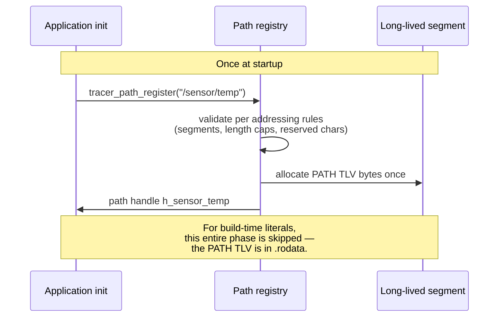
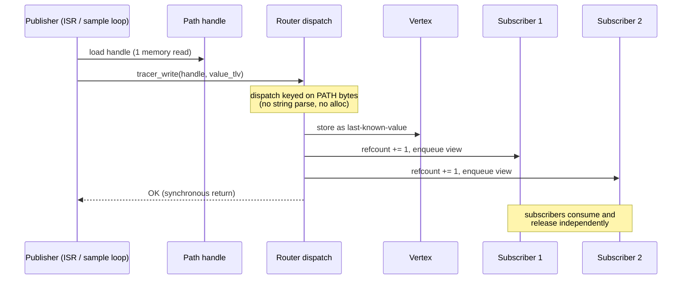
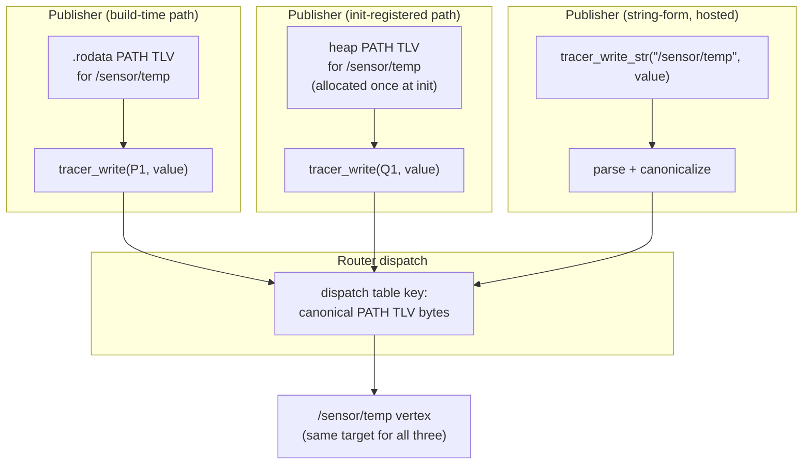

# Reference 04 — Communication flows

> **Audience**: an implementer building the operation surface — the sequence-diagram catalog for every protocol-level flow, from a local read to a multi-hop remote write and its rejection.
> **See also**: [05-protocol-tlvs.md](05-protocol-tlvs.md) for the byte-precise TLV each flow carries; [ADR-0006 — read/write/await API, no connect](https://github.com/avatarsd-llc/libtracer/blob/main/docs/adr/0006-read-write-await-api-no-connect.md) for the API-surface rationale.

---

## The three primitive operations

The entire control and data surface is three operations. Every flow below decomposes into them.

| Primitive | Effect | Blocks? | Returns |
| ---- | ---- | ---- | ---- |
| `read(path)` | Fetch the last-known-value at `path` | No (configurable: blocks under `reliable`) | TLV view (ownership transferred to caller) or NOT_FOUND |
| `write(path, tlv)` | Push `tlv` to `path`, fan out to subscribers | No (back-pressure may queue) | OK or error code |
| `await(path, timeout)` | Block until next write at `path` or timeout | Yes | TLV view or TIMEOUT |

Subscriptions, QoS, ACL and liveness — every control surface — are encoded as **writes to fields under the `:` separator**. There is no separate `subscribe()`, `connect()` or `set_qos()` verb.

---

## Read

```
Caller                              Local router                Vertex
  |                                       |                       |
  | read("/sensor/temp")                  |                       |
  |─────────────────────────────────────>|                       |
  |                                       | resolve_vertex("/sensor/temp")
  |                                       |──────────────────────>|
  |                                       |                       |
  |                                       |                       |── lookup last-known-value
  |                                       |                       |
  |                                       | <─ TLV view ──────────|
  |                                       | (refcount += 1)       |
  | <─ TLV view (ownership transferred) ──|                       |
  |                                       |                       |
```

- A vertex with no last-known-value answers `STATUS=ERROR(NOT_FOUND)` (or NULL/None, per language binding).
- With `reliability = reliable` in the **subscription's** delivery policy ([RFC-0022](https://github.com/avatarsd-llc/libtracer/blob/main/docs/spec/rfcs/0022-delivery-policy-is-per-subscription-vertex-keeps-storage.md) §3.A — it was a per-vertex `:settings.reliability` knob until then, and nothing consumed it), a read MAY block until the next write, degenerating into `await`.
- Reading a control field (`:subscribers[]`, `:settings.X`, `:schema`) returns that field's current value. `:schema` answers with the vertex's introspectable schema whether or not data has ever been written.

---

## Write: publish and fan-out

```
Publisher              Local router            Vertex            Subscriber 1   Subscriber 2
   |                       |                     |                    |             |
   | write("/sensor/temp", VALUE{...})           |                    |             |
   |─────────────────────>|                     |                    |             |
   |                       | resolve_vertex     |                    |             |
   |                       |───────────────────>|                    |             |
   |                       |                     |── update LKV       |             |
   |                       | enumerate subs    <─|                    |             |
   |                       |───────────────────>|                    |             |
   |                       | <── [sub1, sub2] ──|                    |             |
   |                       |                                          |             |
   |                       |── view.refcount += 2 (one per subscriber) |             |
   |                       |                                          |             |
   |                       | dispatch view ──────────────────────────>|             |
   |                       |                                          |             |
   |                       | dispatch view ────────────────────────────────────────>|
   |                       |                                          |             |
   |                       |── publisher's reference released         |             |
   | <── OK ───────────────|                                          |             |
   |                       |                       (later, sub1 releases its view)  |
   |                       |                       (later, sub2 releases its view)  |
   |                       |                       segment refcount → 0, freed      |
```

Invariants:

- TLV ownership transfers from the publisher to the router on `write`. The publisher MUST NOT touch `tlv` after the call returns.
- The router clones (refcount-bumps) the view per subscriber. **No bytes are copied.**
- Each subscriber's queue holds the view; when the subscriber consumes and releases, its refcount drops.
- The backing segment is freed only when the last view is released.

One write propagates exactly **one hop plus upward bubbling**: the written vertex's own subscriptions, plus each ancestor's subtree subscription ([RFC-0005 — subtree subscriptions](https://github.com/avatarsd-llc/libtracer/blob/main/docs/spec/rfcs/0005-subtree-subscriptions.md)), which is strictly rootward and therefore bounded by tree height.

---

## Delivery is terminal

A delivery landing on a target vertex T performs exactly the **target-local** effects of a write — the store per T's role (overwrite for a stored value, append for a stream), T's write-ACL gate, the `await` readiness wake, and T's own local reaction. It **MUST NOT** re-dispatch to T's `:subscribers[]`, and it does not bubble from T ([RFC-0007 — delivery terminates at the target](https://github.com/avatarsd-llc/libtracer/blob/main/docs/spec/rfcs/0007-delivery-terminates-at-target.md), accepted; implementation record [ADR-0051](https://github.com/avatarsd-llc/libtracer/blob/main/docs/adr/0051-delivery-terminates-at-target-no-dispatch-limits.md)).

Whether, when and with what value T's own subscribers are notified is exclusively the decision of the logic **behind** T: a controller reads its input ports and writes its output ports on its own execution; a handler re-emits when it chooses; a plain stored-value vertex simply holds the value ([ADR-0017 — in-band vertex creation, controller orchestration](https://github.com/avatarsd-llc/libtracer/blob/main/docs/adr/0017-in-band-vertex-creation-controller-orchestration.md)).

This is why the two-hop wiring the formation model uses reads as a pipeline rather than as an amplifier:

```
write /A/sensor:subscribers[]     += SUBSCRIBER{ target = /B/ctrl/0/in }
write /B/ctrl/0/out:subscribers[] += SUBSCRIBER{ target = /B/actuator }
```

A sample written to `/A/sensor` is delivered into `/B/ctrl/0/in` and stops there. The controller behind `/B/ctrl/0` runs, and *its* write to `/B/ctrl/0/out` is a new write — a fresh instance of the fan-out flow — which is what reaches `/B/actuator`. An implementation that instead re-fans on delivery turns those two lines into an unbounded loop the moment the controller's output is wired back anywhere upstream. (The wiring itself is described at [13-network-formation.md](13-network-formation.md).)

Consequences:

- **Dispatch-level subscription cycles are impossible by construction.** No depth cap, hop counter, drain queue or deduplication mechanism exists in the delivery plane, and none is needed. Depth caps are synthetic limits that silently truncate legitimate deep chains; detecting suspicious wiring (feedback loops, dead chains) is design-time analyzer tooling, not runtime enforcement.
- **Chains do not relay.** With `A→B` and `B:subscribers→C`, a write to A does **not** reach C. Subscribe C to A directly — one subtree subscription covers a whole subtree with one edge — or make B a controller or handler whose logic re-emits.
- **The target-perspective claim holds.** A delivery is indistinguishable from a direct write *at the target*: same store, same ACL gate, same readiness. What is not part of delivery is the *continuation* of propagation.

`dst`-monotonicity of `FWD` routes is a separate property of a separate plane: it bounds how far a **remote operation** travels between nodes ([07-host-embedding.md](07-host-embedding.md) §loop safety), whereas terminal delivery bounds how far a **subscription** propagates within a graph. Neither implies the other, and an implementation needs both.

---

## Await: block for the next write

```
Subscriber                     Vertex
   |                              |
   | await("/sensor/temp", 1s)    |
   |─────────────────────────────>|
   |                              |── enqueue caller in waiter list
   |                              |
   ...                            ... waiting ...
   |                              |
   |                              | <── publisher write happens
   |                              |── dequeue waiter, deliver view
   |                              |
   | <── TLV view ────────────────|
   |                              |
```

Or on timeout:

```
   | <── STATUS=ERROR(TIMEOUT) ───|
```

`await` is logically equivalent to `subscribe + receive-one + unsubscribe`. An implementation MAY make it cheaper than the literal sequence, for instance by not creating a persistent SUBSCRIBER record.

A subscriber that wants persistent, callback-driven delivery uses **subscribe via field-write** (next flow), not repeated `await` calls.

---

## Subscribe via field-write

```
Subscriber              Local router        Publisher's vertex
   |                       |                       |
   | tlv_t *sub = tlv_new_subscriber(            |
   |     target_path = "/local/handler",         |
   |     settings   = {delivery_policy=0}        |  ; absent/0 = best-effort, no latch
   | );                                            |
   |                       |                       |
   | write("/sensor/temp:subscribers[]", sub)    |
   |─────────────────────>|                       |
   |                       | resolve_field        |
   |                       |─────────────────────>|
   |                       |                       |── allocate next free slot N
   |                       |                       |── store SUBSCRIBER TLV at slot N
   |                       |                       |── update :schema
   |                       | <── slot index N ────|
   | <── OK (slot N) ─────|                       |
   |                                                |
   ...                                              ... future writes to /sensor/temp
   ...                                              ... fan out to /local/handler
```

Effects once the subscribe write returns:

- A SUBSCRIBER TLV exists at `/sensor/temp:subscribers[N]`.
- Every future write to `/sensor/temp` produces a delivery to `/local/handler` carrying the publisher's payload — and, per the previous section, stops there.
- ⚠️ *Intent, not behaviour.* The subscriber's `liveness` state is meant to begin here: with `:liveness.heartbeat_hz > 0` the subscriber would refresh its liveness periodically. **No `:liveness.*` field is implemented** — a read or write of one answers `tr::schema::not_found` ([#586](https://github.com/avatarsd-llc/libtracer/issues/586)) — and the spelling for the refresh is unratified besides (see [Pitfalls](#pitfalls)).

The SUBSCRIBER TLV layout is defined in [05-protocol-tlvs.md](05-protocol-tlvs.md) §`SUBSCRIBER`.

There is no `subscribe()` verb — a subscription **is** a control-plane field-write of a `SUBSCRIBER` into `:subscribers[]`. Over a transport the same write arrives as an `FWD{WRITE}` and binds a *remote* subscriber, after which the producer fan-out streams deliveries back (see [05 §Producer fan-out](05-protocol-tlvs.md#producer-fan-out-to-remote-subscribers)):

```{mermaid}
sequenceDiagram
    autonumber
    participant App as Subscriber
    participant N as Producer node
    participant V as /sensor/temp
    App->>N: write("/sensor/temp:subscribers[]",<br/>SUBSCRIBER{ target, qos })
    N->>V: field_write → store SUBSCRIBER at slot N
    V-->>N: ok
    N-->>App: ack (FWD{REPLY} when remote)
    Note over App,V: future writes to /sensor/temp fan out to the slot —<br/>local re-dispatch, or FWD{WRITE}/COMPACT to a remote subscriber
```

---

## Unsubscribe via field-write

```
Subscriber                              Publisher's vertex
   |                                          |
   | write("/sensor/temp:subscribers[3]",     |
   |       STATUS{ok})                        |
   |─────────────────────────────────────────>|
   |                                          |── slot 3 cleared
   |                                          |── update :schema
   | <── OK ──────────────────────────────────|
```

An indexed write to `:subscribers[N]` is resolved by **what it carries**, not by the index alone: the empty-`STATUS` sentinel clears the slot, a `SUBSCRIBER` replaces the slot's edge, anything else answers `TYPE_MISMATCH` and leaves the slot untouched ([02-graph-model.md](02-graph-model.md) §writing `:subscribers[N]`).

After a clear:

- A cleared slot receives no further fan-out from the parent vertex.
- Slot index N may be reallocated by a future `subscribers[]` append.
- In-flight TLVs dispatched before the clear but not yet consumed from the subscriber's queue are NOT recalled. A subscriber may receive a few more TLVs after the unsubscribe call returns.

---

## Storage policy is declared owner-side — there is no flow

```
Owner (host API, no wire)         Vertex
   |                                |
   | g.set_history_depth(v, 8)      |
   |───────────────────────────────>|
   |                                |── (the next store trims to the new depth)
   |                                |

Peer                              Vertex
   |                                |
   | write("/sensor/temp:settings.history_keep_last",
   |       VALUE{u32=8})            |
   |───────────────────────────────>|
   | <── ERROR{tr::schema::not_found} ──|
```

The vertex's `:settings` **core namespace is empty** ([RFC-0022](https://github.com/avatarsd-llc/libtracer/blob/main/docs/spec/rfcs/0022-delivery-policy-is-per-subscription-vertex-keeps-storage.md) §3.B): every flat knob name
answers `SCHEMA_NOT_FOUND`, on read and on write, caller-independently. The two survivors of the
old knob set are declared through the host API — `set_history_depth` for the STREAM ring depth
(§3.C) and `set_pin_payload_ratio` for the §3.D pin amplification ratio `K` — and **neither has any
wire surface at all**. A declaration applies to the **next** store; in-flight dispatches are not
re-evaluated.

A declaration reaches exactly the vertex it names. **Nothing is inherited** (§3.F): no subtree
push, no ancestor walk, and no propagation question when a parent is reconfigured after its
children exist.

`settings.app.*` is the only writable namespace below `settings` (RFC-0010 §A), and there is no
atomic multi-field settings write: writes are per-field, and a bare `:settings` write resolves
nothing.

**Delivery** policy is not written here at all — it belongs to the subscription, and travels in
its `SUBSCRIBER` record (§Subscribe via field-write).

---

## Multi-hop FWD forwarding

A remote operation rides an **`FWD`** frame that carries its own route ([RFC-0004 — remote operation addressing](https://github.com/avatarsd-llc/libtracer/blob/main/docs/spec/rfcs/0004-remote-operation-addressing.md), implemented per [ADR-0035](https://github.com/avatarsd-llc/libtracer/blob/main/docs/adr/0035-implementing-rfc-0004-remote-operation-addressing.md)): `dst` holds the remaining hops and shrinks by a whole `net/<module>/<name>[/<peer>]` mount run per hop (RFC-0014 S2a), not one NAME; `src` accumulates the same run as the way back. A remote endpoint is addressed by path-suffix through a transport vertex ([ADR-0027 — transport and connections are vertices](https://github.com/avatarsd-llc/libtracer/blob/main/docs/adr/0027-transport-and-connections-are-vertices.md)) — see [13-network-formation.md](13-network-formation.md) and [CONTEXT.md §Path-as-route](../../CONTEXT.md). Each node plays one of two roles per frame, decided by whether the **leading** `dst` segments
match one of its mount runs (longest first) — not by the first segment alone:

- **Forward hop** — the first `dst` segment names a transport-child vertex. The hop reads roughly three TLV headers **by offset**, with no decoded tree and **zero heap allocations** (CI-gated), strips that leading `dst` NAME, prepends the inbound-link NAME to `src`, and scatter-gather-sends the result: stack-built replacement heads plus untouched views over the original frame bytes.
- **Terminus** — the first `dst` segment names a local, non-transport vertex. The frame is arena-decoded into a flat pre-order array of span nodes over the frame bytes, drawn from an injected **nothrow** block source (see [09 §where the wire decode draws from](09-memory-substrate.md)); the operation is applied to the local graph, and the `FWD{REPLY}` head is direct-emitted into one exactly-sized segment.

Exhaustion of the terminus decode budget is a **reject**, never an allocation failure and never an abort: the decode answers `tr::tlv::nesting_too_deep`, RFC-0006's "exceeds this receiver's decode resources" ([ADR-0065 — failable allocation gets its own seam](https://github.com/avatarsd-llc/libtracer/blob/main/docs/adr/0065-failable-allocation-gets-its-own-seam-block-source.md)). Nesting depth has no protocol constant; it is whatever the receiver's injected decode resources permit ([RFC-0006 — resource-bounded nesting depth](https://github.com/avatarsd-llc/libtracer/blob/main/docs/spec/rfcs/0006-resource-bounded-nesting-depth.md)).

```{mermaid}
sequenceDiagram
    autonumber
    participant C as Client node
    participant H as Forward hop
    participant T as Terminus node
    C->>H: FWD{op, dst=/h/sensor/temp, src=[], payload}
    Note over H: offset dispatch — read ~3 headers by offset,<br/>no decoded tree, zero heap allocations
    H->>H: first dst segment → transport child<br/>(child-registry demux)
    H->>T: strip leading dst NAME · prepend inbound-link NAME to src<br/>scatter-gather send: stack heads + untouched frame views
    Note over T: first dst segment names a local vertex → terminus
    T->>T: arena-decode the frame into a flat<br/>pre-order array of span nodes
    T->>T: apply the operation — read/write/await —<br/>to the local vertex
    T->>H: FWD{REPLY, dst = accumulated src}<br/>direct-emitted into one exactly-sized segment
    Note over H: a REPLY routes by the same per-hop step<br/>but does not accumulate src
    H->>C: FWD{REPLY} delivered to the originator's reply sink
```

Invariants:

- **Forwarders are stateless.** There is no per-request table: the forward route is the shrinking `dst` and the return route is the growing `src`, both carried in the frame. A hop may reboot mid-operation and the reply routes regardless.
- **Loop-free by construction.** `dst` is consumed monotonically per hop, so a delivery travels exactly as far as its explicit route and no further — a physical cycle is harmless per-op, not rejected (there is no revisit check). No dedup state exists anywhere on the path; parallel links to one peer are *different explicit addresses* (deliberate redundancy), not auto-multipath.
- **The payload bytes never move on a forward hop.** Only the two route PATHs are rewritten; the rest of the frame is sent as views over the inbound bytes.
- **A REPLY expects no reply** (RFC-0004 §B): it routes hop-by-hop along the return route without growing `src`, and terminates at the originator's reply sink.

---

## Address-shift fanout

A publisher splits a logical message across N child endpoints with a shared timestamp; subscribers either process slices independently or assemble per group.

```
Publisher                  Router                  Subscriber on parent vertex
   |                          |                       /camera/frame  (subtree subscription)
   |                          |                                    |
   | for i in 0..N-1:         |                                    |
   |   write("/camera/frame[i]", VALUE{ts=T, bytes=slice_i})       |
   |─────────────────────────>|                                    |
   |                          |── resolve concrete path             |
   |                          |── bubble to parent's subscription   |
   |                          |   (RFC-0005 vertical bubbling)      |
   |                          |── dispatch view ──────────────────>|
   |                          |                                    |── enqueue
   |                          |                                    |   (assemble or stream)
   ... continues for all N slices ...
```

Subscriber assembly follows `:settings.address_shift.*` — see [03-addressing.md](03-addressing.md) §address-shift slicing.

---

## Deadline expiry ⚠️ not implemented, and the knob is gone

> ⚠️ **This flow describes no implemented behaviour.** There is no deadline engine, no liveness
> checker and no `:liveness.*` field anywhere in the reference implementation
> ([#586](https://github.com/avatarsd-llc/libtracer/issues/586)), and the `:settings.deadline_ns`
> knob that used to accept writes nothing read was **removed** by [RFC-0022](https://github.com/avatarsd-llc/libtracer/blob/main/docs/spec/rfcs/0022-delivery-policy-is-per-subscription-vertex-keeps-storage.md) §3.E — a writable
> knob no code honours is worse than an absent one, which at least answers `SCHEMA_NOT_FOUND`. The
> sketch below is kept as the intended shape should deadlines ever land; if they do, they arrive as
> a magnitude on the **subscription**, never as a bit-packed field and never as a per-vertex knob.

```
Vertex with deadline D                Subscriber
   |                                       |
   | write at T0                            |
   |───────────────────────────────────────>|
   |                                       |── consume
   |                                       |
   ...                                     ...
   |                                       |
   | (no write observed by T0+D)           |
   |                                       |
   |── local liveness checker fires        |
   |── increment :liveness.missed_deadlines |
   |── emit STATUS=ERROR(TIMEOUT) to subs ─>|
   |                                       |── react per app logic
```

The deadline check runs in the dispatching node. Subscribers receive a STATUS notification when a deadline is missed; they do NOT need to run their own deadline timer.

---

## Liveness loss

```
Subscriber                         Publisher's vertex
   |                                       |
   | (subscription active, heartbeat_hz=1) |
   |                                       |
   | refresh the subscriber's liveness     |
   |─────────────────────────────────────────────────────────────>|
   |                                       |── update last_seen_ns
   ...                                     ...
   |                                       |
   | (subscriber crashes — no heartbeat for 3s)                   |
   |                                       |
   |                                       |── liveness checker fires
   |                                       |── observe (now - last_seen_ns) > 3s
   |                                       |── mark subscriber slot stale
   |                                       |── clear :subscribers[N] (or mark inactive)
   |                                       |── write link-state VALUE (down)
   |                                       |   to peer subscribers (if any)
```

The intended granularity is per subscriber: the subscriber refreshes its own `liveness.last_seen_ns` at `heartbeat_hz`, the publisher's liveness checker runs locally and observes the field, and no separate heartbeat protocol exists. **No wire spelling for that refresh is ratified** — the only spelling this page ever gave is invalid, and no replacement exists (see [Pitfalls](#pitfalls)). ⚠️ **And the field is not merely unratified in spelling: no `:liveness.*` field is implemented at all**, in either direction, so there is nothing for a checker to observe ([#586](https://github.com/avatarsd-llc/libtracer/issues/586)). Treat this whole flow as a description of intent, not as a wire recipe.

A subscriber with `:liveness.heartbeat_hz = 0` opts out of liveness checking. Best-effort subscriptions with no liveness check are valid.

**Link-level eviction (transport departure).** The heartbeat mechanism above is *per-subscriber application liveness*. A coarser, transport-level event is a whole **link** dropping — a TCP or WS peer disconnecting, a QUIC or WebTransport connection closing. Every subscriber edge that fanned out over that link is dead at once, regardless of heartbeats. The runtime evicts them in one sweep: each edge bound to the departed link is cleared and its slot freed for reuse, **without** retiring the target vertices themselves ([RFC-0009 — vertex removal and subscriber eviction](https://github.com/avatarsd-llc/libtracer/blob/main/docs/spec/rfcs/0009-vertex-removal-and-subscriber-eviction.md) §D; see [02-graph-model.md](02-graph-model.md) §Vertex lifecycle). This keeps a crashed or departed peer from pinning delivery slots until each per-subscriber heartbeat independently times out.

---

## Backpressure and rejection

Memory exhaustion is the first failure a constrained node meets, and it is a **flow** outcome rather than a fault: an exhausted injected resource yields a value, never an abort and never a silent fallback to a resource the host did not offer. Four distinct sites can run out, and they answer differently.

```{mermaid}
sequenceDiagram
    autonumber
    participant C as Client node
    participant L as Link (receiver side)
    participant D as Decode
    participant V as Vertex store
    C->>L: FWD{WRITE, dst=/b/sensor, payload}
    L->>L: reassemble into a segment from the RX backend
    Note over L: ① RX backend exhausted →<br/>drain the frame's bytes, count a drop,<br/>NO reply (no route is known yet)
    L->>D: complete frame
    Note over D: ② decode budget exhausted →<br/>reject: tr::tlv::nesting_too_deep
    D->>V: apply the write
    Note over V: ③ value backend exhausted →<br/>reject: tr::flow::backpressure
    V-->>C: FWD{REPLY, kind=ERROR}<br/>STATUS{ ERROR{ VALUE u16 LE } }
    Note over V,C: ④ a SUCCESS reply too large to assemble<br/>becomes an addressed kind=ERROR backpressure reply<br/>on the same link — never a silent drop
```

| Site | Condition | What the peer observes |
| ---- | ---- | ---- |
| ① Link receive | The receive backend cannot allocate a segment for the reassembled frame | Nothing. The frame's bytes are drained, a drop is counted, and no reply is emitted — the route to reply along has not been parsed yet |
| ② Decode | The receiver's injected decode resources cannot hold the open-node state or the node array | A reject carrying `tr::tlv::nesting_too_deep` — RFC-0006's "exceeds this receiver's decode resources" |
| ③ Store | The vertex's value backend has no free slot, or the value exceeds a slot | `STATUS=ERROR` carrying `tr::flow::backpressure` |
| ④ Reply assembly | The reply's link table or head segment cannot be allocated | An **addressed** `kind=ERROR` reply carrying `tr::flow::backpressure`, routed back along the accumulated `src` on the same link |

Rules that hold at every site:

- **Exhaustion is a value.** A rejected operation returns an error; it does not throw, and on a build without exceptions it does not abort. This is what makes a bounded node's memory ceiling the host's injected resource rather than a hidden global heap.
- **No silent fallback.** A store whose injected pool is exhausted rejects rather than allocating from somewhere else. A silent fallback would breach the bounded-memory guarantee the host bought by injecting the pool.
- **A reply is preferable to a drop where a route exists.** Site ④ exists because a dropped reply is indistinguishable from a dead session: a client waiting on a deadline tears the session down and redials, the redial re-primes the same oversized reply and fails the same way, and the peer stays wedged. An addressed error is a shape the client handles, and the error frame is small enough to allocate on exactly the fragmented heap that could not build the large one.
- **Backpressure is reported, not policed.** The protocol specifies the error reporting, not the policy: an implementation may drop, queue, or block, and it may count drops per link.

**This is a divergence, not a settled rule.** The four sites above answer arena and allocation exhaustion with **different error concepts** — a decode budget exhausted answers `tr::tlv::nesting_too_deep`, a store exhausted answers `tr::flow::backpressure`, and a decode invoked from a branch write cannot distinguish "the value did not parse" from "the arena ran out" and answers `tr::schema::type_mismatch` for both. A second implementer therefore cannot infer *which* resource ran out from the error concept alone. The conformance suite must either **pin one concept per site** or **declare the mapping open** and stop testing it; the choice is not made. The per-consumer divergence is catalogued at [09-memory-substrate.md](09-memory-substrate.md) §how the consumers answer.

---

## Network partition and recovery

```
Forwarder             Transport module      External peer
   |                       |                      |
   | (steady-state)        |                      |
   | <── data ─────────────|<───────── data ──────|
   |                       |                      |
   |                       | (peer disconnects: TCP RST, mDNS expiry, CAN-error-frame, etc.)
   |                       |── notify_disconnect(peer_id)
   |                       |─────────────────────>|
   |── for each path routed via this link:       |
   |   write link-state VALUE (down)             |
   |   to local subscribers                      |
   |                                              |
   ... time passes ...                            ...
   |                                              |
   |                       | (discovery module re-finds peer, or static config triggers retry)
   |                       |<──────── reconnect ──|
   |                       |── notify_connect(peer_id)
   |                       |─────────────────────>|
   |── re-emit the latched value to any subscriber|
   |   that requested durability                  |
   |   for paths routed via this link             |
   |── normal traffic resumes                     |
```

There is no automatic graph-state merge. Last-write-wins by timestamp is the conflict-resolution policy: if both sides wrote during the partition, the higher timestamp wins and the lower timestamp is silently discarded.

Cluster consensus, CRDTs and vector-clock causality are explicitly **out of scope** for v1. Layer them above libtracer if needed.

---

## Auxiliary flows

### Schema discovery

```
Caller                              Vertex
   |                                   |
   | read("/sensor/temp:schema")       |
   |──────────────────────────────────>|
   | <── POINT (PL=1) {                |
   |       NAME "temp"                  |
   |       SETTINGS (PL=1) { }          |  ; the synthesized protocol part: EMPTY
   |       NAME "app"                   |  ; the owner part, iff a descriptor
   |       SETTINGS (PL=1) {            |  ; table is installed
   |         NAME "setpoint"            |
   |         SETTINGS (PL=1) { ... }    |
   |       }                            |
   |     } ───────────────────────────|
```

`:schema` is the introspection root. Tooling — a live-graph browser, a conformance test, a code generator — walks `:schema` on every vertex of interest. A field absent from the emitted schema is a field the vertex does not answer to; the schema is the authority, not a documented field table.

The synthesized protocol part enumerates the implemented `settings.*` knobs, and since [RFC-0022](https://github.com/avatarsd-llc/libtracer/blob/main/docs/spec/rfcs/0022-delivery-policy-is-per-subscription-vertex-keeps-storage.md) §3.B there are none — so it is empty, and therefore for the first time complete. The empty `SETTINGS` is emitted rather than omitted, so a generic renderer walks the same record shape whatever the vertex declares.

### Vertex enumeration

```
Caller                              Local router
   |                                   |
   | read("/sensor")                   |
   |──────────────────────────────────>|
   | <── POINT (PL=1) {                |
   |       NAME "sensor"               |
   |       POINT child_temp            |
   |       POINT child_humidity        |
   |       ...                         |
   |     } ──────────────────────────|
```

Reading a parent vertex returns a POINT TLV whose children include a POINT for each sub-vertex, alongside the other metadata children the POINT specification defines ([05-protocol-tlvs.md](05-protocol-tlvs.md)). Browsing the graph is therefore ordinary reading:

```
read("/")              -> top-level children
read("/sensor")        -> sensors
read("/sensor/temp")   -> the temperature value
read("/sensor/temp:schema")  -> what fields exist
```

---

## Error propagation

Every flow that can fail returns a STATUS TLV. The body of STATUS carries zero or more ERROR TLVs; an empty STATUS is OK. Each ERROR carries a registered `tr::<concept>::<error>` identity as a u16, little-endian, in its first-child VALUE ([RFC-0002 — protocol error model](https://github.com/avatarsd-llc/libtracer/blob/main/docs/spec/rfcs/0002-protocol-error-model.md) §C/§D). The registry is closed: applications never emit protocol errors. Codes are listed in [05-protocol-tlvs.md](05-protocol-tlvs.md) §error codes.

A caller sees an error through the **synchronous return** of `read`, `write` or `await` — locally as the operation's result, remotely as an `FWD{REPLY}` with `kind=ERROR` carrying `STATUS{ ERROR{ VALUE u16 } }`. That path is complete and is what a conforming implementation must produce.

**Asynchronous** error notification — a subscriber learning about a missed deadline, a liveness loss or a transport-down event without polling — has **no ratified spelling**. The `:status` field this page once named is not a valid selector; a field read or write to it answers `tr::schema::not_found`, and the schema a vertex actually emits does not carry it (surface under review, [#584](https://github.com/avatarsd-llc/libtracer/issues/584)). When a spelling is ratified it is intended to be an ordinary subscription over the ordinary subscribe-via-field-write flow, with no special API; until then, deadline and liveness notifications reach a subscriber only as writes the publisher's own logic emits.

---

## The static-path write flow

> **Normative reference**: [../spec/v1.md](../spec/v1.md) §3.1.4.
> **See also**: [03-addressing.md](03-addressing.md) §static path handles; [05-protocol-tlvs.md](05-protocol-tlvs.md) §static / pre-encoded PATH TLV.

This is the MCU-friendly variant of `write`. The path's PATH TLV is encoded once — at build time or at init — and the hot path operates on a path **handle** (a pointer or a small index) rather than a string. There is no `snprintf`, no allocation and no parser walk on the publisher side.

### Init-time path encoding


```mermaid
sequenceDiagram
    participant App as Application init
    participant Reg as Path registry
    participant Mem as Long-lived segment

    Note over App,Mem: Once at startup
    App->>Reg: tracer_path_register("/sensor/temp")
    Reg->>Reg: validate per addressing rules<br/>(segments, length caps, reserved chars)
    Reg->>Mem: allocate PATH TLV bytes once
    Reg->>App: path handle h_sensor_temp

    Note over App,Mem: For build-time literals,<br/>this entire phase is skipped —<br/>the PATH TLV is in .rodata.
```

A build-time literal skips the fallible runtime parse: the path constructor parses a string literal **once** at construction ([ADR-0054 — parse-once path constructor](https://github.com/avatarsd-llc/libtracer/blob/main/docs/adr/0054-path-t-parse-once-constructor.md)), so a literal path pays no per-call parsing, while a runtime string uses the fallible parse entry point. Registering that path once yields the hot-path vertex handle.

### Hot-path write through a path handle


```mermaid
sequenceDiagram
    participant Pub as Publisher (ISR / sample loop)
    participant Hnd as Path handle
    participant Disp as Router dispatch
    participant Vtx as Vertex
    participant S1 as Subscriber 1
    participant S2 as Subscriber 2

    Pub->>Hnd: load handle (1 memory read)
    Pub->>Disp: tracer_write(handle, value_tlv)
    Note over Disp: dispatch keyed on PATH bytes<br/>(no string parse, no alloc)
    Disp->>Vtx: store as last-known-value
    Disp->>S1: refcount += 1, enqueue view
    Disp->>S2: refcount += 1, enqueue view
    Disp-->>Pub: OK (synchronous return)

    Note over S1,S2: subscribers consume and<br/>release independently
```

The bytes flowing through the router are identical to the string-form write at the top of this document. The only difference is **where the path bytes came from** — a pre-encoded blob versus a freshly parsed string.

### Cross-mode equivalence

A subscriber registered against `/sensor/temp` in string form MUST receive deliveries from a publisher writing through a static handle for `/sensor/temp`, and vice versa. Dispatch is keyed on canonical PATH TLV bytes, and both forms produce the same key.


```mermaid
flowchart TB
  subgraph PubBuild["Publisher (build-time path)"]
    P1[".rodata PATH TLV<br/>for /sensor/temp"]
    P2["tracer_write(P1, value)"]
    P1 --> P2
  end

  subgraph PubInit["Publisher (init-registered path)"]
    Q1["heap PATH TLV<br/>for /sensor/temp<br/>(allocated once at init)"]
    Q2["tracer_write(Q1, value)"]
    Q1 --> Q2
  end

  subgraph PubStr["Publisher (string-form, hosted)"]
    R1["tracer_write_str(&quot;/sensor/temp&quot;, value)"]
    R2["parse + canonicalize"]
    R1 --> R2
  end

  subgraph Router["Router dispatch"]
    KEY["dispatch table key:<br/>canonical PATH TLV bytes"]
  end

  P2 --> KEY
  Q2 --> KEY
  R2 --> KEY

  KEY --> Vtx["/sensor/temp vertex<br/>(same target for all three)"]
```

This diagram is the assertion behind [../spec/v1.md](../spec/v1.md) §3.1.1 condition (1): byte-equivalence on the wire after canonicalization.

### Cost envelope

The figures below are **estimated from instruction counts** for a Cortex-M4 at 100 MHz. They are not bench output, no committed benchmark targets this part, and they are not a number any implementation is required to hit — they exist to show the *shape* of the gap between the two forms.

| Mode | Per-write cost (Cortex-M4 @ 100 MHz, estimated from instruction counts) |
| ---- | ---- |
| Build-time literal handle | ~10 cycles to load the handle + ~30 cycles dispatch lookup = **~0.4 µs** |
| Init-registered handle | Identical: the handle's bytes live in heap rather than flash, but the access pattern is the same |
| String-form (`snprintf` + parse) | 1–10 µs depending on path depth and libc; **NOT ISR-safe** |

The same figures appear in [06-user-data-packing.md](06-user-data-packing.md) §MCU-friendly publishing; the two statements are one figure and must agree.

The static-path flow is the only one usable from a hard-real-time ISR. The string form is fine on a hosted platform where the publisher runs in a worker thread.

### Errors specific to the static flow

A static-handle write can answer:

- `ERROR{tr::path::not_found}` — the handle is well-formed but the target vertex is unbound, for instance because a transport module that owned the vertex was unloaded. The handle's bytes remain valid; only the resolution failed.
- `ERROR{tr::path::in_use}` — only at init-time path registration, never on the hot path. A handle that survives init has been validated.

There is no invalid-path error on the hot path: invalidity is detected exclusively at encode time. That is the payoff of paying for validation once.

---

## Pitfalls

### `:subscribers` is addressed whole

`:subscribers` takes exactly one selector step. `[]` appends an edge and `[N]` addresses one slot; there is nothing *inside* a slot to address, because a SUBSCRIBER record is stored and served as one TLV, never member-wise. Any multi-step selector under it — `:subscribers[0].liveness.last_seen_ns`, or any mistyped tail at all — names nothing and answers `tr::schema::not_found`. The read half and the write half agree on this.

The failure mode this bound exists to remove is **silent data loss, not a rejected write**. Before the bound existed, the indexed arm was an unconditional clear: a write to `:subscribers[0].liveness.last_seen_ns` wrote nothing, **destroyed slot 0's edge**, and answered success — byte-identical to a legitimate `[0]` clear. An implementation that resolves the index before validating the remaining selector steps reproduces exactly this: it silently unsubscribes a third party and reports OK. Validate the selector shape *first*, and reject a multi-step selector before any slot is touched.

Consequence for the [liveness flow](#liveness-loss): the per-subscriber heartbeat had no other spelling, and no replacement is ratified. That flow describes intent and is not a wire recipe; an implementation cannot conform to it and should not test against it.

### `:status` is not a field

Asynchronous status has no ratified wire spelling. A field read or write to `:status` answers `tr::schema::not_found`, and no vertex emits it in its schema. An implementation that publishes deadline, liveness or transport-down events by writing `/path:status` gets a rejection on every emission and its subscribers never see the event; one that subscribes to `/path:status` gets a rejection at subscribe time. The synchronous STATUS return from `read` / `write` / `await` is unaffected and is the only error channel that exists.

### Re-fanning on delivery

An implementation that treats an incoming delivery as an ordinary write *including its fan-out* — rather than as target-local effects only — creates a delivery plane in which subscription cycles exist. The visible symptom is not a subtle one: a two-line configuration wiring a controller's input and output produces an unbounded loop, and the usual reflex is to add a dispatch-depth cap, which then silently truncates legitimate deep chains. Delivery terminates at the target; there is no cap because there is nothing to bound.

### Reading the resource from the error concept

Exhaustion sites do not share one error concept, so an error identity does not tell a caller which resource ran out. `tr::schema::type_mismatch` from a branch write can mean either "the payload is not a well-formed tree" or "the decode arena was exhausted"; `tr::tlv::nesting_too_deep` means "this receiver's decode resources were exceeded", which is a statement about the receiver, not about the frame being illegal. An implementation that maps either onto "the peer sent garbage" and tears the link down will tear links down under memory pressure. Treat both as retryable against a receiver whose budget may recover, and do not infer frame validity from them.

### Waiting for a reply that a drop consumed

A frame rejected at the link's receive backend produces no reply, because the route to reply along has not been parsed yet. A client that treats reply timeout as session death redials, re-sends, and re-fails on the same exhausted backend. Reply timeout means "no answer arrived", not "the peer is gone"; back off before redialling, and do not treat a redial as a fresh chance at the same oversized operation.
