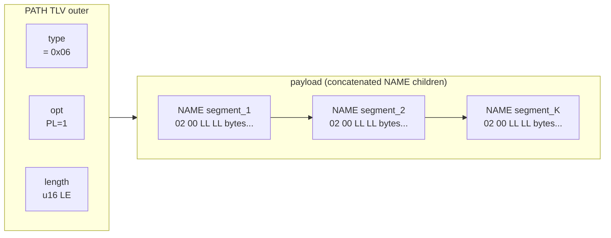

# Reference 05 — Protocol-Defined TLVs

> **Status**: draft, v1, 2026-05-03 (revised same day). Per-TLV byte-precise specification for every type code in the core-reserved range. The header layout, options bits, fixed-width length, and trailer (TS + CRC) are in [01-data-format.md](01-data-format.md); this document specifies what each type code's payload looks like.

---

## Type code allocation summary

| Range | Use |
| ---- | ---- |
| `0x00` | Reserved sentinel; never a valid TLV |
| `0x01` – `0x1F` | Core protocol types (this document) |
| `0x20` – `0x7F` | Reserved for future core extensions |
| `0x80` – `0xFF` | User-defined application payload types |

Currently assigned: `0x01`–`0x04`, `0x06`–`0x0D` (12 types). `0x05` is **retired** (was generic LIST in earlier drafts; see §`0x05`). The remaining `0x0E` – `0x1F` are reserved for v1 fast-track additions; `0x20` – `0x7F` is the long-term registry.

The names below are the canonical type-code names; the reference implementation's C enum (header under `core/include/libtracer/`, pending the protocol-v1 rebuild — [ADR-0001](https://github.com/avatarsd-llc/libtracer/blob/main/docs/adr/0001-extract-reference-implementation-from-strawberry-fw.md)) matches them.

### Structured TLVs

Several core type codes are **structured** — they carry `opt.PL=1` and their payload is a concatenation of child TLVs. The structured types are: `0x04` SUBSCRIBER, `0x06` PATH, `0x07` POINT, `0x09` STATUS (when non-empty), `0x0A` ACL, `0x0B` SETTINGS, `0x0D` ROUTER. Each entry below specifies its own children layout.

Earlier drafts had a generic `0x05` LIST type that any structured container could use; that's gone. Every structured container declares its purpose via its type code. User-range type codes (`0x80–0xFF`) MAY also be structured (set `opt.PL=1`) for application-defined records.

---

## `0x01` — VALUE

Opaque application payload. No protocol-imposed structure; the bytes are whatever the publisher and subscriber agreed on out-of-band.

### Payload layout

```
[ payload bytes — application-defined ]
```

The payload is a contiguous, untouched user region. Wire-time TS and CRC live in the optional trailer per [01-data-format.md](01-data-format.md), not interleaved with the payload.

### Defaults

- `opt.PL = 0` (payload is opaque, not nested).
- `opt.CR` recommended `1` for any non-loopback transport.
- `opt.TS` recommended `1` when wire-time-stamping matters (latency telemetry, dedup tie-breaking).
- For application-domain timestamps, embed a sibling `TIME` TLV inside a wrapping structured TLV (a user-range type code with `opt.PL=1`) instead.

### Where it appears

- Body of normal `tracer_write` / `tracer_read`.
- Inside `SUBSCRIBER` records as the configuration scalar.
- Inside `SETTINGS` as field values.
- Inside `STATUS` as error-detail bytes.

### Validation

- No application-level validation by the core.
- The receiver MUST validate `length` against the available buffer before reading payload bytes.

### Hex example

5-byte payload `AA BB CC DD EE`, CRC-32 enabled, no wire-time (default `LL=0` u16 length):

```
01 10 05 00 AA BB CC DD EE [crc:4]
^  ^  ^^^^^ ^^^^^^^^^^^^^^  ^^^^^
|  |  len=5  payload         trailer_crc (CRC-32C over payload)
|  opt = 0x10 (CR=1)
type = 0x01 VALUE
```

`4 (header) + 5 (payload) + 4 (trailer_crc) = 13 bytes`.

Same payload with absolute wire-time-stamp + CRC-32:

```
01 30 05 00 AA BB CC DD EE [ts:8] [crc:4]
^  ^  ^^^^^ ^^^^^^^^^^^^^^  ^^^^^  ^^^^^
|  |  len=5  payload         ts     CRC over payload+ts
|  opt = 0x30 (TS=1, CR=1)
type = 0x01 VALUE
```

`4 + 5 + 8 + 4 = 21 bytes`.

---

## `0x02` — NAME

A single name segment. UTF-8 bytes, **no NUL terminator on the wire**.

### Payload layout

```
[ N bytes UTF-8 ]
```

### Constraints

- Length: 1..64 bytes (per [03-addressing.md](03-addressing.md) §path syntax).
- MUST NOT contain reserved characters (`/ : . [ ] * ?`).
- MUST be valid UTF-8. Invalid byte sequences MUST be rejected with `ERROR=INVALID_PATH`.

### Where it appears

- Inside PATH TLVs (one NAME per segment).
- Inside SETTINGS as field-name keys.
- Inside `:schema` responses as field labels.
- Wherever a "label" is needed inside a structured TLV.

### Hex example

NAME "sensor" (6 bytes), no trailer (typical when nested inside a structured TLV whose outer trailer covers everything):

```
02 00 06 00 73 65 6E 73 6F 72
^  ^  ^^^^^ ^^^^^^^^^^^^^^^^^
|  |  len=6  "sensor"
|  opt = 0 (no PL, no TS, no CR)
type = 0x02 NAME
```

`4 (header) + 6 (payload) = 10 bytes`.

---

## `0x03` — DESCRIPTION

Free-form UTF-8 human-readable description of a vertex or field. Optional in every context; tooling shows it to operators.

### Payload layout

```
[ N bytes UTF-8 ]
```

### Constraints

- Length: 0..1024 bytes recommended; no hard upper limit beyond `length` field range.
- MUST be valid UTF-8.

### Where it appears

- `<vertex>:description` field.
- Inside `:schema` responses annotating fields.
- Inside ERROR TLVs as the human-readable detail.

---

## `0x04` — SUBSCRIBER

Subscription record. The presence of a SUBSCRIBER TLV at `<vertex>:subscribers[N]` causes the router to fan out future writes to that vertex to the subscriber's target path.

### Payload layout

Always structured (`opt.PL=1`). Children, in order:

```
SUBSCRIBER (PL=1) {
  PATH        target_path     ; required — where to dispatch matched writes
  SETTINGS    qos_settings    ; optional — QoS overrides for this subscription
  ACL         capability      ; optional — capability token if enforced
  NAME        subscriber_id   ; optional — opaque ID for self-identification
}
```

### Where it appears

- `<vertex>:subscribers[N]` slot, one per subscription.
- Inside `<vertex>:subscribers[]` reads (returned as a sequence of SUBSCRIBER TLVs nested in the response).

### Validation

- `target_path` MUST be a syntactically valid path (per [03-addressing.md](03-addressing.md)).
- A SUBSCRIBER with no `target_path` is treated as "clear this slot" (unsubscribe sentinel).

### Future extensions

The optional fields after `target_path` may grow. New optional sub-fields MUST appear after the existing ones and MUST be NAME-tagged so older parsers can skip them.

---

## `0x05` — RETIRED (formerly LIST)

Type code `0x05` was a generic structured container in earlier drafts. **Retired.** Every structured TLV in the registry now has a specific purpose declared by its type code; the generic-container concept is gone.

- Senders MUST NOT emit `type=0x05`.
- Receivers MUST treat `type=0x05` as a reserved-but-unassigned code per [01-data-format.md](01-data-format.md) §handling unknown type codes (skip safely, do not crash).
- The code is permanently retired; collision-prevention prevents reuse.

The structural concept survives: any TLV with `opt.PL=1` is a structured container holding concatenated child TLVs. The protocol's structured types are SUBSCRIBER (0x04), PATH (0x06), POINT (0x07), STATUS (0x09), ACL (0x0A), SETTINGS (0x0B), ROUTER (0x0D). User-defined structured records use user-range type codes (`0x80–0xFF`) with `PL=1`.

### Why retired

Generic LIST had no semantic meaning of its own — it was the un-named default whose role was always "structured stuff goes here." Real uses always have a specific purpose. Forcing every container to declare its purpose via type code is what makes the type byte a proper L3 concern.

---

## `0x06` — PATH

A hierarchical address. Structured TLV (`opt.PL=1`) whose children are NAME TLVs, one per segment. Distinct from a generic structured TLV in that the parser validates path-segment constraints up-front.

### Payload layout

```
PATH (PL=1) {
  NAME segment_1
  NAME segment_2
  ...
  NAME segment_K
}
```

### Header settings

- `opt.PL` MUST be `1`.

### Constraints

- Each child MUST be a NAME TLV (`type=0x02`); other types are invalid in PATH context.
- Total path length (sum of NAME bytes + segment separators) ≤ 1024 bytes.
- Segment count ≤ 32.

### Where it appears

- Inside SUBSCRIBER as `target_path`.
- As the PATH form of `tracer_read`/`write`/`await` arguments when the path is constructed programmatically (the C API also accepts string form for ergonomics).
- Inside ROUTER for bridged-source path metadata.

### Note on string form vs PATH-TLV form

A path may be expressed two ways:

- **String form**: `"/sensor/temp"` — a UTF-8 byte string with `/` separators. Used at the API surface for ergonomics. Stored as a single VALUE TLV when transported as data.
- **PATH-TLV form**: a PATH TLV (structured, NAME children). Used inside structured TLVs (SUBSCRIBER, ROUTER) where the parser needs to validate segments individually.

Both forms canonicalize to the same internal representation. Implementations MUST accept either form where a path is expected.

### Static / pre-encoded PATH TLV (init-time form)

> **Normative reference**: [../spec/v1.md](../spec/v1.md) §3.1.
> **See also**: [03-addressing.md](03-addressing.md) §static path handles for the addressing-level rationale, and [04-communication-flows.md](04-communication-flows.md) §the static-path write flow for hot-path semantics.

For MCU-class deployments the PATH TLV is intended to be **encoded once** — at build time as a `.rodata` byte literal, or at node init as a single allocation — and reused for the lifetime of the node. The hot path treats the pre-encoded bytes as the address of a vertex; no parser walk, no string formatting, no allocation occurs per write.

#### Build-time-encodable byte layout

Every conforming PATH TLV is byte-equivalent to the following structure. A correct build-time encoder produces exactly these bytes:



The encoder's invariants:

- **Outer header** (4 bytes, default `LL=0`): `06 40 LL_lo LL_hi`. `0x40` = `PL=1` (bit 6) only, no TS, no CR, `LL=0`. (Earlier drafts of this section showed `0x50` for "PL only" — that was a bug; `0x50` = PL+CR per [01-data-format.md](01-data-format.md) §options bitfield.)
- **`length`** = sum of child NAME TLV total sizes. With no inner trailers, each NAME costs `4 + len(segment_bytes)`.
- **Each NAME child**: `02 00 SS_lo SS_hi <segment_bytes>`, where `SS` is the segment's UTF-8 byte length (`1..64`).
- **No inner trailers.** Children inside a PATH carry no TS and no CRC; the outer (when in transit) covers everything.
- **Reserved characters** (`/ : . [ ] * ?`) MUST NOT appear inside any segment_bytes.

A path that resolves to more than 32 segments, has a single segment longer than 64 bytes, or whose total segment-bytes exceed the addressing-level cap MUST fail to encode.

#### Byte literal — `/sensor/temp`

```
06 40 12 00     ← outer: type=PATH(0x06), opt=PL=1 (0x40), length=18 (u16 LE)
   02 00 06 00 73 65 6E 73 6F 72        ← NAME "sensor" (10 bytes)
   02 00 04 00 74 65 6D 70              ← NAME "temp"   (8 bytes)
```

**22 bytes total** when stored as graph data (no outer trailer). When transmitted with CRC-32, the outer trailer adds 4 bytes; the inner NAME children are unchanged.

#### Byte literal — `/camera/frame`

```
06 40 13 00     ← outer: length=19 (opt=0x40 = PL only)
   02 00 06 00 63 61 6D 65 72 61        ← NAME "camera" (10 bytes)
   02 00 05 00 66 72 61 6D 65           ← NAME "frame"  (9 bytes)
```

**23 bytes total.** A C macro emitting this literal is straightforward; a code generator emitting one per registered path is even simpler.

#### Conformance for the static form

A pre-encoded PATH TLV intended for use as a path handle ([../spec/v1.md](../spec/v1.md) §3.1.1) MUST:

1. Be byte-identical to the canonical encoding above.
2. Pass the segment-validity rules of [03-addressing.md](03-addressing.md) at encode time.
3. Be stored in memory whose lifetime spans every read / write / await that uses it.

A conforming receiver MUST treat a PATH TLV the same regardless of whether it arrives over the wire, was assembled from heap segments, or points into the sender's `.rodata`. **The wire bytes are the contract; the segment they live in is implementation choice.**

#### Why no allocation on the hot path

The motivation for this section is twofold:

- **MCU deployments** (Cortex-M, ESP32) cannot afford `snprintf`+`malloc` per write. Code size and ISR-safety both forbid it.
- **The TLV-as-bytes invariant** ([02-graph-model.md](02-graph-model.md) §the same-substrate insight) extends naturally: if a TLV in memory IS the wire bytes IS the graph node, then a TLV in `.rodata` is the same — just at a different address. Routers and dispatchers read it identically.

Implementations on hosted platforms (Linux, Windows) MAY accept string-form paths at the API surface for ergonomics, but the dispatch underneath SHOULD canonicalize to a PATH TLV byte-blob exactly once and key its routing tables on those bytes.

---

## `0x07` — POINT

Endpoint definition: a vertex's full descriptor as a structured TLV. Used for vertex enumeration and replication snapshots.

### Payload layout

POINT is structured (`opt.PL=1`). Children, in order:

```
POINT (PL=1) {
  NAME           vertex_name        ; required — the leaf segment
  DESCRIPTION    description        ; optional
  SETTINGS       default_settings   ; optional
  SUBSCRIBER     sub_0              ; zero or more, in slot order
  SUBSCRIBER     sub_1
  ...
  POINT          child_0            ; zero or more, recursive
  POINT          child_1
  ...
}
```

Subscribers and children appear as direct children of POINT, identified by their type code. There is no intermediate "subscribers list" or "children list" wrapper — the type byte of each child tells its role.

### Where it appears

- Returned by `read("/some/parent")` to enumerate children.
- Used by the future recorder/replay module to snapshot vertex state.
- Used by discovery modules announcing exported vertex trees.

### Constraints

- `opt.PL` MUST be `1`.
- The `vertex_name` MUST be the first child.
- Children that represent recursive vertex structure MUST themselves be POINT TLVs (type `0x07`).

---

## `0x08` — ERROR

A single error condition. Used inside STATUS TLVs (which may carry zero or more ERRORs) and as the response payload for failed `read`/`write`/`await` calls.

### Payload layout

```
[ u8 error_code ]
[ optional DESCRIPTION (UTF-8) ]
[ optional VALUE (binary detail, error-code-specific) ]
```

The error code is always the first byte. Optional follow-on TLVs (DESCRIPTION, VALUE) are nested by setting `opt.PL=1` and packing them as children after the leading code byte. (For implementers: the leading u8 is treated as a single-byte payload prefix; the rest of the payload is concatenated child TLVs. This packing is deliberately compact for the common case of "code only.")

### Error code registry

```
0x00  OK                   Operation succeeded (rarely sent — empty STATUS implies OK)
0x01  NOT_FOUND            Path does not resolve to a vertex
0x02  PERMISSION_DENIED    ACL rejected the operation
0x03  INVALID_PATH         Malformed PATH or non-UTF-8 NAME
0x04  TYPE_MISMATCH        Payload type incompatible with endpoint schema
0x05  CRC_FAIL             Wire CRC did not match
0x06  VERSION_MISMATCH     Peer advertised an incompatible protocol version (discovery/bridge-level)
0x07  BACKPRESSURE         Subscriber queue full; sample dropped per QoS
0x08  TIMEOUT              No response within deadline
0x09  TRANSPORT_DOWN       Underlying transport disconnected
0x0A  SCHEMA_NOT_FOUND     Field read on a vertex that does not expose it
0x0B  ADDRESS_SHIFT_GAP    Missing index in an address-shift group at deadline
0x0C  TRUNCATED            TLV stream ended mid-frame
0x0D  NESTING_TOO_DEEP     Structured-TLV nesting exceeded depth cap
0x0E  PATH_IN_USE          Bind attempted on an already-owned vertex name
0x0F  – 0x7F  reserved for future core
0x80  – 0xFF  user-defined
```

> **⚠ Superseded by RFC-0002 (draft):** this flat byte registry is replaced by the `tr::<concept>::<error>` namespace (registered-code-or-string identity; severity/disposition in the registry). Retained until RFC-0002 lands; the `0x06` row is corrected in the interim.

### Where it appears

- Inside STATUS TLVs (zero or more ERRORs per STATUS).
- As inline reply payload in implementations that opt to skip the STATUS wrapper.

---

## `0x09` — STATUS

Communication status / response signal. An empty STATUS means OK; a non-empty STATUS contains one or more ERROR TLVs and optional DESCRIPTION text.

### Payload layout

When empty: `length = 0`. (Smallest valid STATUS is the 4-byte empty-OK form.)

When non-empty: structured (`opt.PL=1`) with children:

```
STATUS (PL=1) {
  ERROR        first_error
  ERROR        second_error      ; optional, multiple permitted
  DESCRIPTION  human_message     ; optional
  ...
}
```

### Header settings

- Empty STATUS: `opt.PL = 0`, `length = 0`.
- Non-empty STATUS: `opt.PL = 1`.

### Where it appears

- Synchronous return from `read` / `write` / `await` on failure.
- Asynchronous signal at `<vertex>:status` when subscribers should be notified of liveness/deadline/transport events.
- Sentinel TLV used to clear subscriber slots (write empty STATUS to `:subscribers[N]`).

### Hex example

Empty STATUS=OK (the smallest valid libtracer TLV — used as the unsubscribe sentinel and the implicit OK reply):

```
09 00 00 00
^  ^  ^^^^^
|  |  length = 0 (u16 LE)
|  opt = 0  (no flags; LL=0 default u16)
type = 0x09 STATUS
```

**4 bytes total.** No trailer.

---

## `0x0A` — ACL

Access control list — a collection of capabilities granting permissions on a vertex. Stored at `<vertex>:acl`.

### Payload layout

ACL is structured (`opt.PL=1`). Its children are themselves ACL TLVs, each representing one capability. (The recursion is deliberate: the outer ACL is the capability collection; each inner ACL is one capability with NAME-tagged fields.)

```
ACL (PL=1) {                                ; outer = collection
  ACL (PL=1) {                              ; inner = one capability
    NAME "subject"      <UTF-8 holder>
    NAME "permissions"  VALUE <u8 bitfield: READ=0x1 WRITE=0x2 SUBSCRIBE=0x4>
    NAME "expires_ns"   VALUE <u64>          ; optional
  }
  ACL (PL=1) {
    ...                                       ; next capability
  }
}
```

This shape may be revised when the `security_acl` module ships post-MVP; the v1 TLV layout is structurally defined but enforcement is deferred.

### Header settings

- `opt.PL = 1`.

### Where it appears

- `<vertex>:acl` field.
- ACL enforcement is performed by the `security_acl` module (post-MVP per [10-module-catalog.md](10-module-catalog.md)). The TLV layout is **structurally defined** in v1 even though enforcement is deferred.

### Constraints

- A vertex without an `:acl` field defaults to "no restrictions" (when `security_acl` is not loaded) or "deny by default" (when `security_acl` is loaded with strict mode).

---

## `0x0B` — SETTINGS

QoS and configuration block. Structured (`opt.PL=1`); children are NAME-keyed value pairs describing writable fields under `:settings`.

### Payload layout

```
SETTINGS (PL=1) {
  NAME "reliability"       VALUE <u8>
  NAME "durability"        VALUE <u8>
  NAME "history_keep_last" VALUE <u32>
  NAME "deadline_ns"       VALUE <u64>
  NAME "priority"          VALUE <u8>
  NAME "queue_max_bytes"   VALUE <u32>
  ; module-namespaced fields use a nested SETTINGS:
  NAME "transport_tcp"     SETTINGS (PL=1) { NAME "send_buf_kb" VALUE <u32> ... }
  ...
}
```

Nested SETTINGS for module namespacing (instead of an unnamed structured wrapper) keeps the type byte semantically meaningful at every level.

### Header settings

- `opt.PL = 1`.

### Where it appears

- `<vertex>:settings` for atomic multi-field reads/writes.
- Inside SUBSCRIBER as the `qos_settings` sub-field for per-subscription overrides.

### Validation

- Unknown NAMEs MUST be either (a) ignored if module-namespaced and the module is not loaded, or (b) rejected with `ERROR=SCHEMA_NOT_FOUND` if in the core namespace.
- Type mismatches (e.g., a u32 where u8 expected) MUST return `ERROR=TYPE_MISMATCH`.

### The five core QoS knobs

(Full semantics in [04-communication-flows.md](04-communication-flows.md) §QoS knobs.)

| Field | Type | Default | Effect |
| ---- | ---- | ---- | ---- |
| `reliability` | u8 | 0 (best-effort) | 1 = reliable, transport-dependent guarantee |
| `durability` | u8 | 0 (volatile) | 1 = transient-local, late joiners see history |
| `history_keep_last` | u32 | 1 | Samples retained for transient-local |
| `deadline_ns` | u64 | unset | Maximum interval between writes; missed = STATUS=TIMEOUT |
| `priority` | u8 | 128 | Transport hint; 0 = lowest, 255 = highest |

---

## `0x0C` — TIME

64-bit absolute timestamp, nanoseconds since Unix epoch (1970-01-01 00:00:00 UTC).

### Payload layout

```
[ u64 timestamp_ns_le ]   ; 8 bytes, little-endian
```

### Where it appears

- Inside structured TLVs (typically a user-range record type with `opt.PL=1`) as a sibling of VALUE when application-domain timestamps matter (sample-acquisition time, sensor exposure window, control deadline). Multiple TIME TLVs in one structured TLV is permitted; semantics are application-defined (typically discriminated by a sibling NAME).
- The wire-trailer `opt.TS=1` (see [01-data-format.md](01-data-format.md)) is **transport-time** — it tells you when the sender put the TLV on the wire. That is a different concern from application-domain time and the two SHOULD NOT be conflated.

### Constraints

- u64 wraparound: year 2554 (584 years from 1970). Acceptable.
- Negative (pre-epoch) values: not representable; reject with `ERROR=INVALID_PATH` (no dedicated INVALID_TIME code).

### Hex example

A user-range record TLV (`type=0x80`, application-defined, `opt.PL=1`) containing a TIME and a VALUE, with outer CRC-32:

```
80 50 14 00 [inner 20 bytes] [crc:4]
^  ^  ^^^^^
|  |  length = 20
|  opt = 0x50 (PL=1, CR=1)
type = 0x80 (user-range record, sender and receiver agree on shape)

  Children (20 bytes):
  0C 00 08 00 00 00 00 00 00 00 00 00 00         ← TIME, 12 bytes
  ^  ^  ^^^^^ ^^^^^^^^^^^^^^^^^^^^^^^
  |  |  len=8  u64 = 0 (epoch)
  |  opt = 0
  type = 0x0C TIME

  01 00 04 00 DE AD BE EF                         ← VALUE u32 = 0xDEADBEEF, 8 bytes
```

`4 (outer header) + 20 (children) + 4 (outer CRC) = 28 bytes total`.

(Earlier drafts wrapped TIME + VALUE in a generic `0x05 LIST`. With LIST retired, the application uses a specific user-range type code to declare what the wrapper means.)

---

## `0x0D` — ROUTER

Bridge envelope. ROUTER **wraps** a data TLV with routing metadata when the data crosses a bridge. To downstream subscribers, ROUTER is invisible (the bridge sheds it on ingest); to other bridges, ROUTER carries the dedup key and routing telemetry.

### Payload layout

ROUTER is structured (`opt.PL=1`). Its children are NAME-tagged metadata fields followed by the wrapped data TLV:

```
ROUTER (PL=1) {
  NAME "origin_peer_id"   VALUE <16 bytes peer id>     ; required
  NAME "origin_timestamp" TIME  <u64 ns>                ; required, cycle dedup key
  NAME "hop_count"        VALUE <u8>                    ; required, incremented per bridge
  NAME "transport_label"  NAME  <utf-8>                 ; optional, e.g. "transport_can"
  NAME "route_cost"       VALUE <u16>                   ; optional, application metric
  NAME "original_path"    PATH  <segments>              ; optional, source-side path before mount-prefix
  NAME "data"             <wrapped TLV of any type>     ; required, MUST be the last child
}
```

The `NAME "data"` marker tags the wrapped data TLV so that future metadata extensions (more `NAME "foo" + value` pairs) can be inserted before it without breaking parsers. **The wrapped data TLV MUST be the last child of ROUTER.**

### Header settings

- `opt.PL = 1`.

### Where it appears

- Wrapping a TLV at the moment a bridge re-emits it on a transport. The wrapping is shed on ingest at the next bridge and the bare data TLV is stored at the proxy vertex (see [02-graph-model.md](02-graph-model.md) §the ROUTER shedding rule).

### Cycle handling

The `(origin_peer_id, origin_timestamp)` pair is the dedup key. A receiving bridge maintains a recent-set of seen pairs; already-seen TLVs are dropped silently. **The recent-set is a bounded, evictable best-effort optimization, not the termination guarantee** — `hop_count`/`MAX_HOPS` (below) guarantees termination, so a bridge MAY size the recent-set freely (even zero) and accept bounded duplicate delivery (≤ `MAX_HOPS` × fanout) on eviction. Size it for your topology to minimize redundant forwarding — `deepest_expected_route_fanout × longest_expected_delivery_window` is a good target (per [07-host-embedding.md](07-host-embedding.md) §cycle handling). See [ADR-0014](https://github.com/avatarsd-llc/libtracer/blob/main/docs/adr/0014-router-cycle-termination-hop-count.md).

### Constraints

- `hop_count` SHOULD start at 0 at the source bridge and be incremented by each subsequent bridge. A bridge encountering `hop_count >= MAX_HOPS` (recommended 32) MUST drop the TLV and emit a local `STATUS=ERROR(NESTING_TOO_DEEP)`.
- The wrapped data TLV's own `opt.PL`, type, and trailer are independent of ROUTER's. ROUTER's outer trailer (if present) covers the entire concatenated children including the wrapped data TLV; the wrapped TLV's own trailer is preserved verbatim through the wrap/unwrap cycle.

---

## Reserved range (`0x0E` – `0x1F`)

Currently unassigned. Allocated on a fast-track basis during v1 if a clear need emerges. Candidate uses:

- `MANIFEST` — explicit declaration of an `expected_count` for an address-shift group.
- `CAPABILITY` — opaque capability token (lighter than full ACL).
- `HEARTBEAT` — explicit liveness ping (currently subsumed by writes to `:liveness.last_seen_ns`).

Receivers MUST handle unknown codes in this range per the forward-compatibility rules of [01-data-format.md](01-data-format.md) §forward / backward compatibility.

---

## Reserved range (`0x20` – `0x7F`)

Long-term registry for future core extensions, post-v1. Allocation procedure: PR against this document with rationale + byte spec; implementer review; assignment.

---

## User range (`0x80` – `0xFF`)

128 type codes the protocol does not opine on. Senders and receivers agree out-of-band. Recommended convention: register a project-specific "magic" prefix (e.g., 4-byte UUID-derived bytes at the start of the payload) so multiple unrelated user types can coexist on the same wire without collision.
