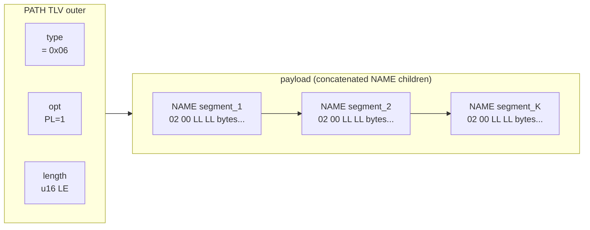

# Reference 05 — Protocol-Defined TLVs

> **Status**: normative, v1, 2026-05-03 (incorporated by [docs/spec/v1.md](../spec/v1.md) §3 per RFC-0001 §A.2). Per-TLV byte-precise specification for every type code in the core-reserved range. The header layout, options bits, fixed-width length, and trailer (TS + CRC) are in [01-data-format.md](01-data-format.md); this document specifies what each type code's payload looks like.

---

## Type code allocation summary

| Range | Use |
| ---- | ---- |
| `0x00` | Reserved sentinel; never a valid TLV |
| `0x01` – `0x1F` | Core protocol types (this document) |
| `0x20` – `0x7F` | Reserved for future core extensions |
| `0x80` – `0xFF` | User-defined application payload types |

Currently assigned: `0x01`–`0x04`, `0x06`–`0x0C`, `0x0E` (12 types). `0x05` is a **reserved code with no assigned meaning** in v1 (see §`0x05`); `0x0D` ROUTER is a **reserved, decodable codepoint with no implemented mechanism** (see §`0x0D`). `0x0E` is **SPEC** (vertex-creation spec, [ADR-0017](../adr/0017-in-band-vertex-creation-controller-orchestration.md)). The remaining `0x0F` – `0x1F` are reserved for v1 fast-track additions; `0x20` – `0x7F` is the long-term registry.

The names below are the canonical type-code names; the reference implementation's C enum (header under `core/include/libtracer/`, pending the protocol-v1 rebuild — [ADR-0001](https://github.com/avatarsd-llc/libtracer/blob/main/docs/adr/0001-extraction-from-production-firmware.md)) matches them.

### Structured TLVs

Several core type codes are **structured** — they carry `opt.PL=1` and their payload is a concatenation of child TLVs. The structured types are: `0x04` SUBSCRIBER, `0x06` PATH, `0x07` POINT, `0x09` STATUS (when non-empty), `0x0A` ACL, `0x0B` SETTINGS, `0x0E` SPEC. Each entry below specifies its own children layout.

There is no generic container type: every structured container declares its purpose via its type code. User-range type codes (`0x80–0xFF`) MAY also be structured (set `opt.PL=1`) for application-defined records.

---

## `0x01` — VALUE

Opaque application payload. No protocol-imposed structure; the bytes are whatever the publisher and subscriber agreed on out-of-band.

### Payload layout

```
[ payload bytes — application-defined ]
```

The payload is a contiguous, untouched user region. Wire-time TS and CRC live in the optional trailer per [01-data-format.md](01-data-format.md), not interleaved with the payload.

### Defaults

- `opt.PL = 0` (payload is opaque, not nested).
- `opt.CR` recommended `1` for any non-loopback transport.
- `opt.TS` recommended `1` when wire-time-stamping matters (latency telemetry, dedup tie-breaking).
- For application-domain timestamps, embed a sibling `TIME` TLV inside a wrapping structured TLV (a user-range type code with `opt.PL=1`) instead.

### Where it appears

- Body of normal `tracer_write` / `tracer_read`.
- Inside `SUBSCRIBER` records as the configuration scalar.
- Inside `SETTINGS` as field values.
- Inside `STATUS` as error-detail bytes.

### Validation

- No application-level validation by the core.
- The receiver MUST validate `length` against the available buffer before reading payload bytes.

### Hex example

5-byte payload `AA BB CC DD EE`, CRC-32 enabled, no wire-time (default `LL=0` u16 length):

```
01 10 05 00 AA BB CC DD EE [crc:4]
^  ^  ^^^^^ ^^^^^^^^^^^^^^  ^^^^^
|  |  len=5  payload         trailer_crc (CRC-32C over payload)
|  opt = 0x10 (CR=1)
type = 0x01 VALUE
```

`4 (header) + 5 (payload) + 4 (trailer_crc) = 13 bytes`.

Same payload with absolute wire-time-stamp + CRC-32:

```
01 30 05 00 AA BB CC DD EE [ts:8] [crc:4]
^  ^  ^^^^^ ^^^^^^^^^^^^^^  ^^^^^  ^^^^^
|  |  len=5  payload         ts     CRC over payload+ts
|  opt = 0x30 (TS=1, CR=1)
type = 0x01 VALUE
```

`4 + 5 + 8 + 4 = 21 bytes`.

---

## `0x02` — NAME

A single name segment. UTF-8 bytes, **no NUL terminator on the wire**.

### Payload layout

```
[ N bytes UTF-8 ]
```

### Constraints

- Length: 1..64 bytes (per [03-addressing.md](03-addressing.md) §path syntax).
- MUST NOT contain reserved characters (`/ : . [ ] * ?`).
- MUST be valid UTF-8. Invalid byte sequences MUST be rejected with `ERROR{tr::path::invalid}`.

### Where it appears

- Inside PATH TLVs (one NAME per segment).
- Inside SETTINGS as field-name keys.
- Inside `:schema` responses as field labels.
- Wherever a "label" is needed inside a structured TLV.

### Hex example

NAME "sensor" (6 bytes), no trailer (typical when nested inside a structured TLV whose outer trailer covers everything):

```
02 00 06 00 73 65 6E 73 6F 72
^  ^  ^^^^^ ^^^^^^^^^^^^^^^^^
|  |  len=6  "sensor"
|  opt = 0 (no PL, no TS, no CR)
type = 0x02 NAME
```

`4 (header) + 6 (payload) = 10 bytes`.

---

## `0x03` — DESCRIPTION

Free-form UTF-8 human-readable description of a vertex or field. Optional in every context; tooling shows it to operators.

### Payload layout

```
[ N bytes UTF-8 ]
```

### Constraints

- Length: 0..1024 bytes recommended; no hard upper limit beyond `length` field range.
- MUST be valid UTF-8.

### Where it appears

- `<vertex>:description` field.
- Inside `:schema` responses annotating fields.
- Inside ERROR TLVs as the human-readable detail.

---

## `0x04` — SUBSCRIBER

Subscription record. The presence of a SUBSCRIBER TLV at `<vertex>:subscribers[N]` causes the router to fan out future writes to that vertex to the subscriber's target path.

### Payload layout

Always structured (`opt.PL=1`). Children, in order:

```
SUBSCRIBER (PL=1) {
  PATH        target_path     ; required — where to dispatch matched writes
  SETTINGS    qos_settings    ; optional — QoS overrides for this subscription
  ACL         capability      ; optional — capability token if enforced
  NAME        subscriber_id   ; optional — opaque ID for self-identification
}
```

The `qos_settings` SETTINGS carries **per-subscriber encoding hints** (byte-agnostic; numeric filtering like deadband is an application *filter vertex*, never a field — ADR-0019's sibling decision). The value-based **delivery filter** it once held (`delivery_mode == ON_CHANGE` byte-diff) and the throttle (`min_interval_ns` / `keepalive_ns`) are **removed** ([RFC-0008](../spec/rfcs/0008-vertex-operations-assign-propagate.md)): the runtime no longer inspects values or times to decide delivery. Delivery selection is now **structural and per-vertex** — see `delivery_mode` below.

```
qos_settings = SETTINGS {
  NAME "delivery_scope"    VALUE <u8: DELTA=0, SNAPSHOT=1>   ; reserved (RFC-0005: as-written is the delivery; SNAPSHOT re-aggregation deferred)
  NAME "delivery_compact"  VALUE <u8: 0=off, 1=on>  ; opt into route-handle compaction (§route-handle)
}
```

**Per-vertex `delivery_mode` ([RFC-0008](../spec/rfcs/0008-vertex-operations-assign-propagate.md)).** Whether a vertex rides an *ancestor's* `propagate` sweep is a value-agnostic property of the **vertex** (not the subscriber): `UNCONDITIONAL` (always swept), `IF_NEWER` (default — swept only if its write sequence advanced since the last covering sweep), `EXPLICIT` (never swept by an ancestor; deliverable only by a direct `propagate` on the vertex). `assign` and a direct `propagate` on the vertex are never gated by it. It is host state defaulting to `IF_NEWER`; wire configuration reuses the vertex's own `:settings` (a `delivery_mode` NAME/VALUE under the vertex `SETTINGS`) and is deferred.

`delivery_compact` (RFC-0004 §E.1, ADR-0035 slice 4) is the consumer's **opt-in to label-compacted deliveries**: on a full-TLV transport (ws/UDP, default *full-route* deliveries) a producer MAY, for a subscriber that set it, advertise a per-link **label** aliasing that subscriber's return route and thereafter stream lean `COMPACT` frames instead of full-route `FWD{WRITE}` (see §route-handle). It is **optional and NAME-tagged**: an older parser (or a producer that does not honor it) simply keeps the full-route delivery path, so it does not perturb any existing conformance vector. Header-elided transports (CAN) always label and ignore the hint.

The per-vertex `delivery_mode` is **enforced producer-side** (during the `propagate` sweep, before fan-out), and it applies to bubbled deliveries (below) exactly as to direct ones. The `capability` child carries the subscriber's **subject-token** ([ADR-0018](../adr/0018-access-control-authorization-pluggable-subject-token.md)); subscribe-authorization is gated by the *source's* `:acl`.

### Subtree subscription — vertical bubbling ([RFC-0005](../spec/rfcs/0005-subtree-subscriptions.md))

Every subscription is a **subtree subscription**: a SUBSCRIBER at `<vertex>:subscribers[N]` observes writes to that vertex **and to any descendant of it** (a leaf subscription is the trivial case), so no wildcard `target_path` is needed — subscribing to the composite vertex *is* the subtree subscription. A write at vertex W MUST deliver, once per subscriber, to the subscribers of W and of each ancestor of W ("vertical bubbling"). The delivered payload is the **written TLV as-is** — the exact frame the producer wrote, at the granularity it chose (a leaf `VALUE`, or a whole branch `POINT` per §`0x07`); there is no re-encoding and no delivery-metadata envelope. Local subscribers receive the usual zero-copy view clone; remote subscribers receive the frame over the existing return-route `FWD{WRITE}` delivery path unchanged. Any provenance a consumer needs beyond the frame itself travels **in the data** ([CONTEXT.md](../../CONTEXT.md) §SUBSCRIBER direction); wire-level concrete-path tagging of remote deliveries remains the separate, still-draft [RFC-0003](../spec/rfcs/0003-bridged-wildcard-delivery-path.md) proposal.

The write path MUST stay near-free when nobody listens: an implementation maintains per-vertex listener bookkeeping (updated at subscribe/unsubscribe, at control-plane frequency) so a write performs the ancestor fan-out walk **only when a subscriber exists at or above it** — the reference implementation's idle write pays one relaxed atomic load ([RFC-0005](../spec/rfcs/0005-subtree-subscriptions.md) §A cost model).

```{mermaid}
flowchart BT
    C["/a/b/c ← write(VALUE)"] -- "fan_out: own subscribers" --> C
    C -- "bubble: written TLV as-is" --> B["/a/b (subscriber S2)"]
    B -- "bubble: written TLV as-is" --> A["/a (subscriber S1, remote via FWD)"]
    A -.-> R["no subscriber above /a ⇒ walk ends;<br/>with no S1/S2 the write never walks at all"]
```

### Producer fan-out to remote subscribers

When a SUBSCRIBER is written into `<vertex>:subscribers[N]` over a transport (an inbound `FWD{WRITE}` to `:subscribers[]`, RFC-0004 §D), the slot retains the request's **accumulated return route** (the FWD `src`) and the inbound link. The route bytes are copied **once**, at subscribe time, into a refcounted segment; the slot holds a `view_t` over it. Thereafter a write to that vertex fans out a delivery back to the consumer along that return route — a `FWD{WRITE, dst=<return route>, payload=<VALUE>}` (delivery-is-a-write), or, when the subscriber set `delivery_compact`, an auto-promoted `COMPACT` (advertised once per flow, then streamed; re-advertised after a reconnect — §route-handle). Each full-route delivery **refcount-clones** the stored route and scatter-gathers the frame from stack-built heads + the roped route + the roped value — no route or payload bytes are copied per delivery, and an in-flight rope keeps the route segment alive across a concurrent unsubscribe. This is the producer half of consumer-initiated subscription; it composes the existing field-writes and adds no wire verb (RFC-0004 / ADR-0035 slice 4, #136).

A **transient-local** producer (`:settings.durability == 1`, [02-graph-model.md](02-graph-model.md)) additionally **latches** its current value to a *fresh* subscriber: the subscribe itself emits one immediate delivery of the vertex's last-known value, so a late joiner paints the current state without waiting for the next write. A `volatile` producer (the default, `durability == 0`) delivers only writes that happen after the subscribe. The latch reuses the same delivery path (full-route or `COMPACT`); it carries no new wire bytes, so it is observable only as delivery *timing* and adds no conformance vector.

The producer fan-out, end to end — the subscribe binds a remote subscriber, the transient-local latch fires immediately, and later writes stream out (auto-promoted to lean `COMPACT` when the subscriber opted in):

```{mermaid}
sequenceDiagram
    autonumber
    participant Cons as Consumer
    participant Prod as Producer node
    participant V as Vertex (transient-local)
    Cons->>Prod: FWD{WRITE, dst=/V, :subscribers[], src=/cons,<br/>SUBSCRIBER{ delivery_compact=1 }}
    Prod->>V: subscribe_wire — the ADR-0049 admission door<br/>(retain return_route=/cons + inbound link)
    Note over Prod,V: durability==1 ⇒ latch the current LKV
    Prod-->>Cons: FWD{WRITE, dst=/cons, VALUE}  (delivery #1 — the latch)
    Prod-->>Cons: FWD{REPLY} (subscribe ack)
    Note over V,Prod: later — a local write fans out via the injected sink
    V->>Prod: write(new VALUE) → fan_out → remote sink
    Prod-->>Cons: ADVERTISE{ label, route=/cons }  (once per flow)
    Prod-->>Cons: COMPACT{ label, VALUE }          (then lean frames…)
    Prod-->>Cons: COMPACT{ label, VALUE }
```

### Where it appears

- `<vertex>:subscribers[N]` slot, one per subscription.
- Inside `<vertex>:subscribers[]` reads (returned as a sequence of SUBSCRIBER TLVs nested in the response).

### Validation

- `target_path` MUST be a syntactically valid path (per [03-addressing.md](03-addressing.md)).
- A SUBSCRIBER with no `target_path` is treated as "clear this slot" (unsubscribe sentinel).

### Future extensions

The optional fields after `target_path` may grow. New optional sub-fields MUST appear after the existing ones and MUST be NAME-tagged so older parsers can skip them.

---

## `0x05` — RESERVED

Type code `0x05` is a **reserved code with no assigned meaning** in v1. Structured payloads are expressed by `opt.PL`, not by a dedicated container type: every structured TLV in the registry has a specific purpose declared by its type code.

- Senders MUST NOT emit `type=0x05`.
- Receivers MUST treat `type=0x05` as a reserved-but-unassigned code per [01-data-format.md](01-data-format.md) §handling unknown type codes (skip safely, do not crash).
- The code is not available for reuse; collision-prevention keeps it unassigned.

The structural concept lives in the options bits: any TLV with `opt.PL=1` is a structured container holding concatenated child TLVs. The protocol's structured types are SUBSCRIBER (0x04), PATH (0x06), POINT (0x07), STATUS (0x09), ACL (0x0A), SETTINGS (0x0B), SPEC (0x0E). User-defined structured records use user-range type codes (`0x80–0xFF`) with `PL=1`.

### Why no generic container

A generic list would have no semantic meaning of its own — an un-named default whose role is always "structured stuff goes here." Real uses always have a specific purpose. Forcing every container to declare its purpose via type code is what makes the type byte a proper L3 concern.

---

## `0x06` — PATH

A hierarchical address. Structured TLV (`opt.PL=1`) whose children are NAME TLVs, one per segment. Distinct from a generic structured TLV in that the parser validates path-segment constraints up-front.

### Payload layout

```
PATH (PL=1) {
  NAME segment_1
  NAME segment_2
  ...
  NAME segment_K
}
```

### Header settings

- `opt.PL` MUST be `1`.

### Constraints

- Each child MUST be a NAME TLV (`type=0x02`); other types are invalid in PATH context.
- Total path length (sum of NAME bytes + segment separators) ≤ 1024 bytes.
- Segment count ≤ 32.

### Where it appears

- Inside SUBSCRIBER as `target_path`.
- As the PATH form of `tracer_read`/`write`/`await` arguments when the path is constructed programmatically (the C API also accepts string form for ergonomics).
- As the `dst`/`src` routes of a `FWD` frame (§reserved range) and the `route` of an ADVERTISE (§route-handle frames).

### Note on string form vs PATH-TLV form

A path may be expressed two ways:

- **String form**: `"/sensor/temp"` — a UTF-8 byte string with `/` separators. Used at the API surface for ergonomics. Stored as a single VALUE TLV when transported as data.
- **PATH-TLV form**: a PATH TLV (structured, NAME children). Used inside structured TLVs (SUBSCRIBER, FWD) where the parser needs to validate segments individually.

Both forms canonicalize to the same internal representation. Implementations MUST accept either form where a path is expected.

### Static / pre-encoded PATH TLV (init-time form)

> **Normative reference**: [../spec/v1.md](../spec/v1.md) §3.1.
> **See also**: [03-addressing.md](03-addressing.md) §static path handles for the addressing-level rationale, and [04-communication-flows.md](04-communication-flows.md) §the static-path write flow for hot-path semantics.

For MCU-class deployments the PATH TLV is intended to be **encoded once** — at build time as a `.rodata` byte literal, or at node init as a single allocation — and reused for the lifetime of the node. The hot path treats the pre-encoded bytes as the address of a vertex; no parser walk, no string formatting, no allocation occurs per write.

#### Build-time-encodable byte layout

Every conforming PATH TLV is byte-equivalent to the following structure. A correct build-time encoder produces exactly these bytes:



The encoder's invariants:

- **Outer header** (4 bytes, default `LL=0`): `06 40 LL_lo LL_hi`. `0x40` = `PL=1` (bit 6) only, no TS, no CR, `LL=0`. (Note the distinction: `0x50` = PL+CR per [01-data-format.md](01-data-format.md) §options bitfield — "PL only" is `0x40`.)
- **`length`** = sum of child NAME TLV total sizes. With no inner trailers, each NAME costs `4 + len(segment_bytes)`.
- **Each NAME child**: `02 00 SS_lo SS_hi <segment_bytes>`, where `SS` is the segment's UTF-8 byte length (`1..64`).
- **No inner trailers.** Children inside a PATH carry no TS and no CRC; the outer (when in transit) covers everything.
- **Reserved characters** (`/ : . [ ] * ?`) MUST NOT appear inside any segment_bytes.

A path that resolves to more than 32 segments, has a single segment longer than 64 bytes, or whose total segment-bytes exceed the addressing-level cap MUST fail to encode.

#### Byte literal — `/sensor/temp`

```
06 40 12 00     ← outer: type=PATH(0x06), opt=PL=1 (0x40), length=18 (u16 LE)
   02 00 06 00 73 65 6E 73 6F 72        ← NAME "sensor" (10 bytes)
   02 00 04 00 74 65 6D 70              ← NAME "temp"   (8 bytes)
```

**22 bytes total** when stored as graph data (no outer trailer). When transmitted with CRC-32, the outer trailer adds 4 bytes; the inner NAME children are unchanged.

#### Byte literal — `/camera/frame`

```
06 40 13 00     ← outer: length=19 (opt=0x40 = PL only)
   02 00 06 00 63 61 6D 65 72 61        ← NAME "camera" (10 bytes)
   02 00 05 00 66 72 61 6D 65           ← NAME "frame"  (9 bytes)
```

**23 bytes total.** A C macro emitting this literal is straightforward; a code generator emitting one per registered path is even simpler.

#### Conformance for the static form

A pre-encoded PATH TLV intended for use as a path handle ([../spec/v1.md](../spec/v1.md) §3.1.1) MUST:

1. Be byte-identical to the canonical encoding above.
2. Pass the segment-validity rules of [03-addressing.md](03-addressing.md) at encode time.
3. Be stored in memory whose lifetime spans every read / write / await that uses it.

A conforming receiver MUST treat a PATH TLV the same regardless of whether it arrives over the wire, was assembled from heap segments, or points into the sender's `.rodata`. **The wire bytes are the contract; the segment they live in is implementation choice.**

#### Why no allocation on the hot path

The motivation for this section is twofold:

- **MCU deployments** (Cortex-M, ESP32) cannot afford `snprintf`+`malloc` per write. Code size and ISR-safety both forbid it.
- **The TLV-as-bytes invariant** ([02-graph-model.md](02-graph-model.md) §the same-substrate insight) extends naturally: if a TLV in memory IS the wire bytes IS the graph node, then a TLV in `.rodata` is the same — just at a different address. Routers and dispatchers read it identically.

Implementations on hosted platforms (Linux, Windows) MAY accept string-form paths at the API surface for ergonomics, but the dispatch underneath SHOULD canonicalize to a PATH TLV byte-blob exactly once and key its routing tables on those bytes.

---

## `0x07` — POINT

Endpoint definition: a vertex's full descriptor as a structured TLV. Used for vertex enumeration and replication snapshots.

### Payload layout

POINT is structured (`opt.PL=1`). Children, in order:

```
POINT (PL=1) {
  NAME           vertex_name        ; required — the leaf segment (first child)
  VALUE          value              ; optional — the vertex's OWN value (RFC-0005)
  DESCRIPTION    description        ; optional
  SETTINGS       default_settings   ; optional
  SUBSCRIBER     sub_0              ; zero or more, in slot order
  SUBSCRIBER     sub_1
  ...
  POINT          child_0            ; zero or more, recursive
  POINT          child_1
  ...
}
```

Subscribers and children appear as direct children of POINT, identified by their type code. There is no intermediate "subscribers list" or "children list" wrapper — the type byte of each child tells its role. The optional `VALUE` child ([RFC-0005](../spec/rfcs/0005-subtree-subscriptions.md)) carries the vertex's own value, making a POINT tree a value-bearing view of a subtree — the read-side dual of the branch write below. Since [RFC-0016](../spec/rfcs/0016-composed-branch-read.md), that dual is a served operation: a plain read of a vertex with ≥ 1 registered child returns exactly this shape — the **composed branch read**, a view composed over the live last-known values (per-node stored TLVs verbatim, READ-denied subtrees pruned, a names-only topology tree when the branch is value-free).

### Where it appears

- Returned by `read("/some/parent")` — the **composed branch read** of the parent's registered subtree ([RFC-0016](../spec/rfcs/0016-composed-branch-read.md)); names-only member enumeration is `read(<parent>:children[])`.
- **Written to a vertex as a branch write** (below) — the write-side dual of the composed branch read.
- Returned by `read(<vertex>:schema)` — the **two-part schema read** (below).
- Used by the future recorder/replay module to snapshot vertex state.
- Used by discovery modules announcing exported vertex trees.

### The `:schema` read — two parts, defined precedence ([RFC-0010](../spec/rfcs/0010-owner-app-fields-and-schema.md) §B.2)

`read <vertex>:schema` serves one POINT holding the **synthesized protocol part** and — iff the owner installed a field descriptor table — the **owner part**, appended verbatim:

```
POINT (PL=1) {
  NAME      <vertex name>            ; as today
  SETTINGS  <protocol part>          ; synthesized by the runtime — authoritative for
                                     ; protocol fields; the owner part is never consulted
  NAME "app"  SETTINGS (PL=1) {      ; owner part — present iff a table is installed
    NAME <field-name>  SETTINGS (PL=1) {
      NAME "access" VALUE <"ro"|"rw"|"wo">  ; runtime-projected from the table — the one
                                            ; member the runtime owns (it cannot be lied about)
      <owner descriptor bytes, verbatim>    ; SHOULD-level vocabulary: dtype/unit/min/max/label…
    }
    ...
  }
}
```

Precedence is by position, with zero merge logic: the two parts describe disjoint namespaces (flat protocol knobs vs the reserved `app` subtree, §`0x0B`), so a name collision cannot occur by construction. A vertex without a table serves the pre-RFC POINT byte-for-byte.

### Branch write — decomposition ([RFC-0005](../spec/rfcs/0005-subtree-subscriptions.md))

A write whose payload TLV is a POINT is a **branch write**: the written tree is rooted **at the target vertex** — the root POINT's `NAME` MUST equal the target's leaf segment (mismatch ⇒ `ERROR{tr::path::invalid}`) — and it **decomposes**:

- Each **value-carrying node** (a POINT with a `VALUE` child) is stored at the corresponding descendant vertex — the target's path extended by the chain of NAMEs — as a refcount-bumped **subview of the written frame** (zero copy, never re-encoded). Values are the truth at the vertices where they land; a branch is a view.
- A landing vertex that does not exist is **created**, `mkdir -p` style, gated by the `CREATE` access bit on the nearest existing ancestor's effective ACL (§`0x0A`) — this is the same **write-creates** rule that applies to any data write to a nonexistent path.
- Each covered subscription point is notified **once** with the smallest subview covering every value landed at-or-below it: the `VALUE` slice at a leaf landing site, the node's whole POINT subtree at an interior node, and the written TLV as-is at the root (and, via §`0x04` bubbling, above it).
- **Strict shape** in a branch write: a node's children are exactly the leading `NAME`, at most one `VALUE`, and zero or more POINT sub-branches; anything else — or any trailer-carrying node in the tree — is rejected with `ERROR{tr::schema::type_mismatch}` and nothing lands (stored values are trailer-less at rest, [ADR-0041](../adr/0041-terminus-arena-decode-span-contract.md) §4). A branch with no `VALUE` anywhere is a valid no-op.
- **One store per vertex; no branch transaction.** A read of any vertex returns its latest stored value — never behind what a subscriber saw, legitimately newer. Admission (shape + ACL + creation gating) is all-or-nothing, but application is per-leaf: cross-leaf atomicity is **explicitly not promised**; snapshot coherence is the coherent-sampling `(origin, ts)` group ([ADR-0019](../adr/0019-per-producer-monotonic-origin-timestamp.md)).

```{mermaid}
sequenceDiagram
    autonumber
    participant P as Producer
    participant S as /s
    participant T as /s/t
    participant U as /s/u (does not exist yet)
    P->>S: write POINT{NAME s, POINT{NAME t, VALUE a}, POINT{NAME u, VALUE b}}
    Note over S: decompose — admit (shape, CREATE/WRITE gates), then land subviews
    S->>T: store VALUE-a slice (refcount subview, zero copy)
    S->>U: write-creates /s/u, store VALUE-b slice
    T-->>P: /s/t subscribers notified with the VALUE-a slice
    S-->>P: /s subscribers (and ancestors, bubbled) notified with the written POINT as-is
```

### Constraints

- `opt.PL` MUST be `1`.
- The `vertex_name` MUST be the first child; the optional `VALUE` (the vertex's own value) immediately follows it when present.
- Children that represent recursive vertex structure MUST themselves be POINT TLVs (type `0x07`).

---

## `0x08` — ERROR

A single error condition. Used inside STATUS TLVs (which may carry zero or more ERRORs) and as the response payload for failed `read`/`write`/`await` calls.

### Payload layout ([RFC-0002](../spec/rfcs/0002-protocol-error-model.md), accepted)

`ERROR` is a **structured TLV (`opt.PL=1`) in all cases** — never special-cased; a
generic `PL=1` walker handles it. Its **first child is the identity**, selected by
the child's type alone:

| First child | Identity form | Payload |
| ---- | ---- | ---- |
| `VALUE` (`0x01`) | **registered code** | `u16` LE code from the registry below |
| `NAME` (`0x02`) | **string** | UTF-8 `tr::…` path (no NUL) — third-party extensions |

Subsequent children are optional detail (`DESCRIPTION` `0x03` human text, `VALUE`
`0x01` binary detail, or concept-specific TLVs).

Worked bytes — `tr::path::not_found` (code `0x0020`), code-only:

```
08 40 06 00   01 00 02 00 20 00     ERROR: type=08 opt=40(PL=1) len=6
└ERROR hdr┘   └── VALUE child ──┘   VALUE payload = 20 00 (u16 LE = 0x0020)
= 10 bytes    (14 wrapped in STATUS: 09 40 0A 00 + the 10 above)
```

### Error registry (`tr::<concept>::<error>`)

Identity is a path in a hierarchy keyed by **stable protocol concept** (never an
implementation module): `frame` · `tlv` · `path` · `schema` · `flow` · `access` ·
`transport` · `version`. `severity` ∈ `warn|error|critical`; `disposition` ∈
`transient` (retry) · `permanent` (don't retry this request) · `fatal` (tear down
the peer) — both live in the registry, **never on the wire**.

| Code | Path | Severity | Disposition |
| ---- | ---- | ---- | ---- |
| `0x0001` | `tr::frame::truncated` | error | transient |
| `0x0002` | `tr::frame::invalid` | error | permanent |
| `0x0003` | `tr::frame::crc_fail` | error | transient |
| `0x0010` | `tr::tlv::nesting_too_deep` | error | permanent |
| `0x0020` | `tr::path::not_found` | warn | permanent |
| `0x0021` | `tr::path::invalid` | warn | permanent |
| `0x0022` | `tr::path::in_use` | warn | permanent |
| `0x0030` | `tr::schema::type_mismatch` | error | permanent |
| `0x0031` | `tr::schema::not_found` | warn | permanent |
| `0x0040` | `tr::flow::backpressure` | warn | transient |
| `0x0041` | `tr::flow::timeout` | warn | transient |
| `0x0042` | `tr::flow::address_shift_gap` | error | permanent |
| `0x0050` | `tr::access::denied` | error | permanent |
| `0x0060` | `tr::transport::down` | error | transient |
| `0x0070` | `tr::version::mismatch` | critical | fatal |

There is **no OK code** (an empty `STATUS` means OK) and **no user/application
error range** ([ADR-0010](../adr/0010-closed-protocol-error-boundary.md)): an
application failure is ordinary data described by the application's schema. A
module outside the frozen registry uses the **string form** (`tr::<vendor>::…`) —
no registry entry, no RFC. `tr::frame::invalid` covers reserved-bit-set /
`type=0x00` / oversize length; `tr::version::mismatch` is a discovery/link-level
outcome, not a frame-parse result. The namespace is prefix-filterable
(`tr::flow::*`). Additions to the registered set are RFC-gated.

### Where it appears

- Inside STATUS TLVs (zero or more ERRORs per STATUS).
- As inline reply payload in implementations that opt to skip the STATUS wrapper.

---

## `0x09` — STATUS

Communication status / response signal. An empty STATUS means OK; a non-empty STATUS contains one or more ERROR TLVs and optional DESCRIPTION text.

### Payload layout

When empty: `length = 0`. (Smallest valid STATUS is the 4-byte empty-OK form.)

When non-empty: structured (`opt.PL=1`) with children:

```
STATUS (PL=1) {
  ERROR        first_error
  ERROR        second_error      ; optional, multiple permitted
  DESCRIPTION  human_message     ; optional
  ...
}
```

### Header settings

- Empty STATUS: `opt.PL = 0`, `length = 0`.
- Non-empty STATUS: `opt.PL = 1`.

### Where it appears

- Synchronous return from `read` / `write` / `await` on failure.
- Asynchronous signal at `<vertex>:status` when subscribers should be notified of liveness/deadline/transport events.
- Sentinel TLV used to clear subscriber slots (write empty STATUS to `:subscribers[N]`).

### Hex example

Empty STATUS=OK (the smallest valid libtracer TLV — used as the unsubscribe sentinel and the implicit OK reply):

```
09 00 00 00
^  ^  ^^^^^
|  |  length = 0 (u16 LE)
|  opt = 0  (no flags; LL=0 default u16)
type = 0x09 STATUS
```

**4 bytes total.** No trailer.

---

## `0x0A` — ACL

Access control list — a collection of capabilities granting permissions on a vertex. Stored at `<vertex>:acl`.

### Payload layout

ACL is structured (`opt.PL=1`). Its children are themselves ACL TLVs, each one an **ACE** (access control entry, NFSv4-style — [ADR-0020](../adr/0020-acl-nfsv4-style-aces-with-inheritance.md)). (The recursion is deliberate: the outer ACL is the ACE collection; each inner ACL is one ACE with NAME-tagged fields.)

```
ACL (PL=1) {                                ; outer = ACE collection
  ACL (PL=1) {                              ; inner = one ACE
    NAME "type"         VALUE <u8: ALLOW=0, DENY=1>
    NAME "flags"        VALUE <u8: INHERIT=0x1 INHERIT_ONLY=0x2 NO_PROPAGATE=0x4 GROUP=0x8> ; optional, default 0
    NAME "subject"      <subject-token (ADR-0018); special: "OWNER@" / "EVERYONE@">
    NAME "access_mask"  VALUE <u16 bitfield, below>
    NAME "expires_ns"   VALUE <u64>          ; optional
  }
  ACL (PL=1) { ... }                         ; next ACE
}
```

`access_mask` bits: `READ=0x01 WRITE=0x02 SUBSCRIBE=0x04 CREATE=0x08 DELETE=0x10 READ_ACL=0x20 WRITE_ACL=0x40 WRITE_OWNER=0x80` (`0x100`+ reserved). The **`admin`** right is `WRITE_ACL` (modify the ACL / delegate); `CREATE` gates vertex creation — the [RFC-0005](../spec/rfcs/0005-subtree-subscriptions.md) write-creates path (the earlier `:children[]` creation-field spelling of [ADR-0017](../adr/0017-in-band-vertex-creation-controller-orchestration.md) is superseded by [ADR-0059](../adr/0059-creator-endpoint-creation-and-removal-are-writes-to-a-vertex.md)).

**Inheritance:** an ACE with `INHERIT` on a composite vertex applies to its whole subtree; a vertex's *effective* ACL is its own ACEs + inherited ancestor ACEs ([ADR-0020](../adr/0020-acl-nfsv4-style-aces-with-inheritance.md)). **Evaluation:** ALLOW/DENY, ordered, first-match-per-bit. The **wire layout is the full NFSv4 model**; the required-modules MCU profile enforces a subset (ALLOW-only, single `INHERIT` flag); full DENY/ordered evaluation is the `security_acl` host module.

**Enforcement (core subset).** The reference core enforces the MCU subset (#81): **ALLOW-only** (a `:acl` write carrying a DENY ACE — or any flag bit beyond the single `INHERIT` — is rejected with `TYPE_MISMATCH`, so stored ACEs never carry semantics the subset evaluator would silently weaken), and **open by default** twice over — enforcement is off until a **subject resolver** is installed (the pluggable-subject-token seam of [ADR-0018](../adr/0018-access-control-authorization-pluggable-subject-token.md): caller context → subject token; the FWD terminus passes the inbound link as the caller context, local API calls are trusted by default), and a vertex whose *effective* ACL is empty stays unrestricted. With a resolver set, an operation is allowed iff some non-expired ACE with a matching subject (byte-equal, or the special `EVERYONE@`) grants the operation's bit: data/field read and `await` need `READ`, data/field writes need `WRITE`, the `:subscribers[]` append needs `SUBSCRIBE` on the *producer* and delivery needs `WRITE` on the *target* (the two-ACL gate of [ADR-0026](../adr/0026-consumer-initiated-subscription-client-write.md)), `:children[]` creation needs `CREATE`, and `:acl` read/write need `READ_ACL`/`WRITE_ACL`. Denial is `PermissionDenied` (`tr::access::denied`, `0x0050`). The effective ACL is computed at check time by walking the ancestor keys — control-plane frequency; the lock-free data hot path pays one null check when no resolver is installed.

### Header settings

- `opt.PL = 1`.

### Where it appears

- `<vertex>:acl` field.
- Core-subset enforcement (ALLOW-only, single `INHERIT`, resolver-gated — the paragraph above) lives in the reference core; the full DENY/ordered/audit model is the `security_acl` module (post-MVP per [10-module-catalog.md](10-module-catalog.md)).

### Constraints

- A vertex without an `:acl` field defaults to "no restrictions" (when `security_acl` is not loaded) or "deny by default" (when `security_acl` is loaded with strict mode).

---

## `0x0B` — SETTINGS

QoS and configuration block. Structured (`opt.PL=1`); children are NAME-keyed value pairs describing writable fields under `:settings`.

### Payload layout

```
SETTINGS (PL=1) {
  NAME "reliability"       VALUE <u8>
  NAME "durability"        VALUE <u8>
  NAME "history_keep_last" VALUE <u32>
  NAME "deadline_ns"       VALUE <u64>
  NAME "priority"          VALUE <u8>
  NAME "queue_max_bytes"   VALUE <u32>
  NAME "store_ref_min_bytes" VALUE <u32>
  ; module-namespaced fields use a nested SETTINGS:
  NAME "transport_tcp"     SETTINGS (PL=1) { NAME "send_buf_kb" VALUE <u32> ... }
  ; the application's own fields use the same shape under the RESERVED key `app`:
  NAME "app"               SETTINGS (PL=1) { NAME <owner-defined> <owner-defined TLV> ... }
  ...
}
```

Nested SETTINGS for module namespacing (instead of an unnamed structured wrapper) keeps the type byte semantically meaningful at every level.

**The `app` key is reserved** ([RFC-0010](../spec/rfcs/0010-owner-app-fields-and-schema.md) §A.1): the protocol MUST never mint a QoS or machinery knob named `app`, and implementations MUST NOT accept `settings.app` as a protocol knob. Everything below `settings.app.` is **owner-defined** — names, nesting (the module-namespacing shape above), and value bytes are the application's, opaque to the runtime. Fields there are writable only where the owner's field descriptor table declares them (`ro`/`rw`/`wo`); undeclared names return `ERROR{tr::schema::not_found}` on read and write. One reservation, collision-proof both ways: the protocol keeps minting flat knob names forever; applications only ever mint below `.app.`.

### Header settings

- `opt.PL = 1`.

### Where it appears

- `<vertex>:settings` for atomic multi-field reads; a bare `:settings` read serves the full container — the protocol knobs plus the nested `app` record when a descriptor table is installed — and `:settings.app` serves the app record alone ([RFC-0010](../spec/rfcs/0010-owner-app-fields-and-schema.md) §A.4). Writes are **per-knob** (`:settings.<knob>`); there is no atomic multi-field settings *write* (a bare `:settings` write resolves no knob and returns `SCHEMA_NOT_FOUND`).
- Inside SUBSCRIBER as the `qos_settings` sub-field for per-subscription overrides.
- Inside the `:schema` POINT (§`0x07`): the synthesized protocol part, and one `SETTINGS` per declared app field inside the owner part.

### Validation

- Unknown NAMEs MUST be either (a) ignored if module-namespaced and the module is not loaded, or (b) rejected with `ERROR{tr::schema::not_found}` if in the core namespace.
- Type mismatches (e.g., a u32 where u8 expected) MUST return `ERROR{tr::schema::type_mismatch}`.

### The seven core QoS knobs

(Full semantics in [04-communication-flows.md](04-communication-flows.md) §QoS knobs.)

| Field | Type | Default | Effect |
| ---- | ---- | ---- | ---- |
| `reliability` | u8 | 0 (best-effort) | 1 = reliable, transport-dependent guarantee |
| `durability` | u8 | 0 (volatile) | 1 = transient-local, late joiners see history |
| `history_keep_last` | u32 | 1 | Samples retained for transient-local |
| `deadline_ns` | u64 | 0 (off) | Maximum interval between writes; missed = STATUS=TIMEOUT |
| `priority` | u8 | 0 (lowest) | Transport hint; 0 = lowest, 255 = highest |
| `queue_max_bytes` | u32 | 0 (unbounded) | Per-subscriber back-pressure cap |
| `store_ref_min_bytes` | u32 | 0 (disabled) | Store-by-reference threshold ([ADR-0042](../adr/0042-refcounted-receiver-seam-view-delivery.md) §3): a view-delivered WRITE whose payload is ≥ this many bytes (and carries no trailer) is stored as a zero-copy subview of the inbound frame; 0 disables referencing |

---

## `0x0C` — TIME

64-bit absolute timestamp, nanoseconds since Unix epoch (1970-01-01 00:00:00 UTC).

### Payload layout

```
[ u64 timestamp_ns_le ]   ; 8 bytes, little-endian
```

### Where it appears

- Inside structured TLVs (typically a user-range record type with `opt.PL=1`) as a sibling of VALUE when application-domain timestamps matter (sample-acquisition time, sensor exposure window, control deadline). Multiple TIME TLVs in one structured TLV is permitted; semantics are application-defined (typically discriminated by a sibling NAME).
- The wire-trailer `opt.TS=1` (see [01-data-format.md](01-data-format.md)) is **transport-time** — it tells you when the sender put the TLV on the wire. That is a different concern from application-domain time and the two SHOULD NOT be conflated.

### Constraints

- u64 wraparound: year 2554 (584 years from 1970). Acceptable.
- Negative (pre-epoch) values: not representable; reject with `ERROR{tr::path::invalid}` (no dedicated INVALID_TIME code).

### Hex example

A user-range record TLV (`type=0x80`, application-defined, `opt.PL=1`) containing a TIME and a VALUE, with outer CRC-32:

```
80 50 14 00 [inner 20 bytes] [crc:4]
^  ^  ^^^^^
|  |  length = 20
|  opt = 0x50 (PL=1, CR=1)
type = 0x80 (user-range record, sender and receiver agree on shape)

  Children (20 bytes):
  0C 00 08 00 00 00 00 00 00 00 00 00 00         ← TIME, 12 bytes
  ^  ^  ^^^^^ ^^^^^^^^^^^^^^^^^^^^^^^
  |  |  len=8  u64 = 0 (epoch)
  |  opt = 0
  type = 0x0C TIME

  01 00 04 00 DE AD BE EF                         ← VALUE u32 = 0xDEADBEEF, 8 bytes
```

`4 (outer header) + 20 (children) + 4 (outer CRC) = 28 bytes total`.

(The application uses a specific user-range type code to declare what the wrapper means — there is no generic container type; see §`0x05`.)

---

## `0x0D` — ROUTER (reserved)

`0x0D` is a **reserved, decodable codepoint with no implemented mechanism** ([ADR-0040](../adr/0040-net-plane-is-explicit-source-routed-only.md)). The frame codec parses a `0x0D` TLV generically (a structured container when `opt.PL=1`, per the rules of [01-data-format.md](01-data-format.md)); no protocol mechanism emits or interprets it.

The remote-operation plane is the source-routed **`FWD`** (`0x0F`, below): every remote endpoint is addressed by an explicit source route, `dst` shrinks monotonically per hop, and a `dst` revisiting a node is malformed (`ERROR{tr::path::invalid}`) — loop-free by construction, so **FWD source-routing needs no duplicate suppression**. Parallel links to one peer are different explicit addresses (deliberate redundancy), not auto-multipath, so no "same value arrived two ways" case exists to dedup.

The codepoint is held in reserve for a possible future *flooding profile* (an auto-multipath deployment class outside the current topology scope). Until such a profile assigns it a payload layout:

- Senders MUST NOT emit `type=0x0D`.
- Receivers MUST handle `type=0x0D` per the unknown-code rules of [01-data-format.md](01-data-format.md) (decode structurally, skip safely, do not crash).

---

## `0x0E` — SPEC

Vertex-creation spec. Writing a SPEC into a parent's `:children[]` field requests the device **instantiate a child vertex of a device-known type** ([ADR-0017](../adr/0017-in-band-vertex-creation-controller-orchestration.md)). It is one *optional, standard* control field (the vertex-`ioctl` model of [ADR-0021](../adr/0021-colon-field-plane-is-the-vertex-ioctl.md)); a device that does not support dynamic creation has no `:children[]` write capability (`SCHEMA_NOT_FOUND`).

### Payload layout

Structured (`opt.PL=1`):

```
SPEC (0x0E, PL=1) {
  NAME "type"     <catalog selector — a type from the device's controller-type catalog>
  NAME "name"     <the new child's path component>
  SETTINGS "config"   ; optional — instantiation params
}
```

### Where it appears

- Written into `<parent>:children[]` to create a child. **Superseded (ratified 2026-07-19):** [ADR-0059](../adr/0059-creator-endpoint-creation-and-removal-are-writes-to-a-vertex.md) §Decision 1 makes creation a `write` of this `SPEC` to the owner-designated **creator endpoint** (conventionally `/net/export`); the `<parent>:children[]` spelling here is the retired ADR-0017 / ADR-0027 model (RFC-0013 closed as superseded via #417). The device validates `type` against its **catalog** (the `:children` field's `:schema`); an unknown type returns `ERROR{tr::schema::not_found}`. Reading `<parent>:children[]` returns the subtree **members**, not SPECs (write-spec / read-members asymmetry).
- Creation requires the `CREATE` right in the parent's `:acl` ([ADR-0020](../adr/0020-acl-nfsv4-style-aces-with-inheritance.md)). The created controller exposes its own **port vertices**; wiring them is a *separate* binding step (SUBSCRIBER edges).

### Validation

- `type` MUST name a type in the device's catalog, else `SCHEMA_NOT_FOUND`.
- `name` MUST be a valid single path component (per [03-addressing.md](03-addressing.md)).

---

## Reserved range (`0x0F` – `0x1F`)

Allocated on a fast-track basis during v1. Assigned so far:

- `0x0F` **FWD** and `0x10` **FIELD** — the remote-operation frames ([RFC-0004](../spec/rfcs/0004-remote-operation-addressing.md) §B/§C, ADR-0035).
- `0x11`–`0x13` — the **route-handle transport-plane control frames** (below).

Still unassigned: `0x14`–`0x1F`. Candidate uses: `CAPABILITY` (opaque token, lighter than full ACL), `HEARTBEAT` (explicit liveness ping, currently subsumed by writes to `:liveness.last_seen_ns`). Receivers MUST handle unknown codes in this range per the forward-compatibility rules of [01-data-format.md](01-data-format.md) §forward / backward compatibility.

A single-hop `FWD` request → reply round-trip (the consumer reaches a terminus node directly). The reply's `dst` is the request's `src`; a failure comes back as `kind=ERROR` carrying `STATUS{ ERROR }`:

```{mermaid}
sequenceDiagram
    autonumber
    participant C as Consumer (client)
    participant N as Node (op_resolver_t)
    participant V as Vertex
    C->>N: FWD{ op=READ, dst=/sensor/temp, src=/client }
    N->>V: resolve dst → local vertex, read LKV
    V-->>N: view_t (zero-copy refcount clone)
    N-->>C: FWD{ op=REPLY, dst=/client, kind=RESULT, VALUE }
    Note over C,N: WRITE/AWAIT/subscribe ride the same shape<br/>an error returns kind=ERROR + STATUS{ERROR}
```

At the terminus — the one place a node reads the whole FWD tree — the frame is decoded into a flat **arena** rather than an owning tree ([ADR-0041](../adr/0041-terminus-arena-decode-span-contract.md)): `wire::decode_into(frame, mr)` parses it into a `tlv_arena_t` of pre-order span-nodes (`{type, opt, wire — trailer-excluded, body, end, canonical_path}`), every span pointing into the inbound frame; `op_resolver_t::resolve` runs over that arena. The nodes are drawn from an injected `std::pmr::memory_resource` — a host that supplies a pool resource over its own slab gets a terminus that allocates nothing from the global heap.

```{mermaid}
flowchart LR
    F["inbound FWD frame<br/>(bytes)"] --> D["wire::decode_into(frame, mr)"]
    D --> A["tlv_arena_t<br/>flat pre-order span-nodes"]
    A --> R["op_resolver_t::resolve"]
    R --> K["vertex lookup:<br/>span-aliased path key<br/>(canonical PATH body IS the map key)"]
    R --> S["WRITE store:<br/>one trailer-sliced copy<br/>(header+body, trailer-less at rest)"]
    R --> E["FWD{REPLY} head direct-emitted<br/>into ONE exactly-sized segment;<br/>payload refcount-roped, zero-copy"]
```

Three properties of the arena resolve:

- **Span-aliased vertex lookup** — a canonical PATH body is byte-identical to the graph's vertex-map key, so dispatch uses the frame's own bytes as the key with zero materialization (a non-canonical PATH from a foreign encoder falls back to a re-emit).
- **Trailer-sliced stores** — a stored WRITE value copies the node’s header+body span exactly once (or, when the frame arrived as an owning view and the target vertex opts in via `:settings.store_ref_min_bytes`, is **referenced** as a zero-copy subview of the refcounted frame — [ADR-0042](../adr/0042-refcounted-receiver-seam-view-delivery.md)); the trailer never lands at rest either way (a trailer-carrying payload always falls back to the sliced copy).
- **Direct-emitted reply** — every reply-head length is known from the node spans, so the `FWD{REPLY}` head (including the route bytes, copied once) is emitted straight into one exactly-sized segment, and a READ's reply payload rides as a zero-copy refcounted rope.

Across hops, `FWD` is **source-routed and stateless**: each forwarder strips the leading `dst` segment (the next link) and prepends its name for the inbound link to `src` (a zero-copy rope head-prepend), so `dst` shrinks toward the target while `src` grows into the return route. A `REPLY` retraces that accumulated `src` and does **not** itself accumulate:

```{mermaid}
sequenceDiagram
    autonumber
    participant C as Consumer
    participant A as Forwarder A
    participant B as Producer B
    C->>A: FWD{ dst=A·B·temp, src=C }
    Note over A: strip leading dst (A), prepend inbound link to src
    A->>B: FWD{ dst=B·temp, src=A·C }
    Note over B: first dst segment is local ⇒ terminus
    B-->>A: FWD{ op=REPLY, dst=A·C }
    A-->>C: FWD{ op=REPLY, dst=C, VALUE }
```

### Route-handle frames — `0x11` ADVERTISE, `0x12` COMPACT, `0x13` HANDLE_NACK

The route-handle (RFC-0004 §E.1, ADR-0035 slice 4) is **ws/UDP delivery-compaction** — the full-TLV counterpart of `transport_can`'s `identity↔path` map ([14-can-transport.md](14-can-transport.md)). These three frames are **transport-plane control**, not core conformance TLVs: they ride a link *alongside* `FWD`, are emitted only for a `delivery_compact`-flagged flow, and a peer that ignores them simply keeps the full-route delivery path — so they carry **no conformance vectors** and do not perturb the cross-core machine. All are structured (`opt.PL=1`); the `label` is a per-link **u16** (`VALUE`, little-endian — 65 536 labels/link), allocated monotonically per link and **swapped each hop** (MPLS-style).

```
ADVERTISE (0x11, PL=1) {            ; bind a label to a delivery route, in-band
  VALUE  label   ; u16, FIRST child — the (per downstream-link) label being bound
  PATH   route   ; the dst route the label aliases; each hop strips its leading
                 ; segment, allocates its OWN out-label, and re-advertises downstream
}
COMPACT (0x12, PL=1) {             ; a label-compacted delivery (no route rides)
  VALUE  label   ; u16, FIRST child — names the established route on THIS link
  <payload TLV>  ; the delivered value (a VALUE), expanded to a write at the terminus
}
HANDLE_NACK (0x13, PL=1) {         ; "I have no binding for this label" — prompts re-advertise
  VALUE  label   ; u16 — the stale/unknown label seen; sent back over the inbound link
}
```

A `COMPACT` whose `label` has no binding on its inbound link is **dropped** and a `HANDLE_NACK` is returned (never a crash); re-advertising on (re)connect — the same producer-holds reconnect trigger — **rebinds** the flow ([ADR-0030](../adr/0030-can-transport-dynamic-in-transport-map-advertise-reassembly.md) self-heal). A node holds label state **only** for the compact flows crossing it (bounded by the number of such subscriptions); one-shot / cold / non-compact traffic allocates none — the slice-3 stateless-forwarder property is preserved. Per-hop multiplexing of a reply to a specific request remains the transport's concern (RFC-0004 §D), so no end-to-end handle exists.

---

## Reserved range (`0x20` – `0x7F`)

Long-term registry for future core extensions, post-v1. Allocation procedure: PR against this document with rationale + byte spec; implementer review; assignment.

---

## User range (`0x80` – `0xFF`)

128 type codes the protocol does not opine on. Senders and receivers agree out-of-band. Recommended convention: register a project-specific "magic" prefix (e.g., 4-byte UUID-derived bytes at the start of the payload) so multiple unrelated user types can coexist on the same wire without collision.
