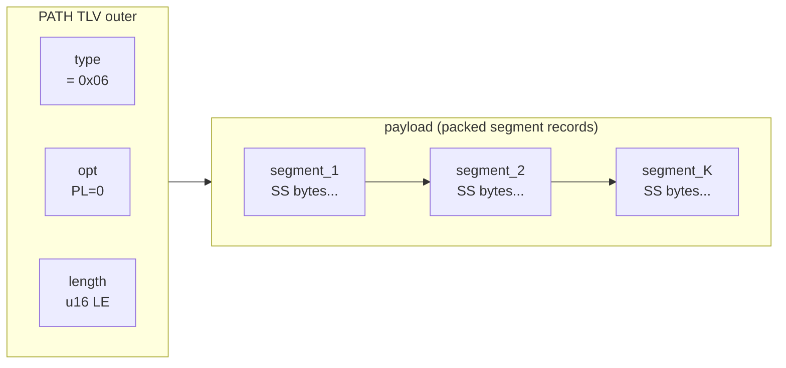

# Reference 05 — Protocol-defined TLVs

> **Status**: normative, v1 (incorporated by [docs/spec/v1.md](../spec/v1.md) §3 per [RFC-0001](https://github.com/avatarsd-llc/libtracer/blob/main/docs/spec/rfcs/0001-v01-consistency-consolidation.md) §A.2). Per-TLV byte-precise specification for every type code in the core-reserved range. The header layout, options bits, fixed-width length, and trailer (TS + CRC) are in [01-data-format.md](01-data-format.md); this document specifies what each type code's payload looks like.

---

## Type code allocation summary

| Range | Use |
| ---- | ---- |
| `0x00` | Reserved sentinel; never a valid TLV |
| `0x01` – `0x1F` | Core protocol types (this document) |
| `0x20` – `0x7F` | Reserved for future core extensions |
| `0x80` – `0xFF` | User-defined application payload types (`0x80` = **BATCH**, the one assigned code — §User range) |

Assigned in the first block: `0x01`–`0x04`, `0x06`–`0x0C`, `0x0E` (12 types). `0x05` is a **reserved code with no assigned meaning** in v1 (see §`0x05`); `0x0D` ROUTER is a **reserved, decodable codepoint with no implemented mechanism** (see §`0x0D`). `0x0E` is **SPEC** (vertex-creation spec, [ADR-0017](https://github.com/avatarsd-llc/libtracer/blob/main/docs/adr/0017-in-band-vertex-creation-controller-orchestration.md)). The `0x0F`–`0x1F` fast-track range holds the remote-operation, route-handle and bound-path frames (`0x0F`–`0x15` assigned, §reserved range `0x0F` – `0x1F`); `0x20` – `0x7F` is the long-term registry.

The names below are the canonical type-code names; an implementation's own enumeration matches them.

### Structured TLVs

Several core type codes are **structured** — they carry `opt.PL=1` and their payload is a concatenation of child TLVs. In the first block the structured types are: `0x04` SUBSCRIBER, `0x07` POINT, `0x09` STATUS (when non-empty), `0x0A` ACL, `0x0B` SETTINGS, `0x0E` SPEC. In the fast-track range `0x0F` FWD, `0x10` FIELD and the `0x11`–`0x13` route-handle frames are structured as well (§the fast-track range); `0x14` PATH_REF and `0x15` PATH_REF_REVERSE are the two codes in that range that are not. Each entry below specifies its own children layout.

There is no generic container type: every structured container declares its purpose via its type code. User-range type codes (`0x80–0xFF`) MAY also be structured (set `opt.PL=1`) for application-defined records.

**No address form is structured.** `0x14` PATH_REF and `0x15` PATH_REF_REVERSE carry a fixed-stride record array and `0x06` PATH carries a packed run of self-delimiting `[u8 len][utf8]` segment records ([RFC-0018](https://github.com/avatarsd-llc/libtracer/blob/main/docs/spec/rfcs/0018-packed-path-segments.md)); all three set `opt.PL` = 0 (§`0x06`, §`0x14`, §`0x15`). A `PATH` was a `NAME`-child container before RFC-0018.

---

## `0x01` — VALUE

Opaque application payload. No protocol-imposed structure; the bytes are whatever the publisher and subscriber agreed on out-of-band.

### Payload layout

```
[ payload bytes — application-defined ]
```

The payload is a contiguous, untouched user region. Wire-time TS and CRC live in the optional trailer per [01-data-format.md](01-data-format.md), not interleaved with the payload.

### Defaults

- `opt.PL = 0` (payload is opaque, not nested).
- `opt.CR` recommended `1` for any non-loopback transport.
- `opt.TS` recommended `1` when wire-time-stamping matters (latency telemetry, dedup tie-breaking).
- For application-domain timestamps, embed a sibling `TIME` TLV inside a wrapping structured TLV (a user-range type code with `opt.PL=1`) instead.

### Where it appears

- Body of normal `tracer_write` / `tracer_read`.
- Inside `SUBSCRIBER` records as the configuration scalar.
- Inside `SETTINGS` as field values.
- Inside `STATUS` as error-detail bytes.

### Validation

- No application-level validation by the core.
- The receiver MUST validate `length` against the available buffer before reading payload bytes.

### Hex example

5-byte payload `AA BB CC DD EE`, CRC-32 enabled, no wire-time (default `LL=0` u16 length):

```
01 10 05 00 AA BB CC DD EE [crc:4]
^  ^  ^^^^^ ^^^^^^^^^^^^^^  ^^^^^
|  |  len=5  payload         trailer_crc (CRC-32C over payload)
|  opt = 0x10 (CR=1)
type = 0x01 VALUE
```

`4 (header) + 5 (payload) + 4 (trailer_crc) = 13 bytes`.

Same payload with absolute wire-time-stamp + CRC-32:

```
01 30 05 00 AA BB CC DD EE [ts:8] [crc:4]
^  ^  ^^^^^ ^^^^^^^^^^^^^^  ^^^^^  ^^^^^
|  |  len=5  payload         ts     CRC over payload+ts
|  opt = 0x30 (TS=1, CR=1)
type = 0x01 VALUE
```

`4 + 5 + 8 + 4 = 21 bytes`.

---

## `0x02` — NAME

A single name segment. UTF-8 bytes, **no NUL terminator on the wire**.

### Payload layout

```
[ N bytes UTF-8 ]
```

### Constraints

- Length: 1..64 bytes (per [03-addressing.md](03-addressing.md) §path syntax).
- MUST NOT contain reserved characters (`/ : . [ ] * ?`).
- MUST be valid UTF-8. Invalid byte sequences MUST be rejected with `ERROR{tr::path::invalid}`.

> ⚠️ **Conformance gap — the reference implementation accepts `[` and `]` in a NAME.** Its segment predicate rejects only `/ : . * ?`, by its own account a deliberate temporary subset held until address-index parsing lands ([03-addressing.md](03-addressing.md) §reserved characters, `core/include/libtracer/path.hpp:53-61`). The rule above is unchanged.

### Where it appears

- Inside SETTINGS as field-name keys.
- Inside `:schema` responses as field labels.
- Inside `:children[]` reads, as the member name beside each `POINT`.
- Wherever a "label" is needed inside a structured TLV.

> **Not inside a `PATH`.** Until [RFC-0018](https://github.com/avatarsd-llc/libtracer/blob/main/docs/spec/rfcs/0018-packed-path-segments.md)
> a `PATH` (`0x06`) body was one `NAME` child per segment. It is now a packed run of
> `[u8 len][utf8]` records with no per-segment TLV header (§`0x06` PATH). `NAME` is unchanged and
> un-retired — it keeps its type code, its fast-track range slot and every use above.

### Hex example

NAME "sensor" (6 bytes), no trailer (typical when nested inside a structured TLV whose outer trailer covers everything):

```
02 00 06 00 73 65 6E 73 6F 72
^  ^  ^^^^^ ^^^^^^^^^^^^^^^^^
|  |  len=6  "sensor"
|  opt = 0 (no PL, no TS, no CR)
type = 0x02 NAME
```

`4 (header) + 6 (payload) = 10 bytes`.

---

## `0x03` — DESCRIPTION

Free-form UTF-8 human-readable description of a vertex or field. Optional in every context; tooling shows it to operators.

### Payload layout

```
[ N bytes UTF-8 ]
```

### Constraints

- Length: 0..1024 bytes recommended; no hard upper limit beyond `length` field range.
- MUST be valid UTF-8.

### Where it appears

- ⚠️ `<vertex>:description` field — **unimplemented**; a read or write answers `tr::schema::not_found` ([#586](https://github.com/avatarsd-llc/libtracer/issues/586)).
- Inside `:schema` responses annotating fields — reachable only through the RFC-0010 owner part, whose descriptor bytes are served verbatim; the synthesized protocol part emits no `TEXT`.
- Inside ERROR TLVs as the human-readable detail.

---

## `0x04` — SUBSCRIBER

Subscription record. The presence of a SUBSCRIBER TLV at `<vertex>:subscribers[N]` causes the router to fan out future writes to that vertex to the subscriber's target path.

### Payload layout

Always structured (`opt.PL=1`). Children, in order:

```
SUBSCRIBER (PL=1) {
  PATH        target_path     ; required — where to dispatch matched writes
  SETTINGS    qos_settings    ; optional — QoS overrides for this subscription
  ACL         capability      ; optional — capability token if enforced
  NAME        subscriber_id   ; optional — opaque ID for self-identification
}
```

The `qos_settings` SETTINGS carries **per-subscriber encoding hints and this subscription's delivery policy** (byte-agnostic; numeric filtering such as deadband is an application *filter vertex*, never a field — the sibling decision of [ADR-0019](https://github.com/avatarsd-llc/libtracer/blob/main/docs/adr/0019-per-producer-monotonic-origin-timestamp.md)). It carries **no value-based delivery filter and no throttle**: there is no `delivery_mode == ON_CHANGE` byte-diff, no `min_interval_ns` and no `keepalive_ns` ([RFC-0008](https://github.com/avatarsd-llc/libtracer/blob/main/docs/spec/rfcs/0008-vertex-operations-assign-propagate.md)) — the runtime inspects neither values nor times to decide delivery. Delivery selection is **structural and per-vertex**; see `delivery_mode` below.

```
qos_settings = SETTINGS {
  NAME "delivery_scope"    VALUE <u8: DELTA=0, SNAPSHOT=1>   ; reserved (RFC-0005: as-written is the delivery; SNAPSHOT re-aggregation is a BRANCH WRITE)
  NAME "delivery_compact"  VALUE <u8: 0=off, 1=on>  ; opt into route-handle compaction (§route-handle)
  NAME "delivery_policy"   VALUE <u16>              ; this subscription's DELIVERY policy (RFC-0022 §3.A)
  NAME "batch_count"       VALUE <u32>              ; RETIRED (RFC-0025 §4.1.3) — carried verbatim, read by nothing
  NAME "batch_window_ns"   VALUE <u64>              ; RETIRED (RFC-0025 §4.1.3) — carried verbatim, read by nothing
}
```

**`delivery_scope = SNAPSHOT` is no longer deferred.** It was parked in
[RFC-0005](https://github.com/avatarsd-llc/libtracer/blob/main/docs/spec/rfcs/0005-subtree-subscriptions.md) §E as "producer-side re-aggregation";
[RFC-0025](https://github.com/avatarsd-llc/libtracer/blob/main/docs/spec/rfcs/0025-stream-class-values.md) §4.1.2 (Amendment 3, 2026-08-21) un-defers it by
**reframing it as a branch write**: `propagate` gains a FOLD emission mode that emits **one
branch-write frame per sweep** — the [RFC-0016](https://github.com/avatarsd-llc/libtracer/blob/main/docs/spec/rfcs/0016-composed-branch-read.md) `POINT`-tree grammar, rooted per
§`0x07`'s branch-write shape, with payload `TIME` (§`0x0C`) children carrying stream-list
times — instead of one `FWD{WRITE}` per selected vertex. The terminus is unchanged (§`0x07`
decomposition slices the one frame per covered subscriber), and it is **not** a wire batch
container: one frame per subtree, several subtrees stay N self-contained frames in one
`send(iov)` (the retired-`LIST` rule, §`0x05`). The `delivery_scope` **key itself is still
reserved** — no implementation reads it today.

The mode is **live host-side** as `graph_t::propagate(v, emission_mode_t::FOLD)` — see
[02-graph-model.md](02-graph-model.md) §"Assign, propagate, and the coalescing sweep" for the
refusal rules — and it stays a **producer-side choice per call**: nothing about it is
negotiated, readable or writable by a peer, and the default emission is unchanged.

The `batch_count` / `batch_window_ns` magnitudes are **RETIRED**
([RFC-0025](https://github.com/avatarsd-llc/libtracer/blob/main/docs/spec/rfcs/0025-stream-class-values.md) §4.1.3, Amendment 4, 2026-08-23): **batching is
user-orchestrated**, so *when to swap and push* is an application decision that never crosses
into the graph — the app already holds the sample count it composed and owns the clock it
stamped with. Neither key is honoured, and none will be. They keep the `qos_settings`
verbatim-carry rule, so a subscription that spells one is not made non-conforming; nothing
reads it. The producer owns cadence ([RFC-0005](https://github.com/avatarsd-llc/libtracer/blob/main/docs/spec/rfcs/0005-subtree-subscriptions.md) §E), there is **no** graph-plane
timer, rate cap or scheduler, and explicit flush is the host-side `graph_t::propagate`.

**`delivery_policy`** ([RFC-0022](https://github.com/avatarsd-llc/libtracer/blob/main/docs/spec/rfcs/0022-delivery-policy-is-per-subscription-vertex-keeps-storage.md) §3.A) is one packed 16-bit value carried in this **same**
`SETTINGS` child, so the per-subscription policy introduced no new wire structure:

| bits | field | values |
| ---: | --- | --- |
| 0–1 | `reliability` | `0` = best-effort, `1` = reliable; `2`–`3` reserved |
| 2–4 | `priority` | `0`–`7`, `0` = default |
| 5 | `durability_request` | `1` = deliver the producer's latched last value on join |
| 6–7 | `delivery_class` | `0` = conflate (default), `1` = immediate, `2` = batch, `3` = stream ([RFC-0025](https://github.com/avatarsd-llc/libtracer/blob/main/docs/spec/rfcs/0025-stream-class-values.md) §4.1) — **assigned, not yet honoured**; see below |
| 8–15 | reserved | MUST be written `0`, MUST be **ignored** on read |

**Absent ⇒ all-zero ⇒ the default behaviour**, byte-identically — a sender that predates the key
is a conforming sender (`subscriber/policy-absent`). Reserved bits MUST be ignored, never
rejected, and are carried verbatim so they read back unchanged from `:subscribers[]`
(`subscriber/policy-reserved-bits`). Only `durability_request` is honoured today (§the latch
above, `subscriber/policy-durability`); `priority` is stored and read back, awaiting the transport
work that honours it. `reliability` is stored and read back too, but it awaits **nothing** — the
§4.4 pressure arm is the receiving vertex's own owner-side declaration, so bits 0–1 are carried
verbatim and read by nothing ([RFC-0025](https://github.com/avatarsd-llc/libtracer/blob/main/docs/spec/rfcs/0025-stream-class-values.md)
§Erratum 2026-08-24).

These three were per-**vertex** `:settings` knobs until RFC-0022: a single `reliability` or
`priority` has no coherent meaning across a heterogeneous fan-out (one vertex to a CAN peer and a
WebSocket peer at once), which is why nothing ever consumed them. **No magnitude may be packed
here** — a deadline or queue bound is a magnitude, and a bit-width on a magnitude is a synthetic
limit this project forbids; one would arrive as a full-width field in the subscription's cold
half, never in these bits.

**Bits 6–7 are DECODED, not yet honoured.** [RFC-0025](https://github.com/avatarsd-llc/libtracer/blob/main/docs/spec/rfcs/0025-stream-class-values.md) §4.1 assigns them
`delivery_class`; the default `0` (conflate) is today's behaviour byte-identically, which is
why the assignment costs no wire byte and breaks no sender — a subscriber that predates the
class wrote `0` there when the bits were reserved and is conflate-class **by construction**.
Every core now reads the field (C++ `delivery_policy_t::delivery_class`, Rust
`DeliveryPolicy::delivery_class`, TS `deliveryClassOf`), and the
`subscriber/policy-reserved-bits` vector was repaired with it — **in place, same bytes**: its
`0xFFC1` word is unchanged (it always carried `delivery_class = 3`), and only its description
and its three-language gates narrowed to "bits 8–15 reserved"
([RFC-0025](https://github.com/avatarsd-llc/libtracer/blob/main/docs/spec/rfcs/0025-stream-class-values.md) §4.1.2, Amendment 3, clause 7). **Reading the class is not honouring
it**: every class beyond `conflate` needs the fan-out-edge mechanics and the receiving
vertex's ring, which land with [#1204](https://github.com/avatarsd-llc/libtracer/issues/1204) phase 3's remaining work. Until then a producer
delivers as it always did, whatever a subscriber's word says.

**Class semantics** ([RFC-0025](https://github.com/avatarsd-llc/libtracer/blob/main/docs/spec/rfcs/0025-stream-class-values.md) §4.1, as amended):

| class | delivery |
| --- | --- |
| `0` conflate | last-wins; delivery MAY coalesce to the newest value. The LKV contract, and the default. |
| `1` immediate | every write delivered as its own event; order-preserving, never conflated. |
| `2` batch | the **wire encoding of the [RFC-0008](https://github.com/avatarsd-llc/libtracer/blob/main/docs/spec/rfcs/0008-vertex-operations-assign-propagate.md) `assign`/`propagate` flush**. Accumulation is the source vertex's own state — a plain value **coalesces** (LKV overwrite, §B.2), a STREAM vertex keeps its **bounded since-last-flush list** (§E) — never a per-subscriber buffer at the fan-out edge. A flush emits the **snapshot** on a plain vertex and the **full list** on a STREAM. **Batching is user-orchestrated** ([RFC-0025](https://github.com/avatarsd-llc/libtracer/blob/main/docs/spec/rfcs/0025-stream-class-values.md) §4.1.3, Amendment 4): the application ropes its sample values into ONE batch value, swaps it in through the ordinary atomic LKV publish, and calls `propagate`/push. The graph holds no counter, no window and no buffer, derives no time, and never interprets the record — `batch_count` / `batch_window_ns` are retired, and a full bounded list is still discharged rather than trimmed (no loss, no gap signal, no counter). **The batch has one layout and two spellings, chosen by carriage**: a **standalone** flush is one BATCH record (§User range, `0x80`); a flush **folded** into a `propagate(v, FOLD)` branch write is seated in the swept node's single structured `VALUE` (`opt.PL=1`) — the one value [RFC-0005](https://github.com/avatarsd-llc/libtracer/blob/main/docs/spec/rfcs/0005-subtree-subscriptions.md) §B admits — byte-identical apart from the header type byte ([RFC-0025](https://github.com/avatarsd-llc/libtracer/blob/main/docs/spec/rfcs/0025-stream-class-values.md) §4.1.2 clause 6, erratum 2026-08-23). |
| `3` stream | append-preserving: every write delivered in order, none conflated, with the RFC-0025 §4.4 pressure contract at the **receiving** vertex's ring. |

**Per-vertex `delivery_mode` ([RFC-0008](https://github.com/avatarsd-llc/libtracer/blob/main/docs/spec/rfcs/0008-vertex-operations-assign-propagate.md)).** Whether a vertex rides an *ancestor's* `propagate` sweep is a value-agnostic property of the **vertex** (not the subscriber): `UNCONDITIONAL` (always swept), `IF_NEWER` (default — swept only if its write sequence advanced since the last covering sweep), `EXPLICIT` (never swept by an ancestor; deliverable only by a direct `propagate` on the vertex). `assign` and a direct `propagate` on the vertex are never gated by it. It is host state defaulting to `IF_NEWER`. Wire configuration reuses the vertex's own `:settings` (a `delivery_mode` NAME/VALUE under the vertex `SETTINGS`) and is **deferred**, so the host call is the only way to set it.

`delivery_compact` ([RFC-0004](https://github.com/avatarsd-llc/libtracer/blob/main/docs/spec/rfcs/0004-remote-operation-addressing.md) §E.1, ADR-0035 slice 4) is the consumer's **opt-in to label-compacted deliveries**: on a full-TLV transport (ws/UDP, default *full-route* deliveries) a producer MAY, for a subscriber that set it, advertise a per-link **label** aliasing that subscriber's return route and thereafter stream lean `COMPACT` frames instead of full-route `FWD{WRITE}` (see §route-handle). It is **optional and NAME-tagged**: a parser that does not know it, or a producer that does not honor it, keeps the full-route delivery path, so it perturbs no conformance vector. Header-elided transports (CAN) always label and ignore the hint.

The per-vertex `delivery_mode` is **enforced producer-side** (during the `propagate` sweep, before fan-out), and it applies to bubbled deliveries (below) exactly as to direct ones. The `capability` child carries the subscriber's **subject-token** ([ADR-0018](https://github.com/avatarsd-llc/libtracer/blob/main/docs/adr/0018-access-control-authorization-pluggable-subject-token.md)); subscribe-authorization is gated by the *source's* `:acl`.

### Subtree subscription — vertical bubbling

Every subscription is a **subtree subscription** ([RFC-0005](https://github.com/avatarsd-llc/libtracer/blob/main/docs/spec/rfcs/0005-subtree-subscriptions.md)): a SUBSCRIBER at `<vertex>:subscribers[N]` observes writes to that vertex **and to any descendant of it** (a leaf subscription is the trivial case), so no wildcard `target_path` is needed — subscribing to the composite vertex *is* the subtree subscription. A write at vertex W MUST deliver, once per subscriber, to the subscribers of W and of each ancestor of W ("vertical bubbling"). The delivered payload is the **written TLV as-is** — the exact frame the producer wrote, at the granularity it chose (a leaf `VALUE`, or a whole branch `POINT` per §`0x07`); there is no re-encoding and no delivery-metadata envelope. Local subscribers receive the usual zero-copy view clone; remote subscribers receive the frame over the existing return-route `FWD{WRITE}` delivery path unchanged. Any provenance a consumer needs beyond the frame itself travels **in the data** ([CONTEXT.md](../../CONTEXT.md) §SUBSCRIBER direction); wire-level concrete-path tagging of remote deliveries is the separate, draft [RFC-0003](https://github.com/avatarsd-llc/libtracer/blob/main/docs/spec/rfcs/0003-bridged-wildcard-delivery-path.md) proposal.

The write path MUST stay near-free when nobody listens: an implementation maintains per-vertex listener bookkeeping (updated at subscribe/unsubscribe, at control-plane frequency) so a write performs the ancestor fan-out walk **only when a subscriber exists at or above it** — an idle write takes no vertex lock and costs two atomic loads ([RFC-0005](https://github.com/avatarsd-llc/libtracer/blob/main/docs/spec/rfcs/0005-subtree-subscriptions.md) §A cost model).

```{mermaid}
flowchart BT
    C["/a/b/c ← write(VALUE)"] -- "fan_out: own subscribers" --> C
    C -- "bubble: written TLV as-is" --> B["/a/b (subscriber S2)"]
    B -- "bubble: written TLV as-is" --> A["/a (subscriber S1, remote via FWD)"]
    A -.-> R["no subscriber above /a ⇒ walk ends;<br/>with no S1/S2 the write never walks at all"]
```

### Producer fan-out to remote subscribers

When a SUBSCRIBER is written into `<vertex>:subscribers[N]` over a transport (an inbound `FWD{WRITE}` to `:subscribers[]`, RFC-0004 §D), the slot retains the request's **accumulated return route** (the FWD `src`) and the inbound link. The route bytes are copied **once**, at subscribe time, into a refcounted segment; the slot holds a view over it. Thereafter a write to that vertex fans out a delivery back to the consumer along that return route — a `FWD{WRITE, dst=<return route>, payload=<VALUE>}` (delivery-is-a-write), or, when the subscriber set `delivery_compact`, an auto-promoted `COMPACT` (advertised once per flow, then streamed; re-advertised after a reconnect — §route-handle). Each full-route delivery **refcount-clones** the stored route and scatter-gathers the frame from stack-built heads + the roped route + the roped value — no route or payload bytes are copied per delivery, and an in-flight rope keeps the route segment alive across a concurrent unsubscribe. This is the producer half of consumer-initiated subscription; it composes the existing field-writes and adds no wire verb (RFC-0004 / ADR-0035 slice 4).

A subscriber that sets **`durability_request`** (bit 5 of its `delivery_policy`, below) additionally receives a **latch**: the subscribe itself emits one immediate delivery of the producer's last-known value, so a late joiner paints the current state without waiting for the next write. A subscriber that does not ask (the default) receives only writes that happen after its subscribe — and the two may sit on the same producer at the same time, which is the point of [RFC-0022](https://github.com/avatarsd-llc/libtracer/blob/main/docs/spec/rfcs/0022-delivery-policy-is-per-subscription-vertex-keeps-storage.md) §3.A: this was a producer-side `:settings.durability` flag that replayed to every subscriber, including the ones that never asked. The latch reuses the same delivery path (full-route or `COMPACT`) and carries no new wire bytes of its own, so it is observable only as delivery *timing*; the vectors pin the REQUEST (`subscriber/policy-durability`, `subscriber/policy-absent`).

The producer fan-out, end to end — the subscribe binds a remote subscriber, its `durability_request` fires the latch immediately, and later writes stream out (auto-promoted to lean `COMPACT` when the subscriber opted in):

```{mermaid}
sequenceDiagram
    autonumber
    participant Cons as Consumer
    participant Prod as Producer node
    participant V as Vertex (producer)
    Cons->>Prod: FWD{WRITE, dst=/V, :subscribers[], src=/cons,<br/>SUBSCRIBER{ delivery_compact=1 }}
    Prod->>V: subscribe_wire — the ADR-0049 admission door<br/>(retain return_route=/cons + inbound link)
    Note over Prod,V: durability_request ⇒ latch the current LKV
    Prod-->>Cons: FWD{WRITE, dst=/cons, VALUE}  (delivery #1 — the latch)
    Prod-->>Cons: FWD{REPLY} (subscribe ack)
    Note over V,Prod: a later local write fans out via the injected sink
    V->>Prod: write(new VALUE) → fan_out → remote sink
    Prod-->>Cons: ADVERTISE{ label, route=/cons }  (once per flow)
    Prod-->>Cons: COMPACT{ label, VALUE }          (then lean frames…)
    Prod-->>Cons: COMPACT{ label, VALUE }
```

### Where it appears

- `<vertex>:subscribers[N]` slot, one per subscription.
- Inside `<vertex>:subscribers[]` reads (returned as a sequence of SUBSCRIBER TLVs nested in the response).

### Validation

- `target_path` MUST be a syntactically valid path (per [03-addressing.md](03-addressing.md)).
- A SUBSCRIBER with no `target_path` is treated as "clear this slot" (unsubscribe sentinel).

### Future extensions

The optional fields after `target_path` may grow. New optional sub-fields MUST appear after the existing ones and MUST be NAME-tagged so older parsers can skip them.

---

## `0x05` — RESERVED

Type code `0x05` is a **reserved code with no assigned meaning** in v1. Structured payloads are expressed by `opt.PL`, not by a dedicated container type: every structured TLV in the registry has a specific purpose declared by its type code.

- Senders MUST NOT emit `type=0x05`.
- Receivers MUST treat `type=0x05` as a reserved-but-unassigned code per [01-data-format.md](01-data-format.md) §handling unknown type codes (skip safely, do not crash).
- The code is not available for reuse; collision-prevention keeps it unassigned.

The structural concept lives in the options bits: any TLV with `opt.PL=1` is a structured container holding concatenated child TLVs. The protocol's structured types are SUBSCRIBER (0x04), POINT (0x07), STATUS (0x09), ACL (0x0A), SETTINGS (0x0B), SPEC (0x0E) in the first block, plus FWD (0x0F), FIELD (0x10) and the route-handle frames ADVERTISE (0x11) / COMPACT (0x12) / HANDLE_NACK (0x13) in the fast-track range; PATH_REF (0x14) and PATH_REF_REVERSE (0x15) are the two codes in that range that are not. PATH (0x06) is **not** structured either — since [RFC-0018](https://github.com/avatarsd-llc/libtracer/blob/main/docs/spec/rfcs/0018-packed-path-segments.md) its body is a packed record run with `opt.PL=0`, so the three address forms (`0x06`, `0x14`, `0x15`) are all opaque-bodied. User-defined structured records use user-range type codes (`0x80–0xFF`) with `PL=1`.

### Why no generic container

A generic list would have no semantic meaning of its own — an un-named default whose role is always "structured stuff goes here." Real uses always have a specific purpose. Forcing every container to declare its purpose via type code is what makes the type byte a proper L3 concern.

---

## `0x06` — PATH

A hierarchical address. An **opaque** TLV (`opt.PL=0`) whose body is a self-delimiting run of
**records** ([RFC-0018](https://github.com/avatarsd-llc/libtracer/blob/main/docs/spec/rfcs/0018-packed-path-segments.md) §5).
Distinct from an ordinary opaque TLV in that the constraints below are *enforced*, not merely
conventional — see [enforcement](#enforcement-of-the-path-constraints).

**Two layers, one sentence.** A `PATH` is a list of **path elements**; an element's kind is
**NAME** or **LABEL**; a NAME element is encoded as a **segment record**, a LABEL element as an
**escape record**. "Path element" is the model-layer word — what an address is *made of* — and the
two record words are the encoding-layer ones, naming the differently-framed byte patterns that
spell the two kinds. Both layers are canonical and neither replaces the other
([#1347](https://github.com/avatarsd-llc/libtracer/issues/1347), ruled 2026-08-16): an escape is
precisely *not* a segment, so the grammar below needs the record words, and an address is not a
list of byte patterns, so the model needs the element word. An element **self-describes by its
kind, never by its position** ([RFC-0027](https://github.com/avatarsd-llc/libtracer/blob/main/docs/spec/rfcs/0027-label-switched-path-compression.md)
§5.1). A `PATH` whose elements are all NAME — the canonical form — is byte-identical to the
pre-RFC-0027 encoding.

> **Amended.** Until RFC-0018 the body was a child sequence (`opt.PL=1`) of `NAME` TLVs, one per
> segment, and "each child MUST be a `NAME`" was the invariant. `NAME` (`0x02`) is **not**
> retired — it still spells SETTINGS keys and `:schema` labels; RFC-0018 removed it from `PATH`
> bodies only.

### Payload layout

```
PATH (PL=0) {
  [u8 len_1][len_1 bytes UTF-8]        ← element 1, kind NAME — a segment record
  [u8 len_2][len_2 bytes UTF-8]        ← element 2, kind NAME — a segment record
  ...
  [u8 len_K][len_K bytes UTF-8]        ← element K, kind NAME — a segment record
}
```

The walk is `p += 1 + body[p]` — one byte load and one add, with no option decode and no header
construction. An **empty** body is valid: it is the graph root (`/`), zero elements.

A **LABEL** element occupies the same list and is encoded as an **escape record** — `00 <u8 kind>
<u8 len> <len bytes>`, `kind = 0x16`, `len = 4` — so the walk over it is `p += 3 + body[p+2]`
instead. That is the next bullet's rule, and the reason the two encodings need two names: the
records are framed differently, while the elements they spell sit in one list.

### Header settings

- `opt.PL` MUST be `0`. The body is not a child sequence.

### Constraints

- Each record's `len` MUST be in `1..64` (the per-segment limit of [03-addressing.md](03-addressing.md)
  §path syntax; the `u8` length field caps it at 255 forever).
- `len == 0` is the **escape record** — `00 <u8 kind> <u8 len> <len bytes>`, total `3 + len`
  bytes ([RFC-0018](https://github.com/avatarsd-llc/libtracer/blob/main/docs/spec/rfcs/0018-packed-path-segments.md) §8, made
  normative by its §5.4 amendment 1). It is **admissible in a frame path** and **rejected in
  canonical / key context** — see [enforcement](#enforcement-of-the-path-constraints).
  `kind = 0x16` is reserved for the **LABEL** element of
  [RFC-0027](https://github.com/avatarsd-llc/libtracer/blob/main/docs/spec/rfcs/0027-label-switched-path-compression.md)
  — the escape record is that element's encoding, not a third kind of thing; no other `kind` is
  assigned, and a host that does not own the `kind` it meets steps over the record by its declared
  length rather than reading it.
- The records MUST **tile the body exactly**: a record whose declared length runs past the
  body's end is ragged framing, not a short read.
- Total path length ≤ 1024 bytes, measured as the **encoded `PATH` body** — the concatenated
  segment records, i.e. exactly this TLV's own `length` field — **not** the sum of segment
  bytes plus separators, a unit that excludes the per-segment length byte and so admits paths
  `path_t::parse` rejects (see [§path syntax](03-addressing.md)).
- Segment count ≤ 255 ([RFC-0023](https://github.com/avatarsd-llc/libtracer/blob/main/docs/spec/rfcs/0023-path-segment-cap-repriced-32-to-255.md)).
  Under this body encoding a record costs `1 + len`, so 1024 bytes admit up to 512 one-byte
  segments and the **count cap binds first** for segments averaging ≤ 3 bytes; past that the
  byte cap binds. Under the retired `NAME`-child body each segment cost `4 + len`, the byte cap
  bound first at 204 segments, and the count clause could never fire — the crossover is pinned
  by the `path/path-deep-255-packed` vector.

### Enforcement of the PATH constraints

Enforcement sits at the resolver, not at the codec. Three rules, in the order a frame meets them:

- **The codec does not enforce these constraints, and is not expected to.** A PATH's body is
  decoded as opaque bytes; the bytes above round-trip byte-identically. That is deliberate —
  the constraint is about what an address *means*, not about what the octets *are*, and it
  keeps codec-only cores (TypeScript, Rust) free of resolver semantics. The packed body makes
  this tier *cheaper*: there is no child-type rule left for the codec to not-enforce.
- **The resolver enforces the record grammar**, when it turns a PATH into a vertex lookup key.
  Ragged framing, an over-long segment, or an escape record in **canonical / key context**
  makes the address unspellable, so the op answers `ERROR{tr::path::invalid}` (`0x0021`) —
  *not* `tr::path::not_found`, which would wrongly assert that the address was well-formed but
  absent. Enforcement **precedes write-create**: a `WRITE` to an illegally-spelled path creates
  nothing.
- **The length and segment-count limits** are bounded where the address is constructed or
  admitted, not at decode.

**The two contexts, and why they differ.** In a **frame path** — a `FWD` `dst`/`src` a hop is
relaying — a forwarder that does not implement an escape record's `kind` MUST step over it by
its declared length rather than drop a frame it is only relaying; that is the whole reason the
escape is self-delimiting. In **canonical / key context** — a vertex-map lookup key, an
`ADVERTISE` route, a pre-encoded path handle — an escape record is rejected, because a label is
not canonical bytes and the key must stay pure-string for the byte-prefix-implies-ancestor
property [02-graph-model.md](02-graph-model.md) depends on.

Conformance vectors: `path/path-escape-in-key-context` carries an escape that a frame admits and
a key refuses; `path/path-record-overruns-body` carries a record whose declared length runs past
the body. Both are `input.bin` cases, not `reject.bin` ones: decode must succeed, because decode
is not where the rule lives. They replace `path/path-value-children-illegal`, retired with
RFC-0018 — a packed record has no type byte, so a mistyped child is unrepresentable.

### Path label element (escape `kind = 0x16`) — routing semantics

The layout above is what a **LABEL** element *is*; this is what a host does with one
([RFC-0027](https://github.com/avatarsd-llc/libtracer/blob/main/docs/spec/rfcs/0027-label-switched-path-compression.md)
§§4–8, accepted 2026-08-15, implemented). It is a compression of **one hop's own local part** of
an address, never a new address form: a `PATH` carrying a label element is still a `0x06`, and the
canonical spelling of the same address is what minted it and what a failure falls back to.

**There is no `PATH_LABEL` type code.** The element is the escape record of §Constraints above —
`00 <u8 kind = 0x16> <u8 len = 4> <u32 LE>`, 7 bytes — and `0x16`–`0x1F` stay **unassigned** in the
type-code registry (§reserved range). The escape `kind` space and the TLV type space are different
namespaces that happen to share a number; RFC-0027's candidate 8-byte TLV-child spelling was ruled
and then never built (its amendments 4 and 5).

**The value.** `u32` little-endian, `(u16 slot index, u16 generation)` — bits 0–15 the index, bits
16–31 the generation. The index is a **slot in the minting host's own label table**, handed out at
mint time and bounds-checkable against the table's cardinality; it is **never a content hash**,
because a hash collision is a mis-delivery and this doc set closes that class by construction
rather than by digest width. A generation of `0` means *no label*: it is never carried by a minted
element, and an element carrying it is a well-formed LABEL whose value is invalid — refused at
deref, not at decode.

**Node-scoped, and an address rather than a capability.** A label means something **only on the
host that minted it**. A host MUST NOT interpret a label it did not mint, and MUST NOT relay a
label of its own into a part of the path another host reads.

**One label covers a whole local part.** A hop's local part is its entire mount run
(`net/<module>/<name>`, however many segments), and one label stands for all of it — never one
label per segment. Granularity is per hop, so mixed granularity across a route is legal.

**Mixed paths are legal and expected.** A `PATH` MAY carry any mixture of NAME and LABEL elements,
in any order; there is no "fully minted" state a path must reach. A hop that does not implement
this mechanism, or that declines to mint, leaves its own part spelled in names and every other
hop's part still compacts.

#### Minting — passive, on the reply, and never load-bearing

There is **no advertise, no request flag, no setup exchange and no control frame of any kind**. A
minting host emits exactly the frames it emits today, with some path elements spelled differently:

- Each forwarding hop resolves its local part canonically on the way out, exactly as today.
- On the way **back**, a minting hop relaying a reply prepends its own local part to that reply's
  `src`, spelled as one label element. The reply's `src` is the only region that survives to the
  origin — the reply's `dst` is consumed hop by hop, and appending a trailing accumulation is
  refused by the "replaces, never appends" rule. RFC-0004 §B's *"a reply accumulates no return
  route"* is therefore narrowed to **non-minting** hops, which is every host that does not inject a
  table (RFC-0027 §6.1 erratum 2).
- A **terminus** does the same for the residual it resolved: at a terminus the reply's `src` region
  *is* that residual, so the rewrite is a literal substitution and the frame gets **shorter**.
- The rewrite **replaces** string bytes and never appends, measured against the string spelling of
  the same part — 7 bytes against the 13 of the shipped `net/<module>/<name>` mount run.

**The trigger is a fact already in hand, never a prediction.** A forwarding hop mints on the first
reply it relays over a child; a terminus mints on the first terminated operation per child. **No
use counters, no hit thresholds, no hotness estimate, no timers, no aging.** Minting is
**post-auth only**: a host MUST NOT mint for a part of a path the requesting peer could not have
reached canonically in the same operation, so probing the labelled spelling yields what probing the
string spelling yields — *exists + denied*, never *exists + here is a handle to it*.

**A mint is never load-bearing.** A host MUST behave correctly when no label is ever minted
anywhere on a route. A refusal to mint, a retired slot, an exhausted table and a hop that does not
implement the mechanism at all are **one case** — the string path — and none of them is an error, a
NACK, or observable on the wire.

#### Dereference and failure — `NOT_FOUND`, then the string the sender still holds

On receipt of a labelled element a host bounds-checks the index against its own table, compares the
generation, and authorizes at the dereferenced vertex — the same three steps, in the same order, a
`PATH_REF` element takes (§`0x14` §routing semantics). Every labelled operation **MUST** evaluate
the access check at the dereferenced vertex for that operation's own right, **exactly as the string
form does**: a generation match says the vertex is the same one, never that the caller may still
act on it, and a label holds no authorization state, so a revoked right takes effect on the very
next operation over an already-minted label. Conformance carries the paired
[`acl/label-vs-string-allow`](https://github.com/avatarsd-llc/libtracer/tree/main/tests/conformance/vectors/v1/acl/label-vs-string-allow)
and [`acl/label-vs-string-deny`](https://github.com/avatarsd-llc/libtracer/tree/main/tests/conformance/vectors/v1/acl/label-vs-string-deny)
asserting the two spellings agree byte for byte, allowed and denied alike.

A host that receives a label it cannot validate — out of range, generation mismatch, unminted slot,
a label it did not mint — **MUST NOT** forward it, **MUST NOT** apply the operation, and **MUST
NOT** attempt any repair of its own: no re-resolution against a nearest match, no retry against a
different slot, no guessing. It **MUST** answer a `NOT_FOUND`-class error (`tr::path::not_found`):
an unresolvable address is exactly what that error already means, and a label is an address. No new
frame is needed and none is defined.

**There is no fall-through to the canonical walk**, and this is where a labelled element differs
from a bound subscriber edge, which does fall through: the label **replaced** the string bytes, so
there is nothing left to walk and a fall-through would amount to inventing an address. The sender's
recovery is the full-string path it still holds, re-minted from the next reply — one failed
operation is the entire cost.

**Staleness is the generation, and nothing else.** When the vertex a label resolves to departs —
retirement, connection-vertex removal, link teardown — the minting host bumps that slot's
generation, and the label the peer holds compares unequal. Generations only move forward, so a
stale label never becomes valid by waiting. A generation **MUST NOT** wrap: on saturation it stops
advancing and the slot is **retired permanently**, removed from the mintable set for the lifetime
of the table and never minted into again. The rule is invisible on the wire — it is a constraint on
what a minting host may do with its own table — and it is what closes the mis-delivery class a
wrapped generation would reopen, identically to §`0x14`'s rule for a vertex ref.

**No withdraw protocol, no aging.** There is no withdraw frame, no unbind, no lease and no TTL. A
label is not retired by its holder and not expired by its minter; it simply stops validating, and
the next frame discovers that.

#### The table — injected, ceilinged, refuse-new, and off by default

The label table is the **per-hop state** this mechanism knowingly buys, and it is bounded by an
injected resource rather than a library-chosen capacity: it draws from the embedder's net-plane
store ([ADR-0079](https://github.com/avatarsd-llc/libtracer/blob/main/docs/adr/0079-allocation-store-composition-defaults-to-per-plane-mid.md)),
carries a **per-peer ceiling** so one peer cannot consume it, and on exhaustion **refuses new
mints** — it does not evict, does not grow, and does not fail the operation. **Live labels are
never evicted by pressure**: an established label is not a cache entry, and reclaiming one would
turn a bounded-resource problem into a stream of avoidable `NOT_FOUND` round trips on flows that
were working.

**Minting is opt-in and off by default.** A node with no injected table never enters the label
branch: it mints nothing, its parts travel as the strings they travel as today, and a peer that
presents it a label gets the `NOT_FOUND` above. That default is deliberate and measured — the
per-hop saving is a **wide-node** property (it arrives with registry width and is not claimed at
all on a narrow node), while the terminus-residual saving is what the mechanism banks; RFC-0027
§3.4 carries both figures and the scope limit.

**One compression per address.** A host SHOULD NOT mint a path label into an address already
spelled as a `PATH_REF` (§`0x14`), and SHOULD NOT bind a `PATH_REF` over an already-labelled path.
Two compressions of one address buy one address's worth of saving and two staleness surfaces.

**Optionality.** Emitting and accepting labelled elements are both optional. A host that implements
neither still relays a frame carrying one, by stepping over the escape record by its declared
length (§Enforcement above) — which is why the element is self-delimiting and why the node least
likely to mint pays only the skip.

Conformance vectors:
[`path-label/label-roundtrip`](https://github.com/avatarsd-llc/libtracer/tree/main/tests/conformance/vectors/v1/path-label/label-roundtrip),
`label-mixed`, `label-multi-segment`, `label-foreign-kind` and the negative `label-wrong-length`
(a declared length that is not 4 makes the address unspellable ⇒ `tr::path::invalid`, the resolver's
answer, since the packed body is codec-opaque); `fwd/fwd-label-mint-reply`,
`fwd/fwd-label-terminus-reply`, `fwd/fwd-label-terminus-deref` and the negatives `fwd/fwd-label-stale`,
`fwd/fwd-label-terminus-stale`; and the ACL pair above. Every existing vector is byte-unchanged: a
`PATH` with no label element is byte-identical to today's.

**On the wire, in a capture.** The [Wireshark dissector](https://github.com/avatarsd-llc/libtracer/tree/main/tools/wireshark)
renders a label in place inside the address — `/<label:3@7>/sensor/temp`, index before generation —
and exposes `libtracer.path.label.index` / `.generation` as display filters. The three
distinguishable cases an operator meets are the three this section defines: a well-formed label, a
generation-`0` label (flagged, and refused where it is dereferenced rather than where it is
decoded), and a `0x16` record whose length is not 4, which is shown as a malformed address and
never read as a label.

### Where it appears

- Inside SUBSCRIBER as `target_path`.
- As the PATH form of `tracer_read`/`write`/`await` arguments when the path is constructed programmatically (the C API also accepts string form for ergonomics).
- As the `dst`/`src` routes of a `FWD` frame (§reserved range) and the `route` of an ADVERTISE (§route-handle frames).

### Note on string form vs PATH-TLV form

A path may be expressed two ways:

- **String form**: `"/sensor/temp"` — a UTF-8 byte string with `/` separators. Used at the API surface for ergonomics. Stored as a single VALUE TLV when transported as data.
- **PATH-TLV form**: a PATH TLV (opaque body, packed records — one per path element). Used inside structured TLVs (SUBSCRIBER, FWD) where elements must be addressable individually rather than re-split from a byte string.

Both forms canonicalize to the same internal representation. Implementations MUST accept either form where a path is expected.

### Static / pre-encoded PATH TLV (init-time form)

> **Normative reference**: [../spec/v1.md](../spec/v1.md) §3.1.
> **See also**: [03-addressing.md](03-addressing.md) §static path handles for the addressing-level rationale, and [04-communication-flows.md](04-communication-flows.md) §the static-path write flow for hot-path semantics.

For MCU-class deployments the PATH TLV is intended to be **encoded once** — at build time as a `.rodata` byte literal, or at node init as a single allocation — and reused for the lifetime of the node. The hot path treats the pre-encoded bytes as the address of a vertex; no parser walk, no string formatting, no allocation occurs per write.

#### Build-time-encodable byte layout

Every conforming PATH TLV is byte-equivalent to the following structure. A correct build-time encoder produces exactly these bytes:


```mermaid
flowchart LR
  subgraph Outer["PATH TLV outer"]
    direction LR
    T["type<br/>= 0x06"]
    O["opt<br/>PL=0"]
    L["length<br/>u16 LE"]
  end
  subgraph Records["payload (packed segment records)"]
    direction LR
    N1["segment_1<br/>SS bytes..."]
    N2["segment_2<br/>SS bytes..."]
    NK["segment_K<br/>SS bytes..."]
  end
  Outer --> Records
  N1 --> N2 --> NK
```

The encoder's invariants:

- **Outer header** (4 bytes, default `LL=0`): `06 00 LL_lo LL_hi`. `0x00` = no PL, no TS, no CR, `LL=0`. (Note the distinction: `0x10` = CR only per [01-data-format.md](01-data-format.md) §options bitfield; the pre-RFC-0018 `0x40` set `PL=1` and is no longer a legal PATH option byte.)
- **`length`** = sum of the segment records' total sizes; each record costs `1 + len(segment_bytes)`.
- **Each segment record**: `SS <segment_bytes>`, where `SS` is the segment's UTF-8 byte length (`1..64`) as a single `u8`.
- **No inner headers and no inner trailers.** A record is length byte plus text — there is no per-segment type byte, no option byte, and nothing inside a PATH that can carry a TS or a CRC; the outer (when in transit) covers everything. This is what gives an address exactly **one** spelling.
- **Reserved characters** (`/ : . [ ] * ?`) MUST NOT appear inside any segment_bytes.

> ⚠️ **Conformance gap — the reference encoder does not enforce the bracket half of that rule** (`core/include/libtracer/path.hpp:53-61` rejects only `/ : . * ?`; §`0x02` NAME §constraints, [03-addressing.md](03-addressing.md) §reserved characters). The invariant above is unchanged.

A path that resolves to more than 255 segments ([RFC-0023](https://github.com/avatarsd-llc/libtracer/blob/main/docs/spec/rfcs/0023-path-segment-cap-repriced-32-to-255.md)), has a single segment longer than 64 bytes, or whose **encoded `PATH` body** exceeds the addressing-level cap MUST fail to encode.

#### Byte literal — `/sensor/temp`

```
06 00 0C 00     ← outer: type=PATH(0x06), opt=0x00 (PL=0), length=12 (u16 LE)
   06 73 65 6E 73 6F 72                 ← record: len 6, "sensor" (7 bytes)
   04 74 65 6D 70                       ← record: len 4, "temp"   (5 bytes)
```

**16 bytes total** when stored as graph data (no outer trailer) — 6 fewer than the 22 the retired NAME-child body cost. When transmitted with CRC-32, the outer trailer adds 4 bytes; the records are unchanged.

#### Byte literal — `/camera/frame`

```
06 00 0D 00     ← outer: length=13 (opt=0x00, PL=0)
   06 63 61 6D 65 72 61                 ← record: len 6, "camera" (7 bytes)
   05 66 72 61 6D 65                    ← record: len 5, "frame"  (6 bytes)
```

**17 bytes total.** A C macro emitting this literal is straightforward; a code generator emitting one per registered path is even simpler.

#### Conformance for the static form

A pre-encoded PATH TLV intended for use as a path handle ([../spec/v1.md](../spec/v1.md) §3.1.1) MUST:

1. Be byte-identical to the canonical encoding above.
2. Pass the segment-validity rules of [03-addressing.md](03-addressing.md) at encode time.
3. Be stored in memory whose lifetime spans every read / write / await that uses it.

A conforming receiver MUST treat a PATH TLV the same regardless of whether it arrives over the wire, was assembled from heap segments, or points into the sender's `.rodata`. **The wire bytes are the contract; the segment they live in is implementation choice.**

#### Why no allocation on the hot path

The motivation for this section is twofold:

- **MCU deployments** (Cortex-M, ESP32) cannot afford `snprintf`+`malloc` per write. Code size and ISR-safety both forbid it.
- **The TLV-as-bytes invariant** ([02-graph-model.md](02-graph-model.md) §the same-substrate insight) extends naturally: if a TLV in memory IS the wire bytes IS the graph node, then a TLV in `.rodata` is the same — just at a different address. Routers and dispatchers read it identically.

Implementations on hosted platforms (Linux, Windows) MAY accept string-form paths at the API surface for ergonomics, but the dispatch underneath SHOULD canonicalize to a PATH TLV byte-blob exactly once and key its routing tables on those bytes.

---

## `0x07` — POINT

Endpoint definition: a vertex's full descriptor as a structured TLV. Used for vertex enumeration and replication snapshots.

### Payload layout

POINT is structured (`opt.PL=1`). Children, in order:

```
POINT (PL=1) {
  NAME           vertex_name        ; required — the leaf segment (first child)
  VALUE          value              ; optional — the vertex's OWN value (RFC-0005)
  DESCRIPTION    description        ; optional
  SETTINGS       default_settings   ; optional
  SUBSCRIBER     sub_0              ; zero or more, in slot order
  SUBSCRIBER     sub_1
  ...
  POINT          child_0            ; zero or more, recursive
  POINT          child_1
  ...
}
```

Subscribers and children appear as direct children of POINT, identified by their type code. There is no intermediate "subscribers list" or "children list" wrapper — the type byte of each child tells its role. The optional `VALUE` child ([RFC-0005](https://github.com/avatarsd-llc/libtracer/blob/main/docs/spec/rfcs/0005-subtree-subscriptions.md)) carries the vertex's own value, making a POINT tree a value-bearing view of a subtree — the read-side dual of the branch write below. That dual is a served operation ([RFC-0016](https://github.com/avatarsd-llc/libtracer/blob/main/docs/spec/rfcs/0016-composed-branch-read.md)): a plain read of a vertex with ≥ 1 registered child returns exactly this shape — the **composed branch read**, a view composed over the live last-known values (per-node stored TLVs verbatim, READ-denied subtrees pruned, a names-only topology tree when the branch is value-free).

### Where it appears

- Returned by `read("/some/parent")` — the **composed branch read** of the parent's registered subtree ([RFC-0016](https://github.com/avatarsd-llc/libtracer/blob/main/docs/spec/rfcs/0016-composed-branch-read.md)); names-only member enumeration is `read(<parent>:children[])`.
- **Written to a vertex as a branch write** (below) — the write-side dual of the composed branch read.
- Returned by `read(<vertex>:schema)` — the **two-part schema read** (below).
- Snapshots of vertex state taken by a recorder/replay module.
- Announcements of exported vertex trees by discovery modules.

### The `:schema` read — two parts, defined precedence

`read <vertex>:schema` ([RFC-0010](https://github.com/avatarsd-llc/libtracer/blob/main/docs/spec/rfcs/0010-owner-app-fields-and-schema.md) §B.2) serves one POINT holding the **synthesized protocol part** and — iff the owner installed a field descriptor table — the **owner part**, appended verbatim:

```
POINT (PL=1) {
  NAME      <vertex name>
  SETTINGS  <protocol part>          ; synthesized by the runtime — authoritative for
                                     ; protocol fields; the owner part is never consulted
  NAME "app"  SETTINGS (PL=1) {      ; owner part — present iff a table is installed
    NAME <field-name>  SETTINGS (PL=1) {
      NAME "access" VALUE <"ro"|"rw"|"wo">  ; runtime-projected from the table — the one
                                            ; member the runtime owns (it cannot be lied about)
      <owner descriptor bytes, verbatim>    ; SHOULD-level vocabulary: dtype/unit/min/max/label…
    }
    ...
  }
}
```

Precedence is by position, with zero merge logic: the two parts describe disjoint namespaces (flat protocol knobs vs the reserved `app` subtree, §`0x0B`), so a name collision cannot occur by construction. A vertex without a table serves the protocol part alone, byte-for-byte the record a runtime without owner fields serves.

### Branch write — decomposition

A write whose payload TLV is a POINT is a **branch write** ([RFC-0005](https://github.com/avatarsd-llc/libtracer/blob/main/docs/spec/rfcs/0005-subtree-subscriptions.md)): the written tree is rooted **at the target vertex** — the root POINT's `NAME` MUST equal the target's leaf segment (mismatch ⇒ `ERROR{tr::path::invalid}`) — and it **decomposes**:

- Each **value-carrying node** (a POINT with a `VALUE` child) is stored at the corresponding descendant vertex — the target's path extended by the chain of NAMEs — as a refcount-bumped **subview of the written frame** (zero copy, never re-encoded). Values are the truth at the vertices where they land; a branch is a view.
- A landing vertex that does not exist is **created**, `mkdir -p` style, gated by the `CREATE` access bit on the nearest existing ancestor's effective ACL (§`0x0A`) — this is the same **write-creates** rule that applies to any data write to a nonexistent path.
- Each covered subscription point is notified **once** with the smallest subview covering every value landed at-or-below it: the `VALUE` slice at a leaf landing site, the node's whole POINT subtree at an interior node, and the written TLV as-is at the root (and, via §`0x04` bubbling, above it).
- **Strict shape** in a branch write: a node's children are exactly the leading `NAME`, at most one `VALUE`, and zero or more POINT sub-branches; anything else — or any trailer-carrying node in the tree — is rejected with `ERROR{tr::schema::type_mismatch}` and nothing lands (stored values are trailer-less at rest, [ADR-0041](https://github.com/avatarsd-llc/libtracer/blob/main/docs/adr/0041-terminus-arena-decode-span-contract.md) §4). A branch with no `VALUE` anywhere is a valid no-op.
- **One store per vertex; no branch transaction.** A read of any vertex returns its latest stored value — never behind what a subscriber saw, legitimately newer. Admission (shape + ACL + creation gating) is all-or-nothing, but application is per-leaf: cross-leaf atomicity is **explicitly not promised**; snapshot coherence is the coherent-sampling `(origin, ts)` group ([ADR-0019](https://github.com/avatarsd-llc/libtracer/blob/main/docs/adr/0019-per-producer-monotonic-origin-timestamp.md)).

```{mermaid}
sequenceDiagram
    autonumber
    participant P as Producer
    participant S as /s
    participant T as /s/t
    participant U as /s/u (does not exist yet)
    P->>S: write POINT{NAME s, POINT{NAME t, VALUE a}, POINT{NAME u, VALUE b}}
    Note over S: decompose — admit (shape, CREATE/WRITE gates), then land subviews
    S->>T: store VALUE-a slice (refcount subview, zero copy)
    S->>U: write-creates /s/u, store VALUE-b slice
    T-->>P: /s/t subscribers notified with the VALUE-a slice
    S-->>P: /s subscribers (and ancestors, bubbled) notified with the written POINT as-is
```

### Constraints

- `opt.PL` MUST be `1`.
- The `vertex_name` MUST be the first child; the optional `VALUE` (the vertex's own value) immediately follows it when present.
- Children that represent recursive vertex structure MUST themselves be POINT TLVs (type `0x07`).

---

## `0x08` — ERROR

A single error condition. Used inside STATUS TLVs (which may carry zero or more ERRORs) and as the response payload for failed `read`/`write`/`await` calls.

### Payload layout

`ERROR` ([RFC-0002](https://github.com/avatarsd-llc/libtracer/blob/main/docs/spec/rfcs/0002-protocol-error-model.md), accepted) is a **structured TLV (`opt.PL=1`) in all cases** — never special-cased; a
generic `PL=1` walker handles it. Its **first child is the identity**, selected by
the child's type alone:

| First child | Identity form | Payload |
| ---- | ---- | ---- |
| `VALUE` (`0x01`) | **registered code** | `u16` LE code from the registry below |
| `NAME` (`0x02`) | **string** | UTF-8 `tr::…` path (no NUL) — third-party extensions |

Subsequent children are optional detail (`DESCRIPTION` `0x03` human text, `VALUE`
`0x01` binary detail, or concept-specific TLVs).

Worked bytes — `tr::path::not_found` (code `0x0020`), code-only:

```
08 40 06 00   01 00 02 00 20 00     ERROR: type=08 opt=40(PL=1) len=6
└ERROR hdr┘   └── VALUE child ──┘   VALUE payload = 20 00 (u16 LE = 0x0020)
= 10 bytes    (14 wrapped in STATUS: 09 40 0A 00 + the 10 above)
```

### Error registry (`tr::<concept>::<error>`)

Identity is a path in a hierarchy keyed by **stable protocol concept** (never an
implementation module): `frame` · `tlv` · `path` · `schema` · `flow` · `access` ·
`transport` · `version`. `severity` ∈ `warn|error|critical`; `disposition` ∈
`transient` (retry) · `permanent` (don't retry this request) · `fatal` (tear down
the peer) — both live in the registry, **never on the wire**.

| Code | Path | Severity | Disposition |
| ---- | ---- | ---- | ---- |
| `0x0001` | `tr::frame::truncated` | error | transient |
| `0x0002` | `tr::frame::invalid` | error | permanent |
| `0x0003` | `tr::frame::crc_fail` | error | transient |
| `0x0010` | `tr::tlv::nesting_too_deep` | error | permanent |
| `0x0020` | `tr::path::not_found` | warn | permanent |
| `0x0021` | `tr::path::invalid` | warn | permanent |
| `0x0022` | `tr::path::in_use` | warn | permanent |
| `0x0030` | `tr::schema::type_mismatch` | error | permanent |
| `0x0031` | `tr::schema::not_found` | warn | permanent |
| `0x0040` | `tr::flow::backpressure` | warn | transient |
| `0x0041` | `tr::flow::timeout` | warn | transient |
| `0x0042` | `tr::flow::address_shift_gap` | error | permanent |
| `0x0050` | `tr::access::denied` | error | permanent |
| `0x0060` | `tr::transport::down` | error | transient |
| `0x0070` | `tr::version::mismatch` | critical | fatal |

There is **no OK code** (an empty `STATUS` means OK) and **no user/application
error range** ([ADR-0010](https://github.com/avatarsd-llc/libtracer/blob/main/docs/adr/0010-closed-protocol-error-boundary.md)): an
application failure is ordinary data described by the application's schema. A
module outside the frozen registry uses the **string form** (`tr::<vendor>::…`) —
no registry entry, no RFC. `tr::frame::invalid` covers reserved-bit-set /
`type=0x00` / oversize length; `tr::version::mismatch` is a discovery/link-level
outcome, not a frame-parse result. The namespace is prefix-filterable
(`tr::flow::*`). Additions to the registered set are RFC-gated.

### Where it appears

- Inside STATUS TLVs (zero or more ERRORs per STATUS).
- As inline reply payload in implementations that opt to skip the STATUS wrapper.

---

## `0x09` — STATUS

Communication status / response signal. An empty STATUS means OK; a non-empty STATUS contains one or more ERROR TLVs and optional DESCRIPTION text.

### Payload layout

When empty: `length = 0`. (Smallest valid STATUS is the 4-byte empty-OK form.)

When non-empty: structured (`opt.PL=1`) with children:

```
STATUS (PL=1) {
  ERROR        first_error
  ERROR        second_error      ; optional, multiple permitted
  DESCRIPTION  human_message     ; optional
  ...
}
```

### Header settings

- Empty STATUS: `opt.PL = 0`, `length = 0`.
- Non-empty STATUS: `opt.PL = 1`.

### Where it appears

- Synchronous return from `read` / `write` / `await` on failure.
- Sentinel TLV used to clear subscriber slots (write empty STATUS to `:subscribers[N]`).

STATUS is a **reply and a sentinel, not a field**. There is no asynchronous status surface:
`<vertex>:status` is not a selector, and a field read or write to it answers
`ERROR{tr::schema::not_found}` (`0x0031`), the declared reply for a field a vertex does not
expose. The field **namespace** a dispatcher recognises is
`{subscribers, acl, children, settings, schema, identity, stats}`, and `status` is not in it.
A recognised name can still answer `NOT_FOUND` when the facet is empty, or
`SCHEMA_NOT_FOUND` for a spelling it does not accept (bare `:subscribers` requires `[N]`) or
for a facet deliberately absent (`:identity` with no keypair, §`0x0B`) — the set is a
namespace, not a list of things that read. Whether an asynchronous status surface should
exist is open ([#584](https://github.com/avatarsd-llc/libtracer/issues/584)).

### Hex example

Empty STATUS=OK (the smallest valid libtracer TLV — used as the unsubscribe sentinel and the implicit OK reply):

```
09 00 00 00
^  ^  ^^^^^
|  |  length = 0 (u16 LE)
|  opt = 0  (no flags; LL=0 default u16)
type = 0x09 STATUS
```

**4 bytes total.** No trailer.

---

## `0x0A` — ACL

Access control list — a collection of capabilities granting permissions on a vertex. Stored at `<vertex>:acl`.

### Payload layout

ACL is structured (`opt.PL=1`). Its children are themselves ACL TLVs, each one an **ACE** (access control entry, NFSv4-style — [ADR-0020](https://github.com/avatarsd-llc/libtracer/blob/main/docs/adr/0020-acl-nfsv4-style-aces-with-inheritance.md)). (The recursion is deliberate: the outer ACL is the ACE collection; each inner ACL is one ACE with NAME-tagged fields.)

```
ACL (PL=1) {                                ; outer = ACE collection
  ACL (PL=1) {                              ; inner = one ACE
    NAME "type"         VALUE <u8: ALLOW=0, DENY=1>
    NAME "flags"        VALUE <u8: INHERIT=0x1 INHERIT_ONLY=0x2 NO_PROPAGATE=0x4 GROUP=0x8> ; optional, default 0
    NAME "subject"      <subject-token (ADR-0018); the one special subject is "EVERYONE@">
    NAME "access_mask"  VALUE <u32 bitfield, below; canonical width per RFC-0026>
    NAME "expires_ns"   VALUE <u64>          ; optional
  }
  ACL (PL=1) { ... }                         ; next ACE
}
```

`access_mask` bits: `READ=0x01 WRITE=0x02 SUBSCRIBE=0x04 CREATE=0x08 DELETE=0x10 READ_ACL=0x20 WRITE_ACL=0x40 WRITE_OWNER=0x80` (`0x100`+ reserved). The **`admin`** right is `WRITE_ACL` (modify the ACL / delegate); `CREATE` gates vertex creation — both the [RFC-0005](https://github.com/avatarsd-llc/libtracer/blob/main/docs/spec/rfcs/0005-subtree-subscriptions.md) write-creates path and the creator endpoint of §`0x0E` ([ADR-0059](https://github.com/avatarsd-llc/libtracer/blob/main/docs/adr/0059-creator-endpoint-creation-and-removal-are-writes-to-a-vertex.md), which supersedes the `:children[]` creation-field spelling of [ADR-0017](https://github.com/avatarsd-llc/libtracer/blob/main/docs/adr/0017-in-band-vertex-creation-controller-orchestration.md)).

**Inheritance:** an ACE with `INHERIT` on a composite vertex applies to its whole subtree; a vertex's *effective* ACL is its own ACEs + inherited ancestor ACEs ([ADR-0020](https://github.com/avatarsd-llc/libtracer/blob/main/docs/adr/0020-acl-nfsv4-style-aces-with-inheritance.md)). **Evaluation:** ALLOW/DENY, ordered, first-match-per-bit. The **wire layout is the full NFSv4 model**; the required-modules MCU profile enforces a subset (ALLOW-only, single `INHERIT` flag); full DENY/ordered evaluation is the `security_acl` host module.

**Enforcement (core subset).** A core implementing the MCU subset enforces **ALLOW-only** — an `:acl` write carrying a DENY ACE, or any flag bit beyond the single `INHERIT`, is rejected with `TYPE_MISMATCH`, so stored ACEs never carry semantics the subset evaluator would silently weaken — and is **open by default** twice over: enforcement is off until a **subject resolver** is installed (the pluggable-subject-token seam of [ADR-0018](https://github.com/avatarsd-llc/libtracer/blob/main/docs/adr/0018-access-control-authorization-pluggable-subject-token.md): caller context → subject token; the FWD terminus passes the inbound link as the caller context, local API calls are trusted by default), and a vertex whose *effective* ACL is empty stays unrestricted. With a resolver set, an operation is allowed iff some non-expired ACE with a matching subject (byte-equal, or the special `EVERYONE@`) grants the operation's bit: data/field read and `await` need `READ`, data/field writes need `WRITE`, the `:subscribers[]` append needs `SUBSCRIBE` on the *producer* and delivery needs `WRITE` on the *target* (the two-ACL gate of [ADR-0026](https://github.com/avatarsd-llc/libtracer/blob/main/docs/adr/0026-consumer-initiated-subscription-client-write.md)), creation needs `CREATE`, and `:acl` read/write need `READ_ACL`/`WRITE_ACL`. The one named exemption is `:identity`, which resolves above the READ gate (§`0x0B`). Denial is `ERROR{tr::access::denied}` (`0x0050`). The effective ACL is computed at check time by walking the ancestor keys — control-plane frequency; the data hot path pays one null check when no resolver is installed.

**`EVERYONE@` is reserved in the subject-token space, and the reservation is enforced on the RESOLVER's output.** The wire carries one spelling for a subject token — the `acl/acl-aces` vector sends `peer-a` and `EVERYONE@` as the same opaque VALUE, and a resolver returns opaque bytes — so a deployment that passes a caller-supplied identity through (a username, a certificate CN, a peer name) could otherwise mint a principal indistinguishable from the wildcard, and an ACE meant for that one principal would grant everyone. This core therefore refuses a resolved subject equal to `EVERYONE@` at every gate, on a vertex with an effective ACL and on one without, the same fail-closed arm the resolver's error return takes — rather than leaving each integrator to blacklist the string. Nothing about the wire changes: an ACE still names the wildcard exactly as the vector spells it. ([#908](https://github.com/avatarsd-llc/libtracer/issues/908).)

**`EVERYONE@` is the only special subject. `OWNER@` is not one, and this document used to say it was.** Earlier revisions of this section, `CONTEXT.md` and [ADR-0020](https://github.com/avatarsd-llc/libtracer/blob/main/docs/adr/0020-acl-nfsv4-style-aces-with-inheritance.md) named `OWNER@` alongside `EVERYONE@`, but no evaluator ever special-cased it: `ace_applies` branches on exactly one string, and every other subject — `OWNER@` included — is compared byte-equal against the resolver's token. Publishing it as special was therefore harmful in two opposite directions. An operator following the old text would write `{subject: "OWNER@", access_mask: WRITE_ACL}` believing the vertex owner keeps admin; the ACE matches nobody, and because *any* present ACE closes an otherwise-open vertex, that write **locks** the vertex instead of delegating it. In the other direction, a deployment whose resolver passes a caller-supplied identity through could mint a principal literally named `OWNER@` and match such an ACE exactly. `OWNER@` is now an ordinary opaque token with no meaning to this core — a deployment may still *use* those bytes as a principal name, and must not expect the core to attach any owner semantics to them. Implementing real owner semantics needs a per-vertex owner identity the graph does not hold and would change how a stored ACE evaluates, so it is an amendment, not an erratum, and is out of scope here. ([#1033](https://github.com/avatarsd-llc/libtracer/issues/1033).)

**Non-canonical ACE shapes are rejected at write time.** An ACE's fields are positional `(NAME key, value)` pairs, and a reference core reads them as *pairs* rather than scanning every offset — so a `NAME`-typed value (the `EVERYONE@` subject spelling) is never re-read as the following key. It answers `TYPE_MISMATCH` for: a numeric field whose `VALUE` payload is empty or **wider** than the width that field is *parsed* at — `type` and `flags` u8, `access_mask` u32, `expires_ns` u64 (a big-endian `u16` `type` of `0x0001` would otherwise read as its low byte, `ALLOW` — leniency here inverts a refusal into a grant); a known key carrying the wrong value TLV type (a skipped `expires_ns` would make a time-limited grant permanent); an **unknown** key; a **repeated** key; and a body whose pairing does not hold (a non-`NAME` where a key belongs, or a trailing key with no value). A payload **narrower** than the parsed width is accepted and zero-extends — little-endian narrowing is exact, so a two-byte `access_mask` (the vector's pre-[RFC-0026](https://github.com/avatarsd-llc/libtracer/blob/main/docs/spec/rfcs/0026-ace-access-mask-canonical-u32.md) spelling) and the canonical four-byte one name the same rights. The canonical `access_mask` width is **u32** ([RFC-0026](https://github.com/avatarsd-llc/libtracer/blob/main/docs/spec/rfcs/0026-ace-access-mask-canonical-u32.md), [#993](https://github.com/avatarsd-llc/libtracer/issues/993)): the layout above, the `acl/acl-aces` vector and both cores' typed builders all spell four bytes, and the parsed widths bound acceptance so older narrow spellings stay readable. Unknown-key tolerance is deliberately *not* granted here, unlike `SETTINGS` (§`0x0B`): an ACL is a security document, and an attribute dropped in silence widens access.

**The OUTER container's shape is checked too, and a read serves a re-encode.** The collection must be *structured*: a **primitive** ACL (`opt.PL=0`) is rejected with `TYPE_MISMATCH`, because its bytes are opaque payload rather than children, so it would parse as **no ACEs at all** — clearing enforcement, the most permissive outcome the field has, on a write that looks like it installs a policy. An **empty container** (`opt.PL=1`, zero children) is the sanctioned way to clear: it stores an ACL that grants nothing, which under the open-by-default rule restricts nothing. A read of `:acl` is answered by **re-encoding the stored ACEs**, not by echoing the bytes that were written, so what an auditor reads back is a projection of the very list the gates evaluate and the two cannot drift apart; the canonical spelling above is therefore what comes back, whichever accepted spelling went in. `NOT_FOUND` means no `:acl` was ever written, which stays distinct from an empty container. ([#907](https://github.com/avatarsd-llc/libtracer/issues/907).)

### Header settings

- `opt.PL = 1`.

### Where it appears

- `<vertex>:acl` field. The field is served whole: an ACE is not separately addressable, so `:acl[N]` names nothing and answers `SCHEMA_NOT_FOUND`.
- Core-subset enforcement (ALLOW-only, single `INHERIT`, resolver-gated — the paragraph above) lives in the core; the full DENY/ordered/audit model is the `security_acl` module (post-MVP per [10-module-catalog.md](10-module-catalog.md)).

### Constraints

- A vertex without an `:acl` field defaults to "no restrictions" (when `security_acl` is not loaded) or "deny by default" (when `security_acl` is loaded with strict mode).

---

## `0x0B` — SETTINGS

QoS and configuration block. Structured (`opt.PL=1`); children are NAME-keyed value pairs describing writable fields under `:settings`.

### Payload layout

```
SETTINGS (PL=1) {
  ; the vertex core namespace is EMPTY (RFC-0022 §3.B) — no flat knob is minted today
  ; module-namespaced fields use a nested SETTINGS:
  NAME "transport_tcp"     SETTINGS (PL=1) { NAME "send_buf_kb" VALUE <u32> ... }
  ; the application's own fields use the same shape under the RESERVED key `app`:
  NAME "app"               SETTINGS (PL=1) { NAME <owner-defined> <owner-defined TLV> ... }
  ...
}
```

Nested SETTINGS for module namespacing (instead of an unnamed structured wrapper) keeps the type byte semantically meaningful at every level.

**The `app` key is reserved** ([RFC-0010](https://github.com/avatarsd-llc/libtracer/blob/main/docs/spec/rfcs/0010-owner-app-fields-and-schema.md) §A.1): the protocol MUST never mint a QoS or machinery knob named `app`, and implementations MUST NOT accept `settings.app` as a protocol knob. Everything below `settings.app.` is **owner-defined** — names, nesting (the module-namespacing shape above), and value bytes are the application's, opaque to the runtime. Fields there are writable only where the owner's field descriptor table declares them (`ro`/`rw`/`wo`); undeclared names return `ERROR{tr::schema::not_found}` on read and write — **for the owner and for callers the vertex ACL admits the operation's right**. A caller the ACL denies receives `ERROR{tr::access::denied}` *before* any name under `settings.app.` is resolved, uniformly over declared, undeclared, `ro` and `wo` spellings, so a protected vertex never discloses owner-field existence through the error channel ([RFC-0010](https://github.com/avatarsd-llc/libtracer/blob/main/docs/spec/rfcs/0010-owner-app-fields-and-schema.md) §Erratum 2026-08-12 — owner names are a per-node secret, unlike the protocol's published field namespace, which resolves name-validity above the gate on both doors). One reservation, collision-proof both ways: the protocol keeps minting flat knob names forever; applications only ever mint below `.app.`.

### Header settings

- `opt.PL = 1`.

### Where it appears

- `<vertex>:settings` for atomic multi-field reads; a bare `:settings` read serves the container — the nested `app` record when a descriptor table is installed, and an **empty** `SETTINGS{}` when none is ([RFC-0010](https://github.com/avatarsd-llc/libtracer/blob/main/docs/spec/rfcs/0010-owner-app-fields-and-schema.md) §A.4 as amended by [RFC-0022](https://github.com/avatarsd-llc/libtracer/blob/main/docs/spec/rfcs/0022-delivery-policy-is-per-subscription-vertex-keeps-storage.md) §4) — and `:settings.app` serves the app record alone. Writes are **per-field** under `settings.app.`; the flat core namespace takes none, and there is no atomic multi-field settings *write* (a bare `:settings` write resolves nothing and returns `SCHEMA_NOT_FOUND`).
- Inside SUBSCRIBER as the `qos_settings` sub-field for per-subscription overrides.
- Inside the `:schema` POINT (§`0x07`): the synthesized protocol part, and one `SETTINGS` per declared app field inside the owner part.
- As the whole reply to `read <vertex>:identity` — the node-identity record below.

### Validation

- Unknown NAMEs MUST be either (a) ignored if module-namespaced and the module is not loaded, or (b) rejected with `ERROR{tr::schema::not_found}` if in the core namespace.
- Type mismatches (e.g., a u32 where u8 expected) MUST return `ERROR{tr::schema::type_mismatch}`.

> ⚠️ **Conformance gap — arm (a) is unimplemented in the reference core.** It does not distinguish a module-namespaced NAME from a core one: every second step below `settings` other than the reserved `app` is *rejected* with `tr::schema::not_found`, not ignored, and there is no module registry keyed on a settings sub-name. The rule above is the requirement and is unchanged; the reference implementation currently meets only arm (b). See [02-graph-model.md](02-graph-model.md) §module field namespacing.

### The core knob namespace is empty

([RFC-0022](https://github.com/avatarsd-llc/libtracer/blob/main/docs/spec/rfcs/0022-delivery-policy-is-per-subscription-vertex-keeps-storage.md) §3.B/§4 — full rationale in
[04-communication-flows.md](04-communication-flows.md) §Storage policy is declared owner-side.)

All seven names the vertex `SETTINGS` core namespace ever held are gone. A read or a write of any
of them answers `ERROR{tr::schema::not_found}` — the honest answer, and the one an unsupported
field already gives — **caller-independently**, since an unknown core-namespace NAME resolves
before any ACL gate:

| removed name | where it went |
| ---- | ---- |
| `reliability`, `priority`, `durability` | the subscription's packed delivery policy (§`0x04` SUBSCRIBER) — they describe a producer→subscriber *relationship*, not a vertex |
| `deadline_ns`, `queue_max_bytes` | deleted: inert, and with no coherent per-vertex meaning |
| `history_keep_last` | owner-side vertex state (`graph_t::set_history_depth`) — an application retention intent, with no wire surface |
| `store_ref_min_bytes` | owner-side vertex state — a deployment copy/pin trade ([ADR-0042](https://github.com/avatarsd-llc/libtracer/blob/main/docs/adr/0042-refcounted-receiver-seam-view-delivery.md) §3), with no wire surface; the host call is `graph_t::set_pin_payload_ratio` and its value is the RFC-0022 §3.D ratio `K`, not a byte count. What that declaration buys and what it costs — a pinned value **borrows its inbound RX segment for its whole lifetime**, which on a pooled RX backend is a pool slot of receive capacity, and the **application** owns that budget because `K` bounds waste per value and never the *number* of retained values — is in [02 §"The pin is a BORROW, and the application owns the budget"](02-graph-model.md). NARROW targets leave it on the never-pin sentinel, which is the shipped default on both targets |

No deprecation window: the protocol is DRAFT, and of the seven only three ever drove behaviour —
none of them as remotely writable QoS. Conformance vectors: `settings/removed-knob`,
`stream/history-depth-host-only`.

The `:schema` and bare-`:settings` reads therefore enumerate **nothing** in the core namespace
(`settings/schema-enumerates-nothing`, `settings/read-container-shape`), so the read surface and
the write gate cannot disagree. `settings.app.*` (RFC-0010 §A) is untouched, and the reservation of
the `app` key means a future protocol knob can still be minted flat without colliding with it.

### The node-identity record — `:identity`

`read <vertex>:identity` ([RFC-0011](https://github.com/avatarsd-llc/libtracer/blob/main/docs/spec/rfcs/0011-node-identity-facet.md)) serves one SETTINGS TLV carrying the node's public key. It reuses the NAME-keyed record shape of the `:` plane rather than a bare key blob, so a second identity kind can be added without a surface break.

```
SETTINGS (PL=1) {
  NAME "kind"  VALUE <u8>          ; required, FIRST — identity-kind registry below
  NAME "key"   VALUE <key bytes>   ; required, SECOND — the raw public key
  ...                              ; optional future members; readers MUST ignore unknown NAMEs
}
```

The two required members appear in that fixed order.

**Identity-kind registry** (additions RFC-gated, like the error registry):

| `kind` | Meaning | `key` length |
| ---- | ---- | ---- |
| `0x00` | reserved — invalid | — |
| `0x01` | ed25519 raw public key (RFC 8032 encoding) | exactly 32 bytes |

Worked bytes — the complete ed25519 record, **60 bytes**:

```
0B 40 38 00                                SETTINGS: type=0x0B opt=0x40(PL=1) len=56
  02 00 04 00 6B 69 6E 64                  NAME "kind"                    (8 bytes)
  01 00 01 00 01                           VALUE u8 = 0x01 (ed25519)      (5 bytes)
  02 00 03 00 6B 65 79                     NAME "key"                     (7 bytes)
  01 00 20 00 <32 raw pubkey bytes>        VALUE = ed25519 public key    (36 bytes)
```

`4 (header) + 56 (payload) = 60 bytes`; a trailer rides per the serving link's egress policy, as for any reply.

Normative rules:

- **Malformed records never reach the wire.** A `kind` outside the registry, a missing or
  misordered required member, or a `key` length that contradicts the `kind` (kind `0x01` ⇒
  exactly 32 bytes) is rejected with `ERROR{tr::schema::type_mismatch}` — at install time on
  the serving side, and on decode at the reader.
- **Absent keypair ⇒ `ERROR{tr::schema::not_found}` (`0x0031`).** A node with no keypair
  answers byte-for-byte as it answers any field it does not expose. Absence is absence; an
  empty record would fabricate an "identity exists but is vacant" state no consumer can act on.
- **The whole `identity` namespace resolves.** The record is served whole and has no member or
  indexed addressing, so `:identity.key`, `:identity[0]` and every other shape answer
  `SCHEMA_NOT_FOUND` — **caller-independently**, the same answer for an authorized and an
  unauthorized caller alike.
- **Node-scoped and pre-serialized.** A node holding a keypair MUST serve the record at every
  vertex of its graph, and all of them MUST return byte-identical bytes; a multi-homed node
  MUST present the same record on every transport. That identity-per-node invariant is what
  makes the record a valid cross-path dedup key — the surface a client-side topology walk uses
  to tell "same node reached two ways" from "two nodes".
- **Pre-auth readable — exempt from the READ gate.** The `:identity` read MUST be served
  regardless of the caller's subject and the vertex's effective ACL, including to an anonymous
  caller: `identity` resolves *above* the ACL check. The public key is precisely what an
  unauthenticated peer must obtain in order to TOFU-pin, and the default ACL ships closed, so
  an implementation that gates `:identity` behind `READ` deadlocks first contact. The exemption
  is narrow and named: it applies to this field alone, and it discloses nothing an
  authenticating handshake would not present as its static key anyway.

### The seam census record — `:stats`

`read <any-vertex>:stats.<seam-class>.<seam-name>` ([RFC-0010](https://github.com/avatarsd-llc/libtracer/blob/main/docs/spec/rfcs/0010-owner-app-fields-and-schema.md) §Amendment 1) serves one SETTINGS TLV carrying **one seam's whole counter block**. Like `:identity` it is **node-scoped** — it takes no vertex, and every vertex answers identically — and unlike `:identity` it is **READ-gated**.

```
SETTINGS (PL=1) {
  NAME "<noun>"  VALUE <u64>       ; one pair per counter, fixed-width u64 little-endian
  ...                              ; readers MUST ignore unknown NAMEs
}
```

The seams a node's graph answers for:

| spelling | the seam | nouns |
| ---- | ---- | ---- |
| `:stats.mem.control` | the injected failable block source every peer-provokable allocation draws from | `capacity`, `in_use`, `peak`, `refused`, `largest_refused` |
| `:stats.mem.ring` | the graph-level default receiver-ring source | the same five |
| `:stats.graph.delivery` | the graph's delivery-drop door (the net plane counts through it too) | `no_target`, `denied`, `out_of_memory`, `fan_out_truncated` |

And the NET-PLANE seams ([RFC-0010](https://github.com/avatarsd-llc/libtracer/blob/main/docs/spec/rfcs/0010-owner-app-fields-and-schema.md) §Amendment 2), which a node publishes when it has a router — the router registers a sampler UP into the graph, so L4 still reaches nothing below itself:

| spelling | the seam | nouns |
| ---- | ---- | ---- |
| `:stats.router.drops` | the node's forwarder's counted cold-path drops | `flatten_dropped`, `forward_iov_dropped`, `arena_dropped`, `assemble_dropped`, `reply_iov_dropped`, `delivery_iov_dropped`, `malformed_rx` |
| `:stats.labels.table` | the RFC-0027 label plane — mint refusals beside dereference tallies | `labels_exhausted`, `refused_bindings`, `label_not_found`, `label_resolves` |
| `:stats.link.<child>` | ONE registered transport child, by the NAME its `/net/<module>/<name>` connection vertex carries | `dropped_rx`, `malformed_rx`, `dropped_tx`, and `labels_used` where the node mints labels |

A node that constructed no router publishes none of the three, and a `link` sub-key naming no registered child — or a removed one — is not a seam: all of these answer `ERROR{tr::schema::not_found}` (`0x0031`), which a monitor reads as "not published here". A link's `rx_capacity` / `tx_capacity` ceilings are deliberately absent: they are per-kind and in per-kind units (buffer bytes on a WebSocket link, TX-pool slots on CAN), so there is no unit-safe ceiling to publish at the interface.

Worked bytes — the graph-door block on a fresh node, **113 bytes** (the `settings/stats-seam-block` vector):

```
0B 40 6D 00                                SETTINGS: type=0x0B opt=0x40(PL=1) len=109
  02 00 09 00 6E 6F 5F 74 61 72 67 65 74   NAME "no_target"
  01 00 08 00 00 00 00 00 00 00 00 00      VALUE u64 = 0
  02 00 06 00 64 65 6E 69 65 64            NAME "denied"
  01 00 08 00 00 00 00 00 00 00 00 00      VALUE u64 = 0
  02 00 0D 00 6F 75 74 5F 6F 66 5F 6D 65 6D 6F 72 79    NAME "out_of_memory"
  01 00 08 00 00 00 00 00 00 00 00 00      VALUE u64 = 0
  02 00 11 00 66 61 6E 5F 6F 75 74 5F 74 72 75 6E 63 61 74 65 64    NAME "fan_out_truncated"
  01 00 08 00 00 00 00 00 00 00 00 00      VALUE u64 = 0
```

Normative rules:

- **One READ is one SEAM is one BLOCK, sampled in ONE call.** The snapshot-coherence clause
  (`core/STYLE.md` §Introspection: monotonic since construction, sampled unsynchronized, read as
  the *difference* between two snapshots) is unachievable across separate field reads, so
  per-counter fields are not this surface.
- **NAME validity resolves ABOVE the READ gate.** Bare `:stats`, a bare `:stats.<class>`, an
  unknown class or seam, any `[N]` / `[]` / `[*]` selector, and any deeper tail all answer
  `ERROR{tr::schema::not_found}` (`0x0031`) **caller-independently**. Aggregating seams into a
  container is deliberately unspellable.
- **The VALUE resolves BELOW it — gated on `READ`.** A denied caller receives
  `ERROR{tr::access::denied}` (`0x0050`), which discloses that the seam exists; that is intended,
  because the seam namespace is published spec, identical on every node.
- **Read-only, and never awaitable.** A write of any `:stats` spelling answers
  `ERROR{tr::schema::not_found}` caller-independently. Counters do not advance the vertex's write
  sequence, so no `await` could ever fire on them — and every field-tailed `await` already answers
  `ERROR{tr::schema::not_found}` regardless (§`0x0F` FWD).
- **A reader MUST ignore unknown `NAME`s** and MUST NOT depend on the member count: a seam may
  grow a noun. A node that does not publish a seam answers `SCHEMA_NOT_FOUND`, which a monitor
  MUST read as "not published here", never as an error.

---

## `0x0C` — TIME

64-bit absolute timestamp, nanoseconds since Unix epoch (1970-01-01 00:00:00 UTC).

### Payload layout

```
[ u64 timestamp_ns_le ]   ; 8 bytes, little-endian
```

### Where it appears

- Inside structured TLVs (typically a user-range record type with `opt.PL=1`) as a sibling of VALUE when application-domain timestamps matter (sample-acquisition time, sensor exposure window, control deadline). Multiple TIME TLVs in one structured TLV is permitted; semantics are application-defined (typically discriminated by a sibling NAME).
- The wire-trailer `opt.TS=1` (see [01-data-format.md](01-data-format.md)) is **transport-time** — it tells you when the sender put the TLV on the wire. That is a different concern from application-domain time and the two SHOULD NOT be conflated.

### Constraints

- u64 wraparound: year 2554 (584 years from 1970). Acceptable.
- Negative (pre-epoch) values: not representable; reject with `ERROR{tr::path::invalid}` (no dedicated INVALID_TIME code).

### Hex example

A **BATCH** record TLV (`type=0x80`, `opt.PL=1`) containing a TIME and a VALUE, with outer CRC-32. `0x80` is the user-range code **formally assigned to BATCH** by [RFC-0025](https://github.com/avatarsd-llc/libtracer/blob/main/docs/spec/rfcs/0025-stream-class-values.md) §4.1.2 (Amendment 3, clause 6) — see §User range; this example predates the assignment and reads the same either way, since the graph never interprets the record:

```
80 50 14 00 [inner 20 bytes] [crc:4]
^  ^  ^^^^^
|  |  length = 20
|  opt = 0x50 (PL=1, CR=1)
type = 0x80 (BATCH — the assigned user-range record; §User range)

  Children (20 bytes):
  0C 00 08 00 00 00 00 00 00 00 00 00 00         ← TIME, 12 bytes
  ^  ^  ^^^^^ ^^^^^^^^^^^^^^^^^^^^^^^
  |  |  len=8  u64 = 0 (epoch)
  |  opt = 0
  type = 0x0C TIME

  01 00 04 00 DE AD BE EF                         ← VALUE u32 = 0xDEADBEEF, 8 bytes
```

`4 (outer header) + 20 (children) + 4 (outer CRC) = 28 bytes total`.

(The application uses a specific user-range type code to declare what the wrapper means — there is no generic container type; see §`0x05`.)

---

## `0x0D` — ROUTER (reserved)

`0x0D` is a **reserved, decodable codepoint with no implemented mechanism** ([ADR-0040](https://github.com/avatarsd-llc/libtracer/blob/main/docs/adr/0040-net-plane-is-explicit-source-routed-only.md)). The frame codec parses a `0x0D` TLV generically (a structured container when `opt.PL=1`, per the rules of [01-data-format.md](01-data-format.md)); no protocol mechanism emits or interprets it.

The remote-operation plane is the source-routed **`FWD`** (`0x0F`, below): every remote endpoint is addressed by an explicit source route, and `dst` shrinks monotonically per hop, so a delivery travels exactly as far as its explicit route and no further — loop-free **by construction**, not by a revisit check (there is no visited-set and no revisit `ERROR`; a `dst` that spells out a physical cycle simply routes around it as many times as the route names, then stops). So **FWD source-routing needs no duplicate suppression**. Parallel links to one peer are different explicit addresses (deliberate redundancy), not auto-multipath, so no "same value arrived two ways" case exists to dedup.

The codepoint is held in reserve for a possible future *flooding profile* (an auto-multipath deployment class outside the current topology scope). Until such a profile assigns it a payload layout:

- Senders MUST NOT emit `type=0x0D`.
- Receivers MUST handle `type=0x0D` per the unknown-code rules of [01-data-format.md](01-data-format.md) (decode structurally, skip safely, do not crash).

---

## `0x0E` — SPEC

Vertex-creation spec. Writing a SPEC requests that the device **instantiate a child vertex of a device-known type** ([ADR-0017](https://github.com/avatarsd-llc/libtracer/blob/main/docs/adr/0017-in-band-vertex-creation-controller-orchestration.md)). Creation is an ordinary `write` — no new wire verb — and it is one *optional, standard* control surface (the vertex-`ioctl` model of [ADR-0021](https://github.com/avatarsd-llc/libtracer/blob/main/docs/adr/0021-colon-field-plane-is-the-vertex-ioctl.md)); a device that does not support dynamic creation exposes no creation surface and answers `SCHEMA_NOT_FOUND`.

### Payload layout

Structured (`opt.PL=1`):

```
SPEC (0x0E, PL=1) {
  NAME "type"    NAME <catalog selector — required only where the catalog is global>
  NAME "name"    NAME <the new child's path component>
  NAME "config"  SETTINGS { … }   ; optional — instantiation params
}
```

The body is a run of positional **pairs**: a `NAME` key followed by its value child. Both
halves are typed, and the value's type is part of the grammar, not a stylistic choice —
`type` and `name` are carried by a **`NAME` (`0x02`)** child, `config` by a `SETTINGS`
(`0x0B`). A receiver matches each pair on the value's type and skips any other, so a
`VALUE` (`0x01`) in a `type`/`name` slot is not a lenient spelling of the same thing: the
field is dropped, the catalog selector comes up empty, and the create is refused
(`INVALID_PATH`). The distinction is invisible to a round-trip — such a SPEC decodes and
re-encodes to itself perfectly — so it is pinned by the `spec/` conformance vectors
instead.

The same typing rule governs `config`'s own key/value pairs: an integer or flag is a
`VALUE` (little-endian), a string is a `NAME`. A string-valued key is found *only* as a
`NAME` child. Note that such a string is not an address segment and need not satisfy the
addressing grammar — a `addr` dotted quad contains `.`, which an address segment may not
— it is simply the wire's string node.

The walk is **pair-consuming**: an unrecognised key is skipped together with its value, so
a value child is never re-read as the next position's key. That is what lets forward-compat
tolerance coexist with positional pairing.

### Where it appears

- Written to the owner-designated **creator endpoint** ([ADR-0059](https://github.com/avatarsd-llc/libtracer/blob/main/docs/adr/0059-creator-endpoint-creation-and-removal-are-writes-to-a-vertex.md) §Decision 1): a creation *field* on the parent is superseded, because `:schema` is vertex-only and a field-hosted catalog has nowhere to live. The accepted surface ([RFC-0014](https://github.com/avatarsd-llc/libtracer/blob/main/docs/spec/rfcs/0014-creator-endpoint-connection-lifecycle-and-link-liveness.md) §1) is a **per-module creator-endpoint vertex**, conventionally `/net/<module>/conn`, where a module is one *(transport, role)* pair mounted flat under the net root — conventionally `/net`, a recommendation (the constructor default), not a library rule — under an **application-declared** name (`register_module`, declared-only per ADR-0073 §4; `ws-client`, `ws-server`, `can`, … are the built-ins' suggested spellings). There, both transport and role are positional — the path already says them — so the SPEC carries `{ name, config }` with no `type` and no `role` member, and `read /net/<module>/conn:schema` **is** the catalog of that module's accepted config. `write SPEC{name, config}` creates `/net/<module>/<name>` atomically; `write NAME{<name>}` to the same endpoint retires it. **The endpoint is implemented** (RFC-0014 S2b) — including the reserved `conn` name in both directions and the no-op success for a `NAME` naming nothing — and it is the **only** connection-creation door: the superseded `SPEC{type = "client"|"listener", name, config}` write to `/net:children[]` was retired at S7, so it now answers `SCHEMA_NOT_FOUND`. (`:children[]` as an *enumeration* is a read and is unaffected, and `:children[]` creation still serves `stored_value` and any application-registered type.) The per-module `:schema`-as-catalog the endpoint needs is **not** implemented (S3), so a read of `conn:schema` does not yet serve the module's config catalog.
- **Gating** ([RFC-0014](https://github.com/avatarsd-llc/libtracer/blob/main/docs/spec/rfcs/0014-creator-endpoint-connection-lifecycle-and-link-liveness.md) §5, [RFC-0009](https://github.com/avatarsd-llc/libtracer/blob/main/docs/spec/rfcs/0009-vertex-removal-and-subscriber-eviction.md) §A.1.1): a `SPEC` (create) write needs `CREATE` (`0x08`) on the endpoint; the `NAME` (remove) write needs `WRITE` (`0x02`), **not** `DELETE`. The two rights are independent, so a peer can hold create-but-not-remove, or the reverse.
- The device validates `type`/`config` against its catalog; an unknown or malformed selector returns `ERROR{tr::schema::not_found}`. A create naming an existing child returns `ERROR{tr::path::in_use}`.
- Reading a parent's `:children[]` returns the subtree **members**, not SPECs (write-spec / read-members asymmetry).
- The created controller exposes its own **port vertices**; wiring them is a *separate* binding step (SUBSCRIBER edges).

### Validation

- `type` MUST name a type in the device's catalog, else `SCHEMA_NOT_FOUND`.
- `name` MUST be a valid single path component (per [03-addressing.md](03-addressing.md)) and MUST NOT collide with a protocol-owned name on the endpoint.

---

## Reserved range (`0x0F` – `0x1F`)

Allocated on a fast-track basis during v1. Assigned so far:

- `0x0F` **FWD** and `0x10` **FIELD** — the remote-operation frames ([RFC-0004](https://github.com/avatarsd-llc/libtracer/blob/main/docs/spec/rfcs/0004-remote-operation-addressing.md) §B/§C, ADR-0035).
  - A `FWD`'s `dst` (and `src`) **MAY** be a `PATH_REF` (§`0x14`) instead of a `PATH`; the two forms are interchangeable as addresses, and a peer that does not accept the bound one falls back per §`0x14` §routing semantics.
  - The `op` byte's **opcode is `op & 0x3F`**; bits 7–6 are flags, of which **bit 7 is the bound-path mint request** (§`0x14` §routing semantics). A forwarder MUST mask rather than switch on the raw byte ([RFC-0024](https://github.com/avatarsd-llc/libtracer/blob/main/docs/spec/rfcs/0024-bound-paths-node-scoped-vertex-ref-source-routing.md) §7.5/§9.3).
  - A request whose **`src` is a zero-length `PATH`** is **unacknowledged**: it carries no return route, and the terminus emits **no** frame for it ([RFC-0004](https://github.com/avatarsd-llc/libtracer/blob/main/docs/spec/rfcs/0004-remote-operation-addressing.md) Amendment 2). A `WRITE` is applied and answered with silence — success, refusal and ACL denial alike, the same drop a denied `COMPACT` delivery takes (§route-handle below). A `READ`, an `AWAIT`, a mint-flagged frame or a `:subscribers[]` subscribe with an empty `src` is **malformed** and dropped at the terminus (no route can carry a NACK). The child is **empty, never omitted** — the child run is positional and a `WRITE` payload may itself be `PATH`-typed, so omission is ambiguous; the grammar is unchanged. Forwarders still accumulate into `src` unconditionally, so the marker reaches a terminus only from a **directly attached** origin or on the **delivery leg**, where the producer emits `src=<empty PATH>` itself. The standing plane — a `SUBSCRIBER` plus `delivery_compact` (§`0x04`, §route-handle) — remains the first answer for streaming wherever the topology admits a consumer-initiated subscription; the unacknowledged write is for **push-ingest**, where the producer is the client and subscription would invert who initiates.
  - A mint-flagged **request** MAY additionally carry a trailing **`PATH_REF_REVERSE`** (§`0x15`) child after RFC-0004 §B's closed child list — the reverse-direction list, contributed by **forwarding hops only**, never by the origin ([RFC-0024](https://github.com/avatarsd-llc/libtracer/blob/main/docs/spec/rfcs/0024-bound-paths-node-scoped-vertex-ref-source-routing.md) §7.1 amendments 1 and 2). It is identified by its **type code**, never by its position; it is nonetheless last, so a positional reader of an ordinary request is untouched, mirroring the reply's mint answer.
- `0x11`–`0x13` — the **route-handle transport-plane control frames** (below).
- `0x14` **PATH_REF** — the **bound path**, the second normative address form ([RFC-0024](https://github.com/avatarsd-llc/libtracer/blob/main/docs/spec/rfcs/0024-bound-paths-node-scoped-vertex-ref-source-routing.md) §4, below).
- `0x15` **PATH_REF_REVERSE** — the **reverse-direction bound-path list** a mint-flagged request accumulates ([RFC-0024](https://github.com/avatarsd-llc/libtracer/blob/main/docs/spec/rfcs/0024-bound-paths-node-scoped-vertex-ref-source-routing.md) §7.1 amendment 2, below). `0x14`'s body grammar exactly; a different role.

Unassigned: `0x16`–`0x1F`. **`0x16` is unassigned as a *type code* and taken as an *escape kind***
— RFC-0027's path-label element is `kind = 0x16` inside a packed `PATH` body (§`0x06` §path label
element), which is a different namespace that happens to share the number. Assigning TLV `0x16`
would not collide, but a reader meeting `16` in a `PATH` body is meeting the escape kind, not this
registry. Candidate uses: `CAPABILITY` (opaque token, lighter than full ACL), `HEARTBEAT` (an explicit liveness ping; the intended alternative is writes to the `:liveness.last_seen_ns` field, [04-communication-flows.md](04-communication-flows.md) — ⚠️ which is itself unimplemented, so *neither* spelling exists today, [#586](https://github.com/avatarsd-llc/libtracer/issues/586)). Receivers MUST handle unknown codes in this range per the forward-compatibility rules of [01-data-format.md](01-data-format.md) §forward / backward compatibility.

A single-hop `FWD` request → reply round-trip (the consumer reaches a terminus node directly). The reply's `dst` is the request's `src`; a failure comes back as `kind=ERROR` carrying `STATUS{ ERROR }`:

```{mermaid}
sequenceDiagram
    autonumber
    participant C as Consumer (client)
    participant N as Node (resolver)
    participant V as Vertex
    C->>N: FWD{ op=READ, dst=/sensor/temp, src=/client }
    N->>V: resolve dst → local vertex, read LKV
    V-->>N: zero-copy refcount clone of the stored value
    N-->>C: FWD{ op=REPLY, dst=/client, kind=RESULT, VALUE }
    Note over C,N: WRITE/AWAIT/subscribe ride the same shape<br/>an error returns kind=ERROR + STATUS{ERROR}
```

At the terminus — the one place a node reads the whole FWD tree — the frame is decoded into a flat **arena** rather than an owning tree ([ADR-0041](https://github.com/avatarsd-llc/libtracer/blob/main/docs/adr/0041-terminus-arena-decode-span-contract.md)): the decoder parses it into pre-order span-nodes (`{type, opt, wire — trailer-excluded, body, end}`), every span pointing into the inbound frame, and the resolver runs over that arena. The nodes are drawn from an injected **nothrow** block source — a host that supplies a bounded source over its own slab gets a terminus that allocates nothing from the global heap, and one whose exhaustion is a `tr::tlv::nesting_too_deep` reject rather than an allocation failure ([ADR-0065](https://github.com/avatarsd-llc/libtracer/blob/main/docs/adr/0065-failable-allocation-gets-its-own-seam-block-source.md)).

```{mermaid}
flowchart LR
    F["inbound FWD frame<br/>(bytes)"] --> D["decode into a span arena"]
    D --> A["flat pre-order span-nodes"]
    A --> R["resolve"]
    R --> K["vertex lookup:<br/>span-aliased path key<br/>(canonical PATH body IS the map key)"]
    R --> S["WRITE store:<br/>one trailer-sliced copy<br/>(header+body, trailer-less at rest)"]
    R --> E["FWD{REPLY} head direct-emitted<br/>into ONE exactly-sized segment;<br/>payload refcount-roped, zero-copy"]
```

Three properties of the arena resolve:

- **Span-aliased vertex lookup** — a canonical PATH body is byte-identical to the graph's vertex-map key, so dispatch uses the frame's own bytes as the key with zero materialization. Since [RFC-0018](https://github.com/avatarsd-llc/libtracer/blob/main/docs/spec/rfcs/0018-packed-path-segments.md) that alias is **unconditional**: a packed body has exactly one spelling per address, so there is no non-canonical form to re-emit and no re-emit fallback to fall into. A body that does not tile into literal records is refused outright (§PATH enforcement).
- **Trailer-sliced stores** — a stored WRITE value copies the node's header+body span exactly once (or, when the frame arrived as an owning view and the target vertex's OWNER opted in via `graph_t::set_pin_payload_ratio`, is **referenced** as a zero-copy subview of the refcounted frame — [ADR-0042](https://github.com/avatarsd-llc/libtracer/blob/main/docs/adr/0042-refcounted-receiver-seam-view-delivery.md)); the trailer never lands at rest either way (a trailer-carrying payload always falls back to the sliced copy). The referenced form is a **borrow of the whole inbound RX segment for the stored value's lifetime**, so on a pooled RX backend it costs a slot of receive capacity until the value is displaced — an application-owned budget, off by default on both targets ([02 §"The pin is a BORROW"](02-graph-model.md)).
- **Direct-emitted reply** — every reply-head length is known from the node spans, so the `FWD{REPLY}` head (including the route bytes, copied once) is emitted straight into one exactly-sized segment, and a READ's reply payload rides as a zero-copy refcounted rope.

Across hops, `FWD` is **source-routed and stateless**: each forwarder strips the whole leading `dst` mount run (the next link — `net/<module>/<name>[/<peer>]`, RFC-0014 S2a) and prepends its own mount run for the inbound link to `src` (a zero-copy rope head-prepend), so `dst` shrinks toward the target while `src` grows into the return route. A `REPLY` retraces that accumulated `src` and does **not** itself accumulate:

```{mermaid}
sequenceDiagram
    autonumber
    participant C as Consumer
    participant A as Forwarder A
    participant B as Producer B
    C->>A: FWD{ dst=A·B·temp, src=C }
    Note over A: strip leading dst (A), prepend inbound link to src
    A->>B: FWD{ dst=B·temp, src=A·C }
    Note over B: first dst segment is local ⇒ terminus
    B-->>A: FWD{ op=REPLY, dst=A·C }
    A-->>C: FWD{ op=REPLY, dst=C, VALUE }
```

### Route-handle frames — `0x11` ADVERTISE, `0x12` COMPACT, `0x13` HANDLE_NACK

The route-handle (RFC-0004 §E.1, ADR-0035 slice 4) is **ws/UDP delivery-compaction** — the full-TLV counterpart of the CAN transport's `identity↔path` map ([14-can-transport.md](14-can-transport.md)). These three frames are **transport-plane control**, not core conformance TLVs: they ride a link *alongside* `FWD`, are emitted only for a `delivery_compact`-flagged flow, and a peer that ignores them simply keeps the full-route delivery path — so they carry **no conformance vectors** and do not perturb the cross-core machine. All are structured (`opt.PL=1`); the `label` is a per-link **u16** (`VALUE`, little-endian — **65 535** usable labels per link, since `0` is reserved to mean "none"), allocated monotonically per link and **swapped each hop** (MPLS-style).

```
ADVERTISE (0x11, PL=1) {            ; bind a label to a delivery route, in-band
  VALUE  label   ; u16, FIRST child — the (per downstream-link) label being bound
  PATH   route   ; the dst route the label aliases; each hop strips its leading
                 ; segment, allocates its OWN out-label, and re-advertises downstream
}
COMPACT (0x12, PL=1) {             ; a label-compacted delivery (no route rides)
  VALUE  label   ; u16, FIRST child — names the established route on THIS link
  <payload TLV>  ; the delivered value (a VALUE), expanded to a write at the terminus
}
HANDLE_NACK (0x13, PL=1) {         ; "I have no binding for this label" — prompts re-advertise
  VALUE  label   ; u16 — the stale/unknown label seen; sent back over the inbound link
}
```

A `COMPACT` whose `label` has no binding on its inbound link is **dropped** and a `HANDLE_NACK` is returned (never a crash); re-advertising on (re)connect — the same producer-holds reconnect trigger — **rebinds** the flow ([ADR-0030](https://github.com/avatarsd-llc/libtracer/blob/main/docs/adr/0030-can-transport-dynamic-in-transport-map-advertise-reassembly.md) self-heal).

**A `COMPACT` terminus is ACL-gated exactly as the `FWD{WRITE}` it compacts is.** RFC-0004 §E.1 makes the terminus expand the label to the bound route and *apply the write*, and §F gates the target vertex's `:acl` at the final hop — so compaction is a framing optimisation and never an authorization one. The caller context is the **inbound link's name**, the same string the full-route form presents, and it is evaluated **per frame**: a label binding caches the *address, never the authorization* ([ADR-0062](https://github.com/avatarsd-llc/libtracer/blob/main/docs/adr/0062-resolve-once-label-bindings-hold-resolutions-not-names.md)), so an `:acl` written after a flow was advertised applies to that flow's very next `COMPACT` and a label never becomes a capability that outlives its grant. A denied delivery is dropped like any other unwritable one — no new frame, no wire surface change. This is descriptive of the reference core: the two paths used to disagree, because the compacted one wrote with no caller at all and inherited the local-trusted context ([#974](https://github.com/avatarsd-llc/libtracer/issues/974)).

A node clearing a link's label state on (re)connect **MUST** also treat as stale every ingress binding it holds — **on any link** — whose downstream half crossed that link, and drop those bindings too. A forwarding binding is keyed by the link the label *arrives* on while it names the link the swapped label *leaves* by, so clearing only the reconnected link's own tables leaves a mid-chain node still holding a binding aimed at an out-label that no longer exists. The upstream never observed the reconnect and so never re-advertises: it keeps streaming `COMPACT`s, the mid-chain node keeps swapping onto the dead out-label, the downstream keeps returning `HANDLE_NACK`s the mid-chain node can no longer answer, and the flow is silently dead in both directions. Dropping the crossing bindings makes the upstream's next `COMPACT` miss, which draws the ordinary stale-label `HANDLE_NACK` and prompts the upstream's own re-advertise — so recovery uses only the frames above, in the situations already specified for them, and **no wire surface changes**. A **terminus** binding has no downstream half and is never dropped by this rule.

That drop covers the bindings a node already holds; it says nothing about the ones still being made. An `ADVERTISE` is processed on its *inbound* link's receive thread while a reconnect of the *downstream* link is processed on another, so a hop can mint its out-label and retain its egress route against the pre-clear downstream tables and bind the swap only afterwards — after the drop above has already scanned the inbound link. The binding then lands aimed at exactly the out-label the drop existed to invalidate. So the rule is a pair: a node clearing a link's label state **MUST** also refuse any forwarding binding whose downstream half was resolved against that link's *pre-clear* state, and the refusal and the drop **MUST NOT** interleave. A refused binding takes the same path an unbindable label already takes — the peer's next `COMPACT` misses, draws the stale-label `HANDLE_NACK`, and re-advertises against the new state — so, again, no wire surface changes.

A node holds label state **only** for the compact flows crossing it (bounded by the number of such subscriptions); one-shot / cold / non-compact traffic allocates none, which preserves the stateless-forwarder property. Per-hop multiplexing of a reply to a specific request remains the transport's concern (RFC-0004 §D), so no end-to-end handle exists.

### Bound path — `0x14` PATH_REF

The **second normative address form** ([RFC-0024](https://github.com/avatarsd-llc/libtracer/blob/main/docs/spec/rfcs/0024-bound-paths-node-scoped-vertex-ref-source-routing.md) §4). The canonical `PATH` (`0x06`, packed segment records) is untouched and stays the only form a cold peer can use; a `PATH_REF` spells the same route in **resolutions** rather than names — one element per **host**, each element that host's own reference to its next-hop connection vertex, the last element the terminus host's reference to the **target vertex itself**.


#### Payload layout

```
PATH_REF (0x14, PL=0, LL=0) {
  ; body: H bare 8-byte elements, in route order, no per-element framing
  ; element i, little-endian:
  ;   u32 index       — the minting host's vertex-map index
  ;   u32 generation  — that vertex's retirement generation at mint time
}
```

The encoder's invariants:

- **Outer header** (4 bytes): `14 00 LL_lo LL_hi`. `opt` is `0x00` — see the two MUSTs below.
- **`opt.PL` MUST be 0.** `PL=1` asserts the payload is concatenated child TLVs, and this payload is a fixed-stride record array. A generic `PL=1` walker reads the first four body bytes as a TLV header (`type` = the low byte of an index, `opt` = the next) and mis-frames the whole body, so a set `PL` is `tr::frame::invalid`, not a tolerated redundancy.
- **`opt.LL` MUST be 0.** `LL=1` buys a u32 length for bodies above 65 535 bytes, and the element-count bound below puts the maximum body at 2040 bytes. There is no reachable `PATH_REF` for which `LL=1` is anything but two wasted bytes, so it is forbidden rather than merely unused. A set `LL` is `tr::frame::invalid`.
- **`length` MUST be a multiple of 8.** There is **no element-count field**: the count *is* `length / 8`, so a length not divisible by 8 describes no body and is `tr::frame::invalid`.
- **Element count MUST be ≤ 255**, i.e. `length` ≤ **2040**. Over that is `tr::frame::invalid`.
- **Both element fields are little-endian** u32, per [01-data-format.md](01-data-format.md) §frame layout.
- **No inner trailers**, and no per-element header: element *i* is `body[8i .. 8i+8)`, computed rather than parsed. `opt.TS` / `opt.CR` remain the enclosing frame's business, exactly as for `PATH`.

`PATH_REF` carries no segment records, so [03-addressing.md](03-addressing.md)'s segment, name-length and 1024-byte path caps do not apply to it and continue to govern the canonical form alone.

#### The 255-element bound

255 is the largest count for which every per-element quantity — the count itself, the largest index (254), a receiver's per-element table dimension — fits a `u8`, the same discipline [RFC-0023](https://github.com/avatarsd-llc/libtracer/blob/main/docs/spec/rfcs/0023-path-segment-cap-repriced-32-to-255.md) applies to the canonical segment cap. It sits *above* both reachable ceilings: a bound path is minted from a canonical route, a canonical body caps at 1024 bytes, and a hop costs at least one 3-segment mount run, so at most 69 hosts are reachable under today's NAME encoding and 171 under packed segments. The bound is therefore encoding-independent rather than an artifact of whichever body grammar `PATH` currently uses.

#### Byte literal — a two-host bound path

```
14 00 10 00     ← outer: type=PATH_REF(0x14), opt=0x00 (PL=0, LL=0), length=16 (u16 LE)
   07 00 00 00 03 00 00 00      ← element 0: index=7,  generation=3
   2A 00 00 00 01 00 00 00      ← element 1: index=42, generation=1
```

**20 bytes total** — the `4 + 8H` a bound path costs at `H = 2`. Conformance vectors: `path-ref/ref-empty` (`H = 0`, the envelope alone), `ref-1host`, `ref-2host`, `ref-3host`, `ref-255-elements`, and the negative `ref-len-not-multiple-of-8`, `ref-256-elements`, `ref-pl-set`, `ref-ll-set`. The four structural rules above each get their own reject case, since a core that drops one of them still satisfies the other three.

An element is **node-scoped**: it means nothing anywhere but on the host that minted it, so no receiver can validate another host's element and no codec can validate any of them. A `PATH_REF` is an **address, never a capability** — an operation arriving on one is authorized by the same per-operation `acl_allows` check at the target vertex that the canonical form performs.

#### Routing semantics

The wire form above is what a bound path *is*; this is what a host does with one ([RFC-0024](https://github.com/avatarsd-llc/libtracer/blob/main/docs/spec/rfcs/0024-bound-paths-node-scoped-vertex-ref-source-routing.md) §5–§7).

**Validation — the check.** On receipt of a `PATH_REF`-addressed operation a host reads element 0 and, in order:

1. **Bounds-checks** the `index` against its own vertex cardinality. An in-range index names a live allocation, because the vertex map is pinned, pointer-stable and insert-only; an out-of-range one is refused.
2. **Compares** the `generation` against the vertex's current retirement generation. A mismatch means the vertex was retired — and possibly re-created for a **different owner** — since the mint, so the reference names an address rather than the thing that was there.
3. **Authorizes**, per operation, at the dereferenced vertex (below). A generation match says the vertex is the same one; it never says the caller may still act on it.
4. Forwards on the remainder, or — at the terminus, where exactly one element is left — applies the operation.

Generations only ever move **forward**, so a stale element can only ever compare lower and never becomes valid again by waiting. A host **MUST NOT** wrap a generation: on saturation the counter stops, the vertex becomes permanently unbindable, and every mint for it declines. A wrapped generation would let a stale reference validate falsely and deliver the operation into the vertex's successor, which is a mis-route rather than a drop.

Each hop **consumes element 0 and forwards the remainder**, the same monotone shrink the canonical `dst` performs — so a bound path is loop-free by construction, for the identical reason, and needs no visited set. The residual that reaches a terminus is therefore exactly one element.

**What a forwarding hop does, in full.** A host that reads a residual longer than one element is a **forwarder** for that frame. It runs the same four steps on element 0, and then:

- it **egresses through the link the dereferenced vertex names** — a connection vertex, never a bus mount and never a bus peer. A bus link's `send()` broadcasts and a peer has no vertex at all, so no element can name either; such a frame is dropped exactly as the canonical spelling refuses a bus link's own NAME as a next hop;
- the `dst` **shrinks by exactly one element** and nothing else about it changes. The `PATH_REF` re-heads with `opt = 0x00` — `PL` stays clear on the way out for the reason it was clear on the way in;
- the `src` **grows canonically**, by the full mount run for the link the frame arrived on, exactly as it grows on a canonical forward. A bound path changes how the *forward* address is spelled and — with one licensed exception — nothing about the return route: the reply still routes home through the ordinary descent, and every hop on the way back may be a peer that does not implement the bound form at all. The exception is the reverse mint (RFC-0024 §7.1 amendment 1): on a **mint-flagged request**, a contributing hop also **prepends its own element** — its arrival identity's vertex ref — to the request's trailing reverse `PATH_REF` child, in lockstep with the canonical growth of `src`; a hop that cannot contribute **MUST strip that child entirely** rather than relay a list that skips a hop. `src` itself is never touched by this and stays canonical and complete.

**The last hop of a reverse-list delivery.** A hop that consumes the **final** element of a bound `dst` and still has a frame to put on the wire — the delivery direction's last hop, which egresses to the session or connection that element names ([RFC-0024](https://github.com/avatarsd-llc/libtracer/blob/main/docs/spec/rfcs/0024-bound-paths-node-scoped-vertex-ref-source-routing.md) §7.1 erratum 3) — re-heads the `dst` as a **canonical empty `PATH`** (`0x06`, `PL=0`, length 0), **never** as a zero-element `PATH_REF`. The address is exhausted, and the party at the far end is an ordinary client that may not read the bound form at all: its frame is byte-identical to the canonical delivery it would have received before any binding existed. This is the delivery-direction half of the mint's "the origin's frame is bit-identical" property — a peer that never *speaks* the bound form is never *answered* in it either.

A host that implements only the terminus case remains **conformant**: it answers a one-element `PATH_REF` and drops any longer residual, which is the failure rule below and which the origin recovers from by falling back to the canonical form it still holds. Nothing about a route is lost by that choice — a route is only ever bound end to end by hosts that each chose to mint, so a host that does not forward simply never appears in a multi-element binding. Conformance vectors: [`fwd/fwd-bound-forward`](https://github.com/avatarsd-llc/libtracer/tree/main/tests/conformance/vectors/v1/fwd/fwd-bound-forward) and [`fwd/fwd-bound-forwarded`](https://github.com/avatarsd-llc/libtracer/tree/main/tests/conformance/vectors/v1/fwd/fwd-bound-forwarded) are the same operation one hop apart.

**Failure is a drop, never a mis-route.** A host that cannot validate element 0 **MUST NOT** forward, **MUST NOT** apply the operation, and **MUST NOT** attempt any repair of its own — no re-resolution, no nearest match, no retry against a different vertex. It drops the frame. A refusal **MAY** additionally be echoed back to the sender as an addressed refusal, and today exactly one arm does: the **one-element bound delivery** ([RFC-0024](https://github.com/avatarsd-llc/libtracer/blob/main/docs/spec/rfcs/0024-bound-paths-node-scoped-vertex-ref-source-routing.md) §5.3 erratum 4), where the echo also lets the producer retire the stale subscriber edge. A hop refusing a **multi-element** residual it was asked to forward drops **silently**. The asymmetry is intended, not an omission: the drop is what conformance requires, the echo is a latency optimisation on the arm that has a second use for it, and RFC-0024 §5.3's hop-index NACK — a separate, richer refusal — is ratified but has no wire spelling yet (§9.2). The origin's recovery is the one that already exists: fall back to the canonical form, which it still holds, and re-mint. This is why canonical support stays mandatory and why no address is ever reachable only in bound form — every bound path is minted from a canonical one.

**Authorization.** Every operation arriving on a bound path **MUST** evaluate the same access check at the dereferenced vertex, for the operation's own right, exactly as the canonical form does. A bound path holds no authorization state of any kind, so a revoked right takes effect on the very next operation over an already-minted binding. Conformance carries a paired vector set — `acl/bound-vs-canonical-allow` and `acl/bound-vs-canonical-deny` — asserting that the two spellings of one operation agree, in the allowed case and the denied one alike.

**Minting.** A binding is minted **in-band**, on an ordinary canonical operation, and costs **zero added origin bytes** — the origin's frame is bit-identical to the unflagged operation; the reverse direction's bytes ride the *forwarded* legs, which the origin never emits (RFC-0024 §7.1 amendment 1):

- The `FWD` `op` byte carries **flags in bits 7–6**; the opcode is `op & 0x3F`. A forwarder **MUST** mask before switching on it, so an unrecognised flag degrades to the plain opcode instead of an unknown-opcode reject.
- **Bit 7 is the mint request.** An origin sets it on an ordinary operation; each host that participates answers with its own vertex ref, and the terminus answers with its reference to the **target vertex itself**.
- The answer rides the **reply**, as its **last** child: a `PATH_REF` of `4 + 8H` bytes. Last, so a positional reader of an ordinary reply is untouched and only an origin that asked reads past it.
- **Both directions bind in one round trip** ([RFC-0024](https://github.com/avatarsd-llc/libtracer/blob/main/docs/spec/rfcs/0024-bound-paths-node-scoped-vertex-ref-source-routing.md) §7.1 amendment 1; its erratum 2 records why the reverse arm needed an amendment — until 2026-08-14 this bullet read "one direction is bound, and only one"). The **forward** list rides the reply, below. The **reverse** list rides the *forwarded request* as a trailing **`PATH_REF_REVERSE`** (§`0x15`) child — identified by that type code and never by its position ([RFC-0024](https://github.com/avatarsd-llc/libtracer/blob/main/docs/spec/rfcs/0024-bound-paths-node-scoped-vertex-ref-source-routing.md) §7.1 amendment 2): each forwarding host **prepends** its own element for the identity the request arrived on — its connection vertex for a point-to-point link, or the accepted session's identity vertex for a bus session, budgeted by the accepting listener's `max_peers`. The origin never emits the child, so the origin's leg carries none. The responder receives the list one element short, completes it with its own reference to the connection vertex the request arrived on, and **consumes that element locally** on every delivery — the exact mirror of the origin's handling of the forward list below. A hop that cannot contribute its reverse element **MUST strip the whole reverse list** (the strip rule below, direction-reversed: a list that skips a hop is a wrong route, not a shorter one).
- **The list accumulates on the reply's way back.** The terminus writes the first element. Each hop that forwards a reply whose last child is already a `PATH_REF` **prepends** its own element for the link that reply arrived on — which is the link the request left through — so the list stays in route order, origin-first. That presence is the only signal a hop reads: a forwarder holds no per-flow state and has nothing else to read it from. The mint answer therefore comes back **one element short of the route**: the hop out of the origin is the one hop no peer ever sees, so the origin completes the list with its own reference to its first-hop connection vertex, and **consumes that element locally** on every subsequent operation rather than putting it on the wire.
- **A hop that cannot contribute MUST strip the mint answer** rather than relay it — no connection vertex, a saturated generation, a full list. This is a safety rule, not tidiness: a list that skips a hop is not a shorter route but a **wrong** one. The origin consumes its own element, the frame reaches the hop that contributed nothing with exactly one element left, and that hop — believing itself the terminus — dereferences an element minted on a *different* host against its own vertex map, where the same index and generation name an ordinary live vertex. That is a mis-route. A hop that cannot mint therefore refuses the whole exchange: the origin sees an ordinary reply, stays canonical, and loses only the optimisation.
- A mint is gated by the **full existing check**: a host **MUST NOT** mint a vref for a vertex the requesting caller could not have reached canonically in the same operation. Since a mint rides that operation, this is automatic — a denial happens before any vref is produced. So probing the bound form yields exactly what probing the canonical form yields, *exists + denied*, and never *exists + here is a handle to it*. A bound path cannot be used to discover a namespace its holder cannot already walk.
- The request is a **hint, never an obligation**. A host that will not or cannot mint — a saturated generation, or simply no implementation — answers the ordinary reply, and the origin stays canonical.

**Optionality.** `PATH_REF` is optional to *emit* and optional to *accept*. A peer that does not accept it answers such a frame per the forward-compatibility rules of [01-data-format.md](01-data-format.md) §handling unknown type codes, and the origin falls back to the canonical form.

### Reverse bound path — `0x15` PATH_REF_REVERSE

The **reverse-direction** list a mint-flagged request accumulates on its way to the responder ([RFC-0024](https://github.com/avatarsd-llc/libtracer/blob/main/docs/spec/rfcs/0024-bound-paths-node-scoped-vertex-ref-source-routing.md) §7.1 amendments 1 and 2). Same body, different role.

#### Payload layout

Byte-for-byte §`0x14`'s, and every structural rule stated there binds here **identically**:

```
PATH_REF_REVERSE (0x15, PL=0, LL=0) {
  ; body: H bare 8-byte elements, in route order (responder-first), no per-element framing
  ;   u32 index       little-endian
  ;   u32 generation  little-endian
}
```

- **`opt.PL` MUST be 0** and **`opt.LL` MUST be 0**; **`length` MUST be a multiple of 8**; the element count **MUST be ≤ 255** (`length` ≤ 2040). A header that fails any of these is `tr::frame::invalid`, exactly as for `0x14`. A core that applies the shape check to `0x14` alone is **not conformant**: conformance vector [`path-ref/reverse-len-not-multiple-of-8`](https://github.com/avatarsd-llc/libtracer/tree/main/tests/conformance/vectors/v1/path-ref/reverse-len-not-multiple-of-8).
- An element means the same thing and is equally **node-scoped**: it is a reference on the host that minted it, and an address rather than a capability.

#### Where it appears, and why it is its own code

It appears in exactly one place: as the **last child of a forwarded `FWD` request whose `op` bit 7 is set**. It never appears on a reply (the forward mint answer there is a `0x14` `PATH_REF`), never on an unflagged request, and never on the origin's own frame — the origin emits no reverse child, which is what keeps a mint request at **zero added origin bytes**. Conformance vector: [`fwd/fwd-reverse-mint`](https://github.com/avatarsd-llc/libtracer/tree/main/tests/conformance/vectors/v1/fwd/fwd-reverse-mint).

The alternative was to identify it as "the only trailing child of a mint-flagged request", which decodes the same frames. It is not used, for three reasons: a positional rule mis-reads a mint-flagged `WRITE` whose stored value is itself a raw `PATH_REF`; it breaks the moment any later extension adds a second trailing child; and every other element of this grammar self-describes by type. The type byte is free to read — a hop already compares each tail child's type — so the role is spelled where the grammar spells every other role.

Hop behaviour — prepend or strip, the responder's completion and local consumption — is §`0x14` §routing semantics §Minting, which describes the list wherever it says "the reverse list".

**Optionality.** As for `0x14`: optional to emit, optional to accept. A peer that does not accept it treats the child per the forward-compatibility rules of [01-data-format.md](01-data-format.md) §handling unknown type codes; the reverse binding is an optimisation plus a liveness check, and a responder that never receives one keeps a canonical return route.

---

## Reserved range (`0x20` – `0x7F`)

Long-term registry for future core extensions, post-v1. Allocation procedure: PR against this document with rationale + byte spec; implementer review; assignment.

---

## User range (`0x80` – `0xFF`)

128 type codes the protocol does not opine on. Senders and receivers agree out-of-band. Recommended convention: register a project-specific "magic" prefix (e.g., 4-byte UUID-derived bytes at the start of the payload) so multiple unrelated user types can coexist on the same wire without collision.

**One code is assigned: `0x80` = BATCH.** [RFC-0025](https://github.com/avatarsd-llc/libtracer/blob/main/docs/spec/rfcs/0025-stream-class-values.md) §4.1.2 (Amendment 3, 2026-08-21, clause 6) promotes `0x80` from a worked example to the **formal record type of the batch convention** — a structured (`opt.PL=1`) written value whose children are the sample frames, carrying one payload `TIME` (§`0x0C`) child as the batch base and, for a non-uniform stream, a packed `i32` offset array ([RFC-0025](https://github.com/avatarsd-llc/libtracer/blob/main/docs/spec/rfcs/0025-stream-class-values.md) §4.2.1, Amendment 1). Three properties of the range survive the assignment intact:

- **No new grammar.** A BATCH is an ordinary structured TLV every conforming decoder already decodes. No core-range type code is minted, no `opt` bit is added, and the graph still never interprets the record (claim 5) — the §4.3 stream descriptor tells consumers how to read it.
- **The protocol still does not opine on the range.** A deployment already using `0x80` for its own record is not made non-conforming; the register-a-prefix advice above still applies, and this range remains per-deployment. What changed is that libtracer's *own* convention now has a number.
- **Nothing on the wire changes.** No conformance vector's bytes move, and a receiver that has never heard of BATCH treats `0x80` exactly as it did before.

**The assignment is scoped to a STANDALONE flush** ([RFC-0025](https://github.com/avatarsd-llc/libtracer/blob/main/docs/spec/rfcs/0025-stream-class-values.md) §4.1.2 clause 6, erratum 2026-08-23). When the flush is **folded** into a `propagate(v, FOLD)` branch write, the batch is seated in the swept node's **single structured `VALUE`** (`opt.PL=1`) instead — because a branch-write node's grammar ([RFC-0005](https://github.com/avatarsd-llc/libtracer/blob/main/docs/spec/rfcs/0005-subtree-subscriptions.md) §B: leading `NAME`, at most one `VALUE`, recursive `POINT` children) admits no `0x80` child, and the folded frame's node shape is held byte-for-byte at that grammar. **One layout, two spellings by carriage**: the `TIME` base, the sample-frame children and the non-uniform offset array are identical in both; only the header type byte differs (`0x80` → `VALUE`). A folded batch therefore never presents a user-range byte to the graph at all, which is why the graph-never-interprets rule survives the fold untouched.

**Who composes a batch: the application, always** ([RFC-0025](https://github.com/avatarsd-llc/libtracer/blob/main/docs/spec/rfcs/0025-stream-class-values.md) §4.1.3, Amendment 4,
2026-08-23). The app ropes its sample values into one batch value — a small owned header segment
carrying the record header and the `TIME{u64 base}` child, with the app's existing sample bytes
appended as refcounted **links**, never copies — swaps it in through the ordinary atomic LKV
publish, and calls `propagate`/push. The graph composes nothing, derives no time, and holds no
flush counter or window. The `TIME` base and any uniform-rate fact are payload bytes the app chose,
which is why claim 5 holds trivially here: the graph does not know the value is a batch. Both
carriages come out of one layout — the reference helper is
`tr::wire::compose_batch` (`core/include/libtracer/batch.hpp`).

---

## Pitfalls

Each entry states the rule, then the failure mode it produces when an implementation gets it
the other way round.

### Validating PATH in the codec

The rule: PATH's grammar constraint is a **resolver** rule, not a codec rule. The codec decodes a
PATH's body as opaque bytes and round-trips them byte-identically; the resolver refuses to address
a vertex through a body that does not tile into literal segment records, answering
`ERROR{tr::path::invalid}` (`0x0021`).

The failure mode: a codec that "validates" PATH pushes the check to the wrong layer, and the
resolver — the layer that still has to build a lookup key — normalizes whatever it is handed.
Two byte-different PATHs then address one vertex, and every peer, cache and router keyed on PATH
bytes has two spellings for one address. Vectors: `path/path-escape-in-key-context`,
`path/path-record-overruns-body`.

> **How [RFC-0018](https://github.com/avatarsd-llc/libtracer/blob/main/docs/spec/rfcs/0018-packed-path-segments.md)
> changed the shape of this pitfall.** Under the retired NAME-child body the classic instance was
> #436: a resolver re-materialized a non-canonical PATH by emitting every child body as a NAME
> regardless of the child's actual type, silently rewriting `PATH{VALUE "sensor"}` into
> `PATH{NAME "sensor"}`'s key. That whole class is now **structurally unrepresentable** — a packed
> record has no type byte and no option byte, so there is nothing to mistype and no re-emit
> fallback to get wrong; the body *is* the key. What survives is the second half of the rule: an
> illegally-spelled address (ragged framing, or an escape record in key context) answers
> `tr::path::invalid` rather than resolving to something.

The related failure mode: answering `tr::path::not_found` instead of `tr::path::invalid`
asserts that the address was well-formed but absent, which sends a peer retrying an address it
can never spell. And because enforcement precedes write-create, an implementation that checks
the child type *after* the mkdir-p branch materializes vertices for addresses the spec says
cannot be spelled.

### Treating the field namespace as a list of readable facets

The rule: `{subscribers, acl, children, settings, schema, identity, stats}` is the namespace a
dispatcher recognises. A recognised name can still answer `NOT_FOUND` (the facet is empty),
or `SCHEMA_NOT_FOUND` (a spelling it does not accept, such as bare `:subscribers` where `[N]`
is required, or a facet deliberately absent, such as `:identity` with no keypair).

The failure mode: an implementation that maps "recognised" to "always returns bytes" invents
surfaces. `<vertex>:status` in particular is **not** a selector — it answers
`ERROR{tr::schema::not_found}` — and a client that polls it as an asynchronous status channel
polls something that never existed.

### Gating `:identity` behind READ

The rule: `identity` resolves above the ACL check, deliberately, and the whole namespace
resolves there — any member or indexed spelling answers `SCHEMA_NOT_FOUND` caller-independently.

The failure mode: an implementation that routes `:identity` through the ordinary
"data/field read needs `READ`" gate deadlocks first contact, because the default ACL ships
closed and the public key is exactly what an unauthenticated peer needs in order to TOFU-pin
and authenticate. A second, subtler failure: resolving the bare spelling above the gate but
letting `:identity.key` fall through to it makes the answer *caller-dependent* — a denied
caller gets `PERMISSION_DENIED` where an allowed caller gets `SCHEMA_NOT_FOUND` — which leaks
the caller's authorization state through an error code.

### Gating `:stats` like `:identity`

The rule: `:stats` is node-scoped in the `:identity` mould but its **gating is inverted** — only
NAME validity resolves above the READ gate; the counter block itself is `READ`-gated, and a denied
caller gets `ERROR{tr::access::denied}`.

The failure mode: an implementation that extends the pre-auth exemption to `:stats` because the two
fields look alike publishes its memory census — slab sizes, occupancy, refusal counts, drop
counts — to any unauthenticated peer that can open a link. Nothing deadlocks by gating it: a
memory census is not first-contact material. The exemption is narrow and names `:identity` alone.
The mirror-image error is gating the *name* too: resolving an unrecognised `:stats` spelling below
the gate makes one spelling answer `SCHEMA_NOT_FOUND` to an allowed caller and `PERMISSION_DENIED`
to a denied one, which is the caller-dependent disclosure §Gating `:identity` names.

### Serving a per-vertex identity record

The rule: the record is node-scoped and pre-serialized; every vertex of one node, on every
transport, serves byte-identical bytes.

The failure mode: a node that derives or re-encodes the record per vertex (different member
order, an added member, a trailer on one link) breaks the one property consumers depend on —
byte-equality as a dedup key. A topology walk that reached the node two ways then counts it as
two nodes, and orbits the cycle.

### Reading a delivery filter into `qos_settings`

The rule: `qos_settings` carries encoding hints only. There is no value-diff delivery filter
and no throttle; delivery selection is the per-vertex, value-agnostic `delivery_mode`.

The failure mode: a producer that suppresses a delivery because the bytes did not change makes
a value-inspecting decision the protocol forbids, and a consumer that assumes suppression
mis-reads a stream of identical samples as a stalled producer. Deadbands and rate limits are
application filter vertices, not fields.
