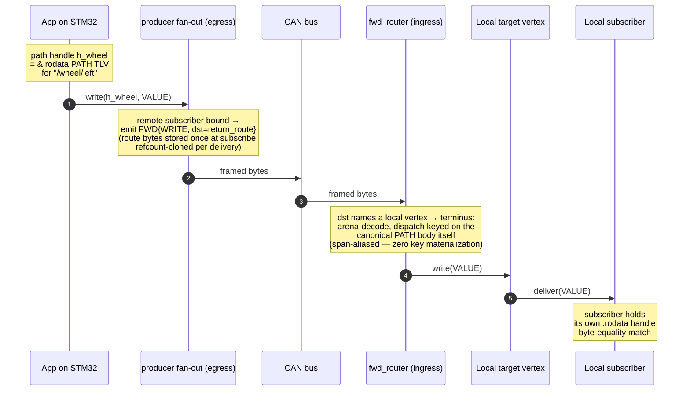

# Reference 07 — Host Graph Embedded in the Larger System

> **Status**: draft, v1, 2026-05-03. This section synthesizes [04-communication-flows.md](04-communication-flows.md) (multi-hop FWD forwarding) and [10-module-catalog.md](10-module-catalog.md) (forwarder, discovery) and is the canonical home for the per-host-DAG ↔ global-topology distinction.
> **Audience**: anyone designing a multi-host deployment; anyone implementing the forwarder logic.

---

## The load-bearing insight

> **Each host sees its slice of the network as a DAG; the global topology can be any graph, including cycles.**

Conforming implementations MUST handle this without livelocks or duplicate delivery, and they MUST do it transparently to application code. From the application's read/write API view, the local DAG IS the world; the forwarding layer is invisible.

The net plane is **explicit-source-routed `FWD` only** ([RFC-0004](../spec/rfcs/0004-remote-operation-addressing.md) / [ADR-0035](../adr/0035-implementing-rfc-0004-remote-operation-addressing.md)): a remote endpoint is addressed by its full path through **transport-vertices** ([ADR-0027](../adr/0027-transport-and-connections-are-vertices.md)) — connections are `/net/<conn>` vertices, and a `dst` route is consumed one segment per hop. The addressing model is [reference/13](13-network-formation.md) + [CONTEXT.md §Path-as-route](../../CONTEXT.md).

---

## Per-host view: a DAG of own vertices and transport-vertex links

A host's local graph consists of:

- **Own vertices**: created by application code on this host, or by modules that expose hardware as vertices (e.g., `transport_i2c` exposing peripherals as `/i2c-bus/0xNN/...`).
- **Transport-vertices**: one local vertex per connection (`/net/<conn>`), naming a link to a peer. A remote vertex is addressed *through* it by path-suffix: `/net/can0/wheel-encoder/left` routes over the `can0` link to the peer's `/wheel-encoder/left`.

Both kinds are **first-class**: they have schemas, settings, liveness state, an `:acl` field — everything described in [02-graph-model.md](02-graph-model.md). A read of `/net/can0/wheel-encoder/left:schema` uses the same API as a read of a local vertex; the path itself names the route the operation takes.

The local graph is a **DAG** because:

- Vertex paths are tree-shaped (`/a/b/c` is a child of `/a/b`).
- Subscriptions form edges from one vertex to another (a SUBSCRIBER's target path).
- Subscriptions can introduce structural cycles only if a subscriber writes back into a vertex it transitively listens to. This is application-level; the local graph data structure does not enforce DAG-ness on subscription edges. Cross-host loops are impossible by construction (see §loop safety).

```
Local graph on linux-node-1:

    /
    ├── self/
    │     └── name = "linux-node-1"
    ├── sensor/                     ← own vertices
    │     ├── temp
    │     └── humidity
    ├── log/
    │     └── output
    └── net/                        ← transport-vertices (one per connection)
          ├── can0/                 ← CAN link: /net/can0/<peer path>
          ├── esp32-front/          ← WS link:  /net/esp32-front/<peer path>
          └── stm32-wheel/          ← UDP link: /net/stm32-wheel/<peer path>
```

A consumer on this host runs `tracer_read("/net/esp32-front/camera/frame[7]")`: the operation rides an `FWD{READ}` over the `esp32-front` link, resolves on the peer, and the reply retraces the route. **The consumer's code looks identical** to a `tracer_read("/sensor/temp")` of a local vertex — same call, same result type; only the path is longer.

---

## Global topology: any shape including cycles

The union of all hosts' local DAGs is the **global topology**. The protocol places **no restrictions** on its shape:

- **Tree**: a star — one central monitor + leaf devices, each device linked once into the monitor.
- **Mesh**: every host linked to every other host, no central authority.
- **Ring**: A links to B links to C links to A. Cycle present.
- **Arbitrary multi-graph**: two hosts may hold two links to the same peer via different transports (e.g., CAN + IP). Both links are valid — and they are **two different explicit addresses** (`/net/can0/...` vs `/net/ws0/...`). A consumer that subscribes via both deliberately receives both deliveries; that is redundancy/failover, not duplication.

This is **deliberate**. Production deployments are messy:

- A robot fleet with redundant LAN + CAN links to survive a Wi-Fi blip.
- A mesh of edge devices with redundant explicit routes for fault tolerance.
- A research setup where data is recorded from two angles (a sniffer host + the production path).

The protocol does not require a spanning tree, a designated root, or a routing election. **It requires that every cross-host delivery names its route explicitly** — nothing floods, nothing is auto-multipath, so cycles in the link graph cannot cause storms.

---

## Loop safety (by construction)

Explicit source routes cannot loop. An `FWD` frame carries its remaining route in `dst`, and every hop **consumes** the leading `dst` segment — `dst` shrinks monotonically, so a frame traverses at most `len(dst)` hops and then terminates. A physical cycle in the topology is harmless per-op: a `dst` that spells one out (`/b/c/a/b/c/…`) routes around it exactly as many times as the route names, then stops. This is loop-freedom **by construction** — there is no revisit check, no visited-set, and no `ERROR` for a route that re-enters a node; the forwarder is stateless (see the dedup bullet below).

> **This protects each delivery, not a client that walks the topology.** A recursive walk that *discovers* links and follows them (a decentralized topology render, say) gets no help from the router — it will orbit a physical cycle forever unless it carries its own visited-set, keyed by a node identity it chooses (dedup is client-side; ADR-0044 pt 3). The wire-readable node-identity surface that makes that reliable is future work (RFC-0011).

Consequences:

- **No dedup state exists anywhere.** There is no recent-set, no origin/timestamp bookkeeping, no hop counter — a forwarder is stateless (see [04-communication-flows.md](04-communication-flows.md) §multi-hop FWD forwarding).
- **Redundant links are visible, not folded.** Two routes to the same producer are two subscriptions delivering independently; an `await` timeout on one route detects a dead link while the other keeps delivering. The failover signal is the pair of deliveries itself.
- **Replies are bounded the same way**: an `FWD{REPLY}`'s `dst` is the accumulated return route, consumed hop by hop; it does not grow `src`.

---

## Node identity

Each node has a **peer-id** (`peer_id_t`): a 128-bit UUIDv4 or device-derived identifier (e.g., MAC-address-based, factory-burned ID). Generation rules:

- **UUIDv4**: random 122 bits + version + variant. Default for Linux hosts.
- **Device-derived**: hash of MAC address + serial number + boot-time entropy. Used on MCUs without a stable RNG at first boot.
- **User-supplied**: explicit peer-id in the node config. Used in deployments where peer-id stability across reboots is required.

The peer-id MUST be stable across the lifetime of a node's installation (typically across reboots). Two nodes with identical peer-ids on the same network is a misconfiguration; discovery modules SHOULD emit `STATUS=ERROR(PATH_IN_USE)` (semantic stretch) on collision.

### Discovery modules announce peer-id

Discovery modules (`discovery_mdns`, `discovery_static`, `discovery_gossip`) emit `(peer_id, transport_label, transport_address)` tuples. A node consuming a discovery announcement may create a connection (a `/net/<conn>` transport-vertex — in-band, per [reference/13](13-network-formation.md)) based on:

- **Static config**: entries that name the peer-id explicitly.
- **Dynamic policy**: connect to all discovered peers automatically (default for `discovery_mdns`).
- **Filter**: connect only to peers matching a glob, advertising specific transports, or holding a capability token.

---

## "Every host is a router"

There is **no architectural distinction** between a leaf and a router. Any host with two or more transport children forwards `FWD` frames between them: a frame whose leading `dst` segment names a transport-child vertex is forwarded onward, one segment consumed per hop. The forward path is the same code on every host; a leaf is simply a host where `dst` empties.

A specialized **WAN router** is a host that runs:

- Multiple WAN-friendly transports (`transport_quic`, `transport_ws`).
- A discovery module to find peers.
- No application vertices — the host's job is purely to forward.

This is **convention**, not a separate node type in the protocol. Such a host conforms at profile P2 (per [00-overview.md](00-overview.md) §conformance profiles); the protocol does not single it out.

A future `router_wan` "module" (in the [10-module-catalog.md](10-module-catalog.md) catalog) may package up the typical WAN-router config (multiple transports + discovery + observability) for ergonomics, but it does not extend the protocol.

---

## Embedding examples

### RC car: 1 host, 1 transport, no forwarding

```
[ ESP32 RC car ]
  /motor/throttle
  /motor/steering
  /battery/voltage
  /self/...
  ↑
  └ transport_uart on USB-CDC ↔ host PC running tracer-cli
```

Local DAG = entire view. The host PC addresses the car's vertices through its one link (`/net/car/...`); the topology has no cycles to worry about. Conformance: P1 (single-transport leaf) on the ESP32, P1 on the PC.

### Robot with CAN bus + Wi-Fi

```
[ STM32 wheel encoder ]──CAN──┐
[ STM32 IMU            ]──CAN──┤
                                │  ┌────[ Linux brain ]───WiFi───[ ground station laptop ]
[ STM32 motor driver   ]──CAN──┴──┤
                                   └ /net/can0/wheel/...      (link to the CAN devices)
                                     /net/can0/imu/...
                                     /net/can0/motor/...
                                     /control/...              (own vertices)
```

The Linux brain holds two transport children: `transport_can` and a Wi-Fi socket transport. The ground station addresses the accelerometer as `/net/brain/net/can0/imu/accel` — the path **is** the route: over the `brain` link, then the brain's `can0` link, then the peer's `/imu/accel`. Each hop consumes one segment. Conformance: P1 on each STM32, P2 on the Linux brain, P2 on the laptop.

### Fleet of robots with central monitor (star)

```
[ robot 1 ]──TCP──┐
[ robot 2 ]──TCP──┼──[ monitor station ]
[ robot 3 ]──TCP──┤
[ robot 4 ]──TCP──┘
                    /net/robot-1/...
                    /net/robot-2/...
                    /net/robot-3/...
                    /net/robot-4/...

Monitor subscribes:
    write("/net/robot-1/**:subscribers[]", SUBSCRIBER{path="/local/recorder"})
```

A wildcard subscription per link aggregates everything from every robot into the monitor's recorder; each producer streams deliveries back along the consumer's accumulated return route. Conformance: P1 on each robot, P2 on the monitor.

### Forwarded delivery end-to-end

The full path of one remote delivery — emphasizing that **every dispatch step uses pre-encoded PATH bytes**, no string parsing happens on the hot path:



Step 5 is the key one: the terminus dispatch is keyed on **canonical PATH TLV bytes**, and a canonical `dst` PATH body in the arriving frame *is* that key — the vertex-map lookup runs over the frame's own bytes with no per-delivery materialization. This generalizes: any vertex that routinely receives or emits — every periodic publisher, every wildcard subscription's matched-set member — has a handle allocated at the time it becomes addressable, not at the time of each operation.

### Mesh of robots with no central node (cycles)

```
[ A ]───┬───[ B ]
   \    │      |
    \   │      |
     \  │      |
      \ │      |
       \│      |
       [ C ]───┘
```

A links to B and C; B links to A and C; C links to A and B. The link graph has a cycle — and no frame can orbit it: every delivery follows an explicit route a consumer named, and every route is consumed segment by segment. If B subscribes to a producer on A both directly (`/net/a/...`) and via C (`/net/c/net/a/...`), B receives **two** deliveries — two subscriptions it deliberately created, giving it link failover.

Conformance: P2 on each. The cycle is structurally fine; explicit source routing is what makes it operationally fine.

### WAN: edge sites linked via QUIC router

```
[ site A devices ]──LAN──[ A router (transport_quic + discovery_static) ]
                                      │
                                      │ QUIC (Internet)
                                      │
[ site B devices ]──LAN──[ B router ]─┘
```

Each router is a host with `transport_tcp` (LAN) + `transport_quic` (WAN). From site B's view, site A's devices are addressed under `/net/a-router/...`. Conformance: P2 on routers, P1 on devices.

---

## What this means for application code

### Path resolution is local

Every `tracer_read` / `tracer_write` / `tracer_await` call resolves against the **local** DAG using a **path handle** (per [03-addressing.md](03-addressing.md) §static path handles): a build-time `.rodata` PATH TLV literal or an init-time-registered handle, never a string parsed on the hot path. If the path's first segment names a transport-vertex, the forwarder routes the operation onward transparently. The application does NOT:

- Open a socket or choose a transport API for a write — the transport is named *in the path*.
- Know anything about the network beyond the routes it addresses.
- Use a different call for local vs remote (`read("/sensor/temp")` and `read("/net/can0/sensor/temp")` are the same API).

### Runtime vertex registration

A path handle does **not** have to be known at init. Registration is a normal
runtime operation: the graph holds its vertices in a map keyed on the canonical
PATH-payload bytes, and registering a new vertex returns a pinned handle that is
valid for the lifetime of the vertex. This is what lets a scanner register a
1-Wire / Modbus device, or a transport accept a hot-plugged CAN / Zigbee node,
**after** the device has booted — the discovered path is registered when the
device appears, and reads/writes use the returned handle thereafter. (In-band
`:children[]` creation, [ADR-0017](../adr/0017-in-band-vertex-creation-controller-orchestration.md),
is the wire-side form of the same operation.)

The contract:

- **Post-init / runtime**: registration is not init-only; it MAY be called at any
  time after startup.
- **Handle stability**: the returned handle stays valid across later
  registrations (the reference implementation stores each vertex behind a stable
  address, so growing the map never moves an existing vertex). Hold the handle;
  do not re-resolve per call.
- **Thread-safety**: registration takes the graph's writer lock and is safe to
  call concurrently with reads/writes/awaits on other handles. A read is
  lock-free on its own LKV slot; a write publishes to the slot lock-free and
  then takes a short per-vertex lock only for the write-sequence bump + waiter
  notify (a 0.4.0 optimization will skip it when no waiter is parked).
- **NOT ISR-safe**: registration acquires a mutex, so it must run from a task /
  thread context, never from an interrupt. Register on the discovery task, not in
  the bus ISR.
- **Capacity**: the protocol imposes no vertex-count cap; the map is bounded only
  by available memory. A constrained host MAY pre-size or cap it (e.g. a fixed
  arena) — that is a host policy, not a wire constraint. (A small numeric handle
  space, such as strawberry-fw's 511-slot `io_layer` handle, is likewise a host
  detail, not a libtracer limit — libtracer handles are pointers.)
- **Memory policy is the host's.** The reference forwarder (`fwd_router_t`) takes
  a defaulted `std::pmr::memory_resource*`: the terminus arena draws from it
  directly, and the library holds no internal buffer. A host that wants a
  zero-global-heap terminus injects a pool resource over its own slab; the
  default is the standard heap (a terminus may allocate).

### Failure surfaces locally

When a remote link fails (transport disconnect, peer crash, network partition):

- The transport-vertex writes a **link-state VALUE** (`0x00` = link-down) to its subscribers.
- This is the **same read/write/await API** as a local vertex going down (e.g., a sensor driver crashing — which may instead deliver a typed `STATUS=ERROR(<reason>)` in place of its VALUE).
- Application failover logic doesn't have to distinguish remote-vs-local; it reacts to the delivered writes on the paths it cares about.

### The "address space" is global; the API is local

An application written against libtracer thinks in **paths**, not in IP addresses or transport URIs. Whether `/sensor/wheel/left` is a local I²C sensor or `/net/can0/wheel/left` is a CAN-linked peripheral makes no difference to the read/write call — the path carries the route, and the API is one and the same. The protocol's job is to make that hold; the operator's job (via configuration or the in-band formation flow of [reference/13](13-network-formation.md)) is to wire up the links that realize the global topology.

This is the operational consequence of the third claim in [00-overview.md](00-overview.md): **forwarding is core**. Decentralization isn't an opt-in feature on top of a centralized core; it's the foundation, and a single-host node is the trivial case of it.
