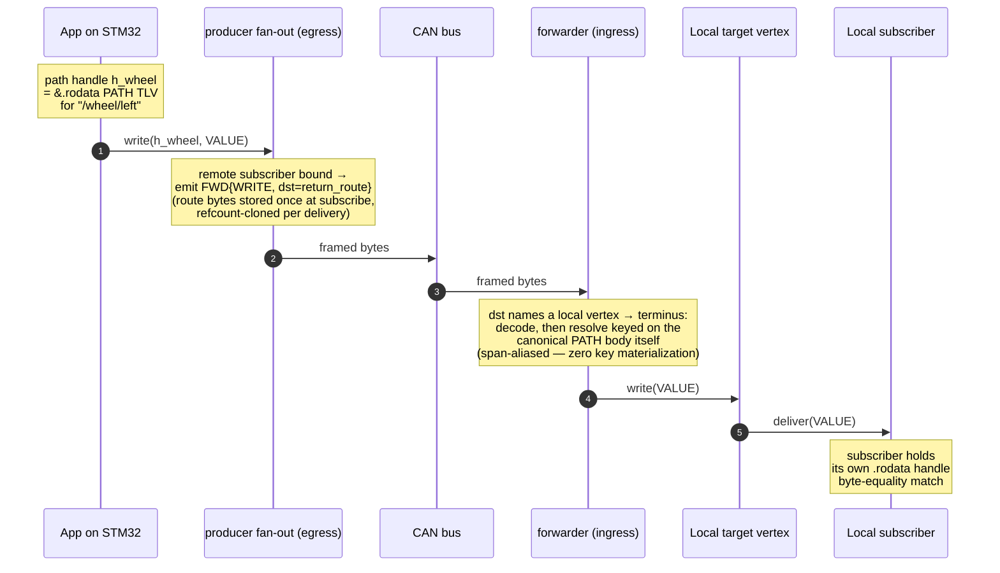

# Reference 07 — Host embedding

> **Audience**: anyone designing a multi-host deployment; anyone implementing forwarder logic.
> **Prerequisites**: [04-communication-flows.md](04-communication-flows.md) (multi-hop `FWD` forwarding), [10-module-catalog.md](10-module-catalog.md) (forwarder, discovery).

This section is the canonical home for the per-host-DAG ↔ global-topology distinction.

---

## The load-bearing insight

> **Each host sees its slice of the network as a DAG; the global topology can be any graph, including cycles.**

Conforming implementations MUST handle this without livelocks or duplicate delivery, and they MUST do it transparently to application code. From the application's read/write API view, the local DAG IS the world; the forwarding layer is invisible.

The net plane is **explicit-source-routed `FWD` only** ([RFC-0004 — Remote operation addressing](https://github.com/avatarsd-llc/libtracer/blob/main/docs/spec/rfcs/0004-remote-operation-addressing.md), [ADR-0035 — Implementing RFC-0004](https://github.com/avatarsd-llc/libtracer/blob/main/docs/adr/0035-implementing-rfc-0004-remote-operation-addressing.md), [ADR-0040 — The net plane is explicit-source-routed only](https://github.com/avatarsd-llc/libtracer/blob/main/docs/adr/0040-net-plane-is-explicit-source-routed-only.md)): a remote endpoint is addressed by its full path through **transport-vertices** ([ADR-0027 — Transports and connections are vertices](https://github.com/avatarsd-llc/libtracer/blob/main/docs/adr/0027-transport-and-connections-are-vertices.md)), and a `dst` route is consumed a whole mount run — `net/<module>/<name>[/<peer>]` — per hop, not one segment (RFC-0014 S2a). The addressing model is [13-network-formation.md](13-network-formation.md) plus [CONTEXT.md §Path-as-route](../../CONTEXT.md).

---

## Per-host view: own vertices and transport-vertex links

A host's local graph consists of:

- **Own vertices**: created by application code on this host, or by modules that expose hardware as vertices (a bus module exposing peripherals as `/i2c-bus/0xNN/…`).
- **Connection vertices**: one local vertex per connection, naming a link to a peer. A remote vertex is addressed *through* it by path-suffix, and the path itself names the route the operation takes.

A connection vertex is mounted — and routed — at **`/net/<module>/<name>`**: a module segment grouping the connections of one transport kind and role, then the connection's own name. The module segment is **declared by the application** with `register_module`, never derived by the library — an undeclared `(kind, role)` pair answers `SCHEMA_NOT_FOUND` ([ADR-0073](https://github.com/avatarsd-llc/libtracer/blob/main/docs/adr/0073-naming-authority-the-application-mints-one-predicate-gates.md) §4). Built-in transports ship a *suggested* name the application may pass (`kTcpClientSuggestedModule` and friends). So a CAN link named `can0` on a node that registered its CAN module as `can` is `/net/can/can0`, and the peer vertex `/wheel-encoder/left` behind it is `/net/can/can0/wheel-encoder/left` — a bus has no dial/listen asymmetry, so `can` is ONE module for both roles. The two-segment mount is what keeps a first-level local vertex from shadowing a connection of the same name. [RFC-0014 — Creator endpoint, connection lifecycle and link liveness](https://github.com/avatarsd-llc/libtracer/blob/main/docs/spec/rfcs/0014-creator-endpoint-connection-lifecycle-and-link-liveness.md) governs how the connection is created; [13-network-formation.md](13-network-formation.md) carries that flow. **The diagrams below abbreviate the mount to a single `<link>` label for legibility; the mount is always two segments.**

Both kinds of vertex are **first-class**: they have schemas, settings, link state, an `:acl` field — everything described in [02-graph-model.md](02-graph-model.md). A read of a remote vertex's `:schema` uses the same API as a read of a local vertex.

The local graph is a **DAG** because:

- Vertex paths are tree-shaped (`/a/b/c` is a child of `/a/b`).
- Subscriptions form edges from one vertex to another (a SUBSCRIBER's target path).
- Subscriptions can introduce structural cycles only if a subscriber writes back into a vertex it transitively listens to. That is application-level; the local graph does not enforce DAG-ness on subscription edges. Cross-host loops are impossible by construction (see §loop safety).

```
Local graph on linux-node-1:

    /
    ├── self/
    │     └── name = "linux-node-1"
    ├── sensor/                     ← own vertices
    │     ├── temp
    │     └── humidity
    ├── log/
    │     └── output
    └── net/                        ← connection vertices, one per link
          ├── can0/                 ← CAN link: /net/can0/<peer path>
          ├── esp32-front/          ← WS link:  /net/esp32-front/<peer path>
          └── stm32-wheel/          ← UDP link: /net/stm32-wheel/<peer path>
```

A consumer on this host reads `/net/esp32-front/camera/frame/7`: the operation rides an `FWD{READ}` over the `esp32-front` link, resolves on the peer, and the reply retraces the route. **The consumer's code is identical** to a read of the local `/sensor/temp` — same call, same result type; only the path is longer.

---

## Global topology: any shape, including cycles

The union of all hosts' local DAGs is the **global topology**. The protocol places **no restrictions** on its shape:

| Shape | Description |
| --- | --- |
| Tree | A star: one central monitor plus leaf devices, each device linked once into the monitor. |
| Mesh | Every host linked to every other host, no central authority. |
| Ring | A links to B links to C links to A. Cycle present. |
| Arbitrary multi-graph | Two hosts hold two links to the same peer over different transports (CAN and IP). Both links are valid, and they are **two different explicit addresses**. A consumer that subscribes via both deliberately receives both deliveries: redundancy and failover, not duplication. |

This is **deliberate**. Production deployments are messy: a robot fleet with redundant LAN and CAN links to survive a Wi-Fi blip; a mesh of edge devices with redundant explicit routes for fault tolerance; a research setup recording data from two angles, a sniffer host alongside the production path.

The protocol does not require a spanning tree, a designated root, or a routing election. **It requires that every cross-host delivery names its route explicitly** — nothing floods, nothing is auto-multipath, so cycles in the link graph cannot cause storms.

---

## Loop safety by explicit source routes

Explicit source routes cannot loop. An `FWD` frame carries its remaining route in `dst`, and every hop **consumes** the leading `dst` segment. `dst` shrinks monotonically, so a frame traverses at most `len(dst)` hops and then terminates. A physical cycle in the topology is harmless per-op: a `dst` that spells one out (`/b/c/a/b/c/…`) routes around it exactly as many times as the route names, then stops.

This is loop-freedom **by construction**. There is **no revisit check, no visited-set, and no error status for a route that re-enters a node** — a revisit is an ordinary hop, and the route's own finite length is the bound. A forwarder is stateless: no recent-set, no origin or timestamp bookkeeping, no hop counter (see [04-communication-flows.md](04-communication-flows.md) §multi-hop FWD forwarding, and the reserved `0x0D` ROUTER codepoint in [05-protocol-tlvs.md](05-protocol-tlvs.md)).

**This is a routing property and it is independent of the subscription-side rule.** Delivery **terminates at the target** ([RFC-0007 — Delivery terminates at target](https://github.com/avatarsd-llc/libtracer/blob/main/docs/spec/rfcs/0007-delivery-terminates-at-target.md), [ADR-0051 — Delivery terminates at target, no dispatch limits](https://github.com/avatarsd-llc/libtracer/blob/main/docs/adr/0051-delivery-terminates-at-target-no-dispatch-limits.md)): a delivery that lands on a target applies the target-local effects of a write and never re-fans from that target's own `:subscribers[]`. A dispatch-level subscription cycle therefore cannot form, and there is **no dispatch-depth cap** — the two rules bound two different things, and neither is a fallback for the other.

Consequences:

- **Redundant links are visible, not folded.** Two routes to the same producer are two subscriptions delivering independently; an `await` timeout on one route detects a dead link while the other keeps delivering. The failover signal is the pair of deliveries itself.
- **Replies are bounded the same way.** An `FWD{REPLY}`'s `dst` is the accumulated return route, consumed hop by hop; it does not grow `src`.
- **A client that walks the topology is not protected by any of this.** A recursive walk that *discovers* links and follows them — a decentralized topology render, say — gets no help from the router: it will orbit a physical cycle forever unless it carries its own visited-set, keyed by whatever node identity its deployment trusts. Deduplication across paths is client-side and is never core ([ADR-0044 — Transport-peer enumeration is stateless; matching device identities across paths is client-side](https://github.com/avatarsd-llc/libtracer/blob/main/docs/adr/0044-stateless-transport-peer-enumeration-separate-paths-client-side-identity.md) pt 3). The `:identity` facet below is the wire-readable key such a walk can use.

---

## Node identity

### The `:identity` facet

`<vertex>:identity` reads a node's public key ([RFC-0011 — Node identity facet](https://github.com/avatarsd-llc/libtracer/blob/main/docs/spec/rfcs/0011-node-identity-facet.md)). It is the one wire-readable identity surface v1 defines, and it is implemented.

| Property | Rule |
| --- | --- |
| Payload | `SETTINGS(PL=1){ NAME "kind" VALUE u8, NAME "key" VALUE <key> }` — the two members, in that fixed order. For `kind = 0x01` (ed25519, a 32-byte key) the whole record is 60 bytes. See [05-protocol-tlvs.md](05-protocol-tlvs.md) §`0x0B` — SETTINGS for the container's byte rules. |
| Kind registry | `0x00` is reserved-invalid. Every other kind fixes its key length, so a length contradicting the kind is a malformed record and never reaches the wire (`TYPE_MISMATCH`). Additions to the registry are RFC-gated. |
| Scope | **Node-scoped, not vertex-scoped.** The record takes no vertex: every vertex of a node serves byte-identical bytes. That byte-identity is what makes the record usable as a cross-path key. |
| Authorization | Resolved **above** the READ gate — a narrow exemption for this field alone. An unauthenticated peer must be able to obtain the public key in order to TOFU-pin it and to verify a challenge ([ADR-0045 — In-graph authentication, per-hop ed25519 TOFU/Noise](https://github.com/avatarsd-llc/libtracer/blob/main/docs/adr/0045-in-graph-authentication-per-hop-ed25519-tofu-noise.md)); gating it behind READ would deadlock first contact, because the default ACL ships closed. |
| Absent facet | A node with no keypair answers `SCHEMA_NOT_FOUND`, not an empty record. An empty record would fabricate an "identity exists but is vacant" state no consumer can act on. |
| Addressing | Served whole. The record has no member and no indexed surface, so any spelling other than bare `:identity` names nothing and answers `SCHEMA_NOT_FOUND` — caller-independently, exactly as an unknown field does. |

A topology walk that needs to recognize "the same node reached two ways" pins `:identity` on first contact and compares it thereafter. That is the client-side projection ADR-0044 pt 3 describes; nothing in the protocol performs the match.

### The peer-id surface is specified but unrealised

A 128-bit **peer-id** appears in the v1 material as the `origin_peer_id` of the `0x0D` ROUTER frame and as the origin half of the `(origin_peer_id, ts)` in-flight identity. **`0x0D` ROUTER is a reserved, decodable codepoint with no implemented mechanism** ([05-protocol-tlvs.md](05-protocol-tlvs.md) §`0x0D`): senders MUST NOT emit it, so **no v1 frame carries a peer-id**. Correspondingly, the protocol defines no peer-id generation rule, no persistence rule, and no announce path, and a second implementer building one would be building against nothing.

What *is* realised under that name is narrower and local: the CAN transport composes a 16-byte origin from the bus node-id purely as the grouping key of its own multi-frame reassembly ([14-can-transport.md](14-can-transport.md)). Both peers derive it identically from the same CAN id, so it is header-elided — never transmitted. It groups slices on one bus; it is not a network-wide node identity.

**Use `:identity` for node identity.** If a deployment additionally needs a short opaque node label, that is a deployment convention carried in application data, not a v1 wire field.

### Discovery

The module catalog reserves discovery modules (`discovery_static`, `discovery_mdns`, `discovery_gossip` in [10-module-catalog.md](10-module-catalog.md)); none is realised. Their scope is deliberately narrow: **IP-peer bootstrap only** — "what can I dial". Vertex and topology discovery is a different layer, and it is walking `:children[]` in-graph, which is real. Neither layer leaks into the other: dialing produces connection vertices; walking reads them (ADR-0044 §4).

A transport vertex holds **no** peer state and creates **no** vertices for peers. A read of its `:children[]` is synthesized from live announce and heartbeat traffic — a snapshot of who is audible at read time, not stored graph structure. This keeps every node O(its own links), never O(the network).

---

## Every host is a router

There is **no architectural distinction** between a leaf and a router. Any host with two or more connection vertices forwards `FWD` frames between them: a frame whose leading `dst` segments name a connection is forwarded onward, the whole mount run — `net/<module>/<name>[/<peer>]` — consumed per hop (RFC-0014 S2a). The forward path is the same code on every host; a leaf is simply a host where `dst` empties.

A specialized **WAN router** is a host that runs multiple WAN-friendly transports, a discovery module to find peers, and no application vertices — its job is purely to forward. This is **convention**, not a separate node type. Such a host conforms at profile P2 ([00-overview.md](00-overview.md) §conformance profiles); the protocol does not single it out. A `router_wan` module in the [10-module-catalog.md](10-module-catalog.md) catalog would package the typical configuration for ergonomics without extending the protocol.

---

## Embedding examples

### RC car: one host, one transport, no forwarding

```
[ ESP32 RC car ]
  /motor/throttle
  /motor/steering
  /battery/voltage
  /self/...
  ↑
  └ transport_uart on USB-CDC ↔ host PC running tracer-cli
```

Local DAG = entire view. The host PC addresses the car's vertices through its one link (`/net/uart/car/…`); the topology has no cycles. Conformance: P1 on the ESP32, P1 on the PC.

### Robot with CAN bus and Wi-Fi

```
[ STM32 wheel encoder ]──CAN──┐
[ STM32 IMU            ]──CAN──┤
                                │  ┌────[ Linux brain ]───WiFi───[ ground station laptop ]
[ STM32 motor driver   ]──CAN──┴──┤
                                   └ /net/can0/wheel/...      (link to the CAN devices)
                                     /net/can0/imu/...
                                     /net/can0/motor/...
                                     /control/...              (own vertices)
```

The Linux brain holds two connections: a CAN link and a Wi-Fi socket link. The ground station addresses the accelerometer as `/net/tcp/brain/net/can/can0/imu/accel` — the path **is** the route: over the `brain` link, then the brain's `can0` link, then the peer's `/imu/accel`. Each hop consumes the whole mount run that names its link — `net/<module>/<name>[/<peer>]` — not one segment (RFC-0014 S2a). Conformance: P1 on each STM32, P2 on the Linux brain, P2 on the laptop.

### Fleet of robots with a central monitor (star)

```
[ robot 1 ]──TCP──┐
[ robot 2 ]──TCP──┼──[ monitor station ]
[ robot 3 ]──TCP──┤
[ robot 4 ]──TCP──┘
                    /net/robot-1/...
                    /net/robot-2/...
                    /net/robot-3/...
                    /net/robot-4/...

Monitor subscribes:
    write("/net/tcp/robot-1:subscribers[]", SUBSCRIBER{path="/local/recorder"})
```

A subtree subscription per link ([RFC-0005](https://github.com/avatarsd-llc/libtracer/blob/main/docs/spec/rfcs/0005-subtree-subscriptions.md)) — subscribing to the connection vertex observes it and every descendant, so no pattern grammar is involved — aggregates everything from every robot into the monitor's recorder; each producer streams deliveries back along the consumer's accumulated return route. Conformance: P1 on each robot, P2 on the monitor.

### Forwarded delivery end to end

The full path of one remote delivery. **Every dispatch step uses pre-encoded PATH bytes**; no string parsing happens on the hot path.


```mermaid
sequenceDiagram
    autonumber
    participant App as App on STM32
    participant TxA as producer fan-out (egress)
    participant CAN as CAN bus
    participant RxB as forwarder (ingress)
    participant Vtx as Local target vertex
    participant Sub as Local subscriber

    Note over App: path handle h_wheel<br/>= &.rodata PATH TLV<br/>for "/wheel/left"
    App->>TxA: write(h_wheel, VALUE)
    Note over TxA: remote subscriber bound →<br/>emit FWD{WRITE, dst=return_route}<br/>(route bytes stored once at subscribe,<br/>refcount-cloned per delivery)
    TxA->>CAN: framed bytes
    CAN->>RxB: framed bytes
    Note over RxB: dst names a local vertex → terminus:<br/>decode, then resolve keyed on the<br/>canonical PATH body itself<br/>(span-aliased — zero key materialization)
    RxB->>Vtx: write(VALUE)
    Vtx->>Sub: deliver(VALUE)
    Note over Sub: subscriber holds<br/>its own .rodata handle<br/>byte-equality match
```

Step 5 is the load-bearing one: terminus resolution is keyed on **canonical PATH TLV bytes**, and a canonical `dst` PATH body in the arriving frame *is* that key — resolution walks the local tree one segment at a time against the frame's own bytes, with no per-delivery key materialization. Since [RFC-0018](https://github.com/avatarsd-llc/libtracer/blob/main/docs/spec/rfcs/0018-packed-path-segments.md) packed the body there is no non-canonical spelling to normalize — a segment record has no option byte and no type byte, so the alias is unconditional and the scratch-key fallback is gone. A body that does not tile into literal segment records (ragged framing, or an escape record in key context) is rejected with an invalid-path error rather than rewritten, because rewriting it would give two byte-different PATHs one address and break the injectivity [02-graph-model.md](02-graph-model.md) depends on.

This generalizes: any vertex that routinely receives or emits — every periodic publisher, every wildcard subscription's matched-set member — has a handle allocated at the time it becomes addressable, not at the time of each operation.

### Mesh of robots with no central node (cycles)

```
[ A ]───┬───[ B ]
   \    │      |
    \   │      |
     \  │      |
      \ │      |
       \│      |
       [ C ]───┘
```

A links to B and C; B links to A and C; C links to A and B. The link graph has a cycle — and no frame can orbit it: every delivery follows an explicit route a consumer named, and every route is consumed segment by segment. If B subscribes to a producer on A both directly (`/net/a/…`) and via C (`/net/c/net/a/…`), B receives **two** deliveries — two subscriptions it deliberately created, giving it link failover.

Conformance: P2 on each. The cycle is structurally fine; explicit source routing is what makes it operationally fine.

### WAN: edge sites linked by a QUIC router

```
[ site A devices ]──LAN──[ A router (QUIC + static discovery) ]
                                      │
                                      │ QUIC (Internet)
                                      │
[ site B devices ]──LAN──[ B router ]─┘
```

Each router is a host with a LAN transport and a WAN transport. From site B's view, site A's devices are addressed under `/net/a-router/…`. Conformance: P2 on routers, P1 on devices.

---

## Consequences for application code

### Path resolution is local

Every read, write and await resolves against the **local** DAG using a **path handle** ([03-addressing.md](03-addressing.md) §static path handles): a build-time `.rodata` PATH TLV literal or an init-time-registered handle, never a string parsed on the hot path. If the path's first segment names a connection, the forwarder routes the operation onward transparently. The application does not:

- Open a socket or choose a transport API for a write — the transport is named *in the path*.
- Know anything about the network beyond the routes it addresses.
- Use a different call for local versus remote. `read("/sensor/temp")` and `read("/net/can0/sensor/temp")` are the same call.

### Runtime vertex registration

A path handle does **not** have to be known at init. Registration is a normal runtime operation: registering a new vertex returns a handle valid for the lifetime of that vertex. This is what lets a scanner register a 1-Wire or Modbus device, or a transport accept a hot-plugged CAN or Zigbee node, **after** the node has booted — the discovered path is registered when the device appears, and reads and writes use the returned handle thereafter. In-band `:children[]` creation ([ADR-0017 — In-band vertex creation and controller orchestration](https://github.com/avatarsd-llc/libtracer/blob/main/docs/adr/0017-in-band-vertex-creation-controller-orchestration.md)) is the wire-side form of the same operation.

The contract:

- **Post-init.** Registration is not init-only; it MAY be called at any time after startup.
- **Handle stability.** A returned handle stays valid across later registrations: growing the vertex set never invalidates an existing handle. Hold the handle; do not re-resolve per call.
- **Thread-safety.** Registration is safe to call concurrently with reads, writes and awaits on other addresses. A **handle**-addressed read or write resolves without taking the graph's lock; a **path**-addressed call resolves the path under it. A write bumps the write sequence without a lock and takes a short **striped** lock only to wake parked waiters — and skips even that when no waiter is parked on its stripe. (Striping means several vertices share one mutex and one waiter counter, so an unrelated vertex's parked awaiter can cost this write one needless lock-and-notify; the wait predicate is still per-vertex, so a collision costs a spurious wake, never a wrong answer.) How much serialization the value slot itself costs is an implementation choice: see [15-concurrency-and-scaling.md](15-concurrency-and-scaling.md) §4 and, for this implementation's figures with their host and spread, [../design/concurrency/](../design/concurrency/README.md).
- **Registration is not ordered against a concurrent operation.** A path-addressed call issued while a registration is in flight either resolves the new vertex or answers `PATH_NOT_FOUND`; the protocol promises no ordering between the two and defines no "vertex appeared" notification. Code that must observe the vertex uses the handle registration returned, or retries the path.
- **Not interrupt-safe.** Registration takes a lock, so it must run from a task or thread context, never from an interrupt. Register on the discovery task, not in the bus ISR.
- **Capacity.** The protocol imposes no vertex-count cap; the set is bounded only by available memory. A constrained host MAY pre-size or cap it — that is host policy, not a wire constraint. A host that exposes a small fixed numeric handle space to its own application code is likewise describing a host limit, not a protocol one.
- **Allocation must be failable, not fatal.** Every allocation a **peer** can provoke — decode arenas, scatter-gather tables, route-label tables, delivery clones — MUST report exhaustion as a value (`BACKPRESSURE`, per [05-protocol-tlvs.md](05-protocol-tlvs.md) §`0x09` STATUS and the error registry) rather than aborting or unwinding. An implementation targeting a `-fno-exceptions` platform therefore needs a **failable allocation seam distinct from its ordinary one**: an allocator that signals failure by returning nothing, not by throwing ([ADR-0065 — Failable allocation gets its own seam: block source](https://github.com/avatarsd-llc/libtracer/blob/main/docs/adr/0065-failable-allocation-gets-its-own-seam-block-source.md)). Which seams exist in this implementation, and what a bounded node must inject into each, is [../design/allocation-and-backpressure.md](../design/allocation-and-backpressure.md); the memory model behind them is [09-memory-substrate.md](09-memory-substrate.md). ⚠️ *The reference implementation does not yet meet this MUST for two of the four categories named above*: the route-label tables allocate from a `std::pmr::memory_resource`, which reports exhaustion by throwing ([#603](https://github.com/avatarsd-llc/libtracer/issues/603)), and the CAN egress window vector grows with a throwing `push_back` on every send — both behind no ACL, which is the pitfall row below made concrete. The requirement stands; these are conformance gaps.

### Enumerating what is registered

A host that has to *walk* its own graph — an embedder rendering a tree, a diagnostic dump, a startup audit — uses the enumeration surface `graph_t::for_each_vertex(fn)`, which visits every **registered** vertex in ascending canonical-key byte order and hands `fn` the vertex's key plus its handle. Two properties matter and neither is obvious:

- **Unregistered intermediates are not visited.** A key created only as addressing scaffolding on the way to a deeper registration is not a vertex an owner declared, and `find` does not answer for it either.
- **Some registered vertices are still not application data.** The net plane's own position-holders (`/net`, `/net/<module>`) enumerate exactly like value vertices; ask `tr::net::transport_vertex_t::is_structural(key)` — the object that minted them — rather than inferring from the path shape. See [11-vertex-roles-and-aggregation.md](11-vertex-roles-and-aggregation.md) §structural vertices.

It is a **control-plane** surface: it snapshots and sorts the whole vertex set, so it belongs in setup, diagnostics and tooling, never on a delivery or write path.

### Failure surfaces locally

When a remote link fails — transport disconnect, peer crash, network partition:

- The connection vertex publishes a **link-state value**. Six states are defined: `DORMANT`, `DIALING`, `RECONNECTING` and `UP` for a DIAL link; `LISTENING` and `BIND_FAILED` for a LISTEN link, which report listen-socket reachability and never per-accepted-peer state. The value is an ordinary vertex value: readable, subscribable, and awaitable.
- The **liveness engine** that would drive those transitions automatically is RFC-0014 §S5 and is not realised; the value is set by the node that owns the link. A consumer therefore treats link state as advisory and uses an `await` timeout on the data path as the ground truth.
- This is the **same read/write/await API** as a local vertex going down — a sensor driver crashing may instead deliver a typed `STATUS=ERROR(<reason>)` in place of its value.
- Application failover logic does not have to distinguish remote from local; it reacts to the delivered writes on the paths it cares about.

### The address space is global; the API is local

An application thinks in **paths**, not in IP addresses or transport URIs. Whether `/sensor/wheel/left` is a local I²C sensor or `/net/can0/wheel/left` is a CAN-linked peripheral makes no difference to the call — the path carries the route, and the API is one and the same. The protocol's job is to make that hold; the operator's job, by configuration or by the in-band formation flow of [13-network-formation.md](13-network-formation.md), is to wire up the links that realize the global topology.

This is the operational consequence of the third claim in [00-overview.md](00-overview.md): **forwarding is core**. Decentralization is not an opt-in feature layered on a centralized core; it is the foundation, and a single-host node is the trivial case of it.

---

## Pitfalls

| Rule | The failure mode |
| --- | --- |
| Loop-freedom is route-length, not revisit detection. | An implementation that adds a visited-set or a hop counter "for safety" breaks a legitimate route that deliberately re-enters a node, and one that *relies* on such a check to bound subscription fan-out has protected the wrong plane — delivery termination at the target is what bounds that, and it is a separate rule. |
| A connection mounts at `/net/<module>/<name>`, two segments. | An implementation that mounts connections flat at `/net/<name>` lets a first-level local vertex named `can0` shadow the `can0` link, black-holing every `/net/can0/…` operation onto local state. |
| Two routes to one device are two addresses. | An implementation that folds them — deduplicating by some inferred device identity — destroys the failover signal that redundant explicit routes exist to provide. A consumer that sees one delivery instead of two cannot tell a healthy pair from a dead link. |
| Only `:identity` is a wire-readable node identity. | An implementation that builds against the 128-bit peer-id builds against a reserved codepoint no sender may emit; its "identity" is never on the wire and no peer will ever answer for it. |
| `:identity` resolves above the READ gate. | An implementation that gates it behind READ deadlocks first contact against any node whose default ACL is closed: the peer cannot obtain the key it needs in order to authenticate itself into being allowed to read the key. |
| `:identity` is node-scoped and served whole. | An implementation that varies the record per vertex, or that accepts `:identity[0]` or a member selector, breaks the byte-identity that makes the record usable as a cross-path key. Any spelling other than bare `:identity` is `SCHEMA_NOT_FOUND`, caller-independently. |
| A node with no keypair answers `SCHEMA_NOT_FOUND`. | An implementation that answers an empty record instead invents a state — "identity exists, but is vacant" — that no consumer can act on, and that a TOFU pin will happily store. |
| Registration is unordered against concurrent operations. | An implementation whose application code registers a vertex on one task and immediately resolves the path on another sees intermittent `PATH_NOT_FOUND`. There is no appearance notification; the handle returned by registration is the ordering. |
| Peer-provoked allocation reports exhaustion as a value. | An implementation that leaves one peer-driven allocation on a throwing allocator turns a remote peer's oversized frame into an `abort()` on a `-fno-exceptions` node — a remotely triggerable crash from a path behind no ACL. |
