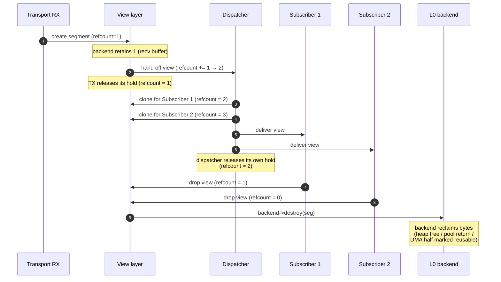

# Reference 08 — Views and Ownership (L1)

> **Status**: draft, v1, 2026-05-03. The view layer between raw memory ([09-memory-substrate.md](09-memory-substrate.md)) and the wire format ([01-data-format.md](01-data-format.md)). Specifies the canonical view struct, refcount semantics, rope structure, the TLV-as-cast operation, and the catalog of view-modules that integrate with specific I/O capabilities.
> **Audience**: anyone implementing the view layer; anyone integrating libtracer with a specific I/O subsystem (UART simple, UART DMA, lwIP, CAN, SHM); anyone reasoning about zero-copy semantics or rope traversal.

---

## What L1 is

L1 is the layer between **real memory** (L0) and **TLV bytes** (L2). It provides three things:

1. **A view struct** — a `(segment, offset, length)` triple naming a span of bytes inside a refcounted segment.
2. **Shared ownership** — refcounting on segments, so multiple views can outlive each other while keeping the underlying memory alive.
3. **Ropes** — chains of views, so a logical sequence of bytes can span multiple non-contiguous segments without copying.

A rope is **storage** composition, not meaning: it is the L1 axis of the *two orthogonal compositions* described in [02-graph-model.md §the two compositions](02-graph-model.md#the-two-compositions-storage-and-meaning) — a rope chains *bytes*, a structured TLV (L3) nests *meaning*, and the two are independent (a view boundary may fall mid-TLV-header).

The load-bearing claim of L1:

> **A TLV at L2 is a cast from an L1 view.**

Given a view whose bytes constitute a valid TLV, the L2 layer interprets the bytes in place. No copy. The TLV's payload is itself a view (or a sub-view, or a rope) into the same segment(s). Nested TLVs are views into the parent's bytes. The whole structure is one tree of views over one or more L0 segments.

This is what separates libtracer from middleware that decodes wire bytes into in-memory message structs. There is no decode step. There is the wire bytes IS the view IS the in-memory representation.

---

## The view struct

The view is deliberately POD-simple — one owning handle plus two sizes (reference
implementation: `tr::view::view_t`, [core/include/libtracer/view.hpp](../../core/include/libtracer/view.hpp)):

```cpp
namespace tr::view {

struct view_t {
    segment_ptr_t owner;    // owning handle to the refcounted L0 segment
    std::size_t   offset;   // bytes from the segment's base
    std::size_t   length;   // bytes covered
};

}
```

A **rope** is a separate composite type — an ordered chain of views (`rope_t`,
holding its links in a contiguous `std::vector<view_t>`) — not an intrusive
`next` pointer inside the view. A view is always exactly one window over one
segment; the rope composes several of them into one logical payload. Keeping
the chain out of the view keeps the single-link hot path allocation-free: a
plain `view_t` allocates nothing, and only a multi-link `rope_t` allocates
(one vector for the chain).

Invariants:

- `offset + length <= owner->bytes.size()`. A view never escapes its segment.
- **Copy IS clone.** Copying a view copies its `segment_ptr_t`, which bumps the
  segment refcount (relaxed) — never a byte copy.
- **Destruction IS release.** Ownership is RAII: when a view is destroyed or
  reassigned, its `segment_ptr_t` does the acq_rel decrement and invokes the
  backend's `destroy` at zero. There is no manual release call to forget.
- A view does not own any bytes — it borrows them via the segment refcount.

Sub-views are cheap: `subview(off, len)` produces a new view with the same `owner`
(refcount bumped), narrower offset/length. Useful for zero-copy slicing. A view
also knows whether its bytes are CPU-addressable (`is_host()` / `is_device()`) —
a DEVICE window (e.g. GPU memory, [ADR-0024](../adr/0024-mem-cuda-gpu-backend-heterogeneous-rope.md))
must not be dereferenced on the CPU.

---

## The segment struct (recap from L0)

```cpp
namespace tr::view {

struct segment_t {
    detail::ref_count       refcount;   // intrusive: inc relaxed, dec acq_rel
    tr::mem::mem_backend_t* backend;    // who reclaims these bytes
    std::span<std::byte>    bytes;      // the real bytes (data + capacity)
};

}
```

The view layer sees segments as nothing but a refcount, a backend pointer, and the byte span. Backend-specific state (lwIP `pbuf*`, DMA descriptor index, MMIO register table, etc.) lives behind the backend and is L0's concern; reclamation is `backend->destroy(seg)`, invoked by the owning handle (`segment_ptr_t`) when the count hits zero ([09-memory-substrate.md](09-memory-substrate.md) §the backend abstraction).

---

## Refcount semantics

The atomic memory orderings for the segment refcount are specified once in [02-graph-model.md](02-graph-model.md) §required atomic operations and recapped here for completeness:

| Operation | Order | Why |
| ---- | ---- | ---- |
| Increment (clone view) | `relaxed` | Caller already holds a reference; data dependency travels via that reference |
| Decrement (release view) | `acq_rel` | release: flush all writes before someone else observes count drop; acquire: if we observe drop to zero, sync with all prior releases |
| Read for inspection (debug/metrics) | `acquire` | Pairs with each decrement; gives consistent snapshot |
| Weak-to-strong upgrade (CAS loop) | `acq_rel` on success, `acquire` on failure | Same logic as inc + sync with last decrementer |

For Cortex-M0/M0+ (no LDREX/STREX) and bare-metal single-threaded contexts, the refcount can be a plain `uint32_t` under `LIBTRACER_NO_ATOMIC=ON`. The application must guarantee no cross-thread sharing of segments.

When a segment's refcount drops to zero, the owning handle invokes `backend->destroy(seg)`. Destruction returns the bytes to whichever L0 backend owns them.

---

## View and rope operations

The clone/release pair of a manual-refcount design is expressed as ordinary C++ value semantics; everything else is a small set of member operations ([core/include/libtracer/rope.hpp](../../core/include/libtracer/rope.hpp)):

### Clone — copy the view

Copying a `view_t` bumps its segment's refcount (relaxed) via the copied `segment_ptr_t`. Copying a `rope_t` copies its links — one bump per link's segment.

### Release — destroy the view

Destroying (or reassigning) a `view_t` does the acq_rel decrement; at zero, the segment's backend `destroy` fires. Destroying a rope releases every link. RAII: there is no leak-by-forgotten-release failure mode.

### `view_t::subview(sub_offset, sub_length) -> view_t`

A narrower window into the same segment: `offset + sub_offset`, length `sub_length`, refcount bumped. A view is single-segment by definition — slicing across segment boundaries is a rope-level concern (walk to the appropriate link first).

### `rope_t::append(view)` / `rope_t::concat(rope)` / `operator+`

Chain links onto the rope. Appending `rope2` extends the chain with all of `rope2`'s links, in order. **No bytes are copied** — assembly is chaining, never memcpy. A single `view_t` converts implicitly to a one-link rope.

### `rope_t::total_length() -> size_t`

Sums `length` over the links. O(N) in chain length.

### `rope_t::walk(fn)`

Visits each link's contiguous bytes in order. Used by parsers, serializers, and CRC accumulators.

### `rope_t::to_iovec() -> spans`

Scatter-gather egress: one span per link, pointing into the original segments (no copy). Hand the result to `writev` / `sendmsg`-style I/O for true zero-copy transmit.

### `rope_t::flatten(backend) -> view_t`

Materializes the rope into one contiguous segment allocated from `backend` — the **single bridge-boundary copy**, taken only when a flat-buffer consumer demands it. Fails (returns an empty view) if the backend cannot allocate or if the rope has a DEVICE link the CPU must not touch ([ADR-0024](../adr/0024-mem-cuda-gpu-backend-heterogeneous-rope.md)).

---

## Ropes: chains of views

A **rope** (`rope_t`) is an ordered chain of views representing a logical sequence of bytes that may span multiple segments. The chain lives in the rope, not in the views: each link is an ordinary `view_t`, and the rope holds them in order in one contiguous vector.

```
Logical TLV bytes:
   ┌───────────────────────────────────────────────────────┐
   │ header(4) │ payload byte 0..N-1                       │
   └───────────────────────────────────────────────────────┘

Underlying rope:
   ┌─────────┐    ┌──────────────────────┐    ┌───────────┐
   │ view A  │ →  │ view B               │ →  │ view C    │
   │ (4 B)   │    │ (first half payload) │    │ (second…) │
   │ → seg 1 │    │ → seg 2              │    │ → seg 3   │
   └─────────┘    └──────────────────────┘    └───────────┘
        │                  │                       │
        ▼                  ▼                       ▼
    static seg        DMA RX seg              MMIO seg
    (header bytes)    (payload first half)    (sensor reg)
```

**Properties of a rope:**

- The wire serialization of the rope is `seg1[off1..off1+len1] || seg2[off2..off2+len2] || ...` — concatenated bytes from each link.
- Each link's bytes are contiguous within their segment, but consecutive links may live in different segments.
- The proof obligation from [02-graph-model.md](02-graph-model.md) §spec-level proof obligation guarantees: any rope, when serialized, produces the same bytes as the equivalent flat buffer would.

**Use cases:**

- **MMIO + dynamic header**: a header in static memory plus a payload that points at an MMIO register. Rope makes this a single TLV without copy.
- **Multi-pbuf TCP receive**: lwIP delivers a 4 KiB TLV across three 1.5 KiB pbufs. The TLV is a 3-link rope.
- **Aggregated transmit**: a publisher composes a TLV from a static header buffer + a runtime payload buffer + a fixed tail buffer. Three segments, one rope, one TLV on the wire.
- **Forward hop**: the forwarder receives a `FWD` frame and sub-views the pieces that survive the hop — the `dst` tail after the stripped segment, the untouched payload region — off the original segment; every sub-view shares the inbound frame's segment via refcount, no bytes move.

**Walking a rope**: parsers and serializers use `rope_t::walk` or equivalent. The iterative TLV parser ([01-data-format.md](01-data-format.md) §iterative parsing requirement) treats a rope-cursor specially when traversing children: advancing the cursor across a link boundary is one extra branch in the iteration, but otherwise the parser logic is identical.

### Refcount fan-out and release sequence

The lifetime drawing for a single segment under fan-out:



The publisher and the transport never wait for subscribers; back-pressure surfaces as **the segment refcount staying high**, which the L0 backend observes when it tries to reuse the slot. This is the protocol's flow-control signal at the substrate layer.

---

## Casting a view to a TLV

Given a view whose bytes hold an L2 TLV, the cast decodes and **validates** it. Because it produces a `tlv_t`, the cast itself lives at L2 (`tr::wire`, not `tr::view`) — L1 never depends upward:

```cpp
std::expected<tlv_t, tr::wire::err_t> tlv = tr::wire::view_as_tlv(v);
```

`view_as_tlv(v)` is exactly `decode(v.bytes())`: it **validates** the framing (minimum size, reserved-bit and type-`0x00` rejects, the `LL` length width, trailer sizing, CRC verification, and the nesting-depth cap) and, on success, materializes an owning `tlv_t` tree. The decoded payload spans (and every child's) **borrow** `v`'s bytes, so the view — and thus its refcounted segment (§refcount) — must outlive the returned `tlv_t`. On malformed input it yields the `err_t` the grammar rejected with (`FRAME_TRUNCATED` / `FRAME_INVALID` / `FRAME_CRC_FAIL` / `TLV_NESTING_TOO_DEEP`).

There is **no** separate non-validating cast. The earlier draft's split — "the cast trusts the bytes; call `view_validate_as_tlv` first" — was dropped ([ADR-0048](../adr/0048-one-wire-grammar-chunk-cursor-rope-aware-decode.md) §4): the receive path always validates, and a non-validating lazy accessor had no consumer (the forwarder's hand-tuned offset peeks over already-validated framing are a net-plane optimization, not a public cast).

For a flat (single-link) view the decode reads `v.bytes()` directly. **Rope-aware** decode — casting a multi-link view without first flattening it, by reading the grammar through a chunk-cursor — is committed by [ADR-0048](../adr/0048-one-wire-grammar-chunk-cursor-rope-aware-decode.md) §1 but not yet implemented (the grammar core + span cursor have landed; the rope cursor has not); today a multi-link rope is `flatten()`ed to one contiguous view before the cast.

---

## Two parser contexts revisited

[01-data-format.md](01-data-format.md) §two parser contexts names the distinction; here is the mechanism:

### Context A: wire-receive

The parser sees a flat byte buffer (one segment) and walks byte offsets within it.

```c
const uint8_t *buf;
size_t         offset = 0;
size_t         end;
while (offset < end) {
    const tlv_t *t = (const tlv_t *)(buf + offset);
    size_t total = tlv_total_size(t);  // header + payload + trailer
    /* process t */
    offset += total;
}
```

Cursor advance is `offset += total`. No segment-boundary crossings; the buffer is one segment.

### Context B: in-memory walk (rope)

The parser sees a rope and steps across link boundaries (the rope owns the link order — `rope.links()` is the ordered chain):

```cpp
std::size_t link_idx = 0, in_link = 0;
while (link_idx < rope.link_count()) {
    const view_t& link  = rope.links()[link_idx];
    auto          bytes = link.bytes();
    while (in_link < bytes.size()) {
        const tlv_t* t     = view_as_tlv(link.subview(in_link, bytes.size() - in_link));
        std::size_t  total = tlv_total_size(t);
        if (in_link + total <= bytes.size()) {
            /* TLV fits in this link; process and advance within link */
            in_link += total;
        } else {
            /* TLV spans a link boundary; need a rope-aware cursor advance */
            rope_advance(rope, link_idx, in_link, total);
        }
    }
    ++link_idx;
    in_link = 0;
}
```

Implementations share the iterative pattern (recurse on `PL=1`, bound depth at 32) but specialize the cursor advance per context. Most TLVs in practice fit within one link, so the rope-aware path is rare and hot-path performance is dominated by the flat case.

---

## L1 module catalog

L1 is core (the view + refcount machinery) **plus** module-style integrations with specific I/O paths. The integrations expose the same uniform view API to L2+ but pair with specific L0 backends and handle their idioms.

### `view_basic` — week 1 MVP

- **Status**: ships in v1.
- **Pairs with**: any L0 backend that exposes contiguous segments (`mem_heap`, `mem_pool_*`, `mem_mmio`, `mem_dma_buffer`).
- **What it provides**: the canonical view/rope ops (clone-on-copy, RAII release, `subview`, rope `append`/`concat`/`walk`).
- **Footprint**: ~1 KB code.
- **When to use**: every host. The default integration.

### `view_pbuf` — week 3 / week 5 with lwIP transports

- **Status**: planned with `transport_tcp` over lwIP.
- **Pairs with**: `mem_lwip_pbuf`.
- **What it provides**: rope-aware wrap of lwIP pbuf chains. Each pbuf in a chain becomes one rope link; the rope's logical length equals the pbuf chain's `tot_len`.
- **Footprint**: ~600 bytes code on top of `view_basic`.
- **When to use**: lwIP-using hosts (ESP-IDF, mbed-OS, FreeRTOS+TCP).
- **Special semantics**: `release` walks the chain and calls `pbuf_free` exactly once per pbuf head; sub-views into individual pbufs share the chain's refcount via lwIP's own pbuf-ref mechanism.

### `view_iovec` — week 2 / week 5 for kernel-syscall transports

- **Status**: planned with the Linux `transport_tcp` epoll path.
- **Pairs with**: any backend; converts a rope to/from POSIX `struct iovec` arrays.
- **What it provides**:
  - rope → `iovec[]`: adapts `rope_t::to_iovec()`'s spans into an `iov[]` array so that `writev` / `sendmsg` emits the rope's bytes in one syscall.
  - `iovec[]` → rope: wraps an `iov[]` into a rope, with each element backed by an externally-owned segment (typical for `recvmsg`).
- **Footprint**: ~400 bytes.
- **When to use**: any time the underlying syscall accepts scatter-gather. Avoids one host-side copy per egress.

### `view_dma_descriptor` — week 6 with `transport_can` / SPI / I²S DMA

- **Status**: with the CAN demo.
- **Pairs with**: `mem_dma_buffer`.
- **What it provides**: wraps DMA scatter-gather descriptor lists as ropes. Cooperates with the DMA controller's scatter-gather engine when present (ESP32 GDMA, STM32 BDMA SG mode).
- **Special semantics**: cache-coherency hooks (`before_io` / `after_io`) fire automatically at view egress / ingress boundaries.

### `view_uart_simple` — pulled in by need

- **Status**: per-target.
- **Pairs with**: `mem_uart_rx_simple`.
- **What it provides**: a ring-buffer-style segment whose currently-valid bytes are exposed as a single contiguous view. Each completed-TLV detection produces a sub-view; the underlying ring's free space is reclaimed when all sub-views into the consumed range release.
- **Footprint**: ~300 bytes per peripheral.
- **When to use**: bare-metal MCU with UART-only I/O, no DMA available.

### `view_uart_dma` — pulled in by need

- **Status**: per-target.
- **Pairs with**: `mem_uart_rx_dma`.
- **What it provides**: same as `view_uart_simple` but with cache hooks and double-buffer / ping-pong semantics. Each DMA-half-complete IRQ produces a view over the just-filled half; framers detect TLV boundaries and emit sub-views.
- **When to use**: Cortex-M7-class MCU with UART + DMA.

### `view_can_frames` — week 6

- **Status**: with the CAN demo.
- **Pairs with**: `can_reassembly`.
- **What it provides**: per-peer reassembly buffer surfaced as a view once a complete TLV's frames have arrived. The reassembly pool is per-`(peer × inflight)`; on RX-frame, bytes accumulate; on completion, a view is handed off and the slot is reclaimed when the view releases.
- **Special semantics**: timeout reclamation if a reassembly never completes; emits `STATUS=ERROR(TIMEOUT)` at the transport ingress.

### `view_shm` — post-MVP with `transport_shm`

- **Status**: post-MVP.
- **Pairs with**: `mem_shared`.
- **What it provides**: views into shared-memory regions visible to multiple processes. Refcounting uses cross-process atomic primitives (futex on Linux, equivalents elsewhere).
- **When to use**: intra-host inter-process libtracer.

### `view_iceoryx2` — future

- **Status**: future, sketched.
- **Pairs with**: `mem_iceoryx2`.
- **What it provides**: views over iceoryx2 sample loans. The view's lifetime is tied to the sample loan; release returns the sample to the publisher's pool.

### `view_rdma` — aspirational

- **Status**: aspirational.
- **Pairs with**: `mem_rdma`.
- **What it provides**: views over RDMA-registered memory regions. Egress hands the view's iovec to libfabric / UCX for one-sided RDMA write; ingress wraps an incoming RDMA buffer.

---

## Module pairing

Some L0 backend / L1 module pairings are natural and standard:

| L0 backend | Natural L1 module |
| ---- | ---- |
| `mem_heap` | `view_basic` (and `view_iovec` for syscall paths) |
| `mem_pool_static` | `view_basic` |
| `mem_pool_class` | `view_basic` |
| `mem_lwip_pbuf` | `view_pbuf` |
| `mem_skbuff` | (kernel-only future) |
| `mem_dma_buffer` | `view_dma_descriptor` (or `view_basic` if no SG) |
| `mem_mmio` | `view_basic` (with permanent-refcount semantics) |
| `mem_shared` | `view_shm` |
| `mem_iceoryx2` | `view_iceoryx2` |
| `mem_rdma` | `view_rdma` |
| `mem_uart_rx_simple` | `view_uart_simple` |
| `mem_uart_rx_dma` | `view_uart_dma` |
| `can_reassembly` | `view_can_frames` |

A host loads only the pairings it needs. An RC-car build with one UART loads `mem_uart_rx_simple` + `view_uart_simple` plus a tiny `mem_pool_static` for outgoing TLVs. A gateway loads heap + pbuf + DMA + their corresponding view modules.

---

## Cross-substrate transitions

When a TLV crosses a substrate boundary (e.g., received over lwIP and forwarded to CAN), the L1 layer handles the transition. Two patterns:

### Pattern A: re-chain (zero-copy, when target is also rope-friendly)

If the target transport accepts iovec-style scatter-gather, the rope view is handed over as-is. Each segment retains its L0 backend; the target transport's egress walks the rope and emits per-link bytes through whatever its egress facility is.

Example: TLV received over lwIP (pbuf rope) forwarded to a Linux raw-socket transport that uses `sendmsg` — `rope.to_iovec()` produces the per-link spans (adapted to a `struct iovec[]`), the kernel does scatter-gather DMA, no userspace copy.

### Pattern B: materialize (single-copy, when target needs a flat buffer)

If the target transport needs a contiguous buffer (CAN with limited DMA descriptors, UART with byte-by-byte FIFO, a transport without iovec support), the transport egress materializes the rope into a flat segment in the target's substrate.

Example: TLV received over lwIP (pbuf rope) forwarded to CAN — the egress allocates a CAN-capable segment from `can_reassembly`'s TX pool, walks the pbuf rope, and copies bytes into the CAN segment. One copy at the transport boundary; no further copies during CAN egress.

The transition cost is **per cross-substrate hop**, not per fanout. Subscribers on the lwIP side still see zero-copy delivery; only the cross-substrate traffic pays.

---

## Worked examples

### A. GPIO MMIO register as a TLV vertex

Goal: expose `*(uint32_t *)0x40020010` (STM32F4 GPIOA IDR) as a libtracer vertex returning a `VALUE` TLV whose 4 payload bytes are the live register value. The shape (informative sketch, not a header dump):

```cpp
// 1. A permanent segment over the MMIO region. Its refcount is held forever by
//    a static descriptor; mem_mmio's destroy is a no-op (the "memory" is
//    hardware — see 09-memory-substrate.md §mem_mmio).
segment_ptr_t idr_seg = mmio_region(/*base=*/0x40020010, /*size=*/4);

// 2. A permanent segment over the 4 static TLV header bytes
//    (type=VALUE, opt=0, length=4 u16 LE): { 0x01, 0x00, 0x04, 0x00 }.
segment_ptr_t header_seg = static_const_region(header_bytes);

// 3. Chain a two-link rope: [header][live register]. No bytes copied.
rope_t tlv = rope_t{view_t::over(header_seg)} + view_t::over(idr_seg);

// 4. Register the rope as the read-handler for /gpio/A/IDR.
//    Each read returns a copy of the rope — a refcount bump on both segments.
//    The MMIO segment is read live every time (its bytes ARE the register).
tracer_register_read_only_vertex("/gpio/A/IDR", read_gpio_idr, tlv);
```

Result: every `tracer_read("/gpio/A/IDR")` returns a 2-link rope. The header bytes are static (refcount-permanent); the payload bytes are at the live register address. **Zero copy, ever.** A subscriber reading the TLV's payload bytes literally reads from `0x40020010`.

### B. TCP receive over lwIP, fanout to two subscribers

```
1. lwIP delivers pbuf (chain of 2 links, total 800 bytes) to libtracer netif callback.
2. mem_lwip_pbuf_wrap(pbuf) → segment_t with destroy=pbuf_free, refcount=1.
3. Framer parses TLV: 4-byte header + 796-byte payload, fits within pbuf chain.
   Constructs a 2-link rope view over the relevant pbuf links.
4. Router fans out to 2 subscribers:
     copy of the rope for sub 1  (refcounts on both pbufs += 1)
     copy of the rope for sub 2  (refcounts on both pbufs += 1)
5. Original rope is dropped (refcounts -= 1).
   Both pbufs now have refcount = 2 (one per subscriber).
6. Sub 1 consumes and releases. Refcounts → 1.
7. Sub 2 consumes and releases. Refcounts → 0.
8. lwIP's pbuf_free fires for each pbuf. Memory returned to pbuf pool.
```

No userspace copy from receive to delivery. The pbufs stay alive exactly as long as the slowest subscriber needs them.

### C. ADC DMA stream

```
1. ADC fills a 4 KiB DMA buffer (segment from mem_dma_buffer).
2. On DMA-half-complete: backend.after_io(seg, io_dir_t::DEVICE_TO_CPU) → cache invalidate.
3. Framer wraps the just-filled half as a view; emits address-shift slices
   ([06-user-data-packing.md] §streaming a high-speed ADC).
4. Each slice is a sub-view (offset, length) into the DMA segment.
   refcount += N (one per slice).
5. Subscribers consume slices; as each releases, refcount decrements.
6. When all slices in this half are consumed, refcount returns to baseline.
   The DMA half is reusable for the next fill.
```

The DMA buffer's refcount is the back-pressure signal: if subscribers are slow, refcount stays high, the next half-complete IRQ may find the previous half not yet released, and the framer either drops (per QoS) or stalls (per QoS). No copy at any point in the data path.

### D. CAN reassembly

```
1. CAN frame arrives with sequence-bit indicating "first" of a multi-frame TLV.
2. can_reassembly allocates a per-peer slot, copies first-frame payload.
3. Subsequent frames append (each is one HW DMA into the reassembly slot).
4. Last-frame bit: framer constructs a view over the completed reassembly slot.
5. View is dispatched to subscribers; refcount holds the slot.
6. When all subscribers release, the slot returns to the reassembly pool.
```

CAN's hardware framing forces one copy per frame into the reassembly slot; from there to the graph it's zero-copy via the view.

---

## End-to-end trace: ADC sample by DMA, fanned out over the network

This is the **acid test** for the zero-copy claim. A single ADC sample arrives via DMA and lands on a multicast subscriber's buffer with no intermediate copy of the sample bytes. Every layer is named.

### Setup

- **Hardware**: STM32 with ADC peripheral driving DMA into a 4 KiB ring buffer in main RAM. DMA is configured as double-buffered (half-complete IRQ + complete IRQ).
- **L0 backend**: `mem_dma_buffer` owns the 4 KiB ring as one persistent segment with two halves. The segment is preallocated at boot; `alloc()` is **never called** for this segment — it is an MMIO-shaped backend, with its `destroy()` recycling halves back to a half-pool.
- **L1 module**: `view_dma_descriptor` paired with `mem_dma_buffer`.
- **L2 codec**: `frame_codec` constructs a `USER_SAMPLE_RECORD` TLV (user-range type code `0x80`, `opt.PL=1`).
- **L4 vertex**: `/adc/raw` is a graph vertex with two subscribers — one local recorder, one multicast UDP subscriber.
- **Transport**: `transport_udp` configured for multicast on a LAN.

### Per-step trace

```
Step 1 — Hardware fills DMA buffer half A.
   The ADC peripheral writes samples directly into bytes [0..2047] of the
   ring. The CPU is not involved. No libtracer code runs.

Step 2 — DMA-half-complete IRQ fires.
   The ISR enters mem_dma_buffer.on_half_complete(half = A).

Step 3 — Cache invalidate (L0 → L1 hand-off).
   mem_dma_buffer calls after_io(seg = A, io_dir_t::DEVICE_TO_CPU).
   On a non-coherent SoC: invalidates cache lines covering [0..2047].
   On a coherent SoC: no-op.
   At this point, CPU reads of [0..2047] see the just-DMA'd bytes.

Step 4 — view_dma_descriptor creates a view (L1).
   view_t payload_v = {segment A, offset = 0, length = 2048}.
   This bumps segment_A.refcount from 1 (the static "DMA owns it" count)
   to 2. No copy.

Step 5 — Frame codec wraps as a TLV (L1 → L2).
   The header bytes (4 bytes for type=0x80, opt=PL|TS=1, length=2048) are
   constructed in a small heap segment H from a tiny header pool:
     view_t header_v = {segment H, offset = 0, length = 4}.
   The TLV-as-rope is:
     rope_t{header_v} + payload_v (+ optional trailer_v)
   This is a 2- or 3-link rope. No bulk-payload copy. The header's bytes
   are computed once into segment H; the payload's bytes are still in
   segment A's just-DMA'd half.

Step 6 — TLV registry recognizes the type code (L2 → L3).
   tlv_registry sees type=0x80 (user range) and opt.PL=1 — the TLV is
   structured. For dispatch purposes, the registry treats this as opaque:
   it is forwarded to the graph layer as the bytes-of-this-TLV.

Step 7 — Graph runtime dispatches to /adc/raw (L3 → L4).
   graph_runtime.dispatch(path = "/adc/raw", tlv = rope) looks up the
   vertex, finds two registered subscribers.

Step 8 — Dispatcher fans out to subscribers (L4).
   For each subscriber:
     - the dispatcher copies the rope. This bumps refcounts on every
       segment in the chain: segment_H.refcount++, segment_A.refcount++.
     - The subscriber's queue receives the rope copy.
   After fan-out, segment_A.refcount = 2 (DMA) + 1 (recorder) + 1 (UDP) = 4.

Step 9 — Local recorder consumes (subscriber 1).
   The recorder writes the rope's bytes to a memory-mapped log file via
   sendmsg-style scatter-gather (or by walking the rope and writev'ing).
   When done, the recorder drops its rope copy; RAII decrements every
   segment's refcount: segment_H.refcount--, segment_A--.
   segment_A.refcount = 3.

Step 10 — UDP transport consumes (subscriber 2).
   transport_udp.send_tlv(rope, peer = multicast_group):
     - It checks its capability flag wants_flat = false (UDP supports
       scatter-gather via writev).
     - It calls rope.to_iovec(), yielding one span per link (two here).
     - It calls the kernel's sendmsg() with that iovec.
     - The kernel's UDP stack constructs UDP/IP/Ethernet headers in
       its own buffer, then DMAs the headers + the iovec payload to the
       NIC. (Modern NICs scatter-gather natively; the iovec is preserved
       all the way down.)
     - sendmsg returns. transport_udp drops its rope copy.
   segment_H.refcount-- = 0  → header pool reclaims segment H.
   segment_A.refcount-- = 2.

Step 11 — DMA half A is reusable.
   segment_A.refcount = 2 = (DMA static) + (no live views).
   Wait — the static count means the segment never reaches 0. Instead,
   mem_dma_buffer's accounting tracks "live views beyond the static count."
   When that count drops to zero on segment_A, half A is marked reusable.
   The next ADC half-complete IRQ for half A finds it free and starts the
   cycle over.

Net data-path copies:    ZERO bytes copied for the 2 KiB sample payload.
Net allocations:         ONE small (4-byte) header segment from a fast
                         pool (recycled per-TLV in step 10's release).
NIC work:                The kernel constructs UDP/IP/Eth headers; the NIC
                         DMA-gathers from those + the libtracer iovec.
```

### Where copies WOULD have appeared (but don't)

- **Wire-format encoding step**: Naïve encoders allocate a contiguous output buffer and copy header + payload into it. Here, the rope avoids that — the iovec to the kernel walks the rope as-is.
- **Fan-out step**: A single-buffer scheme would have to copy or arena-share. Here, refcount cloning of the rope hands every subscriber the same view tree.
- **Transport egress**: A transport that demanded a contiguous buffer would force `rope_t::flatten()`, costing one copy. UDP's scatter-gather avoids this; CAN (which has its own framing model) is the case where flattening or per-frame splitting happens.

### When this breaks

- **Egress to a transport that doesn't support scatter-gather** (e.g., some embedded UART drivers): the forwarder calls `rope_t::flatten()` once at egress. One copy at the transport boundary, paid only on that path; subscribers on scatter-gather-capable paths still see zero copies.
- **Cross-process transport**: the SHM open-question (see below); the byte-flow leaves the publisher's address space and one copy is always paid.
- **Slow subscriber stalls the DMA cycle**: if subscribers don't release fast enough, the back-pressure manifests as `segment_A.refcount` not dropping; the next half-complete IRQ finds the half busy. Per QoS, this is either a drop or a stall. The data path itself is still zero-copy; the failure mode is throughput, not integrity.

This trace is the working specification for what "zero-copy" means in libtracer: the *bytes the application produced* (the ADC samples) are the *exact bytes the NIC sees*, with refcounted views threading them through every layer in between.

---

## Memory-binding contract — modular (resolved, [ADR-0012](https://github.com/avatarsd-llc/libtracer/blob/main/docs/adr/0012-modular-memory-binding-transparent-router.md))

These were the design's identified-but-unresolved hard integrations; they now resolve under one principle. **Memory binding is a modular spectrum, and libtracer is a transparent byte router** — it imposes no snapshot/copy/CRC semantics on a backend. Each entry below has a **recommended-safe** default, but a backend module MAY offer any point on the spectrum (snapshot · shadow vertex · live/raw direct-register, lock-free, no-CRC). The protocol does not limit the user from "dangerous" access; instead **each backend module owns and declares its per-architecture contract** — allocation, cache-coherency hooks, ISR-safety, atomicity granularity, memory ordering (x86 TSO vs weak ARM/MIPS), and `destroy` thread-affinity. CRC is an optional higher-layer concern ([01-data-format.md](01-data-format.md) `opt.CR`); a live/no-copy binding simply carries no CRC (or snapshots at CRC-compute time).

### Boost asio streambuf integration

A `boost::asio::streambuf` is a read-write buffer with **consume-on-read** semantics. A view pinning some of its bytes is in conflict with `streambuf::consume()`:

- **Wrap and pin** — modify or fork streambuf so consume waits on libtracer's view refcount.
- **Copy on import** — at the boost-asio↔libtracer boundary, copy bytes into a `mem_heap` segment. One copy per ingress.
- **Don't integrate** — leave the boost-asio↔libtracer boundary to user code; a copy-on-import shim is trivial to write against the public API.

**Default**: don't integrate in v1. Revisit if real demand surfaces. Documented in [10-module-catalog.md](10-module-catalog.md) §hard integrations.

### MMIO register-as-view: volatile bytes (modular)

A view over an MMIO register is a view onto bytes that change asynchronously. All three bindings ship — the user picks per backend:

- **Snapshot at view creation** (recommended-safe) — copy the register value into a small segment; stable bytes, any CRC consistent. Use for *publish-a-moment*.
- **Live view** — a `mem_mmio` segment pointing at the live register; the byte router stays transparent (no copy, typically no CRC). The backend declares its **atomicity granularity** (an aligned `u32` is torn-read-free on ARM/MIPS/x86; a multi-word register block is not) and MAY offer a **lock-free consistent read** (e.g. a seqlock: the reader retries on a writer version bump) for multi-word live data. ISR/SMP safety and any memory barriers are the backend's declared contract.
- **No-CRC raw** — a live binding with `opt.CR=0` is a pure transparent conduit; CRC over volatile bytes is meaningless, so a live binding either omits CRC or snapshots at compute time.

**Resolved**: ship all three. Snapshot is the recommended-safe default and *publish-a-moment* the recommended mental model, but live/raw/lock-free bindings are first-class for users who own the hazard ([ADR-0012](https://github.com/avatarsd-llc/libtracer/blob/main/docs/adr/0012-modular-memory-binding-transparent-router.md)).

### Cross-process refcount on `mem_shared`

A POSIX SHM region mapped into multiple processes has independent libtracer refcounts in each. They cannot decrement each other.

- **Single-publisher, multi-reader** — only the publisher owns the segment; readers' views are reaped by the publisher's heartbeat-GC. Acceptable for unidirectional pub/sub. **The publisher MUST NOT reclaim a segment until readers have observably released it, or a generation counter has invalidated stale views** — otherwise a reader mid-read races the reap. The grace/epoch is required, not optional.
- **Robust shared refcount** — atomic + robust mutex in the SHM region; every process participates. Complex.
- **Copy at process boundary** — each process treats the other's SHM as foreign; the boundary copies. No zero-copy across process.

**Default**: single-publisher, multi-reader. v1's `mem_shared` documents this constraint. Robust shared refcount lives in a future `mem_iceoryx2` module.

### lwIP pbuf: aliasing libtracer refcount with `pbuf_ref/pbuf_free`

Two libtracer subscribers cloning a `view_pbuf` over the same `pbuf*` create two libtracer-side refcount holds; lwIP-side, libtracer holds **one** `pbuf_ref` for the segment's lifetime. The risk is calling `pbuf_free` from a non-lwIP-thread context (e.g., from an interrupt, or from a view destroyed on another thread).

**Default**: a pbuf segment's `destroy` callback schedules `pbuf_free` via `tcpip_callback` (or equivalent), never frees synchronously from outside lwIP's thread context. Document explicitly.

### Rope walk vs flatten

A scatter-gather-capable transport walks the rope at egress (zero-copy). A flat-buffer-only transport must materialize via `rope_t::flatten()` (one copy).

**Default**: each transport declares `wants_flat` capability. Forwarders and fan-out walk the rope into scatter-gather transports; call `rope_t::flatten()` once at egress for flat-buffer transports.

### DMA cache coherency races

On non-coherent SoCs, the `before_io` / `after_io` hooks must be called at exactly the right moment. Missing them yields stale CPU reads or clobbered DMA writes.

**Default**: `mem_dma_buffer`'s ISR is the only place that calls `after_io`. Application code never calls these. Document the required interleaving in the backend's spec.

### Reference-to-a-value (live variable / register) (modular)

The "I want an endpoint backed by `&my_uint32` directly" pattern — both bindings are first-class:

- **Shadow vertex** (Option B, recommended) — the graph stores values; the publisher writes the value when the variable changes; subscribers read the shadow. Protocol-clean; no aliasing hazard.
- **Live view** (Option A) — a `mem_mmio`-style segment over the live address; the byte router stays transparent. A real binding, not merely a footgun helper: the backend declares its atomicity/ordering/ISR contract per [§MMIO register-as-view](#mmio-register-as-view-volatile-bytes-modular), and atomic/lock-free access is the backend's to provide. Exposed as `tracer_attach_register(&my_var)`.

**Resolved**: shadow vertex is the recommended-safe default; live binding is fully supported for users who own the hazard ([ADR-0012](https://github.com/avatarsd-llc/libtracer/blob/main/docs/adr/0012-modular-memory-binding-transparent-router.md)).

---

## What L1 does NOT specify

- The wire format that views are interpreted as — see [01-data-format.md](01-data-format.md).
- The graph-level meaning of a TLV at a vertex — see [02-graph-model.md](02-graph-model.md).
- Per-substrate allocation and destruction details — see [09-memory-substrate.md](09-memory-substrate.md).
- Transport-level framing (when bytes form a complete TLV) — see [10-module-catalog.md](10-module-catalog.md).
- Memory-pressure policy — see [09-memory-substrate.md](09-memory-substrate.md) §pressure and pool exhaustion.
