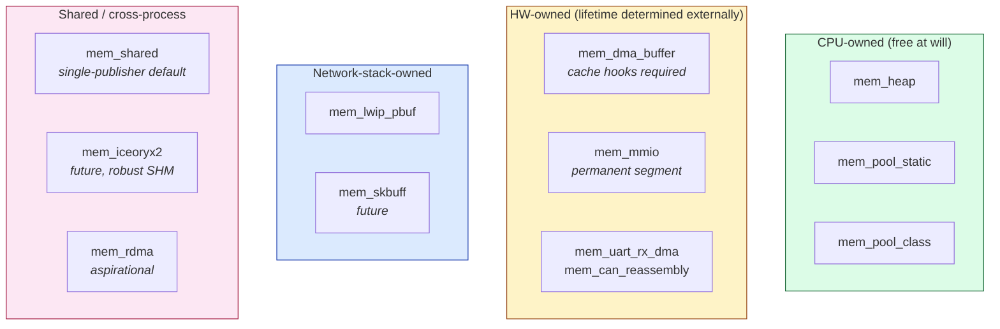

# Reference 09 — Memory Substrate (L0)

> **Status**: draft, v1, 2026-05-03. The memory layer beneath the wire format. Specifies the real-buffer / register / pool substrates that the view layer ([08-views-and-ownership.md](08-views-and-ownership.md)) refcounts and the TLV layer ([01-data-format.md](01-data-format.md)) is cast over.
> **Audience**: anyone implementing a memory backend for a new host or integrating libtracer with an existing buffer ecosystem (lwIP, Linux kernel skbuff, iceoryx2, RDMA-registered memory, peripheral DMA descriptors).

---

## What L0 is

L0 is the foundation: real bytes in real memory, owned by some real allocator with real lifetime rules. It is everything beneath the libtracer protocol — the buffer that holds TLV bytes, the register whose value the TLV represents, the pool that allocated the buffer, the queue that delivered it from a peripheral.

libtracer **does not allocate memory itself**. It receives memory from L0 backends, wraps it in refcounted views (L1, [08-views-and-ownership.md](08-views-and-ownership.md)), and interprets the bytes as TLV frames (L2, [01-data-format.md](01-data-format.md)). Every byte that flows through libtracer is owned at L0 by something more concrete than libtracer cares to know — and L0 is where that ownership story is honored.

This separation is what makes zero-copy real:

- A TLV constructed over a TCP receive buffer doesn't copy bytes out of the receive buffer — it just holds a view onto it, with the receive buffer's lifetime extended by the view's refcount.
- A TLV constructed over a memory-mapped GPIO register doesn't copy the register value — it just points the view at the register's address.
- A TLV split across a chain of lwIP `pbuf`s doesn't materialize the chain into one buffer — it holds a rope of views, each into one pbuf.

---

## Why a substrate layer

Real systems don't have one kind of memory. A robot fleet might run libtracer across:

- An ESP32 with `heap_caps` allocator and lwIP pbufs.
- An STM32 with a static pool, peripheral DMA buffers, and bare MMIO.
- A Linux gateway with `malloc`, `mmap`, and skbuffs.
- A future RDMA appliance with libfabric-registered pinned memory.

The L2 wire format is the same on all of them. The L1 view abstraction is the same. But the L0 memory substrate is wildly different. Cramming all these into one allocator strategy would either:

- Force the lowest common denominator (small fixed pool everywhere — wastes the host's capability), or
- Force every host to implement the most capable substrate (large RTOS-class memory infrastructure on a Cortex-M0 — impossible).

Splitting L0 into substrate **backends** (modules) lets each host pull only what it needs. A bare-metal STM32 with simple I/O pulls in the static-pool backend. A gateway pulls in heap + lwIP pbuf + skbuff backends. The protocol code above L1 sees the same view abstraction regardless.

---

## Categories of substrate

The substrates libtracer must integrate with fall into a few categories. This catalog informs the backend abstraction (next section) and the catalog of backends (the section after).

### Allocator-managed memory

Bytes live in heap or in a pool; allocation and free are explicit operations.

- `malloc` / `free` (host-class).
- jemalloc, tcmalloc (host-class with better fragmentation).
- ESP-IDF `heap_caps` (region-tagged: DRAM, IRAM, DMA-capable, SPI-RAM).
- FreeRTOS `pvPortMalloc` / `vPortFree`.
- Static-class pools (preallocated slabs by size class).
- Linux kernel `mempool` variants.

Lifetime: explicit. Ownership: whoever holds the pointer must eventually call the matching free.

### Network-stack buffers

Bytes arrive from the network and live in stack-managed buffers with their own lifetime conventions.

- lwIP `pbuf` — chain-of-buffer, refcounted, multiple types (`POOL`, `RAM`, `REF`, `ROM`).
- Linux `sk_buff` — kernel-only, refcounted, complex linkage.
- BSD `mbuf` — chain-of-buffer.
- ESP-IDF Wi-Fi RX queues — fixed-size frames, drained via callback.

Lifetime: stack-managed. Ownership: typically refcounted; the stack expects callers to release.

### Memory-mapped I/O

Bytes are at fixed addresses; "allocation" is meaningless because the memory was never allocated — it's hardware.

- GPIO data / set / clear registers.
- Peripheral SFRs (UART data registers, CAN mailboxes, I²C transfer FIFOs).
- Memory-mapped flash regions (read-only data sections).

Lifetime: permanent (until power-off). Ownership: hardware.

### DMA buffers

Bytes are in cache-coherency-aware regions where ownership oscillates between CPU and hardware.

- TX descriptors: CPU writes, then hands to hardware; hardware DMAs out, returns ownership.
- RX descriptors: hardware writes, then returns; CPU invalidates cache and reads.
- Cyclic DMA: two or more buffers ping-ponged between CPU and HW.

Lifetime: long-lived (allocated at init, reused). Ownership: oscillates between CPU and DMA controller.

### Shared memory

Bytes live in regions visible to multiple CPUs, processes, or cores.

- POSIX `shm_open` / `mmap`.
- System V shared memory.
- Multi-core shared SRAM on heterogeneous SoCs (RP2040 dual-core scratch SRAM, ESP32 dual-core DRAM).
- iceoryx2-managed segments.

Lifetime: explicit (created, mapped, eventually unmapped). Ownership: typically single-writer multi-reader by convention, sometimes refcounted.

### Hardware FIFOs

Bytes transit through peripheral hardware queues; the "buffer" is at fixed registers but its semantics are queue-like, not address-like.

- UART RX / TX FIFOs.
- CAN message mailboxes.
- I²C / SPI buffers.
- USB endpoint buffers.

Lifetime: continuous (data flows through, no stable identity per byte). Ownership: peripheral hardware.

### Substrate categories at a glance



All four families implement the same `mem_backend_t` interface ([§the backend abstraction](#the-backend-abstraction) below); the differences are in how they honor `destroy`, whether they need cache hooks, and what their per-segment lifetime story is.

---

## The backend abstraction

Each L0 substrate is wrapped behind a small C interface. The interface intentionally does NOT expose allocation as a first-class operation — many substrates can't allocate (MMIO, hardware FIFOs). It exposes:

```c
typedef struct mem_backend mem_backend_t;
typedef struct segment     segment_t;

typedef enum {
    IO_DIR_DEVICE_TO_CPU  = 1,   // CPU will read these bytes (after DMA-in completion)
    IO_DIR_CPU_TO_DEVICE = 2,   // CPU has written; HW will DMA-out
} io_dir_t;

struct mem_backend {
    const char *name;             // e.g. "mem_heap", "mem_lwip_pbuf"
    uint32_t    abi_version;

    // Optional: allocate a fresh segment, if the backend supports it.
    // Returns NULL if allocation is not supported (MMIO, hardware FIFOs).
    segment_t *(*alloc)(const mem_backend_t *self, size_t size, uint32_t hint);

    // Required: release one refcount on a segment.
    // The segment's destroy callback fires when refcount drops to zero.
    void (*release)(segment_t *seg);

    // Optional: prepare CPU-visible memory for a DMA transfer.
    //   IO_DIR_CPU_TO_DEVICE: clean cache so HW reads CPU's last writes.
    //   IO_DIR_DEVICE_TO_CPU:  invalidate cache so CPU reads HW's last writes.
    void (*prepare_for_io)(segment_t *seg, io_dir_t);
    void (*finalize_after_io)(segment_t *seg, io_dir_t);

    // Static limits.
    size_t (*max_segment_size)(const mem_backend_t *self);
    size_t (*alignment)(const mem_backend_t *self);
};
```

The `segment_t` struct carries the refcount and a pointer back to its backend:

```c
struct segment {
    atomic_uint_least32_t refcount;
    const mem_backend_t  *backend;
    void                 *base;          // pointer to the bytes
    size_t                size;          // capacity
    void                 (*destroy)(segment_t *);
    // backend-specific fields follow as a tail allocation
};
```

When a view's refcount drops to zero (L1 machinery, [08-views-and-ownership.md](08-views-and-ownership.md)), the view layer invokes `destroy(segment)`. The destroy implementation is **backend-specific**:

- heap-backend: `free(seg->base)`, then `free(seg)`.
- pool-backend: return slot to pool free list; `seg` itself is part of a static array.
- lwIP-backend: `pbuf_free(pbuf)`, then `free(seg)`.
- MMIO-backend: no-op (refcount is permanently held by a static segment descriptor).

L0 is ignorant of L1 view semantics; L1 is ignorant of how L0 honors `destroy`. The protocol's zero-copy story is the contract that they cooperate via this interface.

---

## Backend catalog

Each entry: status, what it wraps, allocation supported, footprint, when to use, when to avoid.

### `mem_heap` — week 1 MVP

- **Status**: ships in v1.
- **Wraps**: `malloc` / `free`.
- **Allocation**: yes.
- **Footprint**: ~200 bytes plus per-segment overhead.
- **When to use**: Linux / macOS hosts; ESP-IDF when `heap_caps` granularity isn't needed.
- **When to avoid**: tightly-bounded MCUs (use static pool); DMA-capable buffers (use `mem_dma`).

### `mem_pool_static` — week 1 MVP

- **Status**: ships in v1.
- **Wraps**: a single preallocated slab carved into fixed-size slots.
- **Allocation**: yes (from free list).
- **Footprint**: pool size + ~32 bytes per slot for header.
- **When to use**: bare-metal MCU; FreeRTOS without dynamic allocation; deterministic-latency targets.
- **When to avoid**: highly variable payload sizes (fragmentation in a single-class pool wastes memory; use `mem_pool_class`).

### `mem_pool_class` — week 2 likely

- **Status**: planned for v1.
- **Wraps**: multiple `mem_pool_static` instances at different size classes (e.g. 64, 256, 1024, 4096 bytes).
- **Allocation**: yes (chooses smallest class that fits).
- **Footprint**: sum of class pools.
- **When to use**: MCU with variable payload sizes; the universal MCU choice once it's available.

### `mem_lwip_pbuf` — week 3 / week 5

- **Status**: planned with the `transport_tcp` LAN demo.
- **Wraps**: lwIP `pbuf` chains. The segment_t holds a pointer to a pbuf head; `release` calls `pbuf_free`.
- **Allocation**: yes (`pbuf_alloc`).
- **Footprint**: dependent on lwIP's pool config; ~300 B code on top of lwIP itself.
- **When to use**: ESP-IDF and lwIP-using MCUs; the natural backend for `transport_tcp` and `transport_udp` on those targets.
- **When to avoid**: hosts not using lwIP.

### `mem_skbuff` — post-MVP

- **Status**: not in v1 (kernel-only; libtracer's MVP is userspace).
- **Wraps**: Linux kernel `sk_buff`. Used only if libtracer is ever built as a kernel module.
- **When to use**: a kernel-side libtracer ingestion path.

### `mem_dma_buffer` — week 6 with `transport_can`

- **Status**: planned with the CAN demo.
- **Wraps**: a statically-allocated buffer registered with the SoC's DMA controller. Adds cache-coherency hooks via `prepare_for_io` / `finalize_after_io`.
- **Allocation**: yes (from a small DMA-capable pool — `heap_caps_malloc(MALLOC_CAP_DMA)` on ESP32, manual-region on STM32).
- **Footprint**: ~600 bytes code plus pool size.
- **When to use**: peripheral I/O on Cortex-M7 / -M33 with cache; ESP32 SPI/I²S DMA flows; CAN with HW FIFO.
- **When to avoid**: Cortex-M0/M3 without cache (DMA buffers are just regular memory — `mem_pool_static` is enough).

### `mem_mmio` — week 1 / pulled in by need

- **Status**: ships in v1.
- **Wraps**: a static segment descriptor pointing at a fixed MMIO address. The `destroy` callback is a no-op; refcount is permanently held by an initial reference that's never released.
- **Allocation**: no.
- **Footprint**: ~40 bytes per registered region.
- **When to use**: exposing GPIO registers, peripheral SFRs, or memory-mapped flash as libtracer vertices ([06-user-data-packing.md](06-user-data-packing.md) §GPIO register example).

### `mem_shared` — post-MVP for `transport_shm`

- **Status**: post-MVP.
- **Wraps**: POSIX `shm_open` / `mmap` regions; on heterogeneous SoCs, multi-core shared SRAM.
- **Allocation**: yes (from the shm region's own free list).
- **When to use**: intra-host inter-process libtracer; `transport_shm` module's data plane.

### `mem_iceoryx2` — future

- **Status**: future, sketched.
- **Wraps**: iceoryx2 `Sample<T>` loans. The segment_t holds the loan; `release` returns the sample to the publisher.
- **When to use**: `transport_iceoryx2` future module; safety-cert intra-host zero-copy.
- **When to avoid**: any MCU target.

### `mem_rdma` — future

- **Status**: aspirational.
- **Wraps**: RDMA-registered pinned memory. Cooperates with libfabric or UCX for the data plane.
- **When to use**: HPC `transport_rdma` future module.

### `mem_uart_rx_simple`, `mem_uart_rx_dma` — pulled in by need

- **Status**: per-target.
- **Wraps**: a per-peripheral RX buffer.
- **Allocation**: no — the buffer is statically allocated and reused; what's "allocated" at L1 is a view-segment over the current valid bytes.
- **Footprint**: small (200-500 bytes code per peripheral).
- **When to use**: bytes-arrive-incrementally patterns (UART, I²C in master-receive mode, SPI slave). The simple variant is byte-by-byte ISR; the DMA variant uses cache hooks.

### `mem_can_reassembly` — week 6

- **Status**: with the CAN demo.
- **Wraps**: a small per-peer reassembly buffer that accumulates multi-frame CAN messages until a complete TLV is present.
- **Allocation**: from a dedicated pool sized for `(peers × inflight)` reassembly slots.
- **When to use**: `transport_can` module's RX path.

---

## Ownership at L0

Each backend is responsible for honoring **its own** ownership rules. libtracer's L1 refcount governs how long the segment **stays referenced**, but the actual destruction logic is L0's concern.

This decoupling has three consequences:

### 1. Lifetime extension is visible to L0

When a TLV is received over TCP into a lwIP pbuf, libtracer's L1 creates a view holding the pbuf segment with refcount=1. If the TLV is fanned out to N subscribers, refcount becomes N+1 (one for each subscriber, one for the original). The pbuf is **NOT freed** until all subscribers release their views. lwIP doesn't see the pbuf as "consumed"; the segment-refcount holds it alive.

This means the pbuf pool must be sized for the worst-case fan-out latency. A subscriber that holds views for too long applies pressure to the pbuf pool. This is one of the QoS knobs (`queue_max_bytes`).

### 2. Different substrates have incompatible lifetime models

Heap segments can be freed in any order. lwIP pbufs MUST be freed via `pbuf_free`. MMIO "segments" are never freed. Pool slots return to their specific pool. The `destroy` callback per backend handles this; the L1 machinery is uniform above it.

### 3. Cross-substrate moves require copies (sometimes)

If a TLV arrives via lwIP pbuf and is forwarded to a CAN transport, the CAN transport's egress can't directly DMA out of the pbuf (CAN's DMA expects a different region). The bridge layer materializes the rope of pbuf-views into a contiguous CAN-DMA buffer (one copy at the bridge boundary).

This is a **bridge-time** copy, not a per-fanout copy. Subscribers on the lwIP side still see zero-copy fanout; only the cross-substrate hop pays. See [02-graph-model.md](02-graph-model.md) §read-vs-write copy semantics for the per-transport copy table.

---

## I/O integration patterns

How L0 backends interact with the host's I/O paths.

### Polling RX (UART, I²C master-receive, SPI slave)

```
ISR or polling loop:
  byte arrives → write into mem_uart_rx_simple's static segment at offset cursor
  cursor++
  if (cursor matches a valid TLV tail by L2 framing rules):
      atomically promote: take a view over [tail-N..tail], hand to recv callback
      reset cursor (or wrap)
```

The L0 backend's job is just "manage the static segment and the cursor." The L1 view is constructed when the framer detects a complete TLV; the segment's refcount is bumped, the cursor advances. No copy.

### DMA RX (cache-coherent variant)

```
HW writes into mem_dma_buffer's preallocated segment (HW owns).
On DMA-complete IRQ:
  backend.finalize_after_io(seg, IO_DIR_DEVICE_TO_CPU)   // invalidates cache
  framer scans for TLV boundaries in seg
  for each complete TLV: create view, hand off
HW continues filling next segment (double-buffer or ring).
```

The cache-coherency hooks live in the backend; framers and L1 don't see them.

### lwIP RX

```
lwIP delivers a pbuf via netif input callback.
  segment_t *seg = mem_lwip_pbuf_wrap(pbuf);  // refcount=1, destroy=pbuf_free
  framer parses TLVs out of the pbuf chain (may be a rope across pbuf links)
  for each complete TLV:
      view = view_subview(seg, off, len)      // bumps seg refcount
      hand to recv callback
  release seg  // initial refcount; views hold their own
```

If the TLV spans multiple `pbuf` links (typical for large frames), the resulting view is a **rope** with one link per `pbuf` segment. See [08-views-and-ownership.md](08-views-and-ownership.md) §rope semantics.

### TX path mirror

```
Application creates TLV (a view tree, possibly a rope).
Transport sees an outgoing view tree; needs to emit bytes on the wire.
  for transport with iovec syscall (writev / sendmsg):
      backend extracts iovec from the view tree (zero-copy)
      kernel syscall does the per-iovec copy itself (one copy per element)
  for transport with single-buffer egress (CAN, simple UART):
      backend serializes the rope into a contiguous TX segment (one copy)
      TX segment is emitted byte-by-byte or via DMA
```

The view tree's structure determines whether egress is true zero-copy (iovec scatter-gather) or single-copy (rope flatten). The application doesn't choose this; the transport module does, based on the underlying I/O facility.

### Hardware-FIFO direct emit

```
Transport calls backend.alloc(size, hint=FIFO).
  → returns a pseudo-segment whose base is the FIFO's MMIO data register
  → writes to base[0] enqueue into the FIFO
TLV is serialized one byte at a time into the FIFO.
```

The "segment" is fictional — there's no real buffer — but the abstraction holds: an L0 backend says "writes to this address are how the bytes leave the host."

---

## Cache coherency

On Cortex-M7 / -M33 / Cortex-A class CPUs with data caches, DMA buffers need explicit cache management:

- **Before HW reads a CPU-written buffer** (TX): clean the cache so HW sees the writes. `prepare_for_io(seg, IO_DIR_CPU_TO_DEVICE)`.
- **Before CPU reads a HW-written buffer** (RX): invalidate the cache so CPU doesn't see stale lines. `finalize_after_io(seg, IO_DIR_DEVICE_TO_CPU)`.

The `mem_dma_buffer` backend implements these; the rest of libtracer (L1, L2+) doesn't see cache concerns.

Cortex-M0 / -M3 / -M4 without cache: the hooks are no-ops.

---

## Alignment

Each backend declares its alignment guarantee via `alignment()`. Typical values:

- `mem_heap`: 8 (host malloc usually).
- `mem_pool_static`: 4 or 8 (configurable per pool).
- `mem_dma_buffer`: 32 or 64 (typical DMA cache-line alignment).
- `mem_mmio`: declared per-region (a u32 register is 4-aligned; an 8-byte FIFO mailbox might be 8-aligned).
- `mem_lwip_pbuf`: 4 (lwIP's default).

L2 frame parsing tolerates unaligned access (per [01-data-format.md](01-data-format.md) §alignment), so this is informational rather than required. A higher-performance application that wants aligned access can request specific alignment when allocating; the backend may decline (return NULL) if it can't satisfy.

---

## What L0 does NOT specify

- The protocol's wire bytes — see [01-data-format.md](01-data-format.md).
- The view abstraction or refcount semantics — see [08-views-and-ownership.md](08-views-and-ownership.md).
- Allocation policy (which backend a given vertex uses, fallback strategy on pool exhaustion) — application or framework concern.
- Cross-substrate routing decisions — bridge layer concern.
- Garbage collection — there is none; lifetime is explicit per backend's destroy callback.

---

## Pressure and pool exhaustion

When a backend's allocation fails (heap returns NULL, pool is full):

- The transport module's recv path SHOULD drop the incoming TLV and emit `STATUS=ERROR(BACKPRESSURE)` to the source if a return path exists.
- A subscriber whose queue is full SHOULD apply the configured QoS policy: drop oldest, drop newest, or block (`:settings.queue_max_bytes` and `:settings.history_keep_last`).
- Backends MAY expose pool-utilization metrics via implementation-defined paths (e.g., `/_libtracer/mem/heap:utilization`); these are introspection conveniences, not protocol-level requirements.

The protocol does not mandate behavior under pressure; it specifies the **error reporting** (STATUS=BACKPRESSURE) and lets implementations choose the policy.
