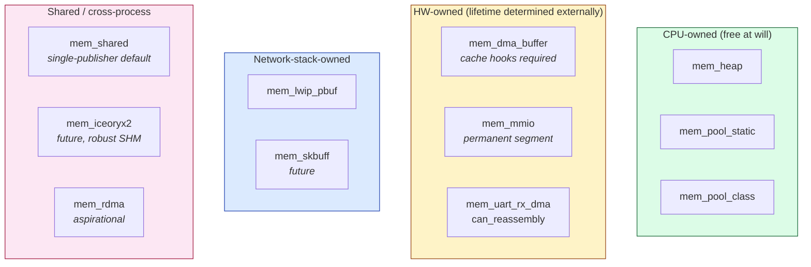

# Reference 09 — Memory substrate (L0)

> The memory layer beneath the wire format. Specifies the real-buffer / register / pool substrates that the view layer ([08-views-and-ownership.md](08-views-and-ownership.md)) refcounts and the TLV layer ([01-data-format.md](01-data-format.md)) is cast over.
> **Audience**: anyone implementing a memory backend for a new host or integrating libtracer with an existing buffer ecosystem (lwIP, Linux kernel skbuff, iceoryx2, RDMA-registered memory, peripheral DMA descriptors).

---

## What L0 is

L0 is the foundation: real bytes in real memory, owned by some real allocator with real lifetime rules. It is everything beneath the libtracer protocol — the buffer that holds TLV bytes, the register whose value the TLV represents, the pool that allocated the buffer, the queue that delivered it from a peripheral.

libtracer **does not allocate memory itself**. It receives memory from L0 backends, wraps it in refcounted views (L1, [08-views-and-ownership.md](08-views-and-ownership.md)), and interprets the bytes as TLV frames (L2, [01-data-format.md](01-data-format.md)). Every byte that flows through libtracer is owned at L0 by something more concrete than libtracer cares to know — and L0 is where that ownership story is honored.

This separation is what makes zero-copy real:

- A TLV constructed over a TCP receive buffer doesn't copy bytes out of the receive buffer — it just holds a view onto it, with the receive buffer's lifetime extended by the view's refcount.
- A TLV constructed over a memory-mapped GPIO register doesn't copy the register value — it just points the view at the register's address.
- A TLV split across a chain of lwIP `pbuf`s doesn't materialize the chain into one buffer — it holds a rope of views, each into one pbuf.

---

## Why a substrate layer

Real systems don't have one kind of memory. A robot fleet might run libtracer across:

- An ESP32 with `heap_caps` allocator and lwIP pbufs.
- An STM32 with a static pool, peripheral DMA buffers, and bare MMIO.
- A Linux gateway with `malloc`, `mmap`, and skbuffs.
- A future RDMA appliance with libfabric-registered pinned memory.

The L2 wire format is the same on all of them. The L1 view abstraction is the same. But the L0 memory substrate is wildly different. Cramming all these into one allocator strategy would either:

- Force the lowest common denominator (small fixed pool everywhere — wastes the host's capability), or
- Force every host to implement the most capable substrate (large RTOS-class memory infrastructure on a Cortex-M0 — impossible).

Splitting L0 into substrate **backends** (modules) lets each host pull only what it needs. A bare-metal STM32 with simple I/O pulls in the static-pool backend. A gateway pulls in heap + lwIP pbuf + skbuff backends. The protocol code above L1 sees the same view abstraction regardless.

---

## Categories of substrate

The substrates libtracer must integrate with fall into a few categories. This catalog informs the backend abstraction (next section) and the catalog of backends (the section after).

### Allocator-managed memory

Bytes live in heap or in a pool; allocation and free are explicit operations.

- `malloc` / `free` (host-class).
- jemalloc, tcmalloc (host-class with better fragmentation).
- ESP-IDF `heap_caps` (region-tagged: DRAM, IRAM, DMA-capable, SPI-RAM).
- FreeRTOS `pvPortMalloc` / `vPortFree`.
- Static-class pools (preallocated slabs by size class).
- Linux kernel `mempool` variants.

Lifetime: explicit. Ownership: whoever holds the pointer must eventually call the matching free.

### Network-stack buffers

Bytes arrive from the network and live in stack-managed buffers with their own lifetime conventions.

- lwIP `pbuf` — chain-of-buffer, refcounted, multiple types (`POOL`, `RAM`, `REF`, `ROM`).
- Linux `sk_buff` — kernel-only, refcounted, complex linkage.
- BSD `mbuf` — chain-of-buffer.
- ESP-IDF Wi-Fi RX queues — fixed-size frames, drained via callback.

Lifetime: stack-managed. Ownership: typically refcounted; the stack expects callers to release.

### Memory-mapped I/O

Bytes are at fixed addresses; "allocation" is meaningless because the memory was never allocated — it's hardware.

- GPIO data / set / clear registers.
- Peripheral SFRs (UART data registers, CAN mailboxes, I²C transfer FIFOs).
- Memory-mapped flash regions (read-only data sections).

Lifetime: permanent (until power-off). Ownership: hardware.

### DMA buffers

Bytes are in cache-coherency-aware regions where ownership oscillates between CPU and hardware.

- TX descriptors: CPU writes, then hands to hardware; hardware DMAs out, returns ownership.
- RX descriptors: hardware writes, then returns; CPU invalidates cache and reads.
- Cyclic DMA: two or more buffers ping-ponged between CPU and HW.

Lifetime: long-lived (allocated at init, reused). Ownership: oscillates between CPU and DMA controller.

### Shared memory

Bytes live in regions visible to multiple CPUs, processes, or cores.

- POSIX `shm_open` / `mmap`.
- System V shared memory.
- Multi-core shared SRAM on heterogeneous SoCs (RP2040 dual-core scratch SRAM, ESP32 dual-core DRAM).
- iceoryx2-managed segments.

Lifetime: explicit (created, mapped, eventually unmapped). Ownership: typically single-writer multi-reader by convention, sometimes refcounted.

### Hardware FIFOs

Bytes transit through peripheral hardware queues; the "buffer" is at fixed registers but its semantics are queue-like, not address-like.

- UART RX / TX FIFOs.
- CAN message mailboxes.
- I²C / SPI buffers.
- USB endpoint buffers.

Lifetime: continuous (data flows through, no stable identity per byte). Ownership: peripheral hardware.

### Substrate categories at a glance


```mermaid
flowchart TB
    subgraph CPU_OWNED["CPU-owned (free at will)"]
        A1[mem_heap]
        A2[mem_pool_static]
        A3[mem_pool_class]
    end
    subgraph HW_OWNED["HW-owned (lifetime determined externally)"]
        B1[mem_dma_buffer<br/><i>cache hooks required</i>]
        B2[mem_mmio<br/><i>permanent segment</i>]
        B3[mem_uart_rx_dma<br/>can_reassembly]
    end
    subgraph STACK_OWNED["Network-stack-owned"]
        C1[mem_lwip_pbuf]
        C2[mem_skbuff<br/><i>future</i>]
    end
    subgraph SHARED["Shared / cross-process"]
        D1[mem_shared<br/><i>single-publisher default</i>]
        D2[mem_iceoryx2<br/><i>future, robust SHM</i>]
        D3[mem_rdma<br/><i>aspirational</i>]
    end
    style CPU_OWNED fill:#dcfce7,stroke:#166534
    style HW_OWNED fill:#fef3c7,stroke:#92400e
    style STACK_OWNED fill:#dbeafe,stroke:#1e40af
    style SHARED fill:#fce7f3,stroke:#9f1239
```

All four families implement the same `tr::mem::mem_backend_t` interface ([§the backend abstraction](#the-backend-abstraction) below); the differences are in how they honor `destroy`, whether they need cache hooks, and what their per-segment lifetime story is.

---

## The backend abstraction

Each L0 substrate is wrapped behind a small seam. The reference implementation expresses it as a C++23 base class — `tr::mem::mem_backend_t` — that a backend subclasses; this is the **reference implementation's** seam, not a normative cross-language ABI (implementations interoperate over the wire, never via a shared ABI — [ADR-0013](https://github.com/avatarsd-llc/libtracer/blob/main/docs/adr/0013-v1-scope-boundaries.md)). The seam intentionally does NOT make allocation mandatory — many substrates can't allocate (MMIO, hardware FIFOs):

```cpp
namespace tr::mem {

// Direction of a DMA / cache-coherency transfer. The hook METHOD carries the
// timing; this enum carries only the DIRECTION; the backend maps the pair.
enum class io_dir_t : std::uint8_t {
    DEVICE_TO_CPU = 1,   // CPU will read bytes a device just wrote (invalidate)
    CPU_TO_DEVICE = 2,   // a device will read bytes the CPU just wrote (clean)
};

// An OPAQUE, backend-private allocation hint (a strong typedef). Its meaning is
// defined by — and private to — the backend that interprets it; there is NO
// cross-backend hint vocabulary or registry. A backend that ignores hints MUST
// accept any value. This is the anti-bloat fence.
enum class alloc_hint_t : std::uint32_t { NONE = 0 };

// The L0 substrate seam. Subclass to bind libtracer to any allocator — a heap,
// a fixed caller-owned arena, live registers, lwIP pbufs, DMA descriptors.
class mem_backend_t {
   public:
    explicit mem_backend_t(const char* name) noexcept;
    virtual ~mem_backend_t() = default;

    // Allocate a fresh segment of at least `size` bytes (refcount = 1, for the
    // caller to adopt). Returns nullptr on backpressure / OOM / unsupported
    // (MMIO, hardware FIFOs). Note the return is a raw segment_t*, NOT a
    // segment_ptr_t: if alloc returned the L1 owning handle, tr::mem would
    // depend on tr::view (an upward layering violation). The caller adopts it
    // via tr::view::segment_ptr_t::adopt(seg).
    [[nodiscard]] virtual tr::view::segment_t* alloc(
        std::size_t size, alloc_hint_t hint = alloc_hint_t::NONE) {
        return nullptr;
    }

    // Reclaim a segment whose refcount has reached zero — the ONLY reclaim
    // hook. There is NO release() method: the L1 owning handle (segment_ptr_t)
    // does the acq_rel refcount decrement in its destructor/reset and calls
    // backend->destroy(seg) only when the count hits zero. Never called on a
    // live segment.
    virtual void destroy(tr::view::segment_t* seg) noexcept = 0;

    // Optional cache-coherency hooks for non-coherent DMA paths. `before_io`
    // preps the cache before the buffer is handed to a transfer; `after_io`
    // reconciles the cache after the transfer completes. No-ops by default and
    // on cacheless cores (Cortex-M0/M3/M4); only DMA-class backends override.
    virtual void before_io(tr::view::segment_t* seg, io_dir_t dir) noexcept {}
    virtual void after_io (tr::view::segment_t* seg, io_dir_t dir) noexcept {}

    [[nodiscard]] virtual std::size_t alignment()        const noexcept;
    [[nodiscard]] virtual std::size_t max_segment_size() const noexcept;

    [[nodiscard]] const char* name() const noexcept;
};

}  // namespace tr::mem
```

The `tr::view::segment_t` carries the refcount and a pointer back to its backend. It is an L1 (`tr::view`) type — not an L0 (`tr::mem`) one — precisely *because* it carries the refcount, the L1 ownership concern:

```cpp
namespace tr::view {

struct segment_t {
    detail::ref_count_t     refcount;  // intrusive: inc relaxed, dec acq_rel
    tr::mem::mem_backend_t* backend;   // who reclaims these bytes
    std::span<std::byte>    bytes;     // the real bytes (data + capacity)
    tr::mem::mem_space_t    space;     // HOST or DEVICE, inherited from the backend
};

}  // namespace tr::view
```

When a segment's refcount drops to zero (L1 machinery, [08-views-and-ownership.md](08-views-and-ownership.md): the `segment_ptr_t` owning handle's destructor/reset does the acq_rel decrement), the handle invokes `backend->destroy(seg)`. The `destroy` override is **backend-specific**:

- heap-backend: `free` the bytes, then the segment control block.
- pool-backend: return the slot to the pool free list; the segment is part of a static array.
- lwIP-backend: `pbuf_free(pbuf)`, then the segment block.
- MMIO-backend: no-op (refcount is permanently held by a static segment descriptor).
- borrowed-backend: reclaim only the control block; the caller's bytes are never touched.

L0 is ignorant of L1 view semantics; L1 is ignorant of how L0 honors `destroy`. The protocol's zero-copy story is the contract that they cooperate via this seam.

### The second L0 seam: `block_source_t` (failable blocks)

`mem_backend_t` vends **refcounted `segment_t`s** — the right shape for payload bytes that many views share. The other shape is the **failable** one: the objects a node builds when it *registers* something (a vertex, a route label, a reassembly entry) have exactly **one owner** and no header, so a refcount on them is pure overhead. They are served by a second, deliberately smaller seam:

```cpp
namespace tr::mem {

// The nothrow failable-block seam. Raw bytes, single owner, no refcount.
class block_source_t {
   public:
    explicit constexpr block_source_t(const char* name) noexcept;
    virtual ~block_source_t() = default;

    // Storage for `bytes`, aligned to at least `align` — NOTHROW.
    // nullptr means exhaustion. It never falls back to the global heap and
    // never aborts; WHICH reject the caller answers is the caller's, and
    // follows the operation (see the consumers below).
    [[nodiscard]] virtual void* try_alloc(std::size_t bytes, std::size_t align) noexcept = 0;

    // Sized reclaim: `bytes`/`align` MUST match the try_alloc that served the
    // block, so a bump or pool source needs no per-block header.
    virtual void release(void* p, std::size_t bytes, std::size_t align) noexcept = 0;

    [[nodiscard]] const char* name() const noexcept;
};

// The process-wide default: the platform heap, nothrow.
[[nodiscard]] block_source_t& heap_source() noexcept;

}  // namespace tr::mem
```

Why it is a distinct type rather than a `std::pmr::memory_resource` with a documented "may return null" contract — the question is not stylistic, and the answer is checkable. `memory_resource::allocate` is annotated `__attribute__((__returns_nonnull__))` in libstdc++, so a caller's `if (p == nullptr)` is undefined behaviour and the optimizer may delete it. Inspecting the generated code on `riscv32-esp-elf-g++ 15.2.0` with the deployment flags shows it does exactly that, and **only at the size-optimized levels**:

| `-O0` | `-O1` | `-O2` | `-O3` | `-Os` | `-Oz` |
| --- | --- | --- | --- | --- | --- |
| check kept | kept | kept | kept | **deleted** | **deleted** |

`-Os` is what an ESP-IDF node ships (`CONFIG_COMPILER_OPTIMIZATION_SIZE`). A seam whose failure signal disappears at exactly the optimization level the target uses is not a seam, so failable allocation gets its own type, whose `try_alloc` carries no such annotation and whose name cannot be confused with `allocate` at a call site ([ADR-0065 — failable allocation gets its own seam](https://github.com/avatarsd-llc/libtracer/blob/main/docs/adr/0065-failable-allocation-gets-its-own-seam-block-source.md)).

The two seams are injected independently at the transport and router seams, and a node may point both at the same underlying store ("one slab, whole stack") or split them. **At `graph_t` they are no longer independent at all** — see the next section.

### One injection at the graph

`graph_t`'s constructor used to take four positional, defaulted seams: a `std::pmr::memory_resource*`, a `mem_backend_t*`, and two `block_source_t*` (`ctl` and the default ring source). Since [#873](https://github.com/avatarsd-llc/libtracer/issues/873) phase 1 it takes **one**:

```cpp
tr::mem::pool_source_t<> store{slab, classes};
tr::graph::graph_t g{store};          // or graph_t{&store}, or graph_t{} for the process heap
```

Everything the graph allocates comes from that source: the per-write LKV control block and rope (through a `source_resource_t` the graph builds internally), the write-path value `segment_t`, both folded reads' POINT headers and — since phase 3 — every segment the graph's **read-back encoders** mint (through a `source_backend_t`, the `mem_backend_t` **wrapper type** described below), every failable `#551` block, and the graph-level default receiver ring. The deployer sizes one slab and reads one census instead of reasoning about which of four channels a given byte travels.

Three consequences are worth stating plainly.

- **The failure convention does not leak.** The substrate speaks raw `nullptr`. Each adapter translates only at its own boundary — the pmr adapter to `std::bad_alloc` because `std::pmr`'s contract requires a throw, the backend adapter to a null `segment_t`, which is the BACKPRESSURE signal the write path already answered. Nothing wraps a refusal in a `result_t`, and nothing falls back to the global heap.
- **NARROW versus WIDE is *which source*, not a config knob.** A host that injects nothing gets `heap_source()` — unbounded, and folded back onto `new_delete_resource()` / `heap_backend()` so a default-built graph allocates exactly what it always did. A bounded node injects a `pool_source_t` and the slab's size *is* the bound. There is no `default_config_t` option for this and there will not be one.
- **Per-domain overrides survive at the seams that own the resource.** One injection is a default, not a mandate to share. A STREAM vertex that must not be affected by another receiver's exhaustion declares its own ring source through `graph_t::set_ring_source` (receiver-pays, [RFC-0025](https://github.com/avatarsd-llc/libtracer/blob/main/docs/spec/rfcs/0025-stream-class-values.md) §4.6.1 clause 3).

### The router's demux table

The other cold-path channel phase 1 closes is `tr::net::child_registry_t`'s chunked list — the one NAME→link demux table. It grew by `new (std::nothrow) chunk_t()`, so a node that had injected a source at every visible seam still could not bound its own routing table. It now takes a `block_source_t` (defaulting to `heap_source()`) and `fwd_router_t` wires it to **`label_src`**, not to `rx`. That split is the point: chunks are long-lived state whose high-water mark is the count of distinct link names ever registered, and a `bump_source_t` — a legitimate choice for the per-frame `rx` store — would fill monotonically under them. Nothing else changed: a refused chunk is still a `nullptr` that `add` reports and `make_connection` rolls back.

#### The channel ledger, at #873's close

All three phases are terminal: phase 1 landed, phase 2 was measured and **reverted** to a carve-out, phase 3 landed. This is the whole account of where a `graph_t`'s bytes come from — read it as the answer to "if I inject one bounded source, what is *not* bounded?"

| Channel | Where it draws from | Instrument |
| --- | --- | --- |
| Per-write LKV control block + `rope_t` (`allocate_shared`) | the injected source, through the graph's internal `source_resource_t` | `graph_pmr_test` |
| Write-path value `segment_t` (the branch/field-write flatten) | the injected source, through the graph's internal `source_backend_t` | `graph_value_backend_test` |
| Folded READ POINT/NAME headers (`read_subtree_folded`, `read_children_folded`) | same `source_backend_t` | `folded_read_backend_test` |
| Read-back encoder segments — `:point`, `:settings`, `:settings.app`, `:acl`, `:children`, identity, stats, an app field's stored bytes, the subscriber and mount-route records | same `source_backend_t` (**phase 3**; these were on the global heap via the one-argument `view::over_bytes`) | `read_back_backend_test` (one family per migrated site), plus `folded_read_backend_test` for the `:children` fold and `graph_value_backend_test` for the write-path flatten |
| Every failable `#551` block — vertex registration, the branch-write decode's bump upstream, the composed read's collect stack | the injected source directly (`control_source()`) | `graph_oom_softfail_test`, `bench_failable_census` |
| Default receiver-ring admissions of a STREAM vertex with no source of its own | the injected source (`default_ring_source()`), overridable per vertex at `set_ring_source` | `ring_pressure_test` |
| The router's NAME→link demux chunks | `fwd_router_t`'s `label_src` (its own injection, by design — see below) | `plane_isolation_test`, `conn_add_oom_test` |
| **LKV hazard-slot nodes** | **the global heap — carve-out 1**, measured | `bench_hazard_node` |
| **Plain `std::vector<std::byte>` sites** — the KEY containers and the read-back encoders' staging buffers | **the global heap — carve-out 2**, a container-type constraint | — |

So: **one injected source bounds every byte channel `graph_t` owns except two**, and both are documented rather than pending.

- **Carve-out 1 — LKV hazard-slot nodes.** Phase 2 built the migration and measured it off the cliff: +22.7 % on hazard-node acquisition, +3.5 % on the free-list-hit *steady* arm that never touches the substrate, with disjoint ranges against a −0.12 % A/A null. The next section carries the full table and the three findings.
- **Carve-out 2 — the plain `std::vector<std::byte>` sites.** These look like an allocator swap and are not, because their container type is fixed by the signatures they cross. The KEY containers (`try_build_key`'s out-parameter, `select_sweep`'s output, the branch-write child-key composition, the sweep snapshot's element type) are pinned by member-function signatures and by the `pending_` / `unconditional_` key sets, so moving them is a key-*type* change across the graph. The read-back encoders' staging buffers are pinned by `tr::wire::emit_tlv`'s `std::vector<std::byte>&` sink; phase 3 moved the resulting *segment* onto the injection, but the transient buffer it is copied from is still the global heap's.

**What is deliberately outside this ledger, and is not a carve-out.** `fwd_router_t` and the transports keep their own `block_source_t` / `mem_backend_t` seams (`rx`, `label_src`, `egress_src`, a transport's `rx_backend`) rather than sharing the graph's. That is receiver-pays, not an omission: a peer-driven receive path that exhausts must not be able to starve the graph's write path, and [ADR-0060](https://github.com/avatarsd-llc/libtracer/blob/main/docs/adr/0060-value-copy-draws-from-an-injected-backend.md) erratum 1 measured a *shared* free-list pool collapsing to ~1/15 of its single-thread rate on a 12-core host. A node that genuinely wants one store passes the same object to each.

### The carve-out: LKV hazard-slot nodes stay on the global heap

`hazard_slot_t`'s indirection nodes (`core/include/libtracer/lkv_slot.hpp`, `detail_hp::acquire_node`) allocate with `new (std::nothrow) node_t` and free with `delete`, and that is now a **decision**, not an omission. [#873](https://github.com/avatarsd-llc/libtracer/issues/873) phase 2 was staged as "move them onto the injected `block_source_t`, gated on a dedicated before/after acquisition A/B; a regression outside the null band reverts the phase and documents the carve-out." It was implemented, measured, and reverted on that gate.

The instrument is `bench/bench_hazard_node.cpp`, written for this question because no existing bench could answer it: acquisition is amortized to a free-list hit after a participant's first publish, so a bench that publishes in a loop reads a flat line whatever the substrate does. It holds thousands of never-written slots live so every publish takes the allocating arm, and reports that arm (`hazard-acquire`), the free path (`hazard-release`) and a free-list-hit control (`hazard-steady`) separately.

Measured under the A/B protocol (`docs/methodology.md` §"The A/B protocol", spliced into the [Performance & conformance](../performance.md) page) — same source directory, two build directories, both arms pinned to one logical CPU, 12 interleaved rounds with the first discarded, best-of-rounds, on an AMD EPYC 9115:

| arm | global heap | injected source | delta | two-binary A/A null |
| --- | ---: | ---: | ---: | ---: |
| `hazard-acquire` (allocating publish) | 10.62 ns/op | 13.03 ns/op | **+22.7 %** | +0.45 % |
| `hazard-steady` (free-list hit) | 10.45 ns/op | 10.82 ns/op | **+3.5 %** | −1.1 % |
| `hazard-release` (retire → scan → free) | 43.18 ns/op | 44.01 ns/op | +1.9 % | +2.1 % |

Ranges are disjoint on the first two arms (acquire 10.62–11.17 against 13.03–13.72; steady 10.45–10.77 against 10.82–11.29), so this is not a window. End to end at the `hazard_slot_t` binding, `bench_libtracer fan` reads **−3.6 % to −6.9 %** deliveries/s and **+3.6 % to +7.1 %** p50 across the fan-out ladder, reproduced across two independent 12-round sessions; `bench_libtracer lkv`'s publish-path rows stay inside ±1.3 % with identical p50s.

Three things the numbers say, in the order they matter:

- **The cost is the indirect call, and it is irreducible at this seam.** A `block_source_t` draw is a virtual `try_alloc` through a base the compiler cannot devirtualize; the path it replaces is a direct call to the plain nothrow `operator new`, which glibc's tcache serves in about ten nanoseconds. There is no version of the injected draw that is cheaper than the call it adds.
- **The free-list arm regressed too, and that is the disqualifying half.** `hazard-steady` never reaches the substrate. It moved because the substrate call re-partitioned the compiler's budget around `scan`, which a steady publisher runs once every `kRetireBatch` publishes. Moving the allocating body out of line (`noinline`/`cold`) was tried — the standard neutralization — and did not recover it; applying the same treatment to the free body made it worse.
- **What a bounded node would have bought here is small.** A hazard node is two words plus a `shared_ptr`, one per *participant thread* in steady state, not one per write — the free list makes the steady publish allocation-free by construction. So the bound this migration would have added covers a working set of `kHazardReaderSlots`-ish nodes, against a measured tax on every publish at the binding that uses them.

A future attempt should therefore start from a different shape rather than from this one — the obvious candidate is drawing from the source only when one has actually been installed, keeping the plain-`operator new` arm as the untouched default, which trades the uniformity of "one injection feeds everything" for a hot path that does not move. That is a design question for whoever reopens it, not a tuning exercise on the code that was reverted. Re-run `bench_hazard_node` under the protocol above before believing any replacement.


Two companions ship with it, because the migrated call sites all need the same pair:

- **`bump_source_t`** — a caller-owned buffer handed out by bump, falling back to an upstream source once full. The nothrow twin of `std::pmr::monotonic_buffer_resource`. The upstream is what makes it a *capability-preserving* substitution: a monotonic resource also spills past its buffer, but it spills to a **throwing** resource, which on `-fno-exceptions` is the `abort()` this seam exists to remove. Pass `null_source()` as the upstream to make the buffer a hard bound instead.
- **`block_array_t<T>`** — a nothrow growable array of trivially-copyable `T`. Growth returns `false` instead of throwing, and relocation is a `memcpy`. Same four-word footprint as `std::pmr::vector`, one virtual call per growth instead of the allocator's two.

`block_array_t` exposes `push_slot()` — claim one uninitialized slot and fill it **in place** — alongside `push_back`. That is not a convenience: building a 48-byte element as a temporary and copying it in writes the aggregate field-by-field to the stack and reads it back as wide loads, and the resulting store-forwarding stall made the first working migration of the terminus decode **45 % slower while executing fewer instructions** (IPC 5.03 → 2.55); with `push_slot` the same decode measures **236 ns against the unmigrated 241–251 ns**. Hot paths use `push_slot`.

### Where the wire decode draws from

The terminus arena decoder is on the **RX path, behind no ACL**, and a peer chooses both the nesting depth and the node count of the frame it sends. All three of its draws (the node array, the walk's open-node stack, and the walk stack's spill past its inline slots) come from a `block_source_t`, so exhaustion is `TLV_NESTING_TOO_DEEP` — the status [RFC-0006](https://github.com/avatarsd-llc/libtracer/blob/main/docs/spec/rfcs/0006-resource-bounded-nesting-depth.md) defines for "exceeds this receiver's decode resources" — and never an allocation failure. There is no depth constant anywhere in the decode, and none is wanted: the bound is the receiver's injected resource.

A **scope-lifetime** consumer composes this as a `bump_source_t` over a stack buffer — construct it, decode, drop it. The branch-write decode does exactly that with a 4 KiB stack buffer, naming the graph's injected failable seam as the bump's *upstream*, so overflow spills into the node's own injected store rather than the global heap and exhaustion stays a value (`core/src/graph.cpp:2501-2502`). Naming `null_source()` as the upstream instead makes the buffer a hard ceiling; that is the composition a node picks when it wants the stack buffer to *be* the bound.

A **long-lived** seam (a router's `rx`, a graph's `ctl`) must not be a bump source: bump blocks are never reclaimed, so it fills monotonically and then refuses everything. An 8 KiB bump source wired as a router's `rx`, **decoding a 53-byte FWD**, decoded **6 frames and rejected the next 194**. The frame size is what makes that a measurement rather than an anecdote — the figure is 8192 bytes divided by the arena footprint of one decode of *that* frame, so it is capacity arithmetic and does not vary with host or build flags ([ADR-0067 §1 — a bounded seam recycles through segregated size classes](https://github.com/avatarsd-llc/libtracer/blob/main/docs/adr/0067-bounded-recycling-source-and-per-owner-topology.md)).

A long-lived bounded seam needs a **recycling** source, which is `pool_source_t` — segregated exact-size free lists over a caller slab, with **no per-block header** (the seam's sized `release` makes one unnecessary). Both bounds are injected: the caller supplies the slab *and* the span of `size_class_t` slots, so neither the byte ceiling nor the class count is a constant in the library.

Its one limitation is worth knowing before you size a slab: **classes do not share.** A freed 64 B block cannot serve a 128 B request. Replaying 70,937 recorded `try_alloc`/`release` events from the host suite — 12 distinct sizes, three of which cover 99.8 % of allocations — against each candidate policy, and taking the peak slab needed to serve every request:

| policy | slab | vs the 23,552 B peak-live floor |
| --- | ---: | ---: |
| segregated exact-size classes | 26,176 B | **+11.1 %** |
| first-fit + boundary-tag coalescing | 27,448 B | +16.5 % |
| TLSF (4 B header + second-level rounding) | 28,440 B | +20.8 % |

So the ~11 % is entirely the inability to reuse a freed block at a different class. A coalescing allocator can do that and still loses, because splitting a remainder under geometric growth rarely produces the size of the next request: re-running the replay with the header zeroed decomposes the gap as **1,088 B of external fragmentation against only 184 B of header**. `classes_used()` and `overflowed()` report what to size the class span against.

:::{warning}
**Own one per receiver; do not share one across receive threads.** A shared free-list pool
collapses to roughly a fifteenth of its own single-thread rate on a 12-core host
(T=1 8.3 M ops/s → T=8 1.36 M ops/s, p50 60 ns → 3,587 ns) while the platform heap
*scales* over the same sweep (15.8 M → 31.0 M ops/s, p50 30 ns → 70 ns); independently
reproduced on a 4-core CI runner. Pure serialization would hold flat at the T=1 figure, so
the collapse is a cacheline storm and **the problem is the shared list, not the flavour of
the guard** — a lock-free `[index | ABA-tag]` CAS on the list head replaces one contended
word with the same word ([ADR-0060 erratum 1](https://github.com/avatarsd-llc/libtracer/blob/main/docs/adr/0060-lkv-copy-store-injected-value-backend.md),
[ADR-0067 §3](https://github.com/avatarsd-llc/libtracer/blob/main/docs/adr/0067-bounded-recycling-source-and-per-owner-topology.md)).
A router therefore accepts an optional per-child source; each transport has its own receive
thread, so a source parked on the child is touched by exactly one. That also makes the bound
per-peer: one noisy link cannot starve another's decode. A source shared at **wiring**
frequency (a graph's `ctl`) is fine behind a lock, which is the one place a `sync_mutex_t`-style
policy belongs.
:::

### Where the forward hop draws from

The decode arena is not the only thing a peer sizes. A FWD hop reading a **multi-link rope** must build a scatter-gather entry table whose length is one entry per straddled link per emitted region — again the sender's choice, again on a path behind no ACL, and this one is not even the terminus. The hop gathers it into a `block_array_t` over the same injected receive source, so exhaustion **drops the hop**.

Dropping is the whole answer, not half of one: emitting the entries that did fit would put a **truncated FWD on the wire**, which is strictly worse than silence, and FWD is not delivery-guaranteed — the sender retries. Note the shape difference from the decode: the decode has a *status* to return, so it answers by value; a forward hop has no reply channel, so its only honest answer is to stay quiet.

The **single-link** (contiguous) hop allocates nothing: each region yields exactly one sub-span, so the entry count is bounded by the frame layout and a stack array of that layout-derived size holds it (`core/include/libtracer/fwd_frame_view.hpp:1053` — `kFwdMaxIov`).

### Migrating a STORE onto the substrate — the route-handle pattern

The two consumers above are *scoped*: a decode arena and a gather table live for one frame. A **store** is the harder case — per-link label tables, reassembly maps, a registry — because it holds bytes across calls, hands them back out, and is often what a peer grows. The reference implementation's `route_handle_t` was the first store moved onto the seam, and it is deliberately the template for the rest ([#873](https://github.com/avatarsd-llc/libtracer/issues/873), [#603](https://github.com/avatarsd-llc/libtracer/issues/603)). Five rules came out of it, in the order they bite.

**1. Invert the ownership at the public type.** The blocker is never the allocation, it is the *element type*: `block_array_t` requires trivially copyable and trivially destructible elements, and a `std::string` or a `std::vector` member is neither. Do not fix that by making the store's own type owning-but-nothrow. Make the **public descriptor non-owning** — `std::string_view` and `std::span<const std::byte>` where the containers were — and let the store copy the bytes into its own blocks. Both halves get what they need: a caller can point at a decoded frame it already holds and allocate nothing, and the store's copy fails by value.

**2. One block per node, with the variable-length part inline.** A refcounted node held by `std::shared_ptr` costs an `allocate_shared` (throwing; there is no nothrow spelling) plus a separate allocation for its key. Replace the control block with an **intrusive `std::atomic<uint32_t>` refcount** and place the key's bytes immediately behind the object in the same `try_alloc` block. One allocation, one refusal point, and the pinning contract is unchanged — an accessor still hands out a reference that survives a concurrent erase.

**3. Free the byte blocks by hand, at every drop path.** `block_array_t` runs no destructors — that is the price of trivially-copyable elements — so an entry's blocks are not reclaimed when the entry goes. Route every removal through one `free_blob`-style helper, and there are exactly four callers of it: rebind-in-place, erase-one, sweep, and the node's own teardown. Missing one is a leak that no test notices, so keep the helper the *only* place a block is released.

**4. Erase by swap, and check that order is not load-bearing first.** `block_array_t` has no `erase`. Swapping the last element down is O(1) and correct **iff** every scan over the table keys on a field rather than on position — which is worth confirming in the store's own scans before relying on it. Sweeping backwards keeps a swapped-in element in the walk.

**5. Fold the source's refusal into the bound the store already has.** Do not invent a second failure vocabulary. A store that already refuses when a count is reached should give the *same* answer when the block source refuses, and count both in the *same* counter — a bounded node's operator is watching one symptom, and [ADR-0079](https://github.com/avatarsd-llc/libtracer/blob/main/docs/adr/0079-allocation-store-composition-defaults-to-per-plane-mid.md) makes the injected store's size a bound in its own right. In the label plane that means a source refusal degrades the flow to the full-route `FWD{WRITE}` form, which is exactly what a full table and an exhausted label space already did.

Two consequences worth stating because they are easy to miss:

- **Read-out APIs have to change too, not just the writes.** An accessor returning `std::optional<std::vector<…>>` is a throwing allocation on whatever thread calls it, and for a store the caller is usually a receive thread. The replacement shape is *copy into caller storage and report the true size* — so the caller can tell "too big for my buffer" (retry against a block from its own injected source) from "no such entry", which an empty result conflates. A caller-side stack buffer sized for the common case plus a `block_array_t` spill covers both without an allocation on the ordinary path.
- **`std::pmr` survives only as an adapter, and only outside.** C++23 has no nothrow `memory_resource`, so a `std::pmr` container fed by an adapter over a `block_source_t` still throws at the adapter's boundary — unavoidable, and fine for an embedder who owns that choice. What must not remain is a *library-internal* path through it: the store itself holds no `std::pmr` type at all. That adapter is now shipped, and is the subject of the next section.

### The `std::pmr` adapter: `source_resource_t`

The adapter the rule above leaves room for is `tr::mem::source_resource_t`, in `core/include/libtracer/mem_source_pmr.hpp`. It is a `std::pmr::memory_resource` holding one `block_source_t*`: `do_allocate` forwards to `try_alloc`, `do_deallocate` forwards to the seam's **sized** `release` (`std::pmr` carries the original size and alignment into `deallocate`, which is exactly the pair a header-free pool needs), and `do_is_equal` is address identity.

```cpp
std::array<std::byte, 8 * 1024> slab{};
std::array<tr::mem::size_class_t, 8> classes{};
tr::mem::pool_source_t<> pool{slab, classes};
tr::mem::source_resource_t pmr{pool};

tr::net::can_reassembly_t reasm{&pmr, /*max_groups=*/16};
```

### The `mem_backend_t` wrapper: `source_backend_t`

The backend twin of the adapter above is `tr::mem::source_backend_t`, in `core/include/libtracer/mem_source_backend.hpp`. [ADR-0079](https://github.com/avatarsd-llc/libtracer/blob/main/docs/adr/0079-allocation-store-composition-defaults-to-per-plane-mid.md) kept `mem_backend_t` separate from `block_source_t` because a segment carries what raw bytes do not — an intrusive refcount and the DMA cache-op hooks. #873 phase 1 settled how the two relate: the substrate is `block_source_t`, and `mem_backend_t` survives as a **wrapper type** over it (source + that refcount/hook table) rather than as an injection seam of its own. `alloc` answers a **null `segment_t*`** on refusal — the BACKPRESSURE signal `mem_backend_t::alloc` already documents — and `destroy` returns what it took, sized.

**One block per segment (phase 3).** The control block and the payload come from a *single* `try_alloc`: the padded `segment_t` header first, the payload immediately behind it, drawn as `source_backend_t::block_bytes(size)` at `source_backend_t::kBlockAlign`. Phase 1 shipped two draws, mirroring `heap_backend_t`'s `operator new` pair, and said the packing was the obvious improvement it was deferring. It is taken in phase 3 because on the deployments that construct this type — a bounded node with an injected `pool_source_t` — two draws meant two size classes, two refusal opportunities and the per-class rounding paid twice for one segment. One draw is the shape `mem_pool` has always had: header and payload carved into one slot. The three constants are public, so a deployer can size a slab against them and an instrument can name the draw (`core/tests/mem_source_backend_test.cpp`).

It carries `backend_tag::UNKNOWN`, so reclaim takes the virtual `destroy` fallback rather than the [ADR-0047](https://github.com/avatarsd-llc/libtracer/blob/main/docs/adr/0047-module-set-closed-backend-dispatch.md) §2 devirtualized switch arm — the same path every out-of-core backend already takes. It costs the default composition nothing, because `graph_t` folds a process-default source straight back onto `heap_backend()` and never constructs this type. **The module-set `SOURCE` enumerator phase 1 left open is decided against**: this is not the only backend left — `heap_backend_t`, `mem_pool` and the two borrowed backends all stay, each for a stated reason — and a fifth switch arm would put this type's `destroy` in every host target's `backend_set.cpp` for a devirtualization only the injected-source composition uses.

**The pmr adapter runs one direction, and the reverse is forbidden.** `block_source_t` → `memory_resource` is offered; `memory_resource` → `block_source_t` is not, and must not be added. A wrapper in that direction would have to answer `nullptr` from a `try_alloc` built on an `allocate` that is annotated `returns_nonnull` and signals only by throwing — so the caller's null check is deleted at exactly the `-Os`/`-Oz` levels the reference node ships at (the table earlier in this section), and the throw reaches the `__cxa_throw` → `abort()` stub. That is the defect [ADR-0065](https://github.com/avatarsd-llc/libtracer/blob/main/docs/adr/0065-failable-allocation-gets-its-own-seam-block-source.md) created the block seam to escape, and `core/tests/mem_source_pmr_test.cpp` asserts the two types stay non-interconvertible.

#### Migrating a host that already has a pmr arena

Saying the reverse wrapper is forbidden is only half an answer, and the missing half is what a
migrating host actually needed
([#1493](https://github.com/avatarsd-llc/libtracer/issues/1493)). A node whose graph and router
historically shared one pmr arena hits this the moment a seam's parameter changes from
`std::pmr::memory_resource*` to `block_source_t*` — `fwd_router_t`'s `label_src` is the shipped
example. Passing `get_default_resource()` is a compile error, which is the point; passing *its
own* resource reaches for the adapter above, and **that one compiles**:

```cpp
// DO NOT DO THIS. It compiles, looks correct, and passes review.
void* try_alloc(std::size_t n, std::size_t a) noexcept override {
    return mr_->allocate(n, a);   // never returns nullptr; throws instead
}
```

**Point a `pool_source_t` at the storage, not at the resource.** `pool_source_t`'s span
constructor carves from a caller-provided slab with caller-provided size classes, so "reuse my
existing arena" has an answer that involves no pmr at all: give the pool the same bytes the
`monotonic_buffer_resource` was partitioning, and exhaustion stays a `nullptr` end to end.

```cpp
alignas(std::max_align_t) static std::byte g_slab[16 * 1024];   // the arena you already had
static tr::mem::size_class_t g_classes[12];

tr::mem::pool_source_t<> pool{g_slab, g_classes};
tr::net::fwd_router_t router{graph, &pool};                     // label state, bounded, nothrow
```

Size the class span against `classes_used()` and `overflowed()`; the slab against `used()`,
which is a high-water mark rather than a running total.

**A budget-tracking adapter is declined, not merely absent.** The tempting third option — an
upstream wrapper that counts its own bytes and returns `nullptr` at the ceiling *before*
delegating — does not become honest by tracking a budget. A **fragmented** pmr resource can
throw well below that ceiling, so the adapter is correct except precisely when the underlying
resource is in the state the bound existed to protect against, and on `-fno-exceptions` that
throw is the same link-wrapped `abort()` — now shipping with the library's name on it. An
adapter that is correct except when the resource is fragmented is a landmine with a label on
it, so the library does not provide one.

:::{warning}
**This delivers PLACEMENT and BOUNDING, not FAILABILITY.** The adapter's boundary is a
`std::bad_alloc` on a hosted build and an `abort()` under `-fno-exceptions`. So it is not
a way to put a **peer-provoked** store on a bounded slab and call it bounded — a store
that must *survive* exhaustion migrates onto `block_array_t` by the five rules above and
fails by value. What the adapter buys is that the bytes come from the deployer's slab
instead of the global heap, and that the slab's size is the bound.
:::

**When to reach for it.** Exactly one case: a `std::pmr` container whose element type is
neither trivially copyable nor trivially destructible, so `block_array_t`'s two static
assertions reject it and rule 1 (invert the ownership at the public type) cannot be
applied without changing a type the store does not own. `tr::net::can_reassembly_t` is
the shipped example — its slice map holds a refcounted `tr::view::view_t` — which is why
the adapter was owed to [#873](https://github.com/avatarsd-llc/libtracer/issues/873)'s
family 5 rather than built speculatively alongside the route-handle migration.

**One source per receiver still applies.** The adapter holds no shared state of its own,
so concurrency is entirely the injected source's contract: a shared `pool_source_t` behind
a `memory_resource` inherits [ADR-0060 erratum 1](https://github.com/avatarsd-llc/libtracer/blob/main/docs/adr/0060-lkv-copy-store-injected-value-backend.md)'s ~15× collapse
unchanged. Wrapping it does not make sharing safe. Two adapters over the *same* source also
compare **unequal** (address identity, not RTTI — the reference node ships `-fno-rtti`), so
construct one adapter per source and pass it around rather than one per container.

**It costs nothing to a target that does not name it.** No library translation unit
includes the header and it is deliberately absent from the `tracer.hpp` umbrella, so a
build that does not use it produces byte-identical objects. A NARROW target that *does*
opt in pays, measured on `riscv32-esp-elf-g++ 15.2.0` at `-Os -fno-exceptions -fno-rtti`
(`rv32imac_zicsr_zifencei`/`ilp32`): 92 B of `.text` across the four out-of-line bodies
(`do_allocate` 28 B, `do_deallocate` 8 B, `do_is_equal` 8 B, the two destructor forms 48 B),
a 28 B vtable in `.rodata`, and **8 B per instance** — one vptr and one source pointer.

### Migrating a SCOPED consumer — the cheap variant, and the one trap in it

Most sites are not stores. A walk stack's spill block, a per-send frame buffer, a gather table: these live for one call or one link, hold nothing across calls, and hand nothing back out. For them the five rules above are overkill and the whole migration is one line — **the hardcoded `mem::heap_source()` in the function body becomes a parameter that defaults to `mem::heap_source()`**. Every existing caller compiles unchanged and behaves identically; what changes is that a caller *can* now say otherwise, which is the entire point ([ADR-0079](https://github.com/avatarsd-llc/libtracer/blob/main/docs/adr/0079-allocation-store-composition-defaults-to-per-plane-mid.md): a bounded node is a property the deployer injects). There is no store to migrate, no element type to invert, and no free path to route — the block's lifetime is the call's.

Two things are still worth being deliberate about.

**Say what the parameter does *not* bound.** A defaulted source is easy to over-read. `wire::decode`'s spill parameter bounds the descent's open-node stack and nothing else: the function returns an *owning* `tlv_t` whose child vectors allocate on the global heap by construction, so injecting a bounded source there does not make the decode allocation-free — it makes the *depth* bounded. (`decode(bytes, mem::null_source())` is a genuinely useful spelling: the walk refuses past the inline slots with `TLV_NESTING_TOO_DEEP` instead of growing.) The rope validator next door *does* reach zero, because its sink models nothing. Same one-line change, two different honest claims; write the weaker one down rather than letting the parameter imply the stronger.

**The trap: a `block_array_t` member binds its source at CONSTRUCTION.** This is where a scoped migration stops being mechanical. `transport_t::set_egress_source` is the documented way to hand a link its egress store, and it is called after the link exists — so it moves the allocations the *base* makes, and it is structurally incapable of re-seating a `mem::block_array_t` **member** of the concrete link, which took its source in its own constructor and keeps it for life. `transport_ws_client::tx_buf_` was exactly that: a factory that dutifully called `with_egress_source` still left that one buffer growing on the process heap, and nothing reported it. The fix is to take the store as a **constructor argument** and apply it to both halves there. The general rule: *if a type owns a `block_array_t` member, its store is a constructor parameter — a setter is not enough, and a setter that silently misses one buffer is worse than no setter at all.* The alternative (a virtual re-seat hook) was rejected: it buys a vtable slot on every transport for a path with no caller.

The corresponding smell in review is a `block_array_t` member with a brace-initialised default source (`mem::block_array_t<std::byte> buf_{mem::heap_source()};`). That is a hardcoded store wearing a member-initialiser, and it is invisible to every injection point the type otherwise offers.

### Divergent rejects: an open conformance question

The reject belongs to the operation, not to the seam. That is a deliberate rule, but it leaves the wire status a peer observes on exhaustion **unspecified**, and the three consumers of the block seam in the reference implementation demonstrate the spread:

| Consumer | Answer on exhaustion |
| --- | --- |
| Terminus decode | `tr::tlv::nesting_too_deep` — the status RFC-0006 defines for "exceeds this receiver's decode resources" |
| Branch-write decode | `tr::schema::type_mismatch` — it cannot distinguish "the value did not parse" from "the arena ran out", and does not try |
| Rope forward hop | nothing at all — no reply channel exists, so silence is the only sound answer |

Whether a conforming receiver **must** narrow the second of those to a resource status is open. A second implementer should therefore treat "which status names an exhausted decode arena" as unfixed, and must not build a peer that distinguishes resource exhaustion from a malformed value by status alone. `BACKPRESSURE` is what a *store* answers when its value backend is exhausted ([§Backpressure, not fallback](#backpressure-not-fallback)); it is not a property of the block seam.

---

## Backend catalog

Each entry: module-set membership, what it wraps, allocation supported, footprint, when to use, when to avoid. Membership in the v1 module set is a statement about the module *set* ([10-module-catalog.md](10-module-catalog.md)), not about what any one implementation has built. The reference implementation provides `mem_heap`, `mem_pool` (a fixed-slot pool plus a synchronized composition of it) and `mem_borrowed` in `core/`, plus `mem_cuda` as a `backends/` tier module (core keeps the substrate *interfaces*; a vendor device backend registers itself through `tr::mem::register_device_backend`); the remaining entries describe the substrate shape a backend for that category has to honor. Footprint figures are order-of-magnitude sizing budgets for a porter, not bench measurements.

### `mem_heap`

- **Module set**: v1.
- **Wraps**: `malloc` / `free`.
- **Allocation**: yes.
- **Footprint**: ~200 bytes plus per-segment overhead.
- **When to use**: Linux / macOS hosts; ESP-IDF when `heap_caps` granularity isn't needed.
- **When to avoid**: tightly-bounded MCUs (use a static pool); DMA-capable buffers (use `mem_dma_buffer`).
- **How it acquires**: through `heap_source_t::acquire` / `reclaim` — the substrate's own platform-heap arm, as `static`, non-virtual entry points (#873 phase 3). The backend tier no longer carries a second, independently-spelled `::operator new` pair. It is *not* an injected `block_source_t&`, deliberately: this backend is the process default on the hottest allocation path, an injected draw buys no bounding there (bounding comes from injecting a source into `graph_t`, which yields a `source_backend_t`), and phase 2 measured exactly that virtual draw at +22.7 % on the hazard domain. One visible consequence: the payload draw takes the plain nothrow `operator new` whenever `alignof(std::max_align_t) <= __STDCPP_DEFAULT_NEW_ALIGNMENT__` instead of always naming the over-aligned overload, and reclaim is the sized `operator delete(p, bytes)`. No alignment guarantee is lost — the guard is the *definition* of what plain `operator new` guarantees — and the allocation count is unchanged at two per segment.

### `mem_pool_static`

- **Module set**: v1.
- **Wraps**: a single preallocated slab carved into fixed-size slots, with the free list threaded through the slab itself so there is no auxiliary heap.
- **Allocation**: yes (from free list); exhaustion is a `nullptr` return, never an OOM.
- **Footprint**: pool size + ~32 bytes per slot for header.
- **When to use**: bare-metal MCU; FreeRTOS without dynamic allocation; deterministic-latency targets.
- **When to avoid**: highly variable payload sizes (fragmentation in a single-class pool wastes memory; use `mem_pool_class`).

### `mem_pool_class`

- **Module set**: v1.
- **Wraps**: multiple fixed-slot pools at different size classes (e.g. 64, 256, 1024, 4096 bytes).
- **Allocation**: yes (chooses smallest class that fits).
- **Footprint**: sum of class pools.
- **When to use**: MCU with variable payload sizes; the general MCU choice where payload sizes spread.

### `mem_borrowed`

- **Module set**: v1.
- **Wraps**: caller-owned bytes — a register, a program variable, a const ROM table, any externally-owned buffer — as a segment that does **not** own them. `destroy` reclaims only the small control block libtracer allocated; the caller's bytes are never touched.
- **Allocation**: no — a borrow wraps bytes that already exist.
- **When to use**: transparent byte routing, where the protocol routes whatever bytes a binding exposes and imposes no snapshot, copy or CRC semantics ([ADR-0012 — modular memory binding, transparent router](https://github.com/avatarsd-llc/libtracer/blob/main/docs/adr/0012-modular-memory-binding-transparent-router.md)).
- **When to avoid**: anywhere the bytes must be durably stored — a borrowed segment declares `owns_bytes = false` and the write path must copy instead ([§why the value copy exists](#why-the-value-copy-exists)).

### `mem_lwip_pbuf`

- **Module set**: v1.
- **Wraps**: lwIP `pbuf` chains. The segment holds a pointer to a pbuf head; its `destroy` calls `pbuf_free`.
- **Allocation**: yes (`pbuf_alloc`).
- **Footprint**: dependent on lwIP's pool config; ~300 B code on top of lwIP itself.
- **When to use**: ESP-IDF and lwIP-using MCUs; the natural backend for TCP and UDP transports on those targets.
- **When to avoid**: hosts not using lwIP.

### `mem_skbuff`

- **Module set**: future (kernel-only; the v1 module set is userspace).
- **Wraps**: Linux kernel `sk_buff`. Applicable only to a kernel-side libtracer ingestion path.

### `mem_dma_buffer`

- **Module set**: v1.
- **Wraps**: a statically-allocated buffer registered with the SoC's DMA controller. Adds cache-coherency hooks via `before_io` / `after_io`.
- **Allocation**: yes (from a small DMA-capable pool — `heap_caps_malloc(MALLOC_CAP_DMA)` on ESP32, manual-region on STM32).
- **Footprint**: ~600 bytes code plus pool size.
- **When to use**: peripheral I/O on Cortex-M7 / -M33 with cache; ESP32 SPI/I²S DMA flows; CAN with HW FIFO.
- **When to avoid**: Cortex-M0/M3 without cache (DMA buffers are just regular memory — a static pool is enough).

### `mem_mmio`

- **Module set**: v1.
- **Wraps**: a static segment descriptor pointing at a fixed MMIO address. The `destroy` callback is a no-op; refcount is permanently held by an initial reference that's never released.
- **Allocation**: no.
- **Footprint**: ~40 bytes per registered region.
- **When to use**: exposing GPIO registers, peripheral SFRs, or memory-mapped flash as libtracer vertices ([06-user-data-packing.md](06-user-data-packing.md) §GPIO register example).
- **Note**: the truly zero-allocation static descriptor is not built in the reference implementation; `mem_borrowed` covers the same shape dynamically, at the cost of a heap-allocated control block per borrow.

### `mem_shared`

- **Module set**: future.
- **Wraps**: POSIX `shm_open` / `mmap` regions; on heterogeneous SoCs, multi-core shared SRAM.
- **Allocation**: yes (from the shm region's own free list).
- **When to use**: intra-host inter-process libtracer; a shared-memory transport's data plane.

### `mem_cuda`

- **Module set**: v1, opt-in — and **out of core**: a tier module under `backends/cuda/` with its own CMake project ([ADR-0024 Amendment 1](https://github.com/avatarsd-llc/libtracer/blob/main/docs/adr/0024-mem-cuda-gpu-backend-heterogeneous-rope.md)). Core holds the substrate *interface* and a registration seam; the vendor specifics live in the tier.
- **Wraps**: CUDA device memory (`cudaMalloc` / `cudaFree`). The segment reports `DEVICE` space, so the codec must never CPU-dereference it; a device segment backs a VALUE payload inside a heterogeneous host+device rope ([ADR-0024 — the `mem_cuda` GPU backend](https://github.com/avatarsd-llc/libtracer/blob/main/docs/adr/0024-mem-cuda-gpu-backend-heterogeneous-rope.md)).
- **Byte-move**: registered, not built in. It calls `tr::mem::register_device_backend(cuda_backend(), &cuda_transfer)`, and `tr::mem::transfer` routes that backend's `DEVICE` segments to that hook. A device backend nobody registered gets a clean `false` — the same refusal every unrecognized device segment has always got.
- **Allocation**: yes.
- **When to use**: a host that publishes tensors already resident on the GPU.
- **When to avoid**: any MCU target.

### `mem_iceoryx2`

- **Module set**: future.
- **Wraps**: iceoryx2 `Sample<T>` loans. The segment holds the loan; its `destroy` returns the sample to the publisher.
- **When to use**: safety-cert intra-host zero-copy.
- **When to avoid**: any MCU target.

### `mem_rdma`

- **Module set**: future, aspirational.
- **Wraps**: RDMA-registered pinned memory. Cooperates with libfabric or UCX for the data plane.
- **When to use**: an HPC RDMA transport.

### `mem_uart_rx_simple`, `mem_uart_rx_dma`

- **Module set**: v1, per-target.
- **Wraps**: a per-peripheral RX buffer.
- **Allocation**: no — the buffer is statically allocated and reused; what's "allocated" at L1 is a view-segment over the current valid bytes.
- **Footprint**: small (200-500 bytes code per peripheral).
- **When to use**: bytes-arrive-incrementally patterns (UART, I²C in master-receive mode, SPI slave). The simple variant is byte-by-byte ISR; the DMA variant uses cache hooks.

### `can_reassembly` — not an L0 backend

- **Layer**: `tr::net`, not `tr::mem`. The type was originally named for L0, which was a layer inversion — an L0 type referencing the L1 rope it assembles. It sits beside the CAN transport ([ADR-0048 — one-wire grammar, chunk cursor, rope-aware decode](https://github.com/avatarsd-llc/libtracer/blob/main/docs/adr/0048-one-wire-grammar-chunk-cursor-rope-aware-decode.md)); see [14-can-transport.md](14-can-transport.md) §Multi-frame reassembly.
- **Wraps**: a per-group reassembly buffer accumulating multi-frame CAN slices until a complete TLV is present; its structure is drawn from an injected resource with a config-bounded live-group count (evict-oldest plus a dropped-group counter), never OOM.
- **When to use**: internal to the CAN transport's RX path.

---

## Ownership at L0

Each backend is responsible for honoring **its own** ownership rules. libtracer's L1 refcount governs how long the segment **stays referenced**, but the actual destruction logic is L0's concern.

This decoupling has three consequences:

### 1. Lifetime extension is visible to L0

When a TLV is received over TCP into a lwIP pbuf, libtracer's L1 creates a view holding the pbuf segment with refcount=1. If the TLV is fanned out to N subscribers, refcount becomes N+1 (one for each subscriber, one for the original). The pbuf is **NOT freed** until all subscribers release their views. lwIP doesn't see the pbuf as "consumed"; the segment-refcount holds it alive.

This means the pbuf pool must be sized for the worst-case fan-out latency. A subscriber that holds views for too long applies pressure to the pbuf pool — and that pressure surfaces as the **pool's own** exhaustion (`tr::flow::backpressure`), not through a per-vertex cap: the `queue_max_bytes` knob this paragraph used to name was inert and was removed by [RFC-0022](https://github.com/avatarsd-llc/libtracer/blob/main/docs/spec/rfcs/0022-delivery-policy-is-per-subscription-vertex-keeps-storage.md) §3.E. Bounds come from the injected resource ([CONTEXT.md](../../CONTEXT.md) §No synthetic limits).

### 2. Different substrates have incompatible lifetime models

Heap segments can be freed in any order. lwIP pbufs MUST be freed via `pbuf_free`. MMIO "segments" are never freed. Pool slots return to their specific pool. The `destroy` callback per backend handles this; the L1 machinery is uniform above it.

### 3. Cross-substrate moves require copies (sometimes)

If a TLV arrives via lwIP pbuf and is forwarded to a CAN transport, the CAN transport's egress can't directly DMA out of the pbuf (CAN's DMA expects a different region). The transport egress materializes the rope of pbuf-views into a contiguous CAN-DMA buffer (one copy at the transport boundary).

This is an **egress-time** copy, not a per-fanout copy. Subscribers on the lwIP side still see zero-copy fanout; only the cross-substrate hop pays. See [02-graph-model.md](02-graph-model.md) §read-vs-write copy semantics for the per-transport copy table.

---

## I/O integration patterns

How L0 backends interact with the host's I/O paths.

### Polling RX (UART, I²C master-receive, SPI slave)

```
ISR or polling loop:
  byte arrives → write into mem_uart_rx_simple's static segment at offset cursor
  cursor++
  if (cursor matches a valid TLV tail by L2 framing rules):
      atomically promote: take a view over [tail-N..tail], hand to recv callback
      reset cursor (or wrap)
```

The L0 backend's job is just "manage the static segment and the cursor." The L1 view is constructed when the framer detects a complete TLV; the segment's refcount is bumped, the cursor advances. No copy.

### DMA RX (cache-coherent variant)

```
HW writes into mem_dma_buffer's preallocated segment (HW owns).
On DMA-complete IRQ:
  backend.after_io(seg, io_dir_t::DEVICE_TO_CPU)   // invalidates cache
  framer scans for TLV boundaries in seg
  for each complete TLV: create view, hand off
HW continues filling next segment (double-buffer or ring).
```

The cache-coherency hooks live in the backend; framers and L1 don't see them.

### lwIP RX

```
lwIP delivers a pbuf via netif input callback.
  segment_t* seg = wrap_pbuf(pbuf);            // refcount=1; destroy = pbuf_free
  auto owner = tr::view::segment_ptr_t::adopt(seg);  // L1 takes ownership
  framer parses TLVs out of the pbuf chain (may be a rope across pbuf links)
  for each complete TLV:
      view_t v = view_t::over(owner).subview(off, len)  // shares ownership, no copy
      hand to recv callback
  // owner drops here; the views the subscribers hold keep the segment alive
```

If the TLV spans multiple `pbuf` links (typical for large frames), the resulting view is a **rope** with one link per `pbuf` segment. See [08-views-and-ownership.md](08-views-and-ownership.md) §rope semantics.

### TX path mirror

```
Application creates TLV (a view tree, possibly a rope).
Transport sees an outgoing view tree; needs to emit bytes on the wire.
  for transport with iovec syscall (writev / sendmsg):
      backend extracts iovec from the view tree (zero-copy)
      kernel syscall does the per-iovec copy itself (one copy per element)
  for transport with single-buffer egress (CAN, simple UART):
      backend serializes the rope into a contiguous TX segment (one copy)
      TX segment is emitted byte-by-byte or via DMA
```

The view tree's structure determines whether egress is true zero-copy (iovec scatter-gather) or single-copy (rope flatten). The application doesn't choose this; the transport module does, based on the underlying I/O facility.

### Hardware-FIFO direct emit

```
Transport calls backend.alloc(size, hint).   // hint is a backend-private alloc_hint_t
  → returns a pseudo-segment whose base is the FIFO's MMIO data register
  → writes to base[0] enqueue into the FIFO
TLV is serialized one byte at a time into the FIFO.
```

The "segment" is fictional — there's no real buffer — but the abstraction holds: an L0 backend says "writes to this address are how the bytes leave the host."

---

## Cache coherency

On Cortex-M7 / -M33 / Cortex-A class CPUs with data caches, DMA buffers need explicit cache management:

- **Before HW reads a CPU-written buffer** (TX): clean the cache so HW sees the writes. `before_io(seg, io_dir_t::CPU_TO_DEVICE)`.
- **After HW has written a buffer the CPU will read** (RX): invalidate the cache so CPU doesn't see stale lines. `after_io(seg, io_dir_t::DEVICE_TO_CPU)`.

The method carries the *timing* (before vs. after the transfer); the `io_dir_t` carries the *direction*; the backend maps the pair to clean/invalidate. The `mem_dma_buffer` backend implements these; the rest of libtracer (L1, L2+) doesn't see cache concerns.

Cortex-M0 / -M3 / -M4 without cache: the hooks are no-ops.

The one in-tree caller of the hooks is **`tr::mem::transfer(seg, host, io_dir_t)`** ([ADR-0047 §2 — build-time closed module sets, compile-time seams](https://github.com/avatarsd-llc/libtracer/blob/main/docs/adr/0047-build-time-closed-module-sets-compile-time-seams.md)) — the module-set's tag-dispatched host↔device byte-mover. `CPU_TO_DEVICE` copies host bytes into the segment; `DEVICE_TO_CPU` copies them back out. A host-addressable backend transfers with a `memcpy`, bracketed by `before_io`/`after_io` **only** when its `needs_cache_ops` trait is set (below), so a cacheless backend folds the bracket away at compile time. A `DEVICE`-space segment takes the **registry** arm instead: `tr::mem::transfer` looks its backend up in the `register_device_backend` table and calls that backend's own hook (for `mem_cuda`, `cudaMemcpy` plus the `after_io` stream barrier), or answers `false` when nothing is registered for it. One seam covers both, rather than a vendor-named pair of free functions or a vendor `#ifdef` in core.

### Module-set traits

Each concrete backend carries **compile-time contracts** as `static constexpr` members, replacing prose ([ADR-0047 §2](https://github.com/avatarsd-llc/libtracer/blob/main/docs/adr/0047-build-time-closed-module-sets-compile-time-seams.md)): `needs_cache_ops` (does a transfer need the cache hooks — read by `mem::transfer`), `is_isr_safe` (are `alloc`/`destroy` safe **concurrent with an ISR** — only a *synchronized* pool whose policy is ISR-safe; the bare `pool_t` is **not**, its free-list RMW is unsynchronized), `is_nonblocking` (no heap, no syscall, no OS wait — the bare `pool_t`'s O(1) free-list yes, a general heap no), and `owns_bytes` (are the bytes backend-owned and thus safe to durably store — false for a borrow). They are `static_assert`-able and, being compile-time, cost nothing on the MCU profile.

---

## Alignment

Each backend declares its alignment guarantee via `alignment()`. Typical values:

- `mem_heap`: 8 (host malloc usually).
- `mem_pool_static`: 4 or 8 (configurable per pool).
- `mem_dma_buffer`: 32 or 64 (typical DMA cache-line alignment).
- `mem_mmio`: declared per-region (a u32 register is 4-aligned; an 8-byte FIFO mailbox might be 8-aligned).
- `mem_lwip_pbuf`: 4 (lwIP's default).

L2 frame parsing tolerates unaligned access (per [01-data-format.md](01-data-format.md) §alignment), so this is informational rather than required. A higher-performance application that wants aligned access can request specific alignment when allocating; the backend may decline (return `nullptr`) if it can't satisfy.

---

## What L0 does not specify

- The protocol's wire bytes — see [01-data-format.md](01-data-format.md).
- The view abstraction or refcount semantics — see [08-views-and-ownership.md](08-views-and-ownership.md).
- Allocation policy (which backend a given vertex uses, fallback strategy on pool exhaustion) — application or framework concern.
- Cross-substrate routing decisions — forwarder / transport-egress concern.
- Garbage collection — there is none; lifetime is explicit per backend's destroy callback.

---

## Injection points

L0 backends are *supplied to* a runtime, never named by it — "which backend a given vertex uses" is the framework concern [§what L0 does not specify](#what-l0-does-not-specify) defers. The protocol-level obligation is narrow and has three parts. First, **every bound a receiver enforces is an injected resource**, not a constant compiled into the library: a host that wants a ceiling supplies the store, and a host that wants none supplies nothing and gets the platform allocator. Second, the three kinds of allocation a node makes — durable value bytes, the small control objects a stored write needs, and the failable blocks a *peer* can provoke — must be **separately boundable**, because bounding only some of them leaves the rest unbounded and the node unbounded with them. Third, **exhaustion of any of them is answered, never hidden**: the answer is a status where the operation has a reply channel and a drop where it does not, and it is never a silent fallback to another store. A concrete mapping of these three onto the reference implementation's constructor seams, with the composition guidance for pointing all of them at one slab, is in [../design/allocation-and-backpressure.md](../design/allocation-and-backpressure.md).

### Why the value copy exists

A stored write does not always own the bytes it is handed. The delivery seam ([ADR-0042 — refcounted receiver seam, view delivery](https://github.com/avatarsd-llc/libtracer/blob/main/docs/adr/0042-refcounted-receiver-seam-view-delivery.md)) distinguishes two tiers:

- **Owning delivery** — the transport hands the runtime a refcounted view over bytes it will keep alive (a reassembled frame, a pinned receive buffer). The last-known value stores a **subview** of that frame: zero copy, just a refcount bump ([08-views-and-ownership.md](08-views-and-ownership.md) §rope semantics).
- **Borrowed delivery** — the transport hands a *transient* span, valid only for the duration of the receive callback (a WebSocket receive buffer freed the moment the callback returns is the common case). The bytes cannot be pinned, so the last-known value must **copy** them into a segment it owns before the transient buffer disappears.

That copy is the single flatten on the write path, and it draws its owned segment from the injected value-bytes backend. On a node whose transport delivers borrowed, *every stored write* mints one such segment, so routing it through a pool rather than the general heap is what makes the write path's value memory deterministic and fragmentation-free.

#### The zero-copy subview is a borrow of RECEIVE capacity

Owning delivery reads as the free case — no allocation, no copy — and on the write path it is. What it costs shows up on the *other* side of the substrate, and this is the one place worth stating it plainly: **the subview holds the whole RX segment for the stored value's lifetime**, not for the receive callback's. A stored value is displaced only by the next write to that vertex, so on a vertex nobody writes again, the borrow never ends.

When the RX backend is a **pool**, that borrow is one **slot** — receive capacity, subtracted from the transport for the duration. A retain-heavy workload therefore consumes the pool along an axis the value-bytes backend never sees: the held quantity is `live pinned values × segment_bytes`, and `segment_bytes` is the *allocated slot*, not the delivered frame's length. The pin amplification ratio `K` ([02 §"The pin is a BORROW"](02-graph-model.md)) bounds waste per value and nothing else, so it cannot be sized against pool occupancy; that is why the shipped default is the never-pin sentinel on both targets.

Two consequences for composition. First, the RX pool and the value-bytes pool are **not interchangeable budgets** even when they are the same slab: an owning-delivery node moves its steady-state value memory *out of* the value backend and *into* the receive path, so a slab sized on write-path arithmetic alone is undersized. Second, exhaustion presents differently — the value backend answers `BACKPRESSURE` on a write that has a reply channel, while an exhausted RX pool has no one to answer and the transport simply **drops** the datagram (`udp_transport_t::dropped_rx()` is where that becomes visible). The borrow is safe in either case — segment refcounts are atomic — but safety is all the library provides here. **Bounding the occupancy is the application's**, because only the application knows the pool geometry and which of its vertices retain.

### Backpressure, not fallback

When the injected value backend is exhausted — a pool with no free slot, or a value larger than the slot — `alloc` returns `nullptr` and the write **rejects with `STATUS=BACKPRESSURE`**; it does *not* silently fall back to the heap. A silent fallback would breach the bounded-memory guarantee the host bought by injecting a pool: exhaustion is an injected-resource signal, never a hidden allocation. The value-size distribution is the host's to compose (a uniform-telemetry pool, or a size-class / pool-plus-heap-fallback composite backend), never runtime logic — this is the "no synthetic limits" line ([00-overview.md](00-overview.md)) applied to value memory.

### Thread-safety of an injected value backend

A value segment self-routes its own reclaim: when the last reference drops, the L1 owning handle calls `backend->destroy(seg)` **on whatever thread dropped it** — typically a reader or subscriber, concurrent with a writer allocating the next value. An injected value backend must therefore be thread-safe. A general-purpose heap is; a slot pool is composed with the target's arch-appropriate synchronization — an interrupt-disable critical section on single-core MCUs, a spinlock on multi-core, never a heavyweight OS mutex whose round-trip would dominate the O(1) free-list op. Sharding the pool per lock-stripe does **not** remove the race (reclamation is cross-thread regardless of which stripe allocated the segment), so one thread-safe pool is the model.

The guard is a correctness requirement, not a scaling one, and the two must not be confused: on a many-core host a *shared* guarded pool is measured slower than the heap it replaced (the collapse figures in the warning under [§where the wire decode draws from](#where-the-wire-decode-draws-from)). On a single-core target with an interrupt-disable critical section there is no concurrent read-modify-write to storm, and a deterministic bounded ceiling is the point rather than throughput.

---

## Pressure and pool exhaustion

When a backend's allocation fails (heap returns NULL, pool is full):

- The transport module's recv path SHOULD drop the incoming TLV and emit `STATUS=ERROR(BACKPRESSURE)` to the source if a return path exists.
- A subscriber whose queue is full SHOULD apply its own drop policy (drop oldest, drop newest, or block); the *bound* is the capacity of the resource it was injected with, never a per-vertex magic number. **There is no producer-side retention.** A producer never queues: its writes are the lock-free path on every delivery class, and the STREAM ring lives on the **receiving** vertex of whichever party wants depth ([RFC-0025](https://github.com/avatarsd-llc/libtracer/blob/main/docs/spec/rfcs/0025-stream-class-values.md) §4.6.1, Amendment 2). That ring is bounded in **bytes** by **that vertex's own** injected `block_source_t` — per injection point, never a source shared across vertices or planes, on the measurement [ADR-0079](https://github.com/avatarsd-llc/libtracer/blob/main/docs/adr/0079-allocation-store-composition-defaults-to-per-plane-mid.md)'s amendment banked (a shared source collapses to 0.01x of its single-thread rate at T = 24; only the per-thread composition scales, at 0.46x and −9.2 % latency). The retention *intent* on top of that bound (the ring depth) is declared HOST-side by the vertex owner through `graph_t::set_history_depth`, and has no wire surface at all — the `:settings.history_keep_last` knob it used to be spelled with was deleted by [RFC-0022](https://github.com/avatarsd-llc/libtracer/blob/main/docs/spec/rfcs/0022-delivery-policy-is-per-subscription-vertex-keeps-storage.md) §3.C; the `queue_max_bytes` knob this line used to name never functioned and was removed by [RFC-0022](https://github.com/avatarsd-llc/libtracer/blob/main/docs/spec/rfcs/0022-delivery-policy-is-per-subscription-vertex-keeps-storage.md) §3.E.
- Backends MAY expose pool-utilization metrics via implementation-defined paths (e.g., `/_libtracer/mem/heap:utilization`); these are introspection conveniences, not protocol-level requirements.

The protocol does not mandate behavior under pressure; it specifies the **error reporting** (`STATUS=BACKPRESSURE`) and lets implementations choose the policy.

---

## Pitfalls

**A bump source parked on a long-lived seam stops working without failing loudly.** Bump blocks are never reclaimed, so the source fills monotonically and then refuses everything; the node does not abort and the seam behaves exactly as specified. An implementation that wires a bump source as a router's receive seam will serve a handful of frames and then reject every frame after, with no signal distinguishing that from a peer sending malformed input. A long-lived seam needs a recycling source.

**Sizing a bounded seam from a frame count is sizing it from the wrong number.** "Six frames from 8 KiB" is capacity arithmetic over one frame shape; a different frame shape gives a different count. Size from the arena footprint of the frames the deployment actually carries.

**A shared block source is a scaling hazard even when it is correct.** Adding a lock makes a shared free list correct and leaves it slower than an unbounded platform heap on a many-core host, because the contention is on the cacheline holding the list head rather than on the guard. An implementation that scales a bounded seam by improving the guard will measure no improvement. Scale by giving each receive thread its own source.

**Sizing a class-segregated pool by total bytes under-provisions it.** Classes do not share, so the peak slab is the sum of per-class peaks, not the peak of the sum. An implementation that sizes to the observed peak-live total will hit exhaustion while free blocks sit in the wrong class.

**Treating an exhaustion status as a parse error, or vice versa, is not safe.** The status a receiver returns on decode-arena exhaustion is not fixed across operations, and one in-tree operation reports it as a type mismatch. A peer that retries only on a resource status will not retry, and a peer that gives up on a schema status will give up on a transient condition.

**Durably storing borrowed bytes is a use-after-free, not a copy elision.** A backend that declares `owns_bytes = false` hands out bytes whose lifetime ends with the receive callback. The write path must copy them before storing; an implementation that stores the view instead sees the value change under it or read freed memory.
