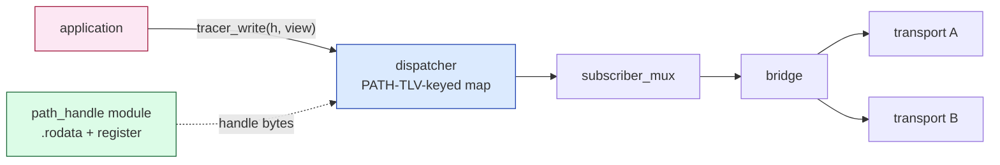

# Reference 10 — Module Catalog and Composition

> **Status**: draft, v0.1, 2026-05-03. New material — this is the cross-cutting index of every module mentioned anywhere in the reference suite, with their layer assignment, required-vs-optional status, dependencies, and pairings.
> **Audience**: anyone deciding what to compile in / out of a build; anyone porting libtracer to a new platform; anyone implementing a new module and needing to know what interface to satisfy.

---

## Framing

There is **no "core" carved out from "modules"**. A libtracer node is a chosen set of modules linked together. Some modules are required for any conforming node (frame codec, dispatcher, refcount/view machinery, router/bridge logic) — they are tagged `required` below. Everything else is optional; you load it if you need its capability.

This catalog is the source of truth for **what gets built and how it composes**. The byte-level wire spec is in [01-data-format.md](01-data-format.md); the graph spec is in [02-graph-model.md](02-graph-model.md); this doc names the implementation pieces and their interfaces.

---

## Module-tag legend

| Tag | Meaning |
| ---- | ---- |
| `required` | Every conforming node loads this. Loaded even at conformance profile P0. |
| `transport` | Provides a `transport_vtable_t` — one wire technology (TCP, CAN, …). |
| `discovery` | Provides a `discovery_vtable_t` — peer announcement and resolution. |
| `security` | Wraps a transport with confidentiality / integrity / auth. |
| `executor` | Hosts vertex-side compute (C callbacks, scripting, WASM). |
| `mem-backend` | L0 memory substrate — owns real bytes, exposes them as `segment_t`. |
| `view-module` | L1 view + rope + cast layer — owns no bytes, owns the ownership semantics. |
| `tool` | Out-of-process utility (CLI introspection, GUI, recorder). |
| `future` | Named, not built for v0.1. Listed so the design space is explicit. |

---

## Module catalog by layer

### L0 — Memory substrate ([09-memory-substrate.md](09-memory-substrate.md))

Backends that own real bytes. Each implements the `mem_backend_t` interface.

| Module | Tag | What it wraps | Status |
| ---- | ---- | ---- | ---- |
| `mem_heap` | mem-backend | malloc/free, jemalloc, mimalloc — any general-purpose heap | v0.1 |
| `mem_pool_static` | mem-backend | A statically-allocated fixed-size slot pool | v0.1 |
| `mem_pool_class` | mem-backend | A small set of fixed-size slot pools partitioned by size class | v0.1 |
| `mem_lwip_pbuf` | mem-backend | An lwIP `struct pbuf` chain (network-stack buffer) | v0.1 |
| `mem_skbuff` | mem-backend | A Linux kernel `sk_buff` (for in-kernel libtracer ports) | future |
| `mem_dma_buffer` | mem-backend | A peripheral DMA buffer (preallocated, recycled, with cache hooks) | v0.1 |
| `mem_mmio` | mem-backend | An MMIO range — bytes never moved; segment is a permanent fixture | v0.1 |
| `mem_shared` | mem-backend | A POSIX SHM region (single-process refcounted, multi-process treats as MMIO) | v0.1 |
| `mem_uart_rx_simple` | mem-backend | A circular UART RX buffer with byte-by-byte cursor | v0.1 |
| `mem_uart_rx_dma` | mem-backend | A double-buffered DMA UART RX ring (half-complete and complete IRQs) | v0.1 |
| `mem_can_reassembly` | mem-backend | A reassembly slab for multi-frame CAN/CAN-FD messages | v0.1 |
| `mem_iceoryx2` | mem-backend | An iceoryx2 publish-side block | future |
| `mem_rdma` | mem-backend | An RDMA-registered memory region with ibv tags | future |
| `mem_asio_streambuf` | mem-backend | A `boost::asio::streambuf` (consume-on-read semantics) | **OPEN — see §hard integrations** |

### L1 — Views and ownership ([08-views-and-ownership.md](08-views-and-ownership.md))

The view + rope + cast machinery itself is one `required` module; integrations with specific I/O facilities are separate optional modules. They expose the same uniform view API to L2+ but pair with specific L0 backends.

| Module | Tag | Pairs with (L0) | Status |
| ---- | ---- | ---- | ---- |
| `view_core` | required | any backend | v0.1 |
| `view_basic` | view-module | `mem_heap`, `mem_pool_*`, `mem_mmio`, `mem_dma_buffer` | v0.1 |
| `view_pbuf` | view-module | `mem_lwip_pbuf` | v0.1 |
| `view_iovec` | view-module | any backend exposing scatter-gather | v0.1 |
| `view_dma_descriptor` | view-module | `mem_dma_buffer` | v0.1 |
| `view_uart_simple` | view-module | `mem_uart_rx_simple` | v0.1 |
| `view_uart_dma` | view-module | `mem_uart_rx_dma` | v0.1 |
| `view_can_frames` | view-module | `mem_can_reassembly` | v0.1 |
| `view_shm` | view-module | `mem_shared` | v0.1 |
| `view_iceoryx2` | view-module | `mem_iceoryx2` | future |
| `view_rdma` | view-module | `mem_rdma` | future |

### L2 — Frame envelope ([01-data-format.md](01-data-format.md))

| Module | Tag | What it does |
| ---- | ---- | ---- |
| `frame_codec` | required | Header pack/unpack; `opt` bit interpretation; CRC-32C and CRC-16-CCITT; relative- and absolute-TS handling; trailer attach/strip |
| `frame_iter` | required | Iterative parser with bounded depth (no recursion); handles flat-buffer and rope-walk contexts |

### L3 — TLV semantics ([05-protocol-tlvs.md](05-protocol-tlvs.md))

| Module | Tag | What it does |
| ---- | ---- | ---- |
| `tlv_registry` | required | Type-code dispatch; structured-vs-opaque decision via `opt.PL`; unknown-code passthrough rules |

### L4 — Graph endpoint logic ([02-graph-model.md](02-graph-model.md), [03-addressing.md](03-addressing.md), [04-communication-flows.md](04-communication-flows.md))

| Module | Tag | What it does |
| ---- | ---- | ---- |
| `graph_runtime` | required | Vertex map, edge / subscription registry, dispatch loop |
| `path_handle` | required | Build-time and init-time PATH TLV encoder; `.rodata` literal helpers; init-time path registration. Hot-path API takes handles only. ([03-addressing.md](03-addressing.md) §static path handles, [../spec/v1.md](../spec/v1.md) §3.1) |
| `path_resolver` | required | Path EBNF parsing, wildcard match, field-chain resolution. Slow path only — string-form entry point used at init or for ergonomics. P0 builds MAY omit the string-form entry. |
| `dispatcher` | required | Fan-out to subscribers, per-subscriber QoS / ACL gating. Vertex map is keyed on canonical PATH TLV bytes ([02-graph-model.md](02-graph-model.md) §dispatch keyed on canonical PATH TLV bytes). |
| `bridge` | required | Cross-transport forwarding; ROUTER attach/strip; cycle dedup recent-set |
| `subscriber_mux` | required | Per-subscriber state slots, rate limit, deadline / liveness watchdog |
| `schema_registry` | required | Per-vertex `:schema` storage and lookup |

These six are required even at profile P0 (in-process build). "Required" does not imply "monolithic" — they are six distinct modules with clean interfaces between them. An implementer may swap any one of them for an alternative implementation as long as the protocol behavior is preserved.

### Transports (L4 ↔ network) ([../plans/05-modules-transport-and-discovery.md](../plans/05-modules-transport-and-discovery.md))

| Module | Tag | Wraps | Status |
| ---- | ---- | ---- | ---- |
| `transport_tcp` | transport | TCP socket | v0.1, week 2 |
| `transport_udp` | transport | UDP socket (unicast and multicast) | v0.1 |
| `transport_quic` | transport | QUIC | post-MVP |
| `transport_ws` | transport | WebSocket (browser / WASM) | v0.1, week 5 |
| `transport_unix` | transport | Unix domain socket | v0.1 |
| `transport_shm` | transport | Iceoryx-style shared-memory ring | post-MVP |
| `transport_uart` | transport | UART (simple + DMA modes) | v0.1, week 6 |
| `transport_can` | transport | CAN classic + CAN-FD with reassembly | v0.1, week 6 |
| `transport_i2c` | transport | I²C bus | v0.1 |
| `transport_spi` | transport | SPI bus | v0.1 |
| `transport_ble_gatt` | transport | BLE GATT characteristics | future |
| `transport_rdma` | transport | RDMA (ibverbs) | future |

### Discovery ([../plans/05-modules-transport-and-discovery.md](../plans/05-modules-transport-and-discovery.md))

| Module | Tag | What it does | Status |
| ---- | ---- | ---- | ---- |
| `discovery_mdns` | discovery | mDNS / DNS-SD over local LAN | v0.1, week 3 |
| `discovery_static` | discovery | TOML config file with explicit peer endpoints | v0.1 |
| `discovery_gossip` | discovery | Gossip protocol over WAN-friendly transports | post-MVP |

### Security ([../plans/06-modules-executor-security-gui.md](../plans/06-modules-executor-security-gui.md))

| Module | Tag | Pairs with | Status |
| ---- | ---- | ---- | ---- |
| `security_tls` | security | `transport_tcp`, `transport_quic`, `transport_ws` | post-MVP |
| `security_dtls` | security | `transport_udp` | post-MVP |
| `security_psk` | security | `transport_uart`, `transport_can`, `transport_spi`, `transport_i2c` | post-MVP |
| `security_acl` | security | any transport | post-MVP |
| `security_noise` | security | any transport | future |

### Executors ([../plans/06-modules-executor-security-gui.md](../plans/06-modules-executor-security-gui.md))

| Module | Tag | What it runs | Status |
| ---- | ---- | ---- | ---- |
| `executor_c` | executor | C callbacks bound by name to a vertex | v0.1, week 7 |
| `executor_micropython` | executor | MicroPython on MCU class hardware | post-MVP |
| `executor_python` | executor | CPython on Linux | post-MVP |
| `executor_lua` | executor | Lua | post-MVP |
| `executor_wasm` | executor | WASM (WAMR) | post-MVP |
| `executor_dataflow` | executor | DAG dataflow scheduler | future |
| `executor_fpga` | executor | FPGA-resident vertex compute | future, aspirational |

### Tools (out-of-process)

| Module | Tag | What it is | Status |
| ---- | ---- | ---- | ---- |
| `tracer-top` | tool | CLI — vertex / edge / sample-rate live view | v0.1, week 8 |
| `diag-gui` | tool | Web UI introspector via `transport_ws` | post-MVP |
| `recorder` | tool | TLV stream-to-disk recorder | post-MVP |

---

## Required modules per conformance profile

| Profile | Modules loaded |
| ---- | ---- |
| **P0** (in-process) | `view_core`, `view_basic`, `mem_heap` (or any L0 backend), `frame_codec`, `frame_iter`, `tlv_registry`, `graph_runtime`, `path_resolver`, `dispatcher`, `bridge`, `subscriber_mux`, `schema_registry` |
| **P1** (single-transport leaf) | P0 + one transport (e.g., `transport_tcp` or `transport_uart`) + the L0 backend and L1 view module the transport pairs with |
| **P2** (bridge) | P1 + ≥1 additional transport + dedup recent-set is mandatory (already in `bridge` from P0, but exercised) |
| **P3** (full) | P2 + one discovery module + one executor module + one security module |

A profile P0 build with `mem_heap` + `view_basic` is the minimum sentinel for the ≤ 16 KB stripped target on Cortex-M.

---

## Inter-module interfaces

Each adjacent layer pair has a small contract. The interfaces are uniform — a transport doesn't care which L1 view module its L0 backend pairs with, as long as the pairing produces a `view_t *`.

### L0 ↔ L1: `mem_backend_t`

```c
typedef struct mem_backend mem_backend_t;
typedef struct segment     segment_t;

typedef enum { IO_DIR_DEVICE_TO_CPU, IO_DIR_CPU_TO_DEVICE } io_dir_t;

struct mem_backend {
    const char *name;
    uint32_t    abi_version;
    segment_t *(*alloc)              (const mem_backend_t *self, size_t size, uint32_t hint);
    void       (*release)            (segment_t *seg);
    void       (*prepare_for_io)     (segment_t *seg, io_dir_t dir);   // optional cache hook
    void       (*finalize_after_io)  (segment_t *seg, io_dir_t dir);   // optional cache hook
    size_t     (*max_segment_size)   (const mem_backend_t *self);
    size_t     (*alignment)          (const mem_backend_t *self);
};

struct segment {
    atomic_uint_least32_t refcount;
    const mem_backend_t  *backend;
    void                 *base;
    size_t                size;
    void                (*destroy)(segment_t *);
};
```

A backend may decline `alloc` (return NULL) — MMIO and hardware-FIFO backends do exactly that. A backend without cache hooks omits `prepare_for_io` / `finalize_after_io` (set to NULL). The `destroy` callback is per-segment, not per-backend, because some backends (e.g., DMA) have multiple destroy paths depending on which pool the segment came from.

### L1 ↔ L2: `view_t` and the cast

```c
typedef struct view view_t;

struct view {
    segment_t *owner;     // refcounted L0 segment
    size_t     offset;
    size_t     length;
    view_t    *next;      // chains a rope
};

// Cast a view to a TLV pointer in place — zero-copy reinterpretation.
const tlv_header_t *view_as_tlv(const view_t *v);

// Validate before cast (recv path).
bool view_validate_as_tlv(const view_t *v);

// Refcount management.
view_t *view_clone   (view_t *v);
void    view_release (view_t *v);
view_t *view_subview (view_t *v, size_t offset, size_t length);
view_t *view_concat  (view_t *head, view_t *tail);
```

### L2 ↔ L3: header-driven dispatch

Frame codec parses `(type, opt, length)`. The TLV registry uses `type` and `opt.PL` to decide whether to recurse into nested children or treat the payload as opaque bytes. The frame codec exposes the payload as a `view_t *`; the registry exposes typed views (`tlv_value_t *`, `tlv_path_t *`, …) by typed cast.

### L3 ↔ L4: graph dispatch

When a TLV arrives at the dispatcher, the registry tells the graph runtime what to do:

- `VALUE` at a vertex path → store, then fan out to subscribers.
- `PATH` → resolve and read.
- `SUBSCRIBER` written to `:subscribers[N]` → register a fan-out target.
- `ROUTER` arriving via a transport → bridge's responsibility (shed envelope, dedup).
- Unknown user-range types with `PL=1` → store as opaque structured data; subscribers see what they handle.

### Transport ↔ L4: `transport_vtable_t`

(Defined in [../plans/05-modules-transport-and-discovery.md](../plans/05-modules-transport-and-discovery.md). Summary:)

```c
typedef struct {
    int  (*init)        (void *self, const char *config);
    int  (*bind)        (void *self, const char *endpoint);
    int  (*send_tlv)    (void *self, view_t *tlv, peer_id_t peer);
    int  (*poll_recv)   (void *self, view_t **out, peer_id_t *out_peer);
    size_t (*mtu_hint)  (void *self);
    void (*shutdown)    (void *self);
} transport_vtable_t;
```

A transport accepts a `view_t *` (which may be a rope) and emits its bytes through whatever its egress facility is. A transport never sees TLV semantics — it sees framed bytes. A scatter-gather-capable transport walks the rope; a contiguous-only transport calls a `view_flatten()` helper that materializes the rope into a single segment (a single copy at the egress boundary).

### Application ↔ L4: path-handle entry points

The hot-path API surface is **handle-typed**, not string-typed. Per [../spec/v1.md](../spec/v1.md) §3.1.4:

```c
typedef const struct path_handle *path_handle_t;   // opaque pointer to a PATH TLV
                                                    // (in .rodata or registered heap)

int  tracer_write (path_handle_t h, const view_t *value);
int  tracer_read  (path_handle_t h, view_t **out_value);
int  tracer_await (path_handle_t h, uint64_t deadline_ns, view_t **out_value);
```

The handle's bytes are the canonical PATH TLV; the dispatcher's vertex map is keyed by those bytes. No string formatting, no allocation, no parser walk on the hot path.

A string-form convenience (`tracer_write_str(const char *path, ...)`) MAY be exposed by an implementation but MUST internally route through the same handle dispatch — typically via an init-time `tracer_path_register(...)` cache. P0 (in-process minimum) builds MAY omit the string entry entirely.

### Module composition for the hot path



The handle module supplies bytes; the dispatcher uses them; the subscriber multiplexer fans out; the bridge picks transports per outbound subscriber. No module on this path takes a string.

---

## Pairing table — picking a stack

The natural pairings of L0 backend / L1 view module / transport. Other combinations are possible but cost an extra copy at one of the boundaries.

| Use case | L0 backend | L1 view module | Transport | Notes |
| ---- | ---- | ---- | ---- | ---- |
| RC car over USB-CDC | `mem_uart_rx_simple` | `view_uart_simple` | `transport_uart` | Polling RX; tiny footprint |
| ESP32 over Wi-Fi (TCP) | `mem_lwip_pbuf` | `view_pbuf` | `transport_tcp` | Pbuf chain becomes a rope; zero-copy through bridge |
| Linux router | `mem_heap` + `mem_lwip_pbuf` | `view_basic` + `view_pbuf` | `transport_tcp` + `transport_quic` | Two backends, two view modules, two transports — bridge wires them |
| ADC streaming | `mem_dma_buffer` | `view_dma_descriptor` (rope-capable) | `transport_udp` (multicast) | DMA-half-complete IRQ produces views; egress walks the rope |
| MMIO sensor (GPIO, ADC raw register) | `mem_mmio` | `view_basic` | (in-process only, or via copy at bridge) | Segment lifetime is permanent; reads always TOCTOU-snapshot at view-create — see §hard integrations |
| CAN-bridged peripheral | `mem_can_reassembly` | `view_can_frames` | `transport_can` | Reassembly into a multi-frame view at L0; egress fragments back into CAN frames |
| Cross-process intra-host | `mem_shared` | `view_shm` | (no transport — shared memory) | Single-process refcount; cross-process treats as MMIO and copies — see §hard integrations |
| Browser WASM | `mem_heap` | `view_basic` | `transport_ws` | Standard heap; WS framing |

A bridge between two pairings (e.g., lwIP TCP → CAN) is **not free**: at the bridge boundary the egress side walks the source rope and constructs egress segments according to the target backend's rules. The cost is "one copy at the bridge boundary, not per-fanout." See [08-views-and-ownership.md](08-views-and-ownership.md) §cross-substrate transitions for the two patterns (re-chain vs materialize).

---

## Hard integrations and OPEN QUESTIONS

These are integrations the design explicitly identifies as **hard** — not blocked, but with multiple plausible approaches. The user has not chosen between them; this section names the tradeoff so future implementers know they must.

### OPEN — `mem_asio_streambuf`: do we wrap, or do we copy?

`boost::asio::streambuf` is a read-write buffer with **consume-on-read** semantics — bytes the application reads are then logically removed from the buffer (advance of the get-area). Pinning the bytes via a libtracer view conflicts with this:

- **Option A — wrap and pin**: A `view_t` over a streambuf prevents `streambuf::consume()` until the view's refcount drops to zero. Implementation: when libtracer creates a view, it bumps a per-streambuf "pinned bytes" counter; `consume()` becomes a no-op until the counter drops. This requires modifying or wrapping the streambuf — boost-side cooperation.
- **Option B — copy on import**: At the boost-asio↔libtracer boundary, we copy the bytes into a `mem_heap` segment. Streambuf reverts to its normal consume behavior. Cost: one copy per ingress.
- **Option C — don't integrate**: Boost-asio is a C++ ecosystem; libtracer is C-first. Provide a documented C-API shim that the user writes themselves; do not ship `mem_asio_streambuf` in v0.1.

**Recommendation**: Option C for v0.1, revisit in v1.0 if there is real demand. Option A is the clean integration but requires either upstream cooperation or a forked streambuf; Option B is correct but defeats the zero-copy claim.

### OPEN — `mem_mmio` reads: TOCTOU on a live register

A view over an MMIO register's bytes is a view onto **bytes that change asynchronously**. If a CRC is computed over those bytes during egress, the bytes may differ from what the receiver later reads if they re-fetch the same view — the value is volatile.

- **Option A — snapshot at view creation**: When `view_create_over_mmio()` is called, immediately copy the current register value into a small heap segment. The view points at the snapshot, not the live register. CRC is stable; subscribers see a consistent value.
- **Option B — explicit "live view" type**: A separate view kind whose CRC is computed at egress time, accepting that two egresses may produce different bytes. Disallow as graph-stored value (must be explicitly read with side effect).

**Recommendation**: Option A. The "register-as-view" abstraction is for a peripheral whose value is to be **published at a moment**; semantics like "subscribe to the live register" are misleading — they should be polled writes, not subscriptions to a live MMIO view. We make this explicit in the L0 spec and avoid the live-view footgun.

### OPEN — Cross-process refcount on `mem_shared`

A POSIX SHM region can be mapped into multiple processes. Each process's libtracer instance has its own atomic refcount on segments. Two processes both holding views of the same SHM-backed segment cannot coordinate decrement — process B's `view_release()` doesn't see process A's count.

- **Option A — single-publisher, multi-reader**: Treat SHM as MMIO from non-publisher processes' point of view. The publisher owns the segment; readers create views that the publisher's heartbeat-based GC reaps. Acceptable for unidirectional pub/sub (the canonical iceoryx use case).
- **Option B — robust shared refcount**: Use a robust mutex + atomic in the SHM region itself; every process participates. Complex; failure modes (process death holding the count) require a watchdog. Iceoryx2 essentially does this.
- **Option C — copy at process boundary**: Each process treats the other's SHM as a foreign substrate; the boundary copies. No zero-copy across process; same cost as a fast loopback transport.

**Recommendation**: Option A for v0.1 — it's what most pub/sub usage actually needs. Option B in a future `mem_iceoryx2` module that uses iceoryx2's existing robust-bookkeeping. Option C is the fallback when neither is available.

### OPEN — lwIP `pbuf` aliasing

Two libtracer subscribers receiving the same pbuf-backed TLV both clone a `view_pbuf` over the same `pbuf*`. lwIP's `pbuf_ref / pbuf_free` is the lwIP-side refcount. Libtracer's `segment->refcount` is libtracer-side. The two refcounts are independent: libtracer holds `pbuf_ref` once for the whole segment lifetime; libtracer's segment refcount tracks fan-out.

- The risk is double-free if libtracer's `destroy(segment)` calls `pbuf_free` and lwIP doesn't expect it (e.g., in interrupt context vs application context). lwIP's pbuf-free is not always interrupt-safe.

**Recommendation**: A pbuf segment's `destroy` schedules a deferred `pbuf_free` via lwIP's `tcpip_callback` or equivalent — never frees synchronously from a non-lwIP-thread context. Document this explicitly in `mem_lwip_pbuf`'s spec.

### OPEN — Rope walk cost vs flat materialization

A rope of N views walked at egress is N pointer chases. For a transport that does scatter-gather (`writev`, lwIP `pbuf` chain, RDMA scatter list), this is fine. For a transport that wants a single contiguous buffer (some MCU drivers, some legacy protocols), the rope is materialized via `view_flatten()` — one alloc + one copy.

- **Where does flatten live?**: At the transport's egress, just before send. Not at fan-out time (would defeat zero-copy). Not at the L4 dispatcher (it doesn't know transport capabilities).

**Recommendation**: Each transport declares `mtu_hint()` and an optional `wants_flat()` capability bit. The bridge / fan-out code walks the rope as-is into transports that don't set `wants_flat`; for those that do, calls `view_flatten()` once at egress. Document the rule in the transport ABI.

### OPEN — DMA cache coherency on heterogeneous SoCs

Cortex-M with non-cache-coherent DMA: the device fills a buffer in main memory, but the CPU's cache may hold stale lines. `prepare_for_io` (invalidate cache before DMA fills) and `finalize_after_io` (invalidate cache before CPU reads) are the hooks. On a coherent SoC (most Cortex-A) these are no-ops.

- **Risk**: missing `finalize_after_io` after a DMA-half-complete IRQ → CPU reads stale bytes → CRC fails or worse, silently bad data.
- **Risk**: calling `prepare_for_io` while the CPU still has dirty bytes in cache → DMA writes get clobbered.

**Recommendation**: The `mem_dma_buffer` backend's IRQ handler is the canonical place to call `finalize_after_io`. Application code never calls these directly; they are backend-internal. Document the expected interleaving as part of `mem_dma_buffer`'s spec.

### OPEN — Reference-to-a-value vs reference-to-bytes

A common pattern: the user wants an endpoint whose value is "the contents of variable X". X may be:

- A C `uint32_t` global — 4 bytes at a known address.
- An MMIO register — 4 bytes at a known address.
- A struct field that the publisher updates atomically.

Two ways to model this:

- **Option A — view over the live address**: A `mem_mmio`-style segment pointing at the live address. Reads always re-snapshot (per the MMIO discussion above). No ownership of the underlying memory; libtracer does not free it.
- **Option B — register a "shadow" vertex**: The graph stores a value; the publisher writes the value when X changes. Subscribers read the shadow.

**Recommendation**: Option B is the protocol-clean answer (the graph stores values; the protocol is about graph state, not direct memory probes). Option A is a quick-and-dirty path for prototyping (`tracer_attach_register(&my_var)`) that we may ship as a developer-convenience helper but not as the canonical pattern. Document this clearly so users don't accidentally rely on Option A's TOCTOU surface.

---

## DMA→ADC→network: end-to-end module trace

The full path of a single DMA-driven ADC sample, naming each module that touches it. Detailed walkthrough is in [08-views-and-ownership.md](08-views-and-ownership.md) §end-to-end trace; here is the module chain summary:

```
1. ADC peripheral fills DMA ring half       — hardware
2. DMA half-complete IRQ                    — hardware → mem_dma_buffer
3. mem_dma_buffer.finalize_after_io         — L0: cache invalidate
4. view_dma_descriptor creates view_t over filled half
                                            — L1: zero-copy
5. frame_codec wraps view as USER_SAMPLE_RECORD TLV
                                            — L2: tlv_t header construction (rope: [header_view, dma_payload_view])
6. graph_runtime dispatch                   — L4: locate /adc/raw vertex
7. dispatcher fan-out                       — L4: each subscriber gets a refcount-incremented view
8. transport_udp.send_tlv (multicast)       — transport: walks rope, writes to socket
9. NIC DMAs out the bytes                   — hardware
10. transport_udp acks send → view_release  — L1: refcount-- on dma segment
11. When all subscribers + transport done, mem_dma_buffer recycles segment back to pool — L0
```

No copy from step 1 to step 9. The single allocation cost is the small header_view at step 5, paid from `mem_heap` or a small-segment pool.

This trace exists because the DMA→ADC→network path is the **acid test** for the zero-copy claim. If any module forces a copy, the claim collapses for streaming workloads.

---

## What this catalog does NOT specify

- The exact C-ABI signatures of each module's exported symbols. See [../plans/05-modules-transport-and-discovery.md](../plans/05-modules-transport-and-discovery.md) §module ABI.
- Build-system mechanics (CMake `add_library` patterns, separate compile units). See [../plans/02-roadmap-weeks-1-to-8.md](../plans/02-roadmap-weeks-1-to-8.md) week 1.
- Configuration syntax for selecting which modules a binary loads. See [../plans/05-modules-transport-and-discovery.md](../plans/05-modules-transport-and-discovery.md) §bridging configuration.
- Per-module memory footprint estimates. See [00-overview.md](00-overview.md) §everything is a module for the rough numbers.

The catalog is the **inventory of pieces** and **how they compose**. The byte-level wire format and graph behavior are independent of the module structure — you could implement libtracer as one monolithic .c file and still be conforming. The module split is an implementation discipline that keeps the code as small as the deployment warrants.
