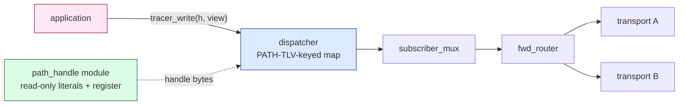

# Reference 10 — Module catalog and composition

> **Audience**: anyone deciding what to compile into a node; anyone porting libtracer to a new platform; anyone implementing a new module and needing to know which contract to satisfy.

---

## What this catalog is

A libtracer node is a chosen set of modules linked together. There is **no "core" carved out from "modules"**: some modules are required for any conforming node — frame codec, dispatcher, refcount/view machinery, forwarder logic — and the required set is identified here, by enumeration, not by architectural privilege. Everything else is optional and is loaded when its capability is wanted.

This catalog names every module the reference suite mentions, in one place: its layer, its required-vs-optional status, what it wraps, which modules it pairs with, and which contract it satisfies. The byte-level wire format is in [01-data-format.md](01-data-format.md) and the graph semantics are in [02-graph-model.md](02-graph-model.md); neither depends on how a node is split into modules.

---

## Module-tag legend

| Tag | Meaning |
| ---- | ---- |
| `required` | Every conforming node loads this, down to conformance profile P0. |
| `transport` | Carries one wire technology (WebSocket, UDP, CAN, …) and satisfies the transport contract. |
| `discovery` | Announces and resolves peers. |
| `security` | Wraps a transport with confidentiality, integrity or authentication. |
| `executor` | Hosts vertex-side compute (C callbacks, scripting, WASM). |
| `mem-backend` | L0 memory substrate — owns real bytes and vends refcounted segments. |
| `block-source` | L0 failable-block seam — raw single-owner blocks, exhaustion reported by value. |
| `view-module` | L1 view + rope + cast layer — owns no bytes, owns the ownership semantics. |
| `tool` | Out-of-process utility (CLI introspection, GUI, recorder). |
| `future` | Named, not built for v1. Listed so the design space is explicit. |

**Status column.** `v1` means *inside the v1 scope boundary* ([ADR-0013 — v1 scope boundaries](https://github.com/avatarsd-llc/libtracer/blob/main/docs/adr/0013-v1-scope-boundaries.md)); `post-MVP` means after the v1 minimum; `future` means named but outside v1. The column is hand-maintained and records **scope**, not the contents of any particular build: what a given implementation ships is decided by its own source tree, and a second implementation is free to ship a different subset and still conform.

---

## Module catalog by layer

### L0 — Memory substrate ([09-memory-substrate.md](09-memory-substrate.md))

L0 has **two** seams. Most modules here are *backends* that own real bytes and vend refcounted segments for payload. One is a *block source*: raw single-owner blocks with failure reported by value, for allocations a peer can provoke ([09 §the second L0 seam](09-memory-substrate.md), [ADR-0065 — failable allocation gets its own seam](https://github.com/avatarsd-llc/libtracer/blob/main/docs/adr/0065-failable-allocation-gets-its-own-seam-block-source.md)).

| Module | Tag | What it wraps | Status |
| ---- | ---- | ---- | ---- |
| `mem_heap` | mem-backend | malloc/free, jemalloc, mimalloc — any general-purpose heap | v1 |
| `mem_source` | block-source | The nothrow failable-block seam: a heap source, a source that serves nothing, a bump source over a caller-supplied buffer with an upstream fallback, a bounded recycling pool source, and a relocating block array over any of them | v1 |
| `mem_borrowed` | mem-backend | Caller-owned bytes wrapped as a non-owning segment — the transparent byte-routing vehicle of [ADR-0012 — memory binding is a modular spectrum](https://github.com/avatarsd-llc/libtracer/blob/main/docs/adr/0012-modular-memory-binding-transparent-router.md) | v1 |
| `mem_pool_static` | mem-backend | A statically allocated fixed-size slot pool | v1 |
| `mem_pool_class` | mem-backend | A small set of fixed-size slot pools partitioned by size class | v1 |
| `mem_lwip_pbuf` | mem-backend | An lwIP `struct pbuf` chain (network-stack buffer) | v1 |
| `mem_skbuff` | mem-backend | A Linux kernel `sk_buff`, for in-kernel ports | future |
| `mem_dma_buffer` | mem-backend | A peripheral DMA buffer (preallocated, recycled, with cache hooks) | v1 |
| `mem_mmio` | mem-backend | An MMIO range — bytes never move; the segment is a permanent fixture | v1 |
| `mem_shared` | mem-backend | A POSIX SHM region (single-process refcounted; multi-process treats it as MMIO) | v1 |
| `mem_uart_rx_simple` | mem-backend | A circular UART RX buffer with a byte-by-byte cursor | v1 |
| `mem_uart_rx_dma` | mem-backend | A double-buffered DMA UART RX ring (half-complete and complete IRQs) | v1 |
| `mem_iceoryx2` | mem-backend | An iceoryx2 publish-side block | future |
| `mem_rdma` | mem-backend | An RDMA-registered memory region with ibv tags | future |
| `mem_cuda` | mem-backend | CUDA device memory — a device address space the codec must not dereference; it backs a VALUE payload inside a heterogeneous host+device rope ([ADR-0024 — mem_cuda and the heterogeneous rope](https://github.com/avatarsd-llc/libtracer/blob/main/docs/adr/0024-mem-cuda-gpu-backend-heterogeneous-rope.md)) | v1, opt-in |
| `mem_asio_streambuf` | mem-backend | A `boost::asio::streambuf` (consume-on-read semantics) | not in v1 — see [§hard integrations](#hard-integrations) |

`can_reassembly` is **not** an L0 module. It is listed under transports below, for the reason given there.

### L1 — Views and ownership ([08-views-and-ownership.md](08-views-and-ownership.md))

The view + rope + cast machinery itself is one `required` module; integrations with specific I/O facilities are separate optional modules. They expose the same uniform view surface to L2 and above, but each pairs with specific L0 backends.

| Module | Tag | Pairs with (L0) | Status |
| ---- | ---- | ---- | ---- |
| `view_core` | required | any backend | v1 |
| `view_basic` | view-module | `mem_heap`, `mem_pool_*`, `mem_mmio`, `mem_dma_buffer` | v1 |
| `view_pbuf` | view-module | `mem_lwip_pbuf` | v1 |
| `view_iovec` | view-module | any backend exposing scatter-gather | v1 |
| `view_dma_descriptor` | view-module | `mem_dma_buffer` | v1 |
| `view_uart_simple` | view-module | `mem_uart_rx_simple` | v1 |
| `view_uart_dma` | view-module | `mem_uart_rx_dma` | v1 |
| `view_can_frames` | view-module | `can_reassembly` (transport plane) | v1 |
| `view_shm` | view-module | `mem_shared` | v1 |
| `view_iceoryx2` | view-module | `mem_iceoryx2` | future |
| `view_rdma` | view-module | `mem_rdma` | future |

### L2 — Frame envelope ([01-data-format.md](01-data-format.md))

| Module | Tag | What it does |
| ---- | ---- | ---- |
| `frame_codec` | required | Header pack and unpack; `opt` bit interpretation; CRC-32C and CRC-16-CCITT; relative- and absolute-TS handling; trailer attach and strip |
| `frame_iter` | required | Iterative parser — recursion is forbidden, so a deep frame cannot overflow a small call stack. Nesting depth is bounded by the receiver's own decode resources and by no constant; a frame that exhausts them is rejected with `TLV_NESTING_TOO_DEEP`. Handles both the flat-buffer and the rope-walk context |

### L3 — TLV semantics ([05-protocol-tlvs.md](05-protocol-tlvs.md))

| Module | Tag | What it does |
| ---- | ---- | ---- |
| `tlv_registry` | required | Type-code dispatch; the structured-vs-opaque decision via `opt.PL`; unknown-code passthrough rules |

### L4 — Graph endpoint logic ([02-graph-model.md](02-graph-model.md), [03-addressing.md](03-addressing.md), [04-communication-flows.md](04-communication-flows.md))

| Module | Tag | What it does |
| ---- | ---- | ---- |
| `graph_runtime` | required | Vertex map, edge and subscription registry, dispatch loop |
| `path_handle` | required | Build-time and init-time PATH TLV encoder; read-only-segment literal helpers; init-time path registration. The hot-path surface takes handles only ([03-addressing.md](03-addressing.md) §static path handles, [../spec/v1.md](../spec/v1.md) §3.1) |
| `path_resolver` | required | Path EBNF parsing and field-chain resolution — v1 has no wildcard grammar, and a path containing `*` or `?` anywhere is rejected with `ERROR{tr::path::invalid}` ([03-addressing.md](03-addressing.md)). Slow path only — the string-form entry point is used at init or for ergonomics. P0 builds MAY omit it |
| `dispatcher` | required | Fan-out to subscribers, per-subscriber QoS and ACL gating. The vertex map is keyed on canonical PATH TLV bytes ([02-graph-model.md](02-graph-model.md) §dispatch keyed on canonical PATH TLV bytes) |
| `fwd_router` | required | The stateless source-routed forwarder ([ADR-0035 — implementing RFC-0004 remote-operation addressing](https://github.com/avatarsd-llc/libtracer/blob/main/docs/adr/0035-implementing-rfc-0004-remote-operation-addressing.md)): an offset-dispatch forward hop that shrinks `dst` and grows `src` with no heap allocation for a contiguous frame (a rope-sourced hop draws its gather table from the injected receive source, since the sub-span count is the sender's choice), an arena-decoded terminus for frames whose leading `dst` mount run is local, and route-handle compaction (ADVERTISE / COMPACT / NACK) |
| `subscriber_mux` | required | Per-subscriber state slots and the per-subscription delivery policy carried on the SUBSCRIBER record. There is no rate throttle — the `min_interval_ns` / `keepalive_ns` knobs are gone for good ([02-graph-model.md](02-graph-model.md) §delivery modes) — no deadline engine and no liveness watchdog ([04-communication-flows.md](04-communication-flows.md)) |
| `schema_registry` | required | Per-vertex `:schema` storage and lookup |

These are required down to profile P0, the in-process build. "Required" does not mean "monolithic": they are distinct modules with declared contracts between them, and any one may be swapped for an alternative implementation as long as the protocol behaviour is preserved.

### Transports (L4 ↔ network)

| Module | Tag | Wraps | Status |
| ---- | ---- | ---- | ---- |
| `transport_tcp` | transport | TCP socket | v1 |
| `transport_udp` | transport | UDP socket (unicast and multicast) | v1 |
| `transport_quic` | transport | QUIC and WebTransport ([ADR-0043 — QUIC/WebTransport as an optional module](https://github.com/avatarsd-llc/libtracer/blob/main/docs/adr/0043-quic-webtransport-optional-module-msquic.md)) | v1, opt-in |
| `transport_ws` | transport | WebSocket (browser and WASM reachable) | v1 |
| `transport_can` | transport | CAN classic and CAN-FD, with `can_reassembly` | v1 |
| `can_reassembly` | transport | Multi-frame CAN and CAN-FD reassembly (see the rule below) | v1 |
| `transport_unix` | transport | Unix domain socket | v1 scope; no reference module |
| `transport_uart` | transport | UART (simple and DMA modes) | v1 scope; no reference module |
| `transport_shm` | transport | Iceoryx-style shared-memory ring | post-MVP |
| `transport_i2c` | transport | I²C bus | future |
| `transport_spi` | transport | SPI bus | future |
| `transport_ble_gatt` | transport | BLE GATT characteristics | future |
| `transport_rdma` | transport | RDMA (ibverbs) | future |

**The reassembly-buffer rule.** A multi-frame reassembly buffer is a **transport-plane** concern, not an L0 one, because it composes L1 views into a rope exactly as any transport does. Placing it at L0 would make an L0 type reference the L1 rope it assembles, which the layer model forbids ([ADR-0048 — one wire-grammar core behind a chunk cursor](https://github.com/avatarsd-llc/libtracer/blob/main/docs/adr/0048-one-wire-grammar-chunk-cursor-rope-aware-decode.md)). Its bounding behaviour follows the same discipline as every other libtracer resource: structure is drawn from an injected resource, the live group count is bounded by configuration, and overflow evicts the oldest group and increments a `dropped_groups` counter. A constrained node therefore degrades by a bounded drop rather than by unbounded growth, and no magic number appears anywhere in the buffer.

### Discovery

| Module | Tag | What it does | Status |
| ---- | ---- | ---- | ---- |
| `discovery_mdns` | discovery | mDNS / DNS-SD over the local LAN | v1 |
| `discovery_static` | discovery | A config file with explicit peer endpoints | v1 |
| `discovery_gossip` | discovery | Gossip over WAN-friendly transports | post-MVP |

### Security

| Module | Tag | Pairs with | Status |
| ---- | ---- | ---- | ---- |
| `security_tls` | security | `transport_tcp`, `transport_quic`, `transport_ws` | post-MVP |
| `security_dtls` | security | `transport_udp` | post-MVP |
| `security_psk` | security | `transport_uart`, `transport_can`, `transport_spi`, `transport_i2c` | post-MVP |
| `security_acl` | security | any transport | post-MVP |
| `security_noise` | security | any transport | future |

### Executors

| Module | Tag | What it runs | Status |
| ---- | ---- | ---- | ---- |
| `executor_c` | executor | C callbacks bound by name to a vertex | v1 |
| `executor_micropython` | executor | MicroPython on MCU-class hardware | post-MVP |
| `executor_python` | executor | CPython on Linux | post-MVP |
| `executor_lua` | executor | Lua | post-MVP |
| `executor_wasm` | executor | WASM (WAMR) | post-MVP |
| `executor_dataflow` | executor | A DAG dataflow scheduler | future |
| `executor_fpga` | executor | FPGA-resident vertex compute | future |

### Tools (out-of-process)

| Module | Tag | What it is | Status |
| ---- | ---- | ---- | ---- |
| `tracer-top` | tool | CLI — live vertex, edge and sample-rate view | v1 |
| `diag-gui` | tool | Web UI introspector over `transport_ws` | post-MVP |
| `recorder` | tool | TLV stream-to-disk recorder | post-MVP |

---

## Required modules per conformance profile

| Profile | Modules loaded |
| ---- | ---- |
| **P0** (in-process) | `view_core`, `view_basic`, `mem_heap` (or any L0 backend), `frame_codec`, `frame_iter`, `tlv_registry`, `graph_runtime`, `path_handle`, `path_resolver`, `dispatcher`, `fwd_router`, `subscriber_mux`, `schema_registry` |
| **P1** (single-transport leaf) | P0 + one transport + the L0 backend and L1 view module that transport pairs with |
| **P2** (forwarder) | P1 + at least one further transport — the forwarder routes `FWD` frames between them |
| **P3** (full) | P2 + one discovery module + one executor module + one security module |

A profile P0 build with `mem_heap` and `view_basic` is the minimum sentinel for the ≤ 16 KB stripped-image target on Cortex-M.

---

## Inter-module interfaces

Each adjacent layer pair has a small contract, stated here in language-neutral terms. The contracts are uniform: a transport does not care which L1 view module its L0 backend pairs with, as long as the pairing produces views.

### Module ABI

The module ABI — the shape of the seams below, and the version tag a loader checks — is **deliberately** an implementation concern, not a protocol property ([ADR-0013 — v1 scope boundaries](https://github.com/avatarsd-llc/libtracer/blob/main/docs/adr/0013-v1-scope-boundaries.md)). Two conforming implementations need not share it. What they share is the wire format ([01-data-format.md](01-data-format.md)) and addressing ([03-addressing.md](03-addressing.md)); a node assembled from one toolchain's modules interoperates over the wire with any other node whatever its ABI.

Within a single implementation the ABI *should* be declared semver-stable: an exported ABI-version symbol, a bump on every breaking seam-layout change, and a loader that refuses a module whose version does not match. ⚠️ **The reference implementation does none of this**, because it has no dynamic module system: its modules are compile-time translation units linked into one binary (the transport seam, for instance, is an abstract class with virtual methods, not a vtable struct), there is no exported ABI-version symbol and no loader, so nothing can refuse anything. The discipline above is a recommendation for implementations that do ship loadable modules.

Executor, security and discovery modules are opt-in; none is linked into a P0 build. A node loads them only when it needs vertex-side compute, transport confidentiality or authentication, or peer announcement.

### L0 ↔ L1 — the memory-backend contract

A backend owns real bytes; the refcounted segment it hands out is an L1 object because it carries the refcount. The backend interface itself is L0 and must not depend on L1, which is why allocation yields a raw segment the caller adopts rather than an already-owning handle. (The corresponding L0 discussion is [09-memory-substrate.md](09-memory-substrate.md) §the backend abstraction.)

A segment is four things: an intrusive refcount, the backend that reclaims it, the byte range it covers, and the address space those bytes live in. Increments are relaxed; decrements are acquire-release; reclaim fires exactly on the transition to zero.

```c
/* Language-neutral sketch of the backend contract, not an ABI. */

typedef enum { IO_DEVICE_TO_CPU = 1, IO_CPU_TO_DEVICE = 2 } io_dir_t;
typedef enum { SPACE_HOST = 0, SPACE_DEVICE = 1 }           mem_space_t;

/* Yield a segment with refcount 1 for the caller to adopt, or nothing.
   Declining is normal, not an error: MMIO and hardware-FIFO backends
   decline every request. `hint` is opaque and backend-private. */
segment_t *mem_alloc      (mem_backend_t *b, size_t size, uint32_t hint);

/* The sole reclaim hook. Invoked exactly once, by the last handle's
   decrement reaching zero. There is no per-segment reclaim pointer: a
   backend with several internal pools dispatches inside its own hook. */
void       mem_destroy    (mem_backend_t *b, segment_t *seg);

/* Cache maintenance around a device transfer. The hook carries the
   timing, `dir` carries which way the bytes move. No-ops by default
   and on cacheless cores. */
void       mem_before_io  (mem_backend_t *b, segment_t *seg, io_dir_t dir);
void       mem_after_io   (mem_backend_t *b, segment_t *seg, io_dir_t dir);

/* Static properties a caller may query before allocating. */
size_t      mem_alignment        (const mem_backend_t *b);
size_t      mem_max_segment_size (const mem_backend_t *b);
mem_space_t mem_space            (const mem_backend_t *b);  /* codec must not
                                        dereference DEVICE bytes */
const char *mem_name             (const mem_backend_t *b);
```

A backend that cannot serve a request declines it; that is a value, not a fault, and callers must handle it on every path a peer can provoke. The reference implementation's C++ form of this seam is in [../modules/backends.md](../modules/backends.md).

### L1 ↔ L2 — the view, rope and cast contract

A **view** is one contiguous window into one segment: an owning handle plus an offset and a length, with the window required to lie inside the segment. Copying a view is a refcount bump on the owning segment and never a byte copy; releasing it is the handle's destruction. Narrowing a view yields another view over the same segment, sharing ownership.

A **rope** is an ordered chain of views forming one logical byte sequence that may span several segments. A view module must guarantee:

- **Appending is chaining, never a memcpy.** Assembly of a scattered frame — a CAN reassembly group, a fragmented WebSocket message — crosses the ingress seam as the rope it already is.
- **Order is stable and the total length is queryable** without walking the bytes.
- **A sub-range yields a rope**, taking references to the links it overlaps rather than copying.
- **A scatter-gather lowering** produces one span per link, in order, for `writev`/`sendmsg`-style egress. Each transport lowers the rope to its own native form; the rope itself is transport-agnostic.
- **Flatten is the one contiguous copy**, taken from a named backend, and is called only where a consumer cannot span segments. A single-link rope is already contiguous and must not pay it.

The **cast** turns a flat view into a TLV in place — a zero-copy reinterpretation that validates as it goes. The cast belongs to L2 even though its argument is L1, because it produces a TLV; the resulting TLV borrows the view's bytes, so the view must outlive it. The reference implementation's C++ forms are in [../modules/views.md](../modules/views.md) and [../modules/segment.md](../modules/segment.md).

### L2 ↔ L3 — header-driven dispatch

The frame codec parses `(type, opt, length)`. The TLV registry uses `type` and `opt.PL` to decide whether to descend into nested children or treat the payload as opaque bytes. The codec exposes the payload as a view; the registry exposes typed views over it by typed cast.

### L3 ↔ L4 — graph dispatch

When a TLV arrives at the dispatcher, the registry tells the graph runtime what to do:

- `VALUE` at a vertex path → store, then fan out to subscribers.
- `PATH` → resolve and read.
- `SUBSCRIBER` appended to `:subscribers[]` → register a fan-out target. An **indexed** write, `:subscribers[N]`, is resolved by what it carries: an empty `STATUS` sentinel clears slot `N`, a `SUBSCRIBER` replaces slot `N`'s edge through the same gate as an append, anything else answers `TYPE_MISMATCH` and leaves the slot untouched ([02-graph-model.md](02-graph-model.md) §writing `:subscribers[N]`).
- `FWD` arriving over a transport → the forwarder's responsibility: forward onward, or terminus-resolve when the leading `dst` segments are local. `0x0D ROUTER` is a reserved code — it decodes generically, and no mechanism consumes it.
- Unknown user-range types with `opt.PL=1` → store as opaque structured data; subscribers see what they can handle.

### Transport ↔ L4 — the transport contract

A transport carries one wire technology and is **byte-level**: a frame is the contiguous bytes of one complete TLV. It never sees TLV semantics — routing is the forwarder's job.

```c
/* Language-neutral sketch of the transport contract, not an ABI. */

/* Emit one frame: the contiguous bytes of one complete TLV. */
void tx_send      (transport_t *t, const void *frame, size_t len);

/* Emit the gathered spans as ONE frame, with no flatten copy — a rope's
   scatter-gather lowering goes straight to the wire. A transport with
   native sendmsg/writev/RDMA-SGE overrides this; the fallback gathers
   into a temporary and MUST DROP the frame when it cannot allocate,
   because an egress that cannot allocate sheds, it does not abort. */
void tx_send_iov  (transport_t *t, const iovec_t *iov, size_t n);

/* Inbound sinks are a function pointer plus a caller-owned context, not
   a type-erased closure: the context must outlive every delivery, and
   delivery may land on an internal transport thread. Both must be set
   before frames flow. */
void tx_set_receiver      (transport_t *t,
                           void (*fn)(void *ctx, const void *frame, size_t len),
                           void *ctx);   /* BORROWED: valid only for the call */
void tx_set_rope_receiver (transport_t *t,
                           void (*fn)(void *ctx, rope_t frame),
                           void *ctx);   /* OWNING: the receiver may keep it */

/* True iff this transport honours the owning sink. */
bool tx_delivers_ropes (const transport_t *t);

/* Fired when this transport's one connection dies — remote hangup,
   protocol close, or a fatal receive error. The forwarder uses it to
   evict the link's subscriber edges. */
void tx_set_down_notifier (transport_t *t, void (*fn)(void *ctx), void *ctx);
```

Two ingress flavours exist and they are one capability, not two tiers. A **borrowed** delivery hands up a span valid only for the duration of the callback. An **owning** delivery hands up a rope of refcounted links the receiver may pin, sub-range or forward beyond the callback; a contiguous frame is the trivial single-link case. A transport that honours the owning form declares the capability so the forwarder installs the matching sink. There is deliberately **no adapter** that wraps a borrowed span in a rope: its refcounts would lie about lifetime ([ADR-0042 — refcounted receiver seam](https://github.com/avatarsd-llc/libtracer/blob/main/docs/adr/0042-refcounted-receiver-seam-view-delivery.md), generalized to ropes by [ADR-0053 — lazy rope-backed decode](https://github.com/avatarsd-llc/libtracer/blob/main/docs/adr/0053-lazy-rope-backed-decode-view-partial-path-routing.md)).

On egress, where a payload lives as a rope scattered across segments, the forwarder lowers it at the transport boundary: a scatter-gather-capable transport consumes the lowered spans directly, and a contiguous-only transport receives one frame the forwarder produced by flattening — one copy, at egress, not per subscriber. The reference implementation's C++ form of this seam is in [../modules/transport.md](../modules/transport.md).

### Application ↔ L4 — path-handle entry points

The hot-path surface is **handle-typed**, not string-typed. Per [../spec/v1.md](../spec/v1.md) §3.1.4:

```c
typedef const struct path_handle *path_handle_t;   /* opaque pointer to a PATH TLV
                                                      (in read-only memory or
                                                      registered at init) */

int  tracer_write (path_handle_t h, const view_t *value);
int  tracer_read  (path_handle_t h, view_t **out_value);
int  tracer_await (path_handle_t h, uint64_t deadline_ns, view_t **out_value);
```

The handle's bytes are the canonical PATH TLV, and the dispatcher's vertex map is keyed by exactly those bytes. No string formatting, no allocation, no parser walk on the hot path.

A string-form convenience (`tracer_write_str(const char *path, ...)`) MAY be exposed, but MUST route internally through the same handle dispatch — typically via an init-time `tracer_path_register(...)` cache. P0 builds MAY omit the string entry entirely.

### Module composition for the hot path


```mermaid
flowchart LR
    APP[application]
    PH[path_handle module<br/>read-only literals + register]
    DISP[dispatcher<br/>PATH-TLV-keyed map]
    SUBM[subscriber_mux]
    FR[fwd_router]
    TXA[transport A]
    TXB[transport B]

    APP -- "tracer_write(h, view)" --> DISP
    PH -. "handle bytes" .-> DISP
    DISP --> SUBM
    SUBM --> FR
    FR --> TXA
    FR --> TXB
    style APP fill:#fce7f3,stroke:#9f1239
    style PH fill:#dcfce7,stroke:#166534
    style DISP fill:#dbeafe,stroke:#1e40af
```

The handle module supplies bytes; the dispatcher keys on them; the subscriber multiplexer fans out; the forwarder picks the transport per outbound remote subscriber's link. No module on this path takes a string.

---

## Pairing table — picking a stack

The natural pairings of L0 backend, L1 view module and transport. Other combinations work, but cost an extra copy at whichever boundary the substrates disagree.

| Use case | L0 backend | L1 view module | Transport | Notes |
| ---- | ---- | ---- | ---- | ---- |
| RC car over USB-CDC | `mem_uart_rx_simple` | `view_uart_simple` | `transport_uart` | Polling RX; tiny footprint |
| MCU over Wi-Fi (TCP) | `mem_lwip_pbuf` | `view_pbuf` | `transport_tcp` | The pbuf chain becomes a rope; zero-copy through the forwarder |
| Linux router | `mem_heap` + `mem_lwip_pbuf` | `view_basic` + `view_pbuf` | `transport_tcp` + `transport_quic` | Two backends, two view modules, two transports — the forwarder wires them |
| ADC streaming | `mem_dma_buffer` | `view_dma_descriptor` (rope-capable) | `transport_udp` (multicast) | The DMA half-complete IRQ produces views; egress walks the rope |
| MMIO sensor (GPIO, raw ADC register) | `mem_mmio` | `view_basic` | in-process, or a copy at transport egress | Segment lifetime is permanent; the recommended-safe binding snapshots at view creation — see [§hard integrations](#hard-integrations) |
| CAN-linked peripheral | `mem_heap` or `mem_pool_*` | `view_can_frames` | `transport_can` with `can_reassembly` | Reassembly chains slices into a multi-frame rope; egress fragments back into CAN frames |
| Cross-process intra-host | `mem_shared` | `view_shm` | none — shared memory | Single-process refcount; cross-process treats it as MMIO and copies — see [§hard integrations](#hard-integrations) |
| Browser WASM | `mem_heap` | `view_basic` | `transport_ws` | Standard heap; WebSocket framing |

Forwarding between two pairings — lwIP TCP to CAN, say — is **not free**: at the transport-egress boundary the egress side walks the source rope and constructs egress segments according to the target backend's rules. The cost is one copy at the egress boundary, not one per fan-out target. [08-views-and-ownership.md](08-views-and-ownership.md) §cross-substrate transitions gives the two patterns, re-chain and materialize.

---

## Hard integrations

Six L0/L1 integrations sit where libtracer's ownership model meets a foreign one. All six resolve under a single principle: **memory binding is a modular spectrum, and libtracer is a transparent byte router** ([08-views-and-ownership.md](08-views-and-ownership.md) §memory-binding contract, [ADR-0012 — memory binding is a modular spectrum](https://github.com/avatarsd-llc/libtracer/blob/main/docs/adr/0012-modular-memory-binding-transparent-router.md)). The protocol imposes no snapshot, copy or CRC semantics on a backend; each backend module owns and declares its own per-architecture contract — allocation, cache-coherency hooks, ISR safety, atomicity granularity, memory ordering, and reclaim thread-affinity. Each entry below states the hazard, then the rule, then the alternative the rule rejects.

### Consume-on-read buffers

A `boost::asio::streambuf` removes bytes from the buffer as the application reads them, and `prepare()` may move or reallocate the underlying storage, so pinning some of those bytes behind a view is in direct conflict with the buffer's own advance. The rule: `mem_asio_streambuf` is **not shipped in v1**; the documented path is a copy-on-import shim the integrator writes against the public API at the boundary.

Three alternatives are rejected. Pinning the bytes in place requires upstream cooperation — a pin counter that suppresses the consume until the view refcount drops — which means modifying or forking the buffer. A copy at import inside libtracer defeats the zero-copy claim the L0/L1 seam exists to make. Supplying the buffer instead — a libtracer type satisfying asio's `DynamicBuffer_v2` concept, where libtracer owns `consume()` and honours the pin itself — needs neither a fork nor a copy, but costs 64 KiB of ring per connection against 232 B for an entire established connection, and buys nothing the shipped transports do not already have: they allocate nothing per frame on egress without asio ([ADR-0071](https://github.com/avatarsd-llc/libtracer/blob/main/docs/adr/0071-host-transport-is-a-separate-tu-with-shared-nothing-epoll.md)).

### Volatile bytes behind an MMIO view

A view over an MMIO register is a view onto bytes that change asynchronously: a CRC computed over them at egress may not describe what a later reader of the same view sees. The rule: **both bindings ship**, and the backend declares which it is. Snapshot-at-view-creation copies the register into a small segment and is the recommended-safe default — the *publish-a-moment* model, with stable bytes and a meaningful CRC. A live binding is first-class rather than a footgun helper, for an integrator who owns the hazard: it declares its atomicity granularity (an aligned 32-bit word is torn-read-free on ARM, MIPS and x86; a multi-word register block is not), MAY offer a lock-free consistent read such as a seqlock, and carries no CRC or snapshots at CRC-compute time. Shipping only the snapshot was rejected because it makes the byte router opaque exactly where transparency is the point ([08-views-and-ownership.md](08-views-and-ownership.md) §MMIO register-as-view).

### Cross-process refcounts on shared memory

A POSIX SHM region mapped into several processes carries an independent libtracer refcount in each, and they cannot decrement one another: a handle released in one process is invisible to the other. The rule for v1's `mem_shared` is **single-publisher, multi-reader** — the publisher owns the segment, and it MUST NOT reclaim a segment until readers have observably released it or a generation counter has invalidated stale views; the grace period is required, not optional. A robust shared refcount in the SHM region itself is rejected for v1 on complexity and on its failure mode — a process dying while holding the count needs a watchdog — and belongs in a future `mem_iceoryx2` module built on existing robust bookkeeping. Copying at the process boundary remains the fallback where neither is available, at the cost of a fast loopback transport.

### Aliased refcounts on network-stack buffers

Two subscribers cloning a `view_pbuf` over the same lwIP `pbuf` create two libtracer-side holds while libtracer holds exactly one `pbuf_ref` for the segment's lifetime; the hazard is a `pbuf_free` issued from a context lwIP does not expect, since lwIP's free is not always interrupt-safe. The rule: a pbuf segment's reclaim hook **schedules** the `pbuf_free` onto lwIP's own thread — via `tcpip_callback` or the equivalent — and never frees synchronously from outside it. Freeing inline from whichever thread happened to drop the last view is rejected: it is a double-free or a corrupted pool, not merely a slow path, and the required interleaving belongs in `mem_lwip_pbuf`'s declared contract.

### Rope walk against flat materialization

A rope of N views walked at egress is N pointer chases, which is free for a transport that does scatter-gather (`writev`, an lwIP pbuf chain, an RDMA scatter list) and impossible for a transport that wants one contiguous buffer. The rule: the forwarder decides **per transport, at the egress boundary, immediately before send** — it hands a scatter-gather-capable transport the lowered spans as they are, and flattens once for a contiguous-only transport. Flattening at fan-out time is rejected because it would defeat zero-copy for every subscriber at once, and flattening in the L4 dispatcher is rejected because the dispatcher does not know transport capabilities.

### DMA cache coherency

On a non-coherent SoC the device fills a buffer in main memory while the CPU's cache may hold stale lines for it. Missing the post-transfer invalidate yields stale CPU reads — a failed CRC if one is present, silently wrong data if not; issuing the pre-transfer clean while the CPU still holds dirty lines clobbers what the DMA wrote. The rule: `mem_dma_buffer`'s own IRQ handler is the single place that calls the after-transfer hook, application code never calls either hook, and the expected interleaving is part of `mem_dma_buffer`'s declared contract. Exposing the hooks as an application-callable API is rejected: correctness depends on a timing only the backend observes. On a coherent SoC both hooks are no-ops.

### Binding a vertex to a live variable

An endpoint whose value is "the contents of variable X" — a 32-bit global, an MMIO register, or a struct field the publisher updates atomically — can be modelled two ways, and **both ship**. A shadow vertex, where the graph stores a value and the publisher writes it when X changes, is the recommended-safe default: protocol-clean, no aliasing hazard. A live binding, a segment pointing at the live address with libtracer never owning or freeing the memory, is fully supported for an integrator who owns the hazard, under the same declared atomicity, ordering and ISR contract as an MMIO view. Restricting the API to the shadow vertex is rejected for the same reason as elsewhere: the byte router does not decide what the integrator is allowed to point at ([08-views-and-ownership.md](08-views-and-ownership.md) §reference-to-a-value).

---

## DMA → ADC → network: end-to-end module trace

The path of a single DMA-driven ADC sample, naming each module that touches it. The full walkthrough is in [08-views-and-ownership.md](08-views-and-ownership.md) §end-to-end trace; the module chain is:

```
1. ADC peripheral fills a DMA ring half        — hardware
2. DMA half-complete IRQ                       — hardware → mem_dma_buffer
3. mem_dma_buffer's after-transfer hook        — L0: cache invalidate
4. view_dma_descriptor creates a view over the filled half
                                               — L1: zero-copy
5. frame_codec wraps the view as a user-range record TLV
                                               — L2: header construction; the frame is
                                                 the rope [header view, DMA payload view]
6. graph_runtime dispatch                      — L4: locate the /adc/raw vertex
7. dispatcher fan-out                          — L4: each subscriber takes a refcount
8. transport_udp send (multicast)              — transport: emits framed bytes; the egress
                                                 lowered the rope to the socket's
                                                 scatter-gather
9. NIC DMAs the bytes out                      — hardware
10. transport_udp releases the frame           — L1: refcount decrement on the DMA segment
11. Last subscriber and transport released → mem_dma_buffer recycles the segment — L0
```

No copy occurs between step 1 and step 9. The single allocation is the small header view at step 5, paid from `mem_heap` or a small-segment pool.

This path is the acid test for the zero-copy claim: if any module on it forces a copy, the claim collapses for streaming workloads.

---

## Pitfalls

| Rule | Failure mode |
| ---- | ---- |
| The Status column records v1 **scope**, not the contents of a build. | An integrator who reads `v1` as "present in the binary I linked" links against a module the implementation does not ship, or omits a capability check the deployment needs. |
| "Required" names the set every conforming node loads, not a monolith. | An implementation that fuses the required modules into one unit loses the ability to swap a single one — the dispatcher, say, or the path resolver — and finds that a P0 build carries machinery it never uses. |
| The nesting-depth bound is the receiver's decode resources, not a constant. | An implementation that hardcodes a depth limit rejects frames a well-resourced peer legitimately sends, and reports an exhaustion condition that has nothing to do with the sender's frame. |
| Flatten is called once, at the egress boundary, for a contiguous-only transport. | Flattening at fan-out time turns one copy into one copy per subscriber and quietly deletes the zero-copy property for the whole path, while every measurement of the dispatcher still looks correct. |
| An off-table pairing costs a copy at a substrate boundary. | A stack assembled by picking a backend and a transport independently appears to work, then shows an unexplained per-frame allocation at the boundary where the two substrates disagree. |
| A backend declining an allocation is a value, not a fault. | Code that treats a decline as impossible turns a bounded drop into an abort on the one path a remote peer can provoke — the exact case the failable-block seam exists for. |
| An inbound sink's context must outlive every possible delivery. | A context bound to a temporary or a scope-local object dangles on an internal transport thread, and the corruption surfaces far from the registration site. |

---

## Boundaries of the catalog

This catalog does not fix:

- The exported symbol signatures of each module — see [§module ABI](#module-abi), which declares them an implementation concern.
- Build-system mechanics: how translation units are grouped, and how a build selects which modules to link.
- The configuration syntax by which a binary chooses its module set.
- Per-module memory footprint. [00-overview.md](00-overview.md) §everything is a module carries the rough envelope.

The catalog is the **inventory of pieces and how they compose**. The byte-level wire format and the graph behaviour are independent of any module structure: an implementation may be one monolithic source file and still conform. The module split is an implementation discipline that keeps a node as small as its deployment warrants.
