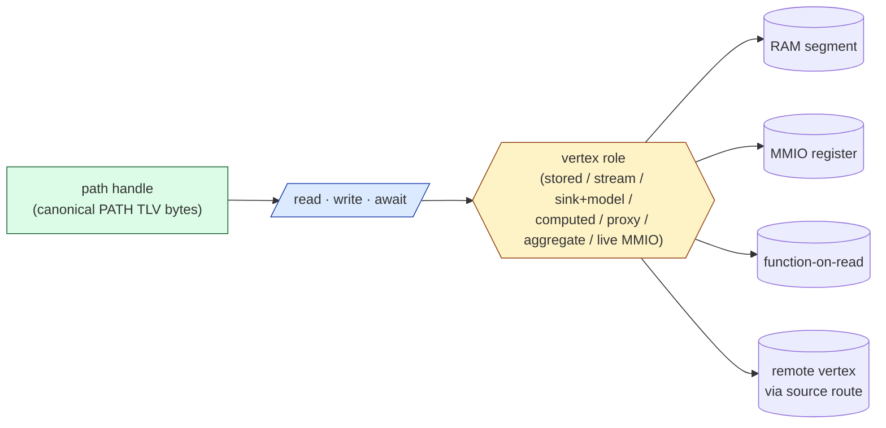

# Reference 11 — Vertex Roles, Address Grouping, and the Facade Principle

> **Status**: draft, v1, 2026-05-03. New material — generalizes the "vertex is unspecified beyond its API contract" remark from [02-graph-model.md](02-graph-model.md) §what the protocol does NOT specify into a worked-out taxonomy of the **kinds of things a path can name**, plus the rules for fronting multiple physical sources or sinks behind one logical address.
> **Audience**: anyone designing a non-trivial graph topology; anyone wondering whether a "shared canvas" should be modeled as streamed bytes, a state-mirror, or both at once; anyone implementing a forwarder that joins several transports behind one path.
> **Prerequisites**: [02-graph-model.md](02-graph-model.md), [03-addressing.md](03-addressing.md), [04-communication-flows.md](04-communication-flows.md), [07-host-embedding.md](07-host-embedding.md).

---

## The vertex-facade principle

> **A path names a contract, not an implementation.** Two vertices that satisfy the same read/write/subscribe contract are interchangeable from the API side, regardless of what backs them.

The protocol's read/write/subscribe primitives ([04-communication-flows.md](04-communication-flows.md)) operate against three observable behaviors:

| Operation | What the caller observes |
| ---- | ---- |
| `tracer_read(path)` → TLV | Some bytes the vertex produces *now* |
| `tracer_write(path, TLV)` | Bytes the vertex accepts *now*; effect is vertex-defined |
| `tracer_await(path)` / SUBSCRIBER | A stream of TLVs the vertex emits *over time* |

What lives behind the path is **deliberately unconstrained**. It can be a stored byte buffer, a stream of arrivals, a state-machine fed by writes, an MMIO snapshot, the output of a transform, or an aggregate of several remote vertices. Subscribers do not know which, and almost never need to.

This is the **facade principle**. The `:schema` field ([02-graph-model.md](02-graph-model.md) §schema discipline) is the only mechanism the protocol gives a subscriber to *interrogate* the contract — but it never reveals the implementation.



A consumer holds a path handle and calls read / write / await. What's behind the role boundary is invisible. Two vertices with the same schema are observationally equivalent regardless of role.

The rest of this document is the catalog of implementation kinds and the addressing patterns that compose them.

---

## Vertex roles (kinds of things a path resolves to)

These are not protocol-level type codes; they are **implementation patterns** at L4. A given vertex has exactly one role at any moment, decided when the vertex is registered. Application code declares the role via the vertex-creation API of its libtracer implementation; the protocol does not surface the role to peers.

### 1. Stored value (last-write-wins)

The simplest vertex. A single TLV is held; writes replace it; reads return it; subscribers receive every replacement.

- **Behavior**: `read` → most recent `write`. `subscribe` → every future `write`.
- **State size**: one TLV (typically a few bytes to a few KiB).
- **Used for**: configuration values, sensor readings, the "shared variable" pattern from [06-user-data-packing.md](06-user-data-packing.md) §the shared variable.

### 2. Stream (append-only, no replacement)

Writes do not replace prior values; they append to a stream. Reads return the most recent value (or a window); subscribers receive the sequence.

- **Behavior**: `read` → most recent OR a windowed list (`read("/x[..]")`). `write` → append, no displacement. `subscribe` → every append.
- **State size**: bounded by `:settings.history.keep_last_n`.
- **Used for**: log streams, sensor streams where each sample matters, address-shift slicing (each `[N]` slot is itself a stored value but the *parent* path acts as a stream).

### 3. Sink with internal model (mirror / state-machine)

This is the **canvas Mode B** of the introductory question. Writes are *commands* that mutate an internal model held by the vertex. Reads return the *materialized current state* of the model.

- **Behavior**: `write({command: ...})` mutates internal state. `read` → serialized current state. `subscribe` → either the stream of mutations OR the materialized state on each change, configurable.
- **State size**: arbitrary; bounded by the model.
- **Used for**: collaborative documents, mutable objects, drawing canvases, anything CRDT-shaped.

The crucial property: **a Mode-B canvas presents the same path as a Mode-A canvas**. A consumer that reads the canvas image gets bytes either way.

### 4. Computed / derived (function-on-read)

Reads invoke a function; the returned TLV is computed from upstream state, not stored.

- **Behavior**: `read` → call the registered function, return its result. `write` → optional; either rejected or treated as input to the function. `subscribe` → re-fire the function on every upstream change (typically registered via internal subscriptions to the upstream paths).
- **State size**: zero (or small cache).
- **Used for**: averages, filters, projections, joins of two sensor streams, FizzBuzz-style transforms.

### 5. Proxy (alias to another vertex)

The path is a redirect; reads/writes pass through to a target path that can be local or remote.

- **Behavior**: every operation is forwarded to `target_path`. Schema is the target's schema. Subscriptions register against the target.
- **State size**: zero (a forwarding rule).
- **Used for**: route proxies (the canonical form, see [07-host-embedding.md](07-host-embedding.md)); per-host aliases; renaming for ergonomics.

### 6. Aggregate (fan-in or fan-out front)

The path fronts multiple physical sources or sinks. A read aggregates; a write fans out; a subscription merges streams.

- **Behavior**: `read` → produces a TLV that combines the constituents (concatenation, last-of-each, sum, …). `write` → fanned to all sinks. `subscribe` → merged stream.
- **State size**: configuration only; backed by the constituents.
- **Used for**: a "global log" that merges per-peer logs, a "broadcast actuator" that writes to several physical motors at once, a multi-camera canvas where layers come from different hosts.

### 7. Live MMIO / register reflector

A view onto live memory whose value changes asynchronously to libtracer. Reads snapshot the current bytes; writes (if accepted) poke the memory.

- **Behavior**: `read` → snapshot now (per the resolved memory-binding contract — [08-views-and-ownership.md](08-views-and-ownership.md) §MMIO register-as-view and [ADR-0012](https://github.com/avatarsd-llc/libtracer/blob/main/docs/adr/0012-modular-memory-binding-transparent-router.md): snapshot is the recommended-safe default, a live binding is supported). `write` → poke. `subscribe` → polled at `:settings.poll_hz`.
- **State size**: zero (the bytes live in MMIO).
- **Used for**: GPIO registers, peripheral status, anything memory-mapped.

### Role table summary

| Role | `read` | `write` | `subscribe` | State |
| ---- | ---- | ---- | ---- | ---- |
| Stored value | most recent | replaces | future replacements | 1 TLV |
| Stream | recent / window | appends | every append | N TLVs |
| Sink with model | materialized state | mutates model | materialized OR mutation stream | model |
| Computed | call function | input to function | re-fires on upstream | cache |
| Proxy | forwards | forwards | forwards | rule |
| Aggregate | combines | fans out | merges | config |
| Live MMIO | snapshot | pokes | polls | none |

The protocol surfaces *none* of these to the wire. The schema may *describe* the contract (e.g., "writes are JSON-encoded `{op, args}` mutation commands") but cannot promise an implementation.

---

## The canvas, worked through both ways

Take the user's example: a canvas vertex at `/canvas`, with a 1024×1024×4-byte image as its observable state.

### Mode A — Transferred (canvas as stored value or stream)

```
Publisher (one host owns the canvas, paints into it):
    write("/canvas:image", VALUE{bytes = 4 MiB raster})

Subscribers:
    read("/canvas:image")        → returns the 4 MiB raster
    subscribe("/canvas:image")   → receives every full-canvas write
```

Implementation: a stored-value vertex at `/canvas:image`. Each repaint is a 4 MiB write. Bandwidth-heavy; the simplest possible model.

For a 4 MiB canvas at 30 Hz, this is 120 MB/s — reasonable on a LAN, painful on a constrained transport. The raster-as-single-write does not have to hit the wire as 4 MiB on every change; address-shift slicing ([03-addressing.md](03-addressing.md) §address-shift slicing) lets the publisher write `/canvas:image[0..N]` and let subscribers reassemble. Still bandwidth-bound by the *changed bytes*, plus retransmission if any.

### Mode B — Mirror (canvas as sink with model)

```
Publishers issue mutation commands:
    write("/canvas:ops", VALUE{op = "draw_line", from = ..., to = ...})
    write("/canvas:ops", VALUE{op = "fill_rect", rect = ..., color = ...})
    write("/canvas:ops", VALUE{op = "set_pixel", xy = ..., color = ...})

Subscribers can do either:
    A. read("/canvas:image")     → vertex serializes its model and returns the raster
    B. subscribe("/canvas:ops")  → subscriber maintains its own model and applies ops
```

Implementation: a sink-with-model vertex at `/canvas`. Internally, it owns the raster buffer and a renderer. Each `write` to `:ops` calls the renderer to update the buffer. Each `read` of `:image` serializes the buffer and returns it.

For a 4 MiB canvas updated at fine grain, this is a few hundred bytes per `:ops` write — the bandwidth scales with *operations*, not with canvas size. A one-pixel change costs ~30 bytes on the wire instead of 4 MiB.

### The crucial interchangeability claim

```
read("/canvas:image")  → 4 MiB raster bytes
```

This call works **identically** in Mode A and Mode B. From the consumer's API view, `/canvas:image` is just a path that returns a 4 MiB raster. The consumer:

- Does not know whether the bytes are stored as the most recent write to `:image` or computed by serializing an internal model.
- Cannot distinguish from inspection of the schema, *unless* the vertex chooses to expose its `:ops` field as a separate writable entry.
- Can switch between Mode A and Mode B without code changes — the path API is identical.

The vertex implementor chose the trade-off:

- **Mode A**: simpler implementation, lossless, large bandwidth.
- **Mode B**: smaller bandwidth (per-op), requires renderer logic in the vertex, model can drift if any subscriber missed an op (fixable by `:settings.history.keep_last_n` ≥ deadline window or by snapshot-and-resume on resubscribe).

The protocol's contribution: **the addressing scheme makes the choice invisible**.

### Hybrid — Mode B with periodic snapshot

A common production pattern: Mode B for live updates, plus a periodic Mode-A-style full-canvas write under `:image` for resync. Late joiners read `:image` once, then subscribe to `:ops` for the live tail.

```
Vertex setup:
    /canvas:ops      sink-with-model, accepts mutation commands
    /canvas:image    derived from the model; snapshot every N seconds
    /canvas:cursor   the last :ops index applied to the latest snapshot
                     (so subscribers can synthesize a join point on resume)

Late-joining subscriber:
    snap   = read("/canvas:image")
    cursor = read("/canvas:cursor")
    apply(snap)
    subscribe("/canvas:ops", since = cursor)   ← starts replay from cursor+1
```

This is the same pattern Kafka, distributed log systems, and CRDT replicas use. The protocol does not impose it; the application composes it from the read/write/subscribe primitives plus the schema's choice of fields.

---

## Address grouping (one path, many things behind it)

The aggregate role above is one form of grouping. There are several structural patterns; this section names them.

### Multi-source fan-in via wildcard subscription

```
A fan-in vertex /log/global subscribes to every peer's /peer/*/log:

write("/log/global:subscribers[]",
      SUBSCRIBER{ source_path = "/peer/*/log", target = "/log/global" })
```

Now any write to any `/peer/{id}/log` lands at `/log/global`. The fan-in vertex becomes the place where every host sends logs *as if* they wrote there directly. Behind the scenes, the wildcard subscription drives the fan-in.

This is **not** a special primitive — it falls out of wildcards plus the SUBSCRIBER target field. The aggregate-role vertex is just any vertex configured with a wildcard subscription pulling into it.

### Multi-sink fan-out

A vertex with multiple subscribers fans every write to each subscriber. This is the default behavior of [04-communication-flows.md](04-communication-flows.md) §write + fanout. Address grouping uses this directly:

```
Configure /actuator/all to fan out to specific physical actuators:

write("/actuator/all:subscribers[]", SUBSCRIBER{target = "/actuator/motor[0]"})
write("/actuator/all:subscribers[]", SUBSCRIBER{target = "/actuator/motor[1]"})
write("/actuator/all:subscribers[]", SUBSCRIBER{target = "/actuator/motor[2]"})
```

A single `write("/actuator/all", ...)` then drives all three motors. From the writer's API view, `/actuator/all` is one path; behind it, the fan-out is invisible.

### Compound vertex composed of children

A vertex's children are themselves vertices. The parent path is a *grouping* of children. A compound canvas can be expressed as:

```
/canvas/layer[0]    ← background, source = host A
/canvas/layer[1]    ← drawing layer, source = host B
/canvas/layer[2]    ← overlay, source = host C
/canvas:image       ← derived: composite of all layers (computed/role-4)
```

A subscriber that wants the live composite reads `/canvas:image`. A subscriber that wants only one layer subscribes to that child. The router behind `/canvas:image` is a computed-role vertex whose function joins its children.

### Redundant links are distinct explicit routes

Two links to the same peer are two transport-vertices ([ADR-0027](../adr/0027-transport-and-connections-are-vertices.md)), hence two routed addresses for the same remote vertex:

```
/net/can0/sensor/wheel/left    ← route #1 (over CAN)
/net/tcp0/sensor/wheel/left    ← route #2 (over TCP), the same sensor
```

A consumer that wants redundancy subscribes to **both** routes and receives both deliveries — that is the point: an `await` timeout on one route detects the dead link, so failover is a visible signal, not a hidden merge. There is no duplicate detection anywhere in the net plane, and none is needed — every arrival travels a route the consumer deliberately named. See [reference/13](13-network-formation.md).

This is the practical realization of the earlier load-bearing claim ([00-overview.md](00-overview.md) §the six load-bearing claims #4): **forwarding is core**. A consumer can hold one route now, switch to another on failover, or hold both redundantly — the vertex's own path on its home node is unchanged throughout.

---

## How the forwarder combines transports + endpoints

Section walked through with the canvas as the running example.

### Step 1 — Configuration

A host hosts the canvas. Its config selects a vertex role and the transports that should carry traffic to/from it (illustrative config, TOML-like):

```ini
[[vertex]]
path = "/canvas"
role = "sink_with_model"
model = "raster_2d_renderer"
:image_size = [1024, 1024, 4]

[[vertex.subscribers]]
target = "/local/snapshot_recorder"      # in-process subscriber for backups

[[connection]]
# Each link is a transport-vertex in the path tree: /net/tcp0, /net/udp0 (ADR-0027).
name = "tcp0"
transport = "transport_tcp"

[[connection]]
name = "udp0"
transport = "transport_udp_multicast"
```

The vertex is one path. The node's forwarder dispatches each inbound `FWD` frame to it; each remote subscriber's deliveries leave over the link its stored return route names.

### Step 2 — A write arrives

A peer writes `/canvas:ops` over TCP. The node:

1. Receives the frame via the `tcp0` link's receiver.
2. Validates the trailer (CRC, timestamp), strips it. (L2 → L3.)
3. The frame is an `FWD{WRITE}` ([RFC-0004](../spec/rfcs/0004-remote-operation-addressing.md)) whose `dst` names a local vertex — a terminus request: the forwarder decodes it and applies the op.
4. The bare payload TLV is dispatched to `/canvas:ops` (L3 → L4).
5. The vertex's sink-with-model handler runs the renderer, mutating `:image`.
6. Peers that subscribed via UDP hold remote-subscriber slots on the vertex; the fan-out emits each one an `FWD{WRITE}` delivery along its stored return route, out over `udp0`.
7. The local subscriber `/local/snapshot_recorder` receives it via fan-out.

Every transport boundary is a forwarder-internal concern. The application only sees `/canvas:ops` change.

### Step 3 — A read arrives

A peer reads `/canvas:image`. The node:

1. Receives the `FWD{READ}` request via the `tcp0` link.
2. Resolves the path against the local graph; finds the sink-with-model vertex.
3. Calls the vertex's `:image` accessor, which serializes the model into a 4 MiB TLV.
4. Sends an `FWD{REPLY}` back over the link the request arrived on, routed by the request's accumulated `src` (per [04-communication-flows.md](04-communication-flows.md) §read flow).

The reader does not know the bytes were synthesized on the fly from a model rather than copied out of a stored buffer. They look identical. *That* is the facade principle in action.

### Step 4 — A screen addresses the canvas through a route

A second host (a screen) wants to display the canvas without participating in the model. It names its TCP link to the canvas host (say `canvas-host`) and addresses the canvas **through** it — the path is the route:

```toml
[[connection]]
name = "canvas-host"           # the screen's transport-vertex: /net/canvas-host
transport = "transport_tcp"
```

The screen subscribes to `/net/canvas-host/canvas:image` and gets snapshots; or to `/net/canvas-host/canvas:ops` and runs its own renderer to apply ops locally. *Same single canvas* — just two views of it.

If the screen later goes offline, the canvas-host doesn't notice (other than the TCP socket closing). When the screen reconnects, it reads `:image` once for resync, then resumes `:ops`. The canvas-host's vertex is unchanged across all of this.

This works because:

- The path is the contract; the transport is invisible.
- The vertex role determines what reads/writes/subscriptions *do*; the protocol doesn't second-guess.
- Forwarders are routing; they don't synthesize role.
- Aggregation rules (fan-in / fan-out / compound) are configuration, not protocol surface.

---

## The contract between role and schema

The role is **invisible** to remote peers; the schema is **visible**. A well-designed vertex documents in its schema the things a peer must know:

- What writes are accepted and what they mean.
- What reads return.
- Whether subscriptions are by-replacement or by-event.
- Per-subscriber state shape (typically standard from [05-protocol-tlvs.md](05-protocol-tlvs.md) §SUBSCRIBER, but with module-namespaced extensions per [02-graph-model.md](02-graph-model.md) §schema discipline).

Two vertices with the same schema are **observationally equivalent**. They may use different roles internally and still be drop-in replaceable. This is the discipline the protocol asks vertex authors to keep — the schema is the contract; the role is the implementation choice.

A schema's relationship to vertex roles:

| Schema declares | Vertex role hints (typical) |
| ---- | ---- |
| `read` returns the last write | stored value (role 1) |
| `read` returns a window of recent writes | stream (role 2) |
| `:ops` is writable, `:image` is read-only | sink with model (role 3) |
| `read` returns a function of upstream | computed (role 4) |
| Forwarded to another path | proxy (role 5) |
| `read` aggregates of children | aggregate (role 6) |
| `read` returns a snapshot of MMIO | live MMIO (role 7) |

The schema cannot enumerate the role exhaustively; an implementer is free to invent new roles as long as the read/write/subscribe contract is satisfied.

---

> **In-band creation ([ADR-0017](../adr/0017-in-band-vertex-creation-controller-orchestration.md)).** Vertex registration is not only an out-of-band, local act — creation is also an **in-band, ACL-gated field-write**: an orchestrator writes a *controller-spec* `{type, path, config}` into a device's creation field (`:children[]`/`:controllers[]`), and the device instantiates one of its **own known controller types** (the creation field's schema is the device's **controller-type catalog**). Creation and **binding** are separate steps — creation exposes the controller's **port vertices**; binding wires them with SUBSCRIBER edges. *Roles* (the implementation pattern below) stay invisible; only the device's *type catalog* becomes visible.

## What this document does NOT specify

- A **role-discovery wire format**. **Roles** (the seven implementation patterns below) are intentionally invisible — a peer cannot interrogate *how* a vertex is implemented. (This is distinct from a device's **controller-type catalog**, which *is* visible, per [ADR-0017](../adr/0017-in-band-vertex-creation-controller-orchestration.md): the catalog names *types the device can instantiate*, not the internal role of any existing vertex.) Schemas describe what a vertex *does*; they do not name how it does it.
- A **CRDT or consistency protocol** for sink-with-model vertices. Out of scope; if your model needs convergence guarantees across replicas, lift them into the application layer (per [04-communication-flows.md](04-communication-flows.md) §coherency notes).
- The **fan-in and fan-out scheduling** beyond "first-arrived-wins-by-timestamp." Implementations may add policies (`prefer_low_latency`, `quorum_n_of_m`); this document just observes the structural patterns.

---

## Verification against existing reference docs

| Concept here | Already covered in | Status |
| ---- | ---- | ---- |
| Vertex backing is unspecified (RAM, MMIO, file, function-on-read) | [02-graph-model.md](02-graph-model.md) §what the protocol does NOT specify | Existed; this doc develops the taxonomy |
| Shared variable pattern as `subscribe + transient_local` | [06-user-data-packing.md](06-user-data-packing.md) §the shared variable pattern | Existed; here it becomes role 1 (stored value) |
| Route proxy as a vertex that forwards | [07-host-embedding.md](07-host-embedding.md) §per-host view | Existed; here it becomes role 5 (proxy) |
| Wildcard subscription mechanics | [03-addressing.md](03-addressing.md) §wildcards | Existed; here used to build aggregate-role vertices |
| Address-shift slicing for big payloads | [03-addressing.md](03-addressing.md) §address-shift slicing | Existed; here it composes with role 2 (stream) and Mode A canvas |
| Schema as the visible contract | [02-graph-model.md](02-graph-model.md) §schema discipline | Existed; here promoted to "the only role-discovery surface" |
| Redundant links as distinct explicit routes | [07-host-embedding.md](07-host-embedding.md) | Existed; here used in §redundant links |
| MMIO snapshot semantics | [10-module-catalog.md](10-module-catalog.md) §MMIO TOCTOU OPEN QUESTION | Existed; here it becomes role 7 |

**Genuinely new** in this document:

- The seven-role taxonomy (most prior docs treated the vertex monolithically).
- The explicit "Mode A vs Mode B canvas, same path" worked example.
- The address-grouping patterns (multi-source fan-in, multi-sink fan-out, compound vertex, per-transport split) collected as one section.
- The "schema vs role" contract distinction.

If you read this doc and find a worked example of a vertex pattern that overlaps with one of the prior sections without naming it as the same pattern, please flag it — the goal is consolidation, not duplication.
