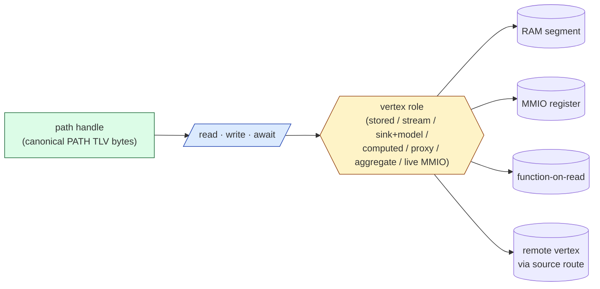

# Reference 11 — Vertex roles and aggregation

> **Topic**: the kinds of thing a path can name, and the rules for fronting several physical sources or sinks behind one logical address. This generalizes the rule that a vertex is unspecified beyond its API contract ([02-graph-model.md](02-graph-model.md) §the graph imposes no shape) into a taxonomy of implementation patterns plus the addressing patterns that compose them.
> **Audience**: anyone designing a non-trivial graph topology; anyone deciding whether a shared canvas is streamed bytes, a state mirror, or both at once; anyone implementing a forwarder that joins several transports behind one path.
> **Prerequisites**: [02-graph-model.md](02-graph-model.md), [03-addressing.md](03-addressing.md), [04-communication-flows.md](04-communication-flows.md), [07-host-embedding.md](07-host-embedding.md).

---

## The vertex-facade principle

> **A path names a contract, not an implementation.** Two vertices that satisfy the same read/write/subscribe contract are interchangeable from the API side, regardless of what backs them.

The protocol's read/write/subscribe primitives ([04-communication-flows.md](04-communication-flows.md)) operate against three observable behaviors:

| Operation | What the caller observes |
| ---- | ---- |
| `tracer_read(path)` → TLV | Some bytes the vertex produces *now* |
| `tracer_write(path, TLV)` | Bytes the vertex accepts *now*; effect is vertex-defined |
| `tracer_await(path)` / SUBSCRIBER | A stream of TLVs the vertex emits *over time* |

What lives behind the path is **deliberately unconstrained**. It can be a stored byte buffer, a stream of arrivals, a state-machine fed by writes, an MMIO snapshot, the output of a transform, or an aggregate of several remote vertices. Subscribers do not know which, and almost never need to.

This is the **facade principle**. The `:schema` field ([02-graph-model.md](02-graph-model.md) §schema and field discipline) is the only mechanism the protocol gives a subscriber to *interrogate* the contract — and it never reveals the implementation.


```mermaid
flowchart LR
    H["path handle<br/>(canonical PATH TLV bytes)"]
    API[/"read · write · await"/]
    R{{"vertex role<br/>(stored / stream / sink+model /<br/>computed / proxy / aggregate / live MMIO)"}}
    BACK1[("RAM segment")]
    BACK2[("MMIO register")]
    BACK3[("function-on-read")]
    BACK4[("remote vertex<br/>via source route")]
    H --> API
    API --> R
    R --> BACK1
    R --> BACK2
    R --> BACK3
    R --> BACK4
    style H fill:#dcfce7,stroke:#166534
    style API fill:#dbeafe,stroke:#1e40af
    style R fill:#fef3c7,stroke:#92400e
```

A consumer holds a path handle and calls read / write / await. What sits behind the role boundary is invisible. Two vertices with the same schema are observationally equivalent regardless of role.

The rest of this document is the catalog of implementation kinds and the addressing patterns that compose them.

---

## Vertex roles (kinds of things a path resolves to)

These are not protocol-level type codes; they are **implementation patterns** at L4. A given vertex has exactly one role at any moment, decided when the vertex is registered. Application code declares the role via the vertex-creation API of its libtracer implementation; the protocol does not surface the role to peers.

### 1. Stored value (last-write-wins)

The simplest vertex. A single TLV is held; writes replace it; reads return it; subscribers receive every replacement.

- **Behavior**: `read` → most recent `write`. `subscribe` → every future `write`.
- **State size**: one TLV (typically a few bytes to a few KiB).
- **Used for**: configuration values, sensor readings, the shared-variable pattern of [06-user-data-packing.md](06-user-data-packing.md) §"Synchronize the value of a variable" pattern.

### 2. Stream (append-only, no replacement)

Writes do not replace prior values; they append to a stream. Reads return the most recent value (or a window); subscribers receive the sequence.

- **Behavior**: `read` → most recent OR a windowed list (`read("/x[..]")`). `write` → append, no displacement. `subscribe` → every append.
- **State size**: bounded by the vertex's configured history window (a `:settings` knob; the protocol fixes no depth).
- **Used for**: log streams, sensor streams where each sample matters, address-shift slicing (each `[N]` slot is itself a stored value but the *parent* path acts as a stream).

### 3. Sink with internal model (mirror / state-machine)

This is Mode B of the canvas example below. Writes are *commands* that mutate an internal model held by the vertex. Reads return the *materialized current state* of the model.

- **Behavior**: `write({command: ...})` mutates internal state. `read` → serialized current state. `subscribe` → either the stream of mutations OR the materialized state on each change, configurable.
- **State size**: arbitrary; bounded by the model.
- **Used for**: collaborative documents, mutable objects, drawing canvases, anything CRDT-shaped.

The crucial property: **a Mode-B canvas presents the same path as a Mode-A canvas**. A consumer that reads the canvas image gets bytes either way.

### 4. Computed / derived (function-on-read)

Reads invoke a function; the returned TLV is computed from upstream state, not stored.

- **Behavior**: `read` → call the registered function, return its result. `write` → optional; either rejected or treated as input to the function. `subscribe` → re-fire the function on every upstream change (typically registered via internal subscriptions to the upstream paths).
- **State size**: zero (or small cache).
- **Used for**: averages, filters, projections, joins of two sensor streams, FizzBuzz-style transforms.

### 5. Proxy (alias to another vertex)

The path is a redirect; reads/writes pass through to a target path that can be local or remote.

- **Behavior**: every operation is forwarded to `target_path`. Schema is the target's schema. Subscriptions register against the target.
- **State size**: zero (a forwarding rule).
- **Used for**: route proxies (the canonical form, see [07-host-embedding.md](07-host-embedding.md)); per-host aliases; renaming for ergonomics.

### 6. Aggregate (fan-in or fan-out front)

The path fronts multiple physical sources or sinks. A read aggregates; a write fans out; a subscription merges streams.

- **Behavior**: `read` → produces a TLV that combines the constituents (concatenation, last-of-each, sum, …). `write` → fanned to all sinks. `subscribe` → merged stream.
- **State size**: configuration only; backed by the constituents.
- **Used for**: a "global log" that merges per-peer logs, a "broadcast actuator" that writes to several physical motors at once, a multi-camera canvas where layers come from different hosts.

### 7. Live MMIO / register reflector

A view onto live memory whose value changes asynchronously to libtracer. Reads snapshot the current bytes; writes (if accepted) poke the memory.

- **Behavior**: `read` → snapshot now (per the resolved memory-binding contract — [08-views-and-ownership.md](08-views-and-ownership.md) §MMIO register-as-view and [ADR-0012](https://github.com/avatarsd-llc/libtracer/blob/main/docs/adr/0012-modular-memory-binding-transparent-router.md): snapshot is the recommended-safe default, a live binding is supported). `write` → poke. `subscribe` → polled at the vertex's configured poll interval (a `:settings` knob).
- **State size**: zero (the bytes live in MMIO).
- **Used for**: GPIO registers, peripheral status, anything memory-mapped.

### Role table summary

| Role | `read` | `write` | `subscribe` | State |
| ---- | ---- | ---- | ---- | ---- |
| Stored value | most recent | replaces | future replacements | 1 TLV |
| Stream | recent / window | appends | every append | N TLVs |
| Sink with model | materialized state | mutates model | materialized OR mutation stream | model |
| Computed | call function | input to function | re-fires on upstream | cache |
| Proxy | forwards | forwards | forwards | rule |
| Aggregate | combines | fans out | merges | config |
| Live MMIO | snapshot | pokes | polls | none |

The protocol surfaces *none* of these to the wire. The schema may *describe* the contract (for example, "writes are JSON-encoded `{op, args}` mutation commands") but cannot promise an implementation.

---

## The canvas, worked through both ways

A canvas vertex at `/canvas` holds a 1024×1024×4-byte image as its observable state.

### Mode A — Transferred (canvas as stored value or stream)

```
Publisher (one host owns the canvas, paints into it):
    write("/canvas:image", VALUE{bytes = 4 MiB raster})

Subscribers:
    read("/canvas:image")        → returns the 4 MiB raster
    subscribe("/canvas:image")   → receives every full-canvas write
```

Implementation: a stored-value vertex at `/canvas:image`. Each repaint is a 4 MiB write. Bandwidth-heavy; the simplest possible model.

For a 4 MiB canvas at 30 Hz, this is 120 MB/s — reasonable on a LAN, painful on a constrained transport. The raster-as-single-write does not have to hit the wire as 4 MiB on every change; address-shift slicing ([03-addressing.md](03-addressing.md) §address-shift slicing) lets the publisher write `/canvas:image[0..N]` and let subscribers reassemble. Still bandwidth-bound by the *changed bytes*, plus retransmission if any.

### Mode B — Mirror (canvas as sink with model)

```
Publishers issue mutation commands:
    write("/canvas:ops", VALUE{op = "draw_line", from = ..., to = ...})
    write("/canvas:ops", VALUE{op = "fill_rect", rect = ..., color = ...})
    write("/canvas:ops", VALUE{op = "set_pixel", xy = ..., color = ...})

Subscribers can do either:
    A. read("/canvas:image")     → vertex serializes its model and returns the raster
    B. subscribe("/canvas:ops")  → subscriber maintains its own model and applies ops
```

Implementation: a sink-with-model vertex at `/canvas`. Internally, it owns the raster buffer and a renderer. Each `write` to `:ops` calls the renderer to update the buffer. Each `read` of `:image` serializes the buffer and returns it.

For a 4 MiB canvas updated at fine grain, this is a few hundred bytes per `:ops` write — the bandwidth scales with *operations*, not with canvas size. A one-pixel change costs ~30 bytes on the wire instead of 4 MiB.

### Interchangeability of the two modes

```
read("/canvas:image")  → 4 MiB raster bytes
```

This call works **identically** in Mode A and Mode B. From the consumer's API view, `/canvas:image` is just a path that returns a 4 MiB raster. The consumer:

- Does not know whether the bytes are stored as the most recent write to `:image` or computed by serializing an internal model.
- Cannot distinguish from inspection of the schema, *unless* the vertex chooses to expose its `:ops` field as a separate writable entry.
- Can switch between Mode A and Mode B without code changes — the path API is identical.

The vertex implementor chose the trade-off:

- **Mode A**: simpler implementation, lossless, large bandwidth.
- **Mode B**: smaller bandwidth (per-op), requires renderer logic in the vertex, model can drift if any subscriber missed an op — repaired by a history window at least as long as the reconnect deadline, or by snapshot-and-resume on resubscribe.

The protocol's contribution: **the addressing scheme makes the choice invisible**.

### Hybrid — Mode B with periodic snapshot

A common production pattern: Mode B for live updates, plus a periodic Mode-A-style full-canvas write under `:image` for resync. Late joiners read `:image` once, then subscribe to `:ops` for the live tail.

```
Vertex setup:
    /canvas:ops      sink-with-model, accepts mutation commands
    /canvas:image    derived from the model; snapshot every N seconds
    /canvas:cursor   the last :ops index applied to the latest snapshot
                     (so subscribers can synthesize a join point on resume)

Late-joining subscriber:
    snap   = read("/canvas:image")
    cursor = read("/canvas:cursor")
    apply(snap)
    subscribe("/canvas:ops")
    ← ops at or below `cursor` are folded into `snap`, so the subscriber
      discards them. The join point is application logic, not a subscribe
      parameter — the protocol has no replay-from-index surface.
```

This is the same pattern Kafka, distributed log systems, and CRDT replicas use. The protocol does not impose it; the application composes it from the read/write/subscribe primitives plus the schema's choice of fields.

---

## Address grouping (one path, many things behind it)

The aggregate role above is one form of grouping. There are several structural patterns; this section names them.

### Multi-source fan-in via subtree subscription

```
A fan-in vertex /log/global subscribes at the peers' common ancestor:

write("/peer:subscribers[]",
      SUBSCRIBER{ target = "/log/global" })
```

Every subscription is a subtree subscription ([RFC-0005](https://github.com/avatarsd-llc/libtracer/blob/main/docs/spec/rfcs/0005-subtree-subscriptions.md)), so the edge at `/peer` observes every write to any `/peer/{id}/log` — and anything else under `/peer`. The consumer filters if the subtree carries more than logs; selecting only sibling-pattern paths like `/peer/*/log` would need the unratified per-segment wildcard grammar ([03-addressing.md](03-addressing.md) §future direction: per-segment wildcards). `/log/global` becomes the place where every host's log lands *as if* they wrote there directly.

This is **not** a special primitive — it falls out of subtree subscription plus the SUBSCRIBER target field. The aggregate-role vertex is just any vertex a subtree subscription pulls into.

### Multi-sink fan-out

A vertex with multiple subscribers fans every write to each subscriber. This is the default behavior of [04-communication-flows.md](04-communication-flows.md) §write (publish + fanout). Address grouping uses this directly:

```
Configure /actuator/all to fan out to specific physical actuators:

write("/actuator/all:subscribers[]", SUBSCRIBER{target = "/actuator/motor[0]"})
write("/actuator/all:subscribers[]", SUBSCRIBER{target = "/actuator/motor[1]"})
write("/actuator/all:subscribers[]", SUBSCRIBER{target = "/actuator/motor[2]"})
```

A single `write("/actuator/all", ...)` then drives all three motors. From the writer's API view, `/actuator/all` is one path; behind it, the fan-out is invisible.

### Compound vertex composed of children

A vertex's children are themselves vertices. The parent path is a *grouping* of children. A compound canvas can be expressed as:

```
/canvas/layer[0]    ← background, source = host A
/canvas/layer[1]    ← drawing layer, source = host B
/canvas/layer[2]    ← overlay, source = host C
/canvas:image       ← derived: composite of all layers (computed, role 4)
```

A subscriber that wants the live composite reads `/canvas:image`. A subscriber that wants only one layer subscribes to that child. The router behind `/canvas:image` is a computed-role vertex whose function joins its children.

### Redundant links are distinct explicit routes

Two links to the same peer are two connection vertices ([ADR-0027](https://github.com/avatarsd-llc/libtracer/blob/main/docs/adr/0027-transport-and-connections-are-vertices.md)), hence two routed addresses for the same remote vertex:

```
/net/can-client/can0/sensor/wheel/left    ← route 1, over the CAN link named can0
/net/tcp-client/tcp0/sensor/wheel/left    ← route 2, over the TCP link named tcp0
                                            — the same sensor
```

A routed address carries **two** segments before the remote path: the *module* the connection belongs to and the connection's own *name* ([ADR-0061](https://github.com/avatarsd-llc/libtracer/blob/main/docs/adr/0061-per-transport-mount-routing-strip-k-l5-demux.md)). A module is one (transport, role) shape; a transport that does not declare a module name of its own falls back to `<kind>-client` for a dialling link and `<kind>-server` for a listening one. See §in-band creation and the type catalog below.

A consumer that wants redundancy subscribes to **both** routes and receives both deliveries — that is the point: an `await` timeout on one route detects the dead link, so failover is a visible signal, not a hidden merge. There is no duplicate detection anywhere in the net plane, and none is needed — every arrival travels a route the consumer deliberately named. See [reference/13](13-network-formation.md).

This is the practical realization of load-bearing claim 4, *forwarding is core* ([00-overview.md](00-overview.md) §the six load-bearing claims): a consumer can hold one route, switch to another on failover, or hold both redundantly — the vertex's own path on its home node is unchanged throughout.

---

## Transports and endpoints behind one path

The canvas vertex is the running example for this section.

### Step 1 — Configuration

One node owns the canvas. Its configuration selects a vertex role and the connections that should carry traffic to and from it (illustrative, TOML-shaped):

```ini
[[vertex]]
path = "/canvas"
role = "sink_with_model"
model = "raster_2d_renderer"
:image_size = [1024, 1024, 4]

[[vertex.subscribers]]
target = "/local/snapshot_recorder"      # in-process subscriber for backups

[[connection]]
# Each connection is a vertex mounted and routed at /net/<module>/<name>
# (ADR-0027, ADR-0061); the module follows from (kind, role), so the dialling
# TCP link below mounts at /net/tcp-client/tcp0.
name = "tcp0"
transport = "transport_tcp"

[[connection]]
name = "udp0"
transport = "transport_udp_multicast"
```

The vertex is one path. The node's forwarder dispatches each inbound `FWD` frame to it; each remote subscriber's deliveries leave over the link its stored return route names.

### Step 2 — A write arrives

A peer writes `/canvas:ops` over TCP. The node:

1. Receives the frame via the `tcp0` link's receiver.
2. Validates the trailer (CRC, timestamp), strips it. (L2 → L3.)
3. The frame is an `FWD{WRITE}` ([RFC-0004](https://github.com/avatarsd-llc/libtracer/blob/main/docs/spec/rfcs/0004-remote-operation-addressing.md)) whose `dst` names a local vertex — a terminus request: the forwarder decodes it and applies the op.
4. The bare payload TLV is dispatched to `/canvas:ops` (L3 → L4).
5. The vertex's sink-with-model handler runs the renderer, mutating `:image`.
6. Peers that subscribed over UDP hold remote-subscriber slots on the vertex; the fan-out emits each one an `FWD{WRITE}` delivery along its stored return route, out over `udp0`.
7. The local subscriber `/local/snapshot_recorder` receives it via fan-out.

Every transport boundary is a forwarder-internal concern. The application only sees `/canvas:ops` change.

### Step 3 — A read arrives

A peer reads `/canvas:image`. The node:

1. Receives the `FWD{READ}` request via the `tcp0` link.
2. Resolves the path against the local graph; finds the sink-with-model vertex.
3. Calls the vertex's `:image` accessor, which serializes the model into a 4 MiB TLV.
4. Sends an `FWD{REPLY}` back over the link the request arrived on, routed by the request's accumulated `src` (per [04-communication-flows.md](04-communication-flows.md) §read).

The reader does not know the bytes were synthesized on the fly from a model rather than copied out of a stored buffer. They look identical. *That* is the facade principle in action.

### Step 4 — A screen addresses the canvas through a route

A second host (a screen) displays the canvas without participating in the model. It names its TCP link to the canvas host and addresses the canvas **through** it — the path is the route:

```toml
[[connection]]
name = "canvas-host"           # mounts at /net/tcp-client/canvas-host
transport = "transport_tcp"
```

The screen subscribes to `/net/tcp-client/canvas-host/canvas:image` and gets snapshots; or to `/net/tcp-client/canvas-host/canvas:ops` and runs its own renderer to apply ops locally. *Same single canvas* — just two views of it.

If the screen goes offline, the canvas host does not notice beyond the TCP socket closing. On reconnect the screen reads `:image` once for resync, then resumes `:ops`. The canvas host's vertex is unchanged across all of this.

This works because:

- The path is the contract; the transport is invisible.
- The vertex role determines what reads/writes/subscriptions *do*; the protocol does not second-guess.
- Forwarders are routing; they do not synthesize role.
- Aggregation rules (fan-in / fan-out / compound) are configuration, not protocol surface.

---

## The contract between role and schema

The role is **invisible** to remote peers; the schema is **visible**. A well-designed vertex documents in its schema the things a peer must know:

- What writes are accepted and what they mean.
- What reads return.
- Whether subscriptions are by-replacement or by-event.
- Per-subscriber state shape (typically standard from [05-protocol-tlvs.md](05-protocol-tlvs.md) §`0x04` — SUBSCRIBER, but with module-namespaced extensions per [02-graph-model.md](02-graph-model.md) §schema and field discipline).

Two vertices with the same schema are **observationally equivalent**. They may use different roles internally and still be drop-in replaceable. This is the discipline the protocol asks vertex authors to keep — the schema is the contract; the role is the implementation choice.

A schema's relationship to vertex roles:

| Schema declares | Vertex role hints (typical) |
| ---- | ---- |
| `read` returns the last write | stored value (role 1) |
| `read` returns a window of recent writes | stream (role 2) |
| `:ops` is writable, `:image` is read-only | sink with model (role 3) |
| `read` returns a function of upstream | computed (role 4) |
| Forwarded to another path | proxy (role 5) |
| `read` aggregates of children | aggregate (role 6) |
| `read` returns a snapshot of MMIO | live MMIO (role 7) |

The schema cannot enumerate the role exhaustively; an implementer is free to invent new roles as long as the read/write/subscribe contract is satisfied.

---

## In-band creation and the type catalog

Vertex registration is not only an out-of-band, local act. Creation is also an **in-band, ACL-gated write**: an orchestrator writes a controller-spec `SPEC{type, path, config}` to a device's **creator endpoint**, and the device instantiates one of its **own known types** ([ADR-0017](https://github.com/avatarsd-llc/libtracer/blob/main/docs/adr/0017-in-band-vertex-creation-controller-orchestration.md), superseded by [ADR-0059](https://github.com/avatarsd-llc/libtracer/blob/main/docs/adr/0059-creator-endpoint-creation-and-removal-are-writes-to-a-vertex.md), which replaces the earlier `:children[]` / `:controllers[]` creation-field spelling). Creation and **binding** are separate steps: creation exposes the new vertex's port vertices, and binding wires them with SUBSCRIBER edges ([reference/13](13-network-formation.md)).

What this makes visible is the device's **type catalog** — the types it can instantiate. *Roles* stay invisible: no peer can interrogate how an existing vertex is implemented.

The net plane carries the same shape for connections:

- **The surface an implementation meets.** A connection is created by a `SPEC` write to the `/net:children[]` catalog carrying a `kind` field that selects the transport; the two catalog child types are the dial shape and the listen shape. The created connection vertex is mounted — and routed — at **`/net/<module>/<name>`**, where `<module>` is the module name the transport declares for that (kind, role) pair, defaulting to `<kind>-client` for a dialling link and `<kind>-server` for a listening one ([ADR-0061](https://github.com/avatarsd-llc/libtracer/blob/main/docs/adr/0061-per-transport-mount-routing-strip-k-l5-demux.md)).
- **The accepted direction.** [RFC-0014](https://github.com/avatarsd-llc/libtracer/blob/main/docs/spec/rfcs/0014-creator-endpoint-connection-lifecycle-and-link-liveness.md) replaces the single global catalog with a **per-module creator endpoint** at `/net/<module>/conn`: `SPEC{name, config}` creates `/net/<module>/<name>` (gated `CREATE`), `NAME{<name>}` retires it (gated `WRITE`), and a read of `conn:schema` *is* that module's catalog. The role becomes positional — it is the module — rather than a config field. **That endpoint is not implemented**; the global `/net:children[]` catalog with a `kind` selector is what a peer meets. The mount-and-route rule at `/net/<module>/<name>` is realised.

---

## Pitfalls

- **Role is not discoverable, so do not infer one.** An implementation that reads a schema, concludes "this is a stored value", and caches the last write as authoritative will serve stale bytes for a computed or live-MMIO vertex, whose read is defined to produce bytes *now*. The schema constrains the contract, never the backing.
- **A Mode-B mirror without a resync point diverges silently.** A subscriber that only ever subscribes to `:ops` and never reads `:image` stays permanently wrong after missing one mutation, with no error to observe. A model-mirroring vertex needs either a history window at least as long as the reconnect deadline, or a snapshot-plus-cursor join point.
- **A subtree subscription captures the whole subtree.** Subscribing at `/peer` to collect `/peer/{id}/log` also delivers every other write under `/peer`; the consumer filters. v1 has no per-segment wildcard, so there is no way to ask for the sibling pattern instead.
- **Redundant routes are not deduplicated.** A consumer subscribed over two routes to the same remote vertex receives two deliveries per write. An implementation that suppresses the second as a duplicate destroys the failover signal that is the second route's entire purpose.
- **A routed address is not `/net/<name>`.** The connection segment is two segments — module then name. An implementation that builds `/net/<name>/<remote path>` addresses a module vertex that does not exist and the route fails to resolve.
- **Fan-out configuration appends.** `write("/x:subscribers[]", …)` appends an edge; `write("/x:subscribers[N]", …)` addresses slot `N`. Building a fan-out front by repeatedly writing `[0]` yields one subscriber, not three.

---

## Outside the scope of this document

- A **role-discovery wire format**. The seven roles above are intentionally invisible — a peer cannot interrogate *how* a vertex is implemented. This is distinct from a device's **type catalog**, which *is* visible ([ADR-0017](https://github.com/avatarsd-llc/libtracer/blob/main/docs/adr/0017-in-band-vertex-creation-controller-orchestration.md)): the catalog names *types the device can instantiate*, not the internal role of any existing vertex. Schemas describe what a vertex *does*; they do not name how it does it.
- A **CRDT or consistency protocol** for sink-with-model vertices. If a model needs convergence guarantees across replicas, they belong in the application layer (per [04-communication-flows.md](04-communication-flows.md) §network partition and recovery).
- **Fan-in and fan-out scheduling** beyond first-arrived-wins-by-timestamp. Implementations may add policies (`prefer_low_latency`, `quorum_n_of_m`); this document observes the structural patterns only.

---

## Where these patterns are specified elsewhere

| Concept | Specified in | Role here |
| ---- | ---- | ---- |
| Vertex backing is unspecified (RAM, MMIO, file, function-on-read) | [02-graph-model.md](02-graph-model.md) §the graph imposes no shape | The taxonomy that develops it |
| Shared-variable pattern via subscribe + `transient_local` | [06-user-data-packing.md](06-user-data-packing.md) §"Synchronize the value of a variable" pattern | Role 1 (stored value) |
| Route proxy as a vertex that forwards | [07-host-embedding.md](07-host-embedding.md) §per-host view | Role 5 (proxy) |
| Subtree subscription mechanics | [03-addressing.md](03-addressing.md) §subtree subscriptions | Builds aggregate-role vertices |
| Address-shift slicing for large payloads | [03-addressing.md](03-addressing.md) §address-shift slicing | Composes with role 2 and the Mode-A canvas |
| Schema as the visible contract | [02-graph-model.md](02-graph-model.md) §schema and field discipline | The only role-adjacent discovery surface |
| Redundant links as distinct explicit routes | [07-host-embedding.md](07-host-embedding.md) §global topology | §redundant links are distinct explicit routes |
| MMIO snapshot semantics | [10-module-catalog.md](10-module-catalog.md) §hard integrations (`mem_mmio` reads: TOCTOU on a live register) | Role 7 (live MMIO) |

The toctree in [README.md](README.md) is the order of record for this suite.
