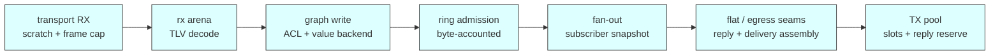

# Backpressure and sizing — wiring every bound so the bottleneck is chosen

> **Genre**: descriptive reference. It assembles behaviour specified elsewhere into one
> narrative a deployer can follow; where it paraphrases, it **cites**. The normative surface is
> [`../spec/v1.md`](../spec/v1.md) and the RFCs it names. The reference implementation's own
> allocation seams and their failure semantics are described in
> [`../design/allocation-and-backpressure.md`](../design/allocation-and-backpressure.md), which
> is the "how this C++ tree does it" companion to the "how a deployment reasons about it" below.

## The thesis

**"No bottlenecks" does not mean unbounded.** An unbounded stage is not a fast stage — it is a
stage whose failure has been deferred until it can only be answered by an allocator, and on a
node with tens of kilobytes of RAM that answer is a reboot. A pipeline with no accidental
bottleneck is one where:

1. **Every stage is bounded**, and every bound is a **real injected resource** — a slab, a pool,
   a byte budget, a slot count — never a synthetic constant
   ([CONTEXT.md](../../CONTEXT.md) §Resource bound).
2. **Exactly one stage per flow is the designated pressure point** — the place the deployer has
   decided the flow will queue or shed, chosen because it is where the loss or the stall is
   cheapest.
3. **Everything upstream of it refuses by value** rather than buffering. A refusal the caller was
   told about is a sizing datum; a byte silently absorbed into a growing queue is a latency
   regression that surfaces a week later as an OOM.

Point 3 is the one that makes points 1 and 2 legible. A stage that answers `BACKPRESSURE`
publishes where the pressure is; a stage that quietly grows hides it. That is why every seam a
peer can provoke draws from `tr::mem::block_source_t`, whose exhaustion is a `nullptr` return
rather than a throw
([CONTEXT.md](../../CONTEXT.md) §Block source / failable allocation,
[ADR-0065](https://github.com/avatarsd-llc/libtracer/blob/main/docs/adr/0065-failable-allocation-gets-its-own-seam-block-source.md)).

The corollary a deployer must internalise: **libtracer will not choose the pressure point for
you.** Every seam defaults to the process heap, so an unwired build is all-heap and has no
designated point at all — the bottleneck is then wherever the platform's allocator happens to
give out. Choosing is the deployment's job
([ADR-0079](https://github.com/avatarsd-llc/libtracer/blob/main/docs/adr/0079-allocation-store-composition-defaults-to-per-plane-mid.md):
no composition is the default, policy stays with the deployer).

---

## 1. The pipeline map

One frame's life through a receiving node, with every bounded stage, what its bound is made of,
what refusal looks like, and the member that observes it.



| Stage | The bound | Where the capacity comes from | Refusal | Observed by |
| --- | --- | --- | --- | --- |
| **transport RX** | the link's own scratch and its peer-agreed max frame — or, on a link put into OWNING delivery, the bounded source the integrator injected (#1565: `httpd_ws_link_t`'s `rx_backend`, `tcp_transport_t`'s `backend`) | per-connection `:settings`, the link's ctor | counted drop (`dropped_rx`) or a malformed reject (`malformed_rx`) — the peer is not told. An injected source that refuses is the same counted drop, never a heap fallback | `transport_t::drop_stats()` (`core/include/libtracer/transport.hpp:475`), one shape for every link kind (#932) |
| **rx arena** | the injected failable source the terminus decode carves its node table from | `fwd_router_t`'s `rx` seam — reachable as `rx_source()` (`core/include/libtracer/fwd_router.hpp:420`) | refused **by value**: `TLV_NESTING_TOO_DEEP`, spelled by RFC-0006 as "exceeds this receiver's decode resources" | `router_stats_t::arena_dropped` (`core/include/libtracer/fwd_router.hpp:83`) |
| **graph write** | the ACL gate, plus the value backend the store draws its durable bytes from | `graph_t`'s four injected seams (see the design companion) | `PERMISSION_DENIED` by value; an exhausted value store answers `BACKPRESSURE` | `graph_t::delivery_drops()` — `denied`, `out_of_memory` (`core/include/libtracer/graph.hpp:2400`) |
| **ring admission** | a **byte** budget: `try_alloc(retained_bytes)` against the receiving vertex's own source | `graph_t::set_ring_source` (`core/include/libtracer/graph.hpp:1577`), per vertex, never a shared pool | **arm-dependent** — see §2 | `ring_reserved_bytes()` / `stream_gaps()` (`core/include/libtracer/graph.hpp:1581`) |
| **fan-out** | the subscriber snapshot's inline prefix, then a heap widen | `kInlineFanout`, then the allocator | counted shed of the whole delivery (`fan_out_truncated`, `out_of_memory`) | `graph_t::delivery_drops()` |
| **flat / egress seams** | the reply-flatten and egress span tables | `fwd_router_t`'s `flat` / `egress` seams — `flatten_backend()`, `egress_backend()` (`core/include/libtracer/fwd_router.hpp:422`) | counted drop of the reply or the forward hop — **drop, never truncate** | `router_stats_t::flatten_dropped`, `reply_iov_dropped`, `forward_iov_dropped`, `delivery_iov_dropped` |
| **TX pool** | outstanding sends in flight, plus a reserve slots deep held back for replies | the link's ctor (`tx_slot_capacity()` + `tx_reply_reserve()` on the ESP httpd link, `integrations/esp-idf/libtracer/httpd_ws_link.cpp:3229`) | counted `dropped_tx`; a refused enqueue names the queue it could not enter | `transport_t::drop_stats()`; the link's own richer `stats()` where it has one |
| **TX payload size classes** (ESP httpd link) | which storage a gathered frame is copied into: the work slot's inline buffer, an optional bounded LARGE class, or the exceptional-tail heap arm | the link's ctor — `tx_inline_bytes()`, and `tx_large_bytes()` × `tx_large_slot_capacity()` where an integrator declared the second class (#1566, `integrations/esp-idf/libtracer/httpd_ws_link.cpp`) | an exhausted large class is a counted `dropped` — fail-closed, never a heap fallback | `stats().tx_large_dropped` and `stats().tx_large_peak`, against `tx_large_in_use()` |
| **label space** (forwarders) | 65535 wire labels per link, and the per-link binding table | `route_handle_t`'s ctor `max_bindings_per_link` (`core/include/libtracer/route_handle.hpp:243`) | a **silent degrade**, not a loss: the flow falls back to full-route `FWD{WRITE}` | `labels_used(link)` / `labels_exhausted()` (`core/include/libtracer/route_handle.hpp:622`) |

Two reading rules for this table:

- **`refused` and `dropped` are different columns and must never be summed.** A refusal was
  answered by value — somebody was told, and it is a sizing problem. A drop was lost — nobody was
  told, which is exactly why it is counted, and it may be a correctness problem
  (`core/STYLE.md` §Introspection).
- **A ceiling is quoted beside every drop** (#1160). A report that says "refused" without saying
  *what ceiling produced the refusal* is unactionable, because the effective ceiling is the
  injected one, never the compile-time default.
- **The transport plane is outside the refuse-by-value law of §Thesis point 3, by contract.**
  `transport_t::send` returns `void` and always will in v1: there is **no wire carrier for
  backpressure** (§2 property 2 — the per-edge credit window is the v2 escalation), so a link
  that dropped a frame has nobody to refuse to. What it owes instead is a **count**: every drop
  MUST land in `drop_stats()`, and that tally — readable in-process, and on the wire as
  `read <any-vertex>:stats.link.<child>` — is the whole of the feedback this plane offers.
  **Counted shed IS the transport contract.** Re-opening it is scoped to M5 (a real socket
  transport), where a link owning its own socket buffer would have something to push back with.
  The two rows this governs are **transport RX** and **TX pool** above; every other row in the
  table refuses by value and the distinction is deliberate.

---

## 2. The two pressure arms, stated once

Every bounded stage answers pressure in one of exactly two ways. The choice is **per flow, not
per node** — a node routinely runs both, and the archetypes in §3 all mix them.

**The reliable arm — refuse admission, answer `BACKPRESSURE`, the producer retries.** Nothing is
lost, nothing is shed, the bound is never exceeded, and the producer is expected to slow down.
This is the arm for control planes and lossless flows: a setpoint that arrives late is still
correct, a setpoint that vanishes is not.

**The best-effort arm — shed the oldest, count the loss, raise the gap marker.** Latency stays
bounded and completeness is sacrificed *knowingly*. This is the arm for streams where freshness
beats completeness: the newest frame of a camera or an IMU is worth more than the one it
displaced.

The canonical instance of the pair is the receiving STREAM vertex's ring, whose arm is declared
at wiring time and read at admission (`core/include/libtracer/vertex.hpp:1339`,
`core/include/libtracer/vertex.hpp:1353`):

| | reliable | best-effort (the default) |
| --- | --- | --- |
| refused reservation | admission refused, ring unchanged | **oldest entry** shed whole, reservation released, retried once |
| what the producer sees | the local write answers `status_t::BACKPRESSURE` | the write succeeds |
| what the consumer sees | nothing — there was no gap | `tr::flow::address_shift_gap` raised **in order** at the shed point |
| accounting | nothing lost, nothing to count | every shed counted (`stream_gaps()`) |

Three properties of this pair that a deployment must design around:

1. **The shed is singular.** One entry per refused admission, never a loop until the source
   relents — a source that has gone to zero converges the ring to empty one write at a time
   instead of destroying every queued delivery in one stroke.
2. **The reliable arm is LOCAL-producer only in v1.** There is no wire carrier for backpressure;
   the per-edge credit window is parked as the v2 escalation (RFC-0025 §4.6.1 clause 7). A
   **remote** producer against a reliable ring does not stall — it sees the receiver's drop tally
   after the fact. Plan the remote case as §3 archetype 3 does, or accept that the feedback is
   asynchronous.
3. **Depth and bytes compose.** The declared depth intent retires *before* the byte bound charges,
   so a ring at its declared depth funds the new admission out of the entry it was going to drop
   anyway — and a source sized for exactly N entries does not spuriously shed on the N+1th
   (`core/include/libtracer/vertex.hpp:1367`).

---

## 3. Deployment archetypes

Four wirings. Each names its **designated pressure point** — the single stage that is allowed to
queue or shed — and what every other stage does instead.

### 3.1 Bounded MCU node (ESP32-class, tens of KB heap)

- **Composition**: folded, or close to it — every seam on `pool_source_t` slabs carved from
  static regions. One slab, whole stack, one cap, tightest RAM; contention-free because the
  target has one thread ([ADR-0079](https://github.com/avatarsd-llc/libtracer/blob/main/docs/adr/0079-allocation-store-composition-defaults-to-per-plane-mid.md)
  §folded).
- **TX**: depth from the link's `tx_slot_capacity()`, with `tx_reply_reserve()` slots held back
  past it. The sum is the link's true outstanding-send bound.
- **Designated pressure point**: **two**, one per flow — the receiving vertex's ring on the
  best-effort arm for sensor streams, the TX pool on the reliable arm for control.
- **Everything else refuses**: the rx arena answers `TLV_NESTING_TOO_DEEP`, the value store
  answers `BACKPRESSURE`, and neither grows.
- Note the one cost a pooled RX backend adds: a **pinned** value borrows its whole inbound
  segment — receive capacity — until it is displaced, not merely for the delivery window. Size
  against `live pinned values × segment_bytes`; the pin ratio bounds the waste per value and never
  the number of values (`core/include/libtracer/graph.hpp:1599`). Declaring a non-sentinel ratio
  on a long-held vertex (a config vertex, a rarely-updated setpoint) is exactly the shape that
  starves a small pool.

### 3.2 Hosted gateway / forwarder

- **Composition**: per-thread on a multi-RX host — the only point that survives a fan-out. Size
  `rx`, `flat` and `egress` for **peer fan-in**, not for the local application.
- **The forward hop is allocation-free in steady state**
  ([ADR-0039](https://github.com/avatarsd-llc/libtracer/blob/main/docs/adr/0039-pmr-memory-model-host-aligned-allocation.md)'s
  `bench_forward_heap == 0`), so pressure genuinely lives at the **edges** — RX admission and TX
  egress. A forwarder that appears to be under memory pressure in the middle is a forwarder with
  a mis-sized edge, not a slow router.
- **Naming the seams**: `label_source()`, `rx_source()`, `flatten_backend()` and
  `egress_backend()` (`core/include/libtracer/fwd_router.hpp:417`) reach the four injected
  objects even when the host took the defaults — which is what makes the §5 loop runnable on a
  gateway at all.
- **Watch the silent degrade**: label exhaustion. `labels_used(link)` against the wire constant
  65535, plus `labels_exhausted()`; and `label_not_found()` on the receiving side. Nothing is
  lost when a label table fills — the flow reverts to full-route `FWD{WRITE}` frames, which is
  *correct* and *larger*. It shows up as bandwidth, not as errors, and it is the degrade behind
  the #1491/#1502 reply-cost story.
- **Designated pressure point**: the egress TX pool of the busiest link. `rx` is sized so
  `arena_dropped` stays zero — and `arena_dropped` is deliberately split from `malformed_rx` so a
  peer sending garbage never reads as a slab that is too small.

### 3.3 Bulk-ingest producer → node

The #1491/#1494 topology: one producer streaming into one node as fast as the node will take it.

- **Write with an empty `src`.** RFC-0004 Amendment 2 makes a zero-length `src` mean *no reply
  requested*: the receiver executes the write and emits nothing back
  ([RFC-0004](https://github.com/avatarsd-llc/libtracer/blob/main/docs/spec/rfcs/0004-remote-operation-addressing.md)
  §Amendment 2). This is the whole point of the archetype — the measurement that forced the
  amendment found throughput peaking at pipeline depth 4 and *degrading* beyond it, depth 4 being
  the async TX pool depth the **replies** travelled through. The writes were not what saturated.
- **Pipeline depth** therefore derives from the receiver's `tx_slot_capacity()` only for the
  flows that still request replies; the unacknowledged stream is off the reply queue entirely.
- **Loss detection is the application's**, because refusal-by-value has been given up
  deliberately: a sequence counter in the payload, plus §6's recipes for the pressure numbers the
  replies would have carried.
- **Designated pressure point**: the receiver's ring, arm chosen per flow. Note §2 property 2 —
  a remote producer against a **reliable** ring gets no stall, so the honest pairing here is
  best-effort plus sequence-gap accounting, or a reply-requesting control flow alongside.

### 3.4 Mixed control + stream on one link

- **A streamer must not be able to silence the control plane** — a producer that consumes every
  TX slot would otherwise starve the replies that carry every control answer (the #1494 severity
  case).
- On the ESP httpd link the reply leg does not compete for the pool at all (#1494): a reply
  serviced **in-call**, on the httpd task, is written straight to the socket and claims neither a
  TX slot nor a control-queue message
  (`integrations/esp-idf/libtracer/httpd_ws_link.cpp:3071`). So a fan-out sweep of any width, a
  full pool and a full control mbox all cost throughput and never the answer.
- Behind that, `tx_reply_reserve()` slots are still held back **past** `tx_slot_capacity()`
  (#1218), so a fan-out sweep cannot reach into them however wide it is, and a publish sweep that
  exceeds the send bound refuses by value rather than borrowing. The reserve now backs the
  replies a link cannot service in-call rather than the ordinary request/response answer.
- **Designated pressure point**: the stream's own ring (best-effort), *upstream* of the shared
  link. Pushing the stream's pressure point onto the link is exactly the mistake the reserve
  exists to survive; a deployment that relies on the reserve rather than on its own ring bound has
  chosen its bottleneck by accident.
- Run the two flows on **different vertices with different sources**. Per-injection-point, never
  a shared pool: one flow running its source dry must not affect another
  (`core/include/libtracer/graph.hpp:1556`).

### 3.5 High-rate acquisition — Recipe C: compose → swap → push

The archetype where **per-sample framing is the bottleneck**: an ADC sweep, a PWM timeline, a
fixed-rate capture. A TLV header plus a routing walk per sample is an order of magnitude of
overhead at 1 Msps, so the samples are **batched** — and batching in libtracer is
**user-orchestrated** ([RFC-0025](https://github.com/avatarsd-llc/libtracer/blob/main/docs/spec/rfcs/0025-stream-class-values.md) §4.1.3, Amendment 4). There is no batch
role, no flush counter, no window and no injected clock. A batch is a **value the application
composed**, and the graph never learns that it is one.

Three steps, and only the first is batch-specific:

1. **COMPOSE.** Rope your sample values into one batch value:

   ```cpp
   // The app already holds its samples as views over its own acquisition buffers.
   tr::view::rope_t batch = tr::wire::compose_batch(
       my_source,                                  // where the ONE head segment comes from
       tr::wire::batch_carriage_t::STANDALONE,     // or ::FOLDED — see below
       base_ns,                                    // YOUR clock: sample time of frame 0
       samples,                                    // std::span<const view_t> — referenced, not copied
       offsets_ns);                                // empty on a uniform stream (0 B/sample)
   ```

   One small owned segment is allocated — the record header, the `TIME{u64}` base child and, on a
   non-uniform stream, the packed `i32` offset run — and the sample bytes are roped on behind it
   as refcounted links. Measured: **constant ~196 B per composition** from 64 B/sample to
   64 KiB/sample, against 459 KB for the copying spelling at the top of that ladder
   (`core/tests/batch_compose_alloc_test.cpp`). The payload never reaches an allocator.

2. **SWAP.** `graph_t::assign` / `write` the composed value to the vertex. This is the ordinary
   atomic LKV publish — there is no batch-specific write path and no new op.

3. **PUSH.** `graph_t::propagate(v)`, or `propagate(v, emission_mode_t::FOLD)` to emit one
   branch-write frame for a swept subtree instead of one `FWD{WRITE}` per vertex.

**Where the count and the window live: on your side.** `batch_count` and `batch_window_ns` are
**retired** as graph and wire duties. You already hold the sample count you composed and you own
the clock you stamped with, so "flush every N samples" and "flush every T" are `if` statements in
your acquisition loop — the only place they can be honoured without a graph-plane timer, which
this project does not have and will not add.

**Which role, and which carriage.** Both are the application's choice, and they pair:

| you want the vertex to hold… | role | carriage |
| --- | --- | --- |
| **the newest window of signal** | `STORED_VALUE` — the LKV *is* the latest batch | either; `FOLDED` if you sweep it with `propagate(v, FOLD)` |
| **the last k windows** | `STREAM` — the ring holds a history of batches, **one entry = one batch** | `STANDALONE` |

The two carriages are the same bytes with a different header type (`0x80` for a standalone
delivery, `VALUE` for a branch-write node's single value), and `compose_batch` produces either
from one layout. A `STREAM` vertex is **refused** by `propagate(v, FOLD)`, permanently: what it
refuses is a *per-sample* ring, which has no single foldable value. Batching for a fold means
composing onto the vertex the sweep visits — which is step 1 above.

- **Designated pressure point**: unchanged, and still the **receiving** vertex's ring, arm chosen
  per flow. Batching does not move it; it changes how many entries a given rate costs — one ring
  entry per batch rather than per sample, which is the whole point. Size that ring against the
  **batch** size, not the sample size, and remember §7's rule that the producer never queues for
  a slow consumer.
- **Sizing the batch** is your byte budget against the receiver's ring bound: one batch must fit,
  because a batch is one value.

---

## 4. Do you need the last-known-value?

Retention is chosen per vertex the same way the pressure arm is chosen per flow, and it is a
sizing decision: a retaining vertex pays a `make_shared` plus a publish plus the heap value on
**every write**. The per-vertex retention switch **is the role system** — a vertex whose flows
need none of the five planes below should be a `HANDLER`-role vertex (callbacks, nothing stored).
The model already sanctions this: the role is invisible and the schema is the contract, so
"read returns the last write" is role 1's contract only
([11-vertex-roles-and-aggregation.md](11-vertex-roles-and-aggregation.md) §The contract between
role and schema).

**Exactly five planes consume the last-known-value:**

| Plane | Needs the LKV because |
| --- | --- |
| Local + remote `READ` | a leaf read serves the stored pointer (`core/src/graph.cpp:1967`; the `FWD{READ}` terminus is the same call) — null ⇒ `NOT_FOUND`, unless the vertex composes an answer from its `on_read` seam (`core/src/graph.cpp:1933`) |
| `await`'s return value | the wake rides the write sequence and the stripe condvar (retention-free), but the value handed back is served through the **same role dispatch** `read` runs (`core/src/graph.cpp:2978`) |
| `assign` / `propagate` sweep | **the hard dependency** — RFC-0008 §C: `propagate` takes no value argument, "the last-known-value is the single source of truth" (`core/src/graph.cpp:2695`) |
| Composed subtree reads | RFC-0016 serves **landed** LKVs only, one atomic load per node (`core/src/graph.cpp:4282`); a non-retaining child contributes nothing |
| Late-joiner replay | the durability latch snapshots the LKV at edge-add (RFC-0022 §3.A bit 5, `core/include/libtracer/vertex.hpp:1587`) |

**Not on the list: the whole callback / delivery plane.** Fan-out never reads the slot. A
storing role delivers the just-published pointer (`core/src/graph.cpp:2461`); a HANDLER delivers
from the incoming value (`core/src/graph.cpp:2405`). If subscribers are all a vertex has, it does
not need to retain.

### What shipped in RFC-0008 Amendment 2

The table above reflects **shipped** behaviour as of RFC-0008 Amendment 2, not the state that
preceded it:

- **`await` at a HANDLER vertex answers the `on_read`-composed value**, not `NOT_FOUND`. Wire
  visible: `FWD{AWAIT}` at a handler terminus went from `ERROR{tr::path::not_found}` to `RESULT`
  plus the `VALUE`. The degradation that remains is the *read contract's* — a handler with no
  `on_read` still answers `NOT_FOUND`, exactly as `read` does.
- **`assign` and `propagate` refuse a non-retaining vertex with `SCHEMA_NOT_FOUND`**
  (`core/src/graph.cpp:2498`, `core/src/graph.cpp:2712-2718`) — the taxonomy's contract-mismatch
  status, deliberately **not** `BACKPRESSURE`: nothing is under pressure and a retry will never
  succeed. At a handler vertex the call is **`write`**, which dispatches the seam and delivers
  eagerly; the accumulate-then-flush pair needs retention. `propagate(v)` is
  `[[nodiscard]] result_t<void>`, so that refusal cannot be dropped on the floor.

### The three stances this table takes

- **Composed branch reads stay landed-only.** A subtree read folds the descendants' landed LKVs
  and never invokes a descendant handler mid-walk (RFC-0016 stands). A non-retaining child
  therefore contributes nothing to its parent's composed read — that is specified, not a defect.
- **The durability latch stays LKV-only.** No `on_read` synthesis at subscribe time; "null ⇒ no
  latch" is the specified degradation
  ([ADR-0049](https://github.com/avatarsd-llc/libtracer/blob/main/docs/adr/0049-field-write-single-subscriber-admission-door.md)
  §the one admission door, as amended by RFC-0022 §3.A).
- **The read contract is advertised as a `:schema` prose convention**, not a wire surface. A
  peer that needs to know whether a vertex retains reads the schema; there is no protocol field
  to interrogate, and none is planned.

### Two honest caveats

1. **The inline slot bytes are not reclaimed by opting out.** Every `vertex_t` pays the inline
   value slot (16 B on x86-64, 8 B on rv32, at offset 0) regardless of role — pinned by the #1285
   cache-line gate. Choosing HANDLER saves the per-write `make_shared` plus publish and the heap
   value; it does not shrink the vertex. Per-vertex layout reclaim is deliberately not offered
   (#1487 marks the slot do-not-touch).
2. **HANDLER is the CHEAPER role, at every fan-out and every value shape.** This caveat used to
   say the opposite — *avoid HANDLER for throughput on a heavily-subscribed vertex* — and both
   halves of that were wrong: wrong axis (the cost it named was a per-**write** term, flat in
   fan-out) and, below the rope's inline link capacity, wrong direction.
   [#1505](https://github.com/avatarsd-llc/libtracer/issues/1505) measured it with
   [#1516](https://github.com/avatarsd-llc/libtracer/pull/1516)'s `bench_source_role` /
   `bench_source_role_alloc` and then removed the cause.

   The handler leg used to take a nothrow rope clone before storing, because it publishes no LKV
   and so has no stored pointer to deliver. It does now: `store_value`'s HANDLER leg only *reads*
   the value and returns the null "consumed" sentinel, so the caller's rope is still live and is
   delivered directly (`core/src/graph.cpp:2405`). Measured x86-64 `-O3`, p50 ns per write:

   | links | fan-out | `STORED_VALUE` | `HANDLER` |
   | ---: | ---: | ---: | ---: |
   | 1 | 0 | 80 | **60** |
   | 1 | 4 | 120 | **100** |
   | 4 | 0 | 130 | **110** |
   | 4 | 4 | 170 | **150** |

   and **one allocation per write fewer than the retaining roles at every link count** — the LKV
   publish it skips, with nothing paid back for it. Before the fix, the clone gave that allocation
   back once the value spilled past the inline capacity (measured knee: between 2 and 3 links) and
   made HANDLER ~40 ns/write *more* expensive there. `handler_write_alloc_test` pins the
   one-block difference at every rung so the inversion cannot return unnoticed.

   **So the sizing rule is simply: choosing HANDLER never costs throughput.** Choose it for the
   retention semantics and take the write-path allocation it removes as a bonus. Neither
   subscriber count nor value link count is an argument against it.

Also worth knowing before switching a vertex to HANDLER: the announce-write convention used to
instruct "assign and propagate". For the handler case it now names **`write`**
([02-graph-model.md](02-graph-model.md)).

---

## 5. The measure-then-size loop

This replaces guess-and-rerun bisection. It is a **host-side procedure** today — a bench or
staging run with the C++ accessors in reach (see §6 for the remote arm and its gate).

1. **Wire generous bounds.** Heap defaults are fine for the first pass; the point is to observe
   the traffic, not to survive it.
2. **Run representative traffic.** Representative means the real payload-size *distribution*,
   not the mean — see step 4.
3. **Read `peak` per seam.** `block_source_t::stats()` (`core/include/libtracer/mem_source.hpp:197`)
   returns `source_stats_t{capacity, in_use, peak, refused, largest_refused}`
   (`core/include/libtracer/mem_source.hpp:46`), all used-polarity. Free is derived, never
   reported as the primary.
4. **Set `capacity = peak + margin`, and take the margin from `largest_refused`, not from the
   mean.** The tail is what refuses. A seam that refused once, for a 9 KB request, against a
   steady-state `peak` of 3 KB needs headroom for the 9 KB — quoting a median request size is
   measuring the wrong distribution (#1492). On peer-driven seams (`rx`, `flat`, `egress`) the
   tail is chosen by the peer, so this is the only figure that generalises.
5. **Re-run with the bounds armed and assert `refused == 0` on every stage except the designated
   pressure point.** For a forwarder, `router_stats_t::arena_dropped`
   (`core/include/libtracer/fwd_router.hpp:394`) is the one to assert zero against when sizing
   `rx`. A non-zero `refused` anywhere else means the bottleneck is still being discovered rather
   than chosen.

**Read the counters through the snapshot-coherence clause** — `core/STYLE.md` §Introspection.
Cite it; do not re-derive it. Its consequence for this loop is the operative one: the intended
reading is the **difference between two snapshots**, never an instant, so step 3 samples at the
start and the end of the run and step 5 asserts on a delta.

Five traps this loop has to name, because each one has produced a wrong size:

- **Zero means "this seam counts nothing", not "nothing happened."** `stats()` is an optional
  virtual whose default is all-zero — the honest answer for a source that counts nothing, and the
  deliberate #932 contract. `heap_source_t` and `null_source_t` report all-zero **by design**.
  Before reading a zero as a result, confirm the seam is one that answers.
- **`pool_source_t`'s `in_use` is bytes *carved*, and carving is monotonic** — so `peak == in_use`
  for it, always. That is not a bug and not a leak; it is what "carve" means.
- **`bump_source_t`'s buffer is its ceiling**, upstream spill is deliberately outside all three
  occupancy fields, and its `peak` survives a `reset()` — which is exactly what makes a
  per-iteration bump arena sizeable across a whole run.
- **Never conflate `overflowed()` with `refused`.** `pool_source_t::overflowed()` counts a
  *recycling degrade* — a freed block whose size class did not fit the injected class table, so
  the block stays carved and **nobody was refused**. They are independent in both directions and
  they point at two different knobs: the size-class span versus the slab
  (`core/STYLE.md` §Introspection, "names this vocabulary deliberately does not unify").
- **Quote the ceiling beside every drop** (#1160). `capacity` in the snapshot is the *effective*
  ceiling — the injected slab, not a compile-time constant — which is the only number a sizing
  decision can be made against.

Beyond the block sources, the same loop reads: `synchronized_pool_t`'s `in_use()` / `available()`
beside `capacity()` for the shared-pool archetype; `route_handle_t::labels_used(link)` against the
wire constant 65535 for a forwarder's label space; `transport_t::drop_stats()` for every link kind
(both ESP WebSocket links answer it, so a kind-agnostic supervisor no longer reads zero from a
link that was counting); and `graph_t::delivery_drops()` for the fan-out plane.

**When the designated pressure point is remote and unacknowledged** — the §3.3 empty-src ingest —
there is no refusal reply to feed step 5. Recipe A's polled `peak` / `refused` replaces that
feedback, and the reply/monitoring cadence must itself be part of the sized load.

---

## 6. Monitoring when refusal-by-value is out of reach

Two recipes for the case §3.3 creates deliberately: a producer that has given up its replies, and
therefore its share of the §5 feedback.

### Recipe A — poll-based pressure monitoring

**The shape.** A supervisor issues periodic ordinary READs of a seam's counter block and reads it
as one snapshot: `in_use` and `peak` against `capacity`, plus `refused` and `dropped` watched for
*movement* (§5's difference-between-snapshots discipline, not the instant).

**In-process supervisors can do this today**, against the shipped C++ accessors: a supervisor task
holding the `graph_t`, the `fwd_router_t` and the links calls `stats()`, `drop_stats()` and
`labels_used()` on its own cadence and applies §5's readings. This is the arm to build now.

**The remote arm — shipped.** The same monitoring is reachable over the protocol: a supervisor
elsewhere on the graph issues an ordinary READ of a node's reserved `:stats` field and gets the
seam's whole counter block back as a **single snapshot-coherent TLV** — one read, one consistent
block, rather than a field at a time. The spelling is
[RFC-0010](https://github.com/avatarsd-llc/libtracer/blob/main/docs/spec/rfcs/0010-owner-app-fields-and-schema.md)
§Amendment 1's:

```
read <any-vertex>:stats.mem.control        ; capacity / in_use / peak / refused / largest_refused
read <any-vertex>:stats.mem.ring           ; the same five, for the default receiver-ring source
read <any-vertex>:stats.graph.delivery     ; no_target / denied / out_of_memory / fan_out_truncated
read <any-vertex>:stats.router.drops       ; the forwarder's seven per-cause cold-path drops
read <any-vertex>:stats.labels.table       ; labels_exhausted / refused_bindings / label_not_found / label_resolves
read <any-vertex>:stats.link.<child>       ; dropped_rx / malformed_rx / dropped_tx (+ labels_used)
```

The field is **node-scoped** — it takes no vertex, and every vertex of the node answers
identically — so a monitor addresses whichever vertex suits it. It is **`READ`-gated** (unlike
`:identity`, which is pre-auth): a supervisor needs `READ` on the vertex it addresses. It is
**read-only and never awaitable**, and the whole block is sampled in the single call that answers
the read, which is what makes §5's difference-between-snapshots reading valid.

**The net-plane seams too, and how they get there.** The router, label-table and per-link
counters are per `fwd_router_t` / `route_handle_t` / link rather than per graph, and L4 still does
not reach DOWN into the net plane to sample them. The wiring points the other way
([RFC-0010](https://github.com/avatarsd-llc/libtracer/blob/main/docs/spec/rfcs/0010-owner-app-fields-and-schema.md)
§Amendment 2): the router registers a sampler UP into the graph in its constructor, beside the five
`{fn, ctx}` seams it already installs there. A node with no router publishes none of these — every
`router` / `labels` / `link` spelling answers `SCHEMA_NOT_FOUND`, and so does a `link` sub-key
naming an unregistered or removed child. Two nouns stay in-process on purpose: a link's
`rx_capacity` / `tx_capacity` are per-kind and in per-kind units (buffer bytes on a WebSocket link,
TX-pool slots on CAN), so they remain the concrete accessors
(`esp_ws_client_link_t::rx_capacity()`) rather than a `transport_t` seam that would compare two
different units under one name.

Three properties hold by construction:

- **Isolation is by construction, not by privilege.** The read targets whatever vertex the peer
  already addressed and is bounded by that vertex's existing list, and pressure in this model is
  designated per vertex — so a flooded STREAM vertex cannot make a monitoring read of a quiet
  vertex queue behind it. There is no privileged control arm and none is needed; the reply reserve
  of §3.4 already protects the reply leg.
- **A timeout is the signal, not a blind spot.** The monitoring READ travels the same fabric it
  measures. If a saturated shared link delays it past its deadline, *that is the hard congestion
  signal* — a fail-deadly health check. The link-seam counters distinguish link saturation from
  vertex pressure after the fact.
- **Poll-only.** Introspection fields are readable and never awaitable: counters do not bump the
  write sequence, so nothing wakes on them. A monitor polls; it does not subscribe. An `await`
  carrying a `:stats` selector answers `ERROR{tr::schema::not_found}`, as every field-tailed
  `await` does.

### Recipe B — probe-vertex timing

An application convention, and it needs nothing from the library at all.

libtracer stays **clock-free** — timing is an application convention, never a library service.
So measure it as one:

1. Wire a dedicated **probe vertex** into the flow being characterised.
2. The producer writes a `{sequence, local timestamp}` payload at a known cadence.
3. The consumer reads or receives it; **the timestamp delta is the end-to-end propagation
   figure**, and **sequence gaps or duplicates exercise the dedup window**. One probe, both
   measurements.

The probe must ride **the same arm, the same link and the same source** as the data it
characterises — then its numbers are representative by construction. A probe on a reliable arm
tells you nothing about a best-effort stream's shed behaviour, and a probe on its own private
slab tells you nothing about the slab the data contends for.

Pair the two: Recipe B tells you *what the flow experienced*; Recipe A tells you *which seam
produced it*.

---

## 7. What must never be the fix

The standing rulings this guide must not be read as licence to violate.

- **No synthetic limits.** Every limit is a real injected resource or per-target / per-connection
  configuration — never a hardcoded magic constant ([CONTEXT.md](../../CONTEXT.md) §Resource
  bound). "Cap it at 32" is not a fix; "size the slab it draws from" is.
- **No library-chosen capacities.** Policy stays with the deployer, and *no composition is the
  default* — every injection seam defaults to the platform heap so an unwired build is all-heap
  and behaves identically
  ([ADR-0079](https://github.com/avatarsd-llc/libtracer/blob/main/docs/adr/0079-allocation-store-composition-defaults-to-per-plane-mid.md)).
  A "sensible default bound" added inside the library is a bottleneck nobody chose.
- **The producer never queues for a slow consumer; the receiver pays.** Depth belongs to the
  vertex that wants it — whoever wants a queue makes their **own** vertex a STREAM and charges
  its entries, in bytes, to the source they injected. A producer-side queue is a fix that relocates
  the problem onto the one party that cannot size it.
- **Counted, never enforced.** Nothing in the library reads its own counters. Alarming,
  throttling and shedding policy on top of these numbers is the deployment's choice, and adding an
  enforcement branch inside the library would put policy back where ADR-0079 removed it.
- **Per-seam, never aggregated.** There is no node-wide census object to fold into; a shared one
  was measured and it causes a cacheline storm
  ([ADR-0067](https://github.com/avatarsd-llc/libtracer/blob/main/docs/adr/0067-bounded-recycling-source-and-per-owner-topology.md)).
- **Wire-grammar constants are not tunables.** NAME ≤ 64 B, PATH body ≤ 1024 B, segment count
  ≤ 255, field depth ≤ 8, the 65535 label space: these are identical on every peer and making them
  per-target is "an interoperability failure dressed as a RAM saving". They are not part of any
  sizing loop.
- **Counters are free on the success path.** A counter is bumped on the refusal / exhaustion /
  drop arm and nowhere else. If observing a stage would cost the hot path an instruction, the
  observation is designed differently — `bench_forward_heap == 0` and the rv32 text figure are the
  standing referees, measured per PR (`core/STYLE.md` §Introspection, the counting doctrine).

---

## Where to go next

- [`../design/allocation-and-backpressure.md`](../design/allocation-and-backpressure.md) — the
  reference implementation's four injected seams, their exact failure semantics, and the one site
  that still reports exhaustion by throwing.
- [09-memory-substrate.md](09-memory-substrate.md) — the implementation-independent statement that
  a receiver's bounds are injected resources and exhaustion is answered by value.
- [11-vertex-roles-and-aggregation.md](11-vertex-roles-and-aggregation.md) — the role/schema
  contract §4's decision table rests on.
- [15-concurrency-and-scaling.md](15-concurrency-and-scaling.md) — when adding threads helps, and
  why an owning read is a write.
- [12-deployment-profiles.md](12-deployment-profiles.md) — the deployment-rung spectrum the §3
  archetypes are drawn from.
