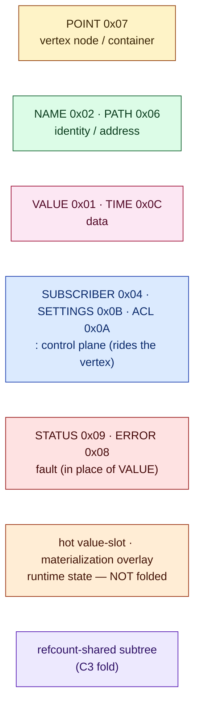
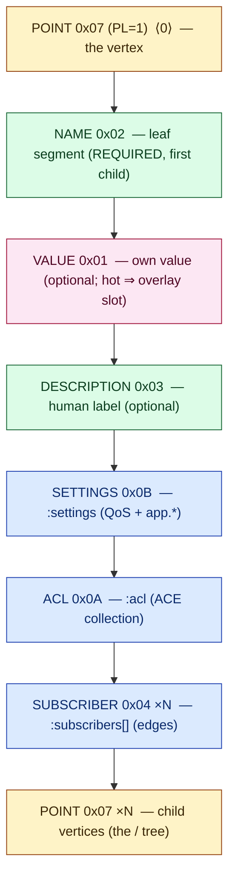
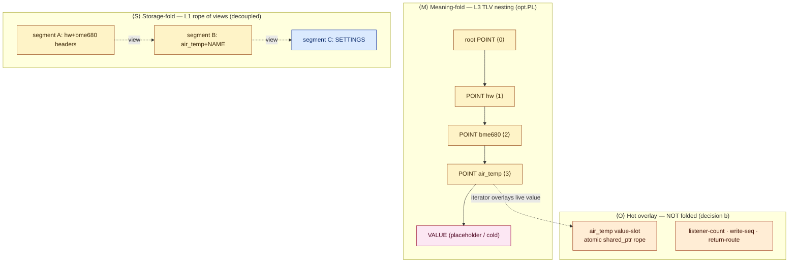

# TLV graph folding structure — the recommended vertex-as-POINT fold

> **Status**: design proposal (descriptive), 2026-07-11. Feeds the proposed **ADR-0059** (stateless-vertex composition / folded structure-rope, amending [ADR-0057](../adr/0057-graph-composite-vertex-tree.md)). **Not yet normative** — the byte grammar it builds on is normative in [reference/01](../reference/01-data-format.md) + [reference/05](../reference/05-protocol-tlvs.md); where this note and those disagree, they win. This document specifies *how a vertex and the graph fold into TLVs*, the recommended container layout, every scenario, the keystones, and the open inconsistencies to resolve before ADR-0059 is written.

---

## TL;DR — the fold in one sentence

> **A vertex IS a `POINT` (`0x07`) TLV; the graph IS a `POINT` tree; folding means keeping that tree as a rope of views and never materializing a second `vertex_t` representation beside it.**

This is the [same-substrate insight](../reference/02-graph-model.md) (*"a TLV in memory IS a graph node IS the wire bytes"*) taken to its terminus at L4. Today `graph_t` materializes ~76–96 B of `vertex_t` control block *next to* the TLV; the fold deletes that second copy for every cold vertex. The one datum that stays out of the fold is the **hot value-slot** (design decision *b*): a live leaf's current value is a swappable `atomic<shared_ptr<rope>>` that the read-iterator overlays onto the cold structure. Transport/connection vertices stay materialized (they own sockets); everything else is a cursor folded out of the rope.

---

## 1. Notation & colour legend (consistent throughout)

Two **orthogonal** compositions fold the same bytes ([reference/02](../reference/02-graph-model.md) §two compositions) — this note colours and marks them separately, because conflating them is the classic error here:

- **Meaning-fold (L3)** — TLV nesting via `opt.PL=1`. Shown by **indentation** + a depth tag `⟨n⟩`.
- **Storage-fold (L1)** — the rope: a chain of `view_t` windows over refcounted `segment_t`. Shown by `╎` where consecutive bytes fall in **different segments**. A view boundary may land anywhere, *including mid-header* — decoupled from meaning.

**Byte cell** — every TLV is `type(u8) · opt(u8) · length(u16 LE)` then payload (header is 6 B when `opt.LL=1`). At rest there is **no trailer**. Drawn as:

```
┌──────┬──────┬───────────┬─────────────────┐
│ type │ opt  │ length u16│ payload …        │
│  07  │  40  │  14 00    │ (children)       │
└──────┴──────┴───────────┴─────────────────┘
   └── opt 0x40 = PL=1 (bit6), LL=0, no TS/CR  →  a structured (folded) TLV
```

**Colour = TLV role-class.** One palette, reused in every diagram below:



| Colour | Class | Type codes | Role in the fold |
| --- | --- | --- | --- |
| 🟡 amber | **node/container** | `POINT 0x07` | the folded vertex; its children ARE the vertex |
| 🟢 green | **identity/address** | `NAME 0x02`, `PATH 0x06` | the vertex's own name; a subscriber's target route |
| 🩷 pink | **data** | `VALUE 0x01`, `TIME 0x0C` | the value (cold-inline or hot-slot); app time |
| 🔵 blue | **`:` control plane** | `SUBSCRIBER 0x04`, `SETTINGS 0x0B`, `ACL 0x0A` | subscriptions, QoS/config, access — folded child TLVs |
| 🔴 red | **fault** | `STATUS 0x09`, `ERROR 0x08` | delivered/stored *in place of* a VALUE |
| 🟠 orange | **runtime (unfolded)** | — | hot value-slot, listener-count, write-seq, return-route |
| 🟣 purple | **shared** | — | a refcount-shared identical subtree (C3) |

---

## 2. Which TLVs a vertex consists of

A vertex folds into **one `POINT` (`0x07`, `PL=1`)** whose children map one-to-one onto the vertex's facets. Child order follows [reference/05 §0x07](../reference/05-protocol-tlvs.md):



| Child TLV | `:` / `/` | Carries | Notes |
| --- | --- | --- | --- |
| `NAME 0x02` | identity | this vertex's leaf segment, UTF-8 1–64 B | required, first child; the tree's *edge label* |
| `VALUE 0x01` | data (`read`/`write`) | opaque last-known value | **cold** ⇒ inline; **hot** ⇒ overlay slot (§6) |
| `DESCRIPTION 0x03` | `:description` | human text | optional |
| `SETTINGS 0x0B` | `:settings` | QoS knobs + nested `app.*` | §3 |
| `ACL 0x0A` | `:acl` | ACE collection (recursive) | inherited down the subtree |
| `SUBSCRIBER 0x04` ×N | `:subscribers[]` | one edge each (target route + QoS) | §3; runtime half lives in overlay |
| `POINT 0x07` ×N | `/` children | nested vertices | the tree **is** this nesting |

The `:` **control plane rides the vertex as child TLVs** (blue) — it does *not* spawn sub-vertices ([CONTEXT.md](../../CONTEXT.md) §field-write: the `ioctl`-on-one-fd model). The `/` **address plane nests as `POINT` children** (amber). *That distinction — `:` folds inward, `/` folds downward — is keystone K3.*

### Worked bytes — a live stored-value leaf `/hw/bme680/air_temp`

```
⟨0⟩ POINT  07 40 20 00                              ← type=POINT opt=PL len=0x20(32)
⟨1⟩   NAME     02 00 08 00 61 69 72 5F 74 65 6D 70   ← "air_temp"  (12 B)
⟨1⟩   VALUE    01 00 04 00 __ __ __ __               ← f32 last value (8 B)   [hot ⇒ slot]
⟨1⟩   SETTINGS 0B 40 08 00                           ← :settings (12 B)
⟨2⟩     NAME 02 00 0B 00 "durability"  VALUE 01 00 01 00 01
```
Total at rest ≈ 4 + 32 = **36 B of folded bytes** (no `vertex_t` control block). Compare current-libtracer: **266–278 B/vertex**.

---

## 3. What each facet carries (subscriptions · path · name · schema · settings · where LIST is used)

### NAME (`0x02`) — the fold's edge label
`02 00 LL LL <utf8>`, 1–64 B, no NUL, no reserved chars `/ : . [ ] * ?`. In the fold a vertex stores **only its own** NAME (one segment); the full path is *rendered on demand* by walking the `POINT` spine (this is exactly ADR-0057's "store the NAME record, not the full key" — the fold makes it structural).

### PATH (`0x06`) — an address, used as a *target*, never as a vertex's identity
`06 40 LL LL { NAME NAME … }`. Appears as a `SUBSCRIBER.target`, an `FWD` `dst`/`src` route, an `ADVERTISE.route`. A vertex is *positioned* by its place in the POINT tree, not by carrying a PATH.

### SUBSCRIBER (`0x04`) — a subscription edge, producer-held
```
⟨1⟩ SUBSCRIBER 04 40 LL LL          (: control plane, blue)
⟨2⟩   PATH     target_path          ← REQUIRED — where deliveries go (green)
⟨2⟩   SETTINGS qos                  ← optional per-edge QoS (delivery_compact…)
⟨2⟩   ACL      capability           ← optional subject-token
⟨2⟩   NAME     subscriber_id        ← optional
```
The **edge is folded bytes** on the *producer* vertex ([CONTEXT.md](../../CONTEXT.md) §SUBSCRIBER direction). Its **runtime half is not folded**: the retained return-route segment + inbound link + listener bookkeeping live in the overlay (orange) — see inconsistency I3.

### SETTINGS (`0x0B`) — `:settings`, example fields
```
⟨1⟩ SETTINGS 0B 40 LL LL
⟨2⟩   NAME "reliability"        VALUE u8   (0 best-effort / 1 reliable)
⟨2⟩   NAME "durability"         VALUE u8   (0 volatile / 1 transient-local)
⟨2⟩   NAME "history_keep_last"  VALUE u32  (late-joiner samples)
⟨2⟩   NAME "deadline_ns"        VALUE u64  (liveness contract)
⟨2⟩   NAME "priority"           VALUE u8   (transport hint, default 128)
⟨2⟩   NAME "queue_max_bytes"    VALUE u32  (backpressure cap)
⟨2⟩   NAME "app" SETTINGS { NAME <owner> <owner TLV> … }   ← RFC-0010 reserved subtree
⟨2⟩   NAME "transport_tcp" SETTINGS { … }                  ← module-namespaced
```
The reserved `app` subkey is the owner's half (RFC-0010) — bytes riding the vertex, no per-field vertex, no subscriber list.

### Schema (`:schema`) — a **synthesized read**, not stored twice
`read <v>:schema` returns a `POINT` = synthesized protocol part (`SETTINGS`) + (iff a descriptor table exists) an owner `NAME "app" SETTINGS{…}` appended verbatim ([reference/05 §0x07](../reference/05-protocol-tlvs.md)). In the fold, schema is **projected from the vertex's own SETTINGS + descriptor table**, not a stored `/meta` child — this is where the fold *generalizes* RFC-0010 and *conflicts* with the shipping `/meta` interim (inconsistency I1).

### Fault — STATUS in place of VALUE
A faulted producer stores/delivers `STATUS 0x09 { ERROR … }` where a `VALUE` would sit (pink→red). A type-aware reader distinguishes `0x09` from `0x01` by the type byte. Empty `STATUS 09 00 00 00` = OK / unsubscribe sentinel.

### Where LIST is used — **nowhere.**
`0x05`/LIST is **retired** ([reference/05 §0x05](../reference/05-protocol-tlvs.md)). "List-ness" = `opt.PL=1` + a *purpose* type byte. Every place a list is tempting:

| Tempting "list" | Actual fold |
| --- | --- |
| a vertex's children | recursive `POINT 0x07` children (type byte = role) |
| `:subscribers[]` | concatenated `SUBSCRIBER 0x04` children |
| `:acl` | recursive `ACL 0x0A` (outer = collection, inner = ACE) |
| `:settings` | `SETTINGS 0x0B` NAME/VALUE pairs |
| array-whole `read('/x:[]')` | a `PL=1` reply whose children are the element TLVs |
| multi-field atomic write | one `SETTINGS 0x0B` |

*There is no generic container.* This is keystone K2 — and it is *why* the graph can be a single fold: the type byte at every level says what the nested bytes mean.

---

## 4. Folding levels — meaning, storage, and the hot overlay

The three planes the reader composes into "one virtual continuous rope of views":



- **Meaning-fold ⟨M⟩** is the POINT tree — the vertex hierarchy *is* the `PL=1` nesting. Depth = path depth.
- **Storage-fold ⟨S⟩** is the rope — where bytes physically live. A cold subtree can be one contiguous segment; an assembled/edited subtree scatters across segments. Independent of ⟨M⟩.
- **Hot overlay ⟨O⟩** holds the runtime state that *cannot* be bytes: the swappable value-slot (so 20 Hz writes stay O(1), not rope-splices), plus listener-count / write-seq / return-route. Present **only** where a vertex has a live reason (subscriber / mutation / handler / transport). This is "runtime things must not exist in RAM without a reason," made literal.

A reader walks ⟨M⟩ over ⟨S⟩ and, at each leaf, reads ⟨O⟩'s live slot instead of the cold `VALUE` — **that composition is the "one virtual continuous rope."**

---

## 5. Scenario scan — every vertex kind, folded

Each of the seven [reference/11](../reference/11-vertex-roles-and-aggregation.md) roles + the special cases, and what its fold looks like:

| # | Scenario | Fold | Overlay? |
| --- | --- | --- | --- |
| 1 | **Stored-value leaf** (sensor) | `POINT{ NAME, VALUE }` | value-slot iff subscribed |
| 2 | **Stream leaf** (log) | `POINT{ NAME, VALUE, SETTINGS(history_keep_last=N) }` | ring buffer in overlay |
| 3 | **Sink-with-model** (canvas) | `POINT{ NAME, VALUE(materialized), SETTINGS }` + `:ops` writes | model in overlay/handler |
| 4 | **Computed** (avg/filter) | `POINT{ NAME }`, VALUE synthesized on read | function ptr in overlay |
| 5 | **Proxy** (alias) | `POINT{ NAME }` forwarding rule | target ref in overlay |
| 6 | **Aggregate** (fan-in) | `POINT{ NAME, SUBSCRIBER×N }` | — |
| 7 | **Live MMIO** | `POINT{ NAME }`, VALUE = register snapshot | live binding |
| 8 | **Interior / composite** (`/hw/bme680`) | `POINT{ NAME, POINT×children }`, **no VALUE** | none (cold) |
| 9 | **`/meta` descriptor child** | `POINT{ NAME "meta", SETTINGS(descriptor) }` | none — **C3 shares these** |
| 10 | **Subscribed leaf** | scenario 1 + `SUBSCRIBER×N` folded | return-route + counters (orange) |
| 11 | **App-field vertex** | `POINT{ NAME, VALUE, SETTINGS{ app{…} } }` | none (bytes ride vertex) |
| 12 | **Branch write** (`POINT` tree) | decomposes: each `VALUE`-bearing `POINT` lands at its descendant as a refcount subview | per-leaf |
| 13 | **Array field** (fixed-stride) | `PL=1` homogeneous children; `[N]` = base+N×stride | — |
| 14 | **Fault** | `POINT{ NAME, STATUS{ERROR} }` (red in place of pink) | — |
| 15 | **Transport / connection** | `POINT{ NAME, SETTINGS(addr,port,role) }` — **materialized, stateful** | **the exception**: socket, reassembly, id↔path map |

Scenarios 8 + 9 (interior + `/meta`) are the **~85 cold vertices of 146** that fold to near-zero. Scenario 15 is the sole materialized exception. Everything between is a cursor + a sparse overlay.

---

## 6. The recommended container layout — C0…C3 (the folding *structure* proper)

Meaning-fold nesting is fixed (POINT tree). The open design is **how a container indexes its POINT children** — variable-length TLVs cannot be binary-searched without help. Four candidates, each drawn with the same colours:

**C0 — flat concat, no index** (the pure same-substrate form)
```
POINT hw 07 40 LL LL ╎ POINT bme680{…} ╎ POINT hx711{…} ╎ POINT w1{…}
                       └ lookup = O(fanout) header-walk; index bytes = 0
```

**C1 — leading fixed-stride offset index**
```
POINT hw 07 40 LL LL
  ⟨idx⟩ VALUE[ {name_id:u16, off:u32} × fanout, sorted ]   ← 6 B/child, O(log fanout)
  POINT bme680{…} ╎ POINT hx711{…} ╎ POINT w1{…}
```

**C2 — global name-interning + C1** (each NAME stored once graph-wide, referenced by u16)
```
[graph name-table: {id → NAME bytes} ×distinct]   ← once
POINT hw 07 40 LL LL  ⟨idx⟩[ {name_id:u16, off:u32} ]  POINT…  ← names deduped, u16 compares
```

**C3 — structural subtree sharing** (on top of the chosen inner layout)
```
POINT bme680 ── /meta ─┐
POINT bh1750 ── /meta ─┼─► ONE shared folded blob (purple), refcount N
POINT hx711  ── /meta ─┘     each site = a 12 B view header onto the shared segment
```

Byte counts on the real ~146-vertex strawberry-fw graph are being produced by the scoring workflow; the *rationale* for each is in §9.

---

## 7. Keystones (the load-bearing principles of the fold)

- **K1 — POINT is the node.** A vertex is a `POINT 0x07`; the graph is a POINT tree. No second representation. (same-substrate)
- **K2 — `PL=1` + purpose type byte replaces every list.** Structure is the option bit; meaning is the type byte. No generic container, so a fold is self-describing at every level.
- **K3 — `:` folds inward, `/` folds downward.** Control facets are child TLVs on the vertex (the `ioctl`-on-one-fd model); sub-identities are nested POINTs. The separator chooses the axis.
- **K4 — two decoupled compositions.** Meaning (TLV nesting) and storage (rope of views) are independent; a view boundary may split a header. This decoupling *is* zero-copy.
- **K5 — hot value is an overlay slot, not folded bytes** (decision *b*). Keeps O(1) writes; the iterator overlays it. Cold values fold inline.
- **K6 — pay-per-reason overlay.** Runtime state (subs return-route, listener-count, write-seq, handlers) exists only for vertices with a live reason. Cold ⇒ pure bytes.
- **K7 — transports are the stateful exception.** Connection vertices own OS resources + the id↔path map; they stay materialized. Everything else is a cursor.
- **K8 — resolution is wiring-frequency; handles pay it once.** So an O(fanout) flat walk (C0) is not a hot-path cost — the hot path holds a handle (ADR-0056).
- **K9 — prefix dedup is free.** Nesting stores each NAME once at its level; the flat-map prefix duplication ADR-0057 fought is gone by construction.

---

## 8. Inconsistencies to resolve (before ADR-0059) — *these are the questions*

The fold surfaces real conflicts with shipped/normative behavior. Each needs a ruling:

- **I1 — schema: folded `:schema` vs shipping `/meta` child.** RFC-0010 folds the descriptor onto the vertex (synthesized `:schema` POINT); the live firmware still stores a `/meta` **child vertex** per leaf (the 59-vertex doubling). The fold recommends killing `/meta` (K1/C3). *Which is authoritative in the fold — synthesized-from-SETTINGS, or a stored descriptor child?* If synthesized, the `/meta` producers must be removed, not just shared.
- **I2 — the cold VALUE lies.** With decision *b*, a hot leaf's folded `VALUE` child is a placeholder; the truth is the overlay slot. A consumer that walks the **raw rope** (a recorder, a `read('/')` snapshot serializer) sees a stale/placeholder value unless it goes through the overlay-aware iterator. *Is the folded VALUE authoritative-but-splice-on-write, or placeholder-superseded-by-overlay? What does the recorder read?*
- **I3 — subscription's split identity.** The `SUBSCRIBER` edge is folded bytes on the producer, but its retained return-route segment + inbound link + listener counters are overlay state (05 §producer fan-out). *A subscribed vertex is therefore half-folded, half-overlay — which half is the source of truth on reconnect / unsubscribe / persistence replay (fw ADR-0080 TLV-replay)?*
- **I4 — name-interning vs `.rodata` PATH-handle dispatch.** C2 interns NAMEs to u16 ids, but [reference/02](../reference/02-graph-model.md) §dispatch and [reference/05 §0x06](../reference/05-protocol-tlvs.md) key dispatch on **byte-identical canonical PATH bytes** (build-time `.rodata` literals, O(1) by memcmp). Interning breaks that byte-equality. *Does C2 violate the static-path-handle contract, or does interning live purely below the dispatch seam (ids never on the wire)?* This is the sharpest one — it may cap C2 to an in-memory-only optimization.
- **I5 — two resolution stories.** The composite tree walk (ADR-0057) vs the arena terminus's span-aliased PATH-key lookup (05 §0x0F: "canonical PATH body IS the map key"). *The fold must pick one; do FWD termini walk the folded POINT tree, or keep a PATH-key map beside it?*
- **I6 — whole-graph fold vs nesting-resource bound.** A `read('/')` serializing the whole graph is a POINT tree nested to `depthMax`; RFC-0006 bounds a **receiver's** decode resources per open level. *A constrained peer reading a deep fold must budget for it — is the whole-graph fold ever serialized, or only ever walked in place?*
- **I7 — delivery_mode / write-seq on cold vertices.** RFC-0008 per-vertex `delivery_mode` + write-seq are host state → overlay. A cold vertex has no overlay. *Confirm cold ⇒ never swept ⇒ needs no delivery_mode (safe), and that promoting a cold vertex to hot lazily creates the overlay entry atomically.*
- **I8 — handle stability across rope edits.** ADR-0056/0057 pinned raw `vertex_t*` (insert-only invariant). Cursors dissolve that pointer; a handle becomes a stable ref into the rope / an overlay slot. *A structural insert (write-creates) re-folds a container and moves offsets — how does an outstanding handle survive it (stable id vs segment-refcount+path)?*

---

## 9. Reason behind each folding (why C0…C3 exist)

- **C0 (flat, no index) — the honest baseline.** It IS same-substrate with zero overhead, and it wins wherever fanout is small: most interior nodes have ≤ 8 children, where a handful of header-skips beats an index lookup, and every hot lookup goes through a handle that resolves **once** (K8). Reason to exist: it is the floor every other candidate must beat with real bytes, and for the strawberry-fw fanout distribution it may simply win.
- **C1 (fixed-stride index) — pays only at wide composites.** A parent with thousands of children (a scan target, a big fan-in) turns C0's O(fanout) walk into a cost even at wiring frequency; C1 buys O(log fanout) for 6 B/child. Reason to exist: the wide-composite tail ADR-0057's sorted-children vector was built for — but as folded bytes, not a C++ vector. Overhead is pure below the fanout threshold, so it's a per-container choice, not global.
- **C2 (name-interning) — attacks duplication, risks the wire contract.** The strawberry-fw graph repeats a handful of NAMEs heavily (`meta`, `cfg`, `temp`, channel indices); interning stores each once and shrinks the index to u16 compares — the densest fast option. Reason to exist: name-repetition is the second-biggest byte term after `/meta`. Reason to be cautious: I4 — it may only be legal *below* the dispatch seam.
- **C3 (subtree sharing) — kills the single biggest cold line item.** 59 structurally-identical `/meta` descriptor subtrees are the largest cold-vertex cost; refcount-sharing them (the rope's native trick applied to *structure*, purple) collapses them to one blob + N 12 B view headers. Reason to exist: it turns the doubling from a liability into ~zero, and composes with C0/C1/C2 as the inner layout. Reason to bound: it needs structural-identity detection + copy-on-write when one shared subtree diverges.

---

## 10. What this note commits vs leaves open

**Committed (from the grill):** vertex = POINT fold (K1); `:` inward / `/` downward (K3); hot value = overlay slot (K5, decision *b*); pay-per-reason overlay (K6); transports stateful (K7). **Open:** the container layout winner (C0…C3, pending the scoring workflow on the real graph) and inconsistencies I1–I8 (each a ruling ADR-0059 must record). The normative byte grammar is unchanged — this fold is an L4 *representation* choice over the existing wire types, not a wire change.
